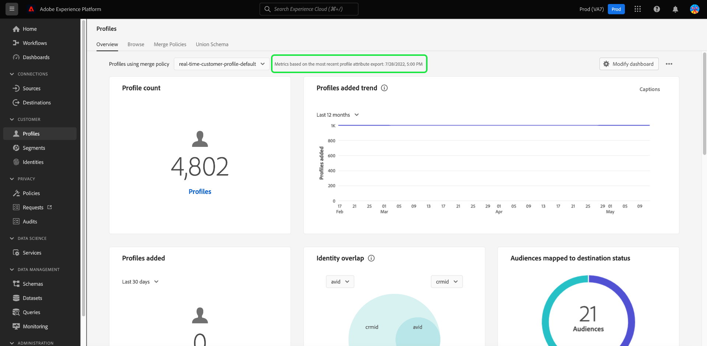

# [!UICONTROL Perfiles] tablero

La interfaz de usuario (IU) de Adobe Experience Platform proporciona un tablero a través del cual puede ver información importante acerca de su [!DNL Real-Time Customer Profile] datos, tal como se capturan durante una instantánea diaria. Esta guía describe cómo acceder al panel Perfiles de la interfaz de usuario y trabajar con él, y proporciona información sobre las métricas que se muestran en el panel.

Consulte la [Guía de la IU del perfil del cliente en tiempo real](../../profile/ui/user-guide.md) para obtener una descripción general de las funciones de perfil en la interfaz de usuario de Experience Platform.

## Datos del panel de perfil

El panel Perfiles muestra una instantánea de los datos de atributo (registro) que su organización tiene en el almacén de perfiles en Experience Platform. La instantánea no incluye datos de evento (series temporales).

Los datos de atributos de la instantánea muestran los datos exactamente como aparecen en el momento específico en el que se tomó la instantánea. En otras palabras, la instantánea no es una aproximación o una muestra de los datos y el panel Perfil no se actualiza en tiempo real.

>[!NOTE]
>
>Los cambios o actualizaciones realizados en los datos desde que se tomó la instantánea no se reflejarán en el tablero hasta que se tome la siguiente instantánea.

## Exploración del panel Perfiles

Para navegar al panel Perfiles dentro de la IU de Platform, seleccione **[!UICONTROL Perfiles]** en el carril izquierdo, seleccione **[!UICONTROL Información general]** para mostrar el tablero.

>[!NOTE]
>
>Si su organización es nueva en Platform y aún no ha creado conjuntos de datos de perfil o políticas de combinación activos, el panel Perfiles no estará visible. En su lugar, la variable [!UICONTROL Información general] Esta pestaña muestra vínculos y documentación para ayudarle a empezar a usar el Perfil del cliente en tiempo real.

### Modificación del panel Perfiles

Puede modificar el aspecto del tablero de mandos Perfiles seleccionando **[!UICONTROL Modificar tablero]**. Puede mover, añadir, cambiar el tamaño y eliminar widgets del tablero, así como acceder al **[!UICONTROL Biblioteca de widgets]** para explorar los widgets disponibles y crear widgets personalizados para su organización.

Para obtener más información, consulte la [modificación de paneles](../customize/modify.md) y [Resumen de biblioteca de widgets](../customize/widget-library.md) documentación.

### Añadir widgets {#add-widget}

Seleccionar **[!UICONTROL Añadir widget]** para desplazarse a la biblioteca de widgets y ver una lista de los widgets disponibles para agregarlos al tablero.

Desde la biblioteca de widgets, puede examinar la selección de widgets de audiencia estándar y personalizados. Para obtener información sobre cómo añadir widgets, consulte la documentación de la biblioteca de widgets sobre cómo [añadir un widget](../customize/widget-library.md#add-widgets).

<!-- ## (Beta) Profile efficacy insights {#profile-efficacy-insights}

>[!IMPORTANT]
>
>The profile efficacy insight functionality is currently in beta and are not available to all users. The documentation and the functionality are subject to change.

The [!UICONTROL Efficacy] tab provides metrics on the quality and completeness of your profile data through the use of profile efficacy widgets. These widgets illustrate at a glance the composition of your profiles, trends in completeness over time, and assessments on the quality of your profile data.

See the [profile efficacy widgets section](#profile-efficacy-widgets) for more information on the widgets currently available.

The layout of this dashboard is also customizable by selecting [**[!UICONTROL Modify dashboard]**](../customize/modify.md) from the [!UICONTROL Overview] tab. -->

## Examen de perfiles {#browse-profiles}

El [!UICONTROL Examinar] le permite buscar y ver los perfiles de solo lectura introducidos en su organización. Desde aquí puede ver información importante que pertenece al perfil de con respecto a sus preferencias, eventos anteriores, interacciones y audiencias.

Para obtener más información sobre las funcionalidades de visualización de perfiles proporcionadas en la IU de Platform, consulte la documentación sobre [exploración de perfiles en Adobe Real-time Customer Data Platform](../../rtcdp/profile/profile-browse.md).

## Políticas de combinación {#merge-policies}

Las métricas que se muestran en el panel Perfiles se basan en las políticas de combinación que se aplican a los datos del perfil del cliente en tiempo real. Cuando los datos se reúnen desde varias fuentes para crear el perfil del cliente, los datos pueden contener valores en conflicto. Por ejemplo, un conjunto de datos puede enumerar un cliente como &quot;único&quot;, mientras que otro conjunto de datos puede enumerar el cliente como &quot;casado&quot;. La tarea de determinar qué datos priorizar y mostrar como parte del perfil corresponde a la política de combinación.

Para obtener más información sobre las políticas de combinación, incluido cómo crear, editar y declarar una política de combinación predeterminada para su organización, consulte la [resumen de políticas de combinación](../../profile/merge-policies/overview.md).

El panel selecciona automáticamente una política de combinación para su uso. La política de combinación aplicada se puede cambiar utilizando el menú desplegable situado junto al nombre de la política de combinación.

>[!NOTE]
>
>El menú desplegable muestra solo las políticas de combinación que utilizan la variable `_xdm.context.profile` esquema. Sin embargo, si su organización ha creado varias políticas de combinación, puede que tenga que desplazarse para ver la lista completa de las políticas de combinación disponibles.

## Esquemas de unión

El [!UICONTROL Esquema de unión] El panel muestra el esquema de unión de una clase XDM específica. Al seleccionar la variable **[!UICONTROL Clase]** , puede ver los esquemas de unión de diferentes clases XDM.

Los esquemas de unión están compuestos por varios esquemas que comparten la misma clase y que se han habilitado para Perfil. Permiten ver en una sola vista una amalgamación de todos los campos contenidos en cada esquema que comparte la misma clase.

Para obtener más información acerca de [visualización de esquemas de unión en la IU de Platform](../../profile/ui/union-schema.md#view-union-schemas), consulte la guía de IU del esquema de unión.

## Widgets y métricas

El tablero está compuesto por widgets, que son métricas de solo lectura que proporcionan información importante sobre los datos del perfil.

La fecha y la hora de la instantánea más reciente se muestran en la parte superior de la [!UICONTROL Información general] junto al menú desplegable de política de combinación. Todos los datos del widget son precisos a partir de esa fecha y hora. La marca de tiempo de la instantánea se proporciona en formato UTC; no se encuentra en la zona horaria del usuario u organización individual.

## Widgets predeterminados {#default-widgets}

Se proporciona una carga de widget predeterminada para todas las instancias nuevas de Adobe Experience Platform que resalta las perspectivas disponibles más recientes de sus datos. Los siguientes widgets están preconfigurados en la vista de segmentos desde el principio. A continuación, se encuentran todos los detalles sobre el propósito y la función de los widgets.

* [[!UICONTROL Recuento de perfiles]](#profile-count)
* [[!UICONTROL Cambio de recuento de perfiles]](#profile-count-change)
* [[!UICONTROL Tendencia de cambio de recuento de perfiles]](#profiles-count-change-trend)
* [[!UICONTROL Perfiles por identidad]](#profiles-by-identity)
* [[!UICONTROL Superposición de identidad]](#identity-overlap)

>[!NOTE]
>
>A partir del 26 de julio de 2023, la [!UICONTROL Perfiles], [!UICONTROL Audiencias], y [!UICONTROL Destinos] Los paneles de información general se han restablecido a una nueva carga de widget predeterminada para todos los usuarios que no modificaron sus vistas en los seis meses anteriores. Consulte la documentación en la [Destinos](./destinations.md#default-widgets) y [Audiencias](./audiences.md#default-widgets) secciones de widgets predeterminadas para obtener detalles sobre los widgets que se incluyen como parte de las cargas de widgets predeterminadas. Puede seguir personalizando los widgets del tablero como antes.

## Widgets estándar {#standard-widgets}

Adobe proporciona varios widgets estándar que puede utilizar para visualizar diferentes métricas relacionadas con los datos del perfil. También puede crear widgets personalizados para compartirlos con su organización mediante el [!UICONTROL Biblioteca de widgets]. Para obtener más información sobre la creación de widgets personalizados, comience por leer el [Resumen de biblioteca de widgets](../customize/widget-library.md).

Para obtener más información sobre cada uno de los widgets estándar disponibles, seleccione el nombre de un widget en la siguiente lista:

* [[!UICONTROL Recuento de perfiles]](#profile-count)
* [[!UICONTROL Tendencia de recuento de perfiles]](#profile-count-trend)
* [[!UICONTROL Cambio de recuento de perfiles]](#profile-count-change)
* [[!UICONTROL Tendencia de cambio de recuento de perfiles]](#profiles-count-change-trend)
* [[!UICONTROL Tendencia de cambio de recuento de perfiles por identidad]](#profiles-count-change-trend-by-identity)
* [[!UICONTROL Perfiles por identidad]](#profiles-by-identity)
* [[!UICONTROL Superposición de identidad]](#identity-overlap)
* [[!UICONTROL Perfiles de identidad únicos]](#single-identity-profiles)
* [[!UICONTROL Perfiles de identidad únicos por identidad]](#single-identity-profiles-by-identity)
* [[!UICONTROL Perfiles no segmentados]](#unsegmented-profiles)
* [[!UICONTROL Los perfiles no segmentados cambian de tendencia]](#unsegmented-profiles-change-trend)
* [[!UICONTROL Perfiles no segmentados por identidad]](#unsegmented-profiles-by-identity)
* [[!UICONTROL Audiences]](#audiences)
* [[!UICONTROL Audiencias asignadas al estado de destino]](#audiences-mapped-to-destination-status)
* [[!UICONTROL Tamaño de audiencia]](#audiences-size)
* [[!UICONTROL Superposición de audiencias por política de combinación]](#audience-overlap-by-merge-policy)
* [[!UICONTROL Informe de superposición de audiencia]](#audience-overlap-report)

### [!UICONTROL Recuento de perfiles] {#profile-count}

>[!CONTEXTUALHELP]
>id="platform_dashboards_profiles_profilecount"
>title="Recuento de perfiles"
>abstract="Este widget muestra el número total de perfiles combinados en el almacén de perfiles en el momento en que se tomó la instantánea. El número depende de las políticas de combinación seleccionadas que se apliquen a los datos de perfil."

El **[!UICONTROL Recuento de perfiles]** Este widget muestra el número total de perfiles combinados dentro del Almacenamiento de perfiles en el momento en que se tomó la instantánea. Este número es el resultado de la política de combinación seleccionada que se está aplicando a los datos del perfil para combinar fragmentos de perfil y formar un único perfil para cada individuo.

Consulte la [sección sobre políticas de combinación anteriormente en este documento](#merge-policies) para obtener más información.

>[!NOTE]
>
>El [!UICONTROL Recuento de perfiles] widget puede mostrar un número diferente al recuento de perfiles que se muestra en la [!UICONTROL Examinar] en la pestaña [!UICONTROL Perfiles] de la interfaz de usuario de por varios motivos. La razón más común de esta diferencia es que la variable [!UICONTROL Examinar] hace referencia al número total de perfiles combinados en función de la política de combinación predeterminada de su organización, mientras que la pestaña [!UICONTROL Recuento de perfiles] widget hace referencia al número total de perfiles combinados en función de la política de combinación que ha seleccionado para ver en el tablero.
>
>Otro motivo común se debe a las diferencias entre el momento en que se toma la instantánea del panel y el momento en que se ejecuta el trabajo de muestra para [!UICONTROL Examinar] pestaña. Se puede ver cuando la variable [!UICONTROL Recuento de perfiles] La última actualización del widget se realizó mirando la marca de tiempo del widget. Para obtener más información sobre cómo se activa el trabajo de muestra en la [!UICONTROL Examinar] , consulte la [sección recuento de perfiles en la guía de la IU del perfil del cliente en tiempo real](https://experienceleague.adobe.com/docs/experience-platform/profile/ui/user-guide.html?lang=en#profile-count).

### [!UICONTROL Tendencia de recuento de perfiles] {#profile-count-trend}

El [!UICONTROL Tendencia de recuento de perfiles] El widget utiliza un gráfico de líneas para ilustrar la tendencia en el número total de perfiles contenidos en el sistema a lo largo del tiempo. Este número total incluye todos los perfiles importados en el sistema desde la última instantánea diaria. Los datos se pueden visualizar en períodos de 30 días, 90 días y 12 meses. El período de tiempo se elige en un menú desplegable del widget.

### [!UICONTROL Cambio de recuento de perfiles] {#profile-count-change}

>[!CONTEXTUALHELP]
>id="platform_dashboards_profiles_profilescountchange"
>title="Cambio de recuento de perfiles"
>abstract="Este widget muestra el número total de perfiles combinados **añadidos** al almacén de perfiles en el momento de la última instantánea. El número depende de las políticas de combinación seleccionadas que se apliquen a los datos de perfil."

El **[!UICONTROL Cambio de recuento de perfiles]** Este widget muestra el número de perfiles combinados agregados al Almacenamiento de perfiles desde la instantánea anterior. Este número es el resultado de la política de combinación seleccionada que se está aplicando a los datos del perfil para combinar fragmentos de perfil y formar un único perfil para cada individuo. Puede utilizar el selector desplegable para ver el número de perfiles agregados en los últimos 30 días, 90 días o 12 meses.

>[!NOTE]
>
>El [!UICONTROL Cambio de recuento de perfiles] widget refleja el número de perfiles añadidos **después** la ingesta inicial de perfiles y la configuración del Almacenamiento de perfiles. En otras palabras, si su organización configura el Almacenamiento de perfiles e ingiere 4 000 000 de en el día 1, en un plazo de 24 horas el tablero estaría disponible, aunque la variable [!UICONTROL Cambio de recuento de perfiles] el widget se establecería en 0. Este método de contabilización se realiza para evitar un pico asociado con la ingesta inicial de perfiles en el sistema. En los próximos 30 días, su organización introducirá 1 000 000 de perfiles adicionales en el almacén de perfiles de. Una vez que se toma la siguiente instantánea, [!UICONTROL Cambio de recuento de perfiles] El widget mostraría un total de 1 000 000 de perfiles agregados, mientras que el [!UICONTROL Recuento de perfiles] El widget mostraría 5 000 000 de perfiles totales.

### [!UICONTROL Tendencia de cambio de recuento de perfiles] {#profiles-count-change-trend}

>[!CONTEXTUALHELP]
>id="platform_dashboards_profiles_profilesaddedtrend"
>title="Tendencia de cambio de recuento de perfiles"
>abstract="Este widget muestra el número de perfiles combinados que se han añadido al almacén de perfiles diariamente durante los últimos 30 días, 90 días o 12 meses. El número también depende de las políticas de combinación seleccionadas que se apliquen a los datos de perfil."

El **[!UICONTROL Tendencia de cambio de recuento de perfiles]** widget muestra el número total de perfiles combinados que se han agregado al Almacenamiento de perfiles diariamente en los últimos 30 días, 90 días o 12 meses. Este número se actualiza cada día que se toma la instantánea, por lo que si tuviera que introducir perfiles en Platform, el número de perfiles no se reflejaría hasta que se tome la siguiente instantánea. El recuento de perfiles agregados es el resultado de la política de combinación seleccionada que se está aplicando a los datos del perfil para combinar fragmentos de perfil y formar un único perfil para cada individuo.

Para obtener más información, consulte la [sección sobre políticas de combinación anteriormente en este documento](#merge-policies).

El **[!UICONTROL Tendencia de cambio de recuento de perfiles]** widget muestra un botón &quot;subtítulos&quot; en la parte superior derecha del widget. Para abrir el cuadro de diálogo de subtítulos automáticos, seleccione **[!UICONTROL Subtítulos]**.

Un modelo de aprendizaje automático genera automáticamente subtítulos para describir las tendencias clave y los eventos importantes mediante el análisis del gráfico y los datos. Las anotaciones se añaden al gráfico en función de los subtítulos. Seleccione un pie de ilustración para centrarse en su anotación correspondiente.

### [!UICONTROL Tendencia de cambio de recuento de perfiles por identidad] {#profiles-count-change-trend-by-identity}

<!-- This widget uses a line graph to illustrate the change in number of profiles filtered by a chosen source identity and merge policy. -->

Este widget filtra el recuento de perfiles en función de una identidad de origen seleccionada y combina la política, a continuación, ilustra el cambio en el número de varios períodos mediante un gráfico de líneas. La política de combinación se selecciona en el menú desplegable de información general en la parte superior de la página, la identidad de origen y el periodo de tiempo se seleccionan en los menús desplegables del widget. La tendencia se puede visualizar en períodos de 30 días, 90 días y 12 meses.

Este widget le ayuda a administrar sus necesidades de activación de destino mostrando el patrón de crecimiento de perfiles filtrados por una identidad requerida.

### [!UICONTROL Perfiles por identidad] {#profiles-by-identity}

>[!CONTEXTUALHELP]
>id="platform_dashboards_profiles_profilesbyidentity"
>title="Perfiles por identidad"
>abstract="Este widget muestra el desglose de todos los perfiles combinados en su almacén de perfiles por identidades."

El **[!UICONTROL Perfiles por identidad]** Este widget muestra el desglose de identidades en todos los perfiles combinados del Almacenamiento de perfiles. El número total de perfiles por identidad (es decir, sumando los valores mostrados para cada área de nombres) puede ser mayor que el número total de perfiles combinados, ya que un perfil podría tener varias áreas de nombres asociadas. Por ejemplo, si un cliente interactúa con su marca en más de un canal, se asociarán varias áreas de nombres a ese cliente individual.

Para obtener más información, consulte la [sección sobre políticas de combinación anteriormente en este documento](#merge-policies).

Para abrir el cuadro de diálogo de subtítulos automáticos, seleccione **[!UICONTROL Subtítulos]**.

Un modelo de aprendizaje automático genera automáticamente perspectivas de datos analizando la distribución general y las dimensiones clave de los datos.

Para obtener más información sobre las identidades, consulte la [Documentación del servicio de identidad de Adobe Experience Platform](../../identity-service/home.md).

### [!UICONTROL Superposición de identidad] {#identity-overlap}

>[!CONTEXTUALHELP]
>id="platform_dashboards_profiles_identityoverlap"
>title="Superposición de identidad"
>abstract="Este widget utiliza un diagrama de Venn para mostrar la superposición de perfiles en su almacén de perfiles que contienen las dos identidades seleccionadas."

El **[!UICONTROL Superposición de identidad]** Este widget utiliza un diagrama de Venn, o diagrama de conjunto, para mostrar la superposición de perfiles en el Almacenamiento de perfiles que contienen las dos identidades seleccionadas.

Utilice los menús desplegables del widget para seleccionar las identidades que desea comparar. Los círculos muestran el recuento total relativo de perfiles que contienen cada identidad. El número de perfiles que contienen ambas identidades se representa mediante el tamaño de la superposición entre los círculos. Si un cliente interactúa con su marca en más de un canal, se asociarán varias identidades a ese cliente individual. En esta situación, es probable que su organización tenga varios perfiles que contengan fragmentos de más de una identidad.

Para obtener más información sobre los fragmentos de perfil, consulte la sección sobre [fragmentos de perfil frente a perfiles combinados](../../profile/home.md#profile-fragments-vs-merged-profiles) en la Información general del Perfil del cliente en tiempo real.

Para obtener más información sobre las identidades, consulte la [Documentación del servicio de identidad de Adobe Experience Platform](../../identity-service/home.md).

### [!UICONTROL Perfiles de identidad únicos] {#single-identity-profiles}

>[!CONTEXTUALHELP]
>id="platform_dashboards_profiles_singleidentityprofiles"
>title="Perfiles de identidad únicos"
>abstract="Este widget proporciona un recuento de los perfiles de su organización que solo tienen un tipo de ID que crea su identidad. Este tipo de ID puede ser un correo electrónico o un ECID."

El [!UICONTROL Perfiles de identidad únicos] Este widget proporciona un recuento de los perfiles de su organización que solo tienen un tipo de ID que crea su identidad. Este tipo de ID puede ser un correo electrónico o un ECID. El recuento de perfiles se genera a partir de los datos contenidos en la instantánea más reciente.

### [!UICONTROL Perfiles de identidad únicos por identidad] {#single-identity-profiles-by-identity}

Este widget utiliza un gráfico de barras para ilustrar el número total de perfiles que se identifican con un solo identificador único. El widget admite hasta cinco de las identidades más comunes.

Para ver un cuadro de diálogo que detalla el recuento total de perfiles de una identidad, utilice el cursor para pasar el ratón sobre barras individuales.

### [!UICONTROL Perfiles no segmentados] {#unsegmented-profiles}

>[!CONTEXTUALHELP]
>id="platform_dashboards_profiles_unsegmentedprofiles"
>title="Perfiles no segmentados"
>abstract="Este widget proporciona el número total de perfiles que no están adjuntos a ningún público y representa la oportunidad de activar perfiles en toda la organización."

El [!UICONTROL Perfiles no segmentados] widget proporciona el número total de perfiles no adjuntos a ninguna audiencia. El número generado es preciso desde la última instantánea y representa la oportunidad de activación de perfiles en toda la organización. También indica la oportunidad de eliminar perfiles que no proporcionan un ROI adecuado.

### [!UICONTROL Los perfiles no segmentados cambian de tendencia] {#unsegmented-profiles-change-trend}

>[!CONTEXTUALHELP]
>id="platform_dashboards_profiles_unsegmentedprofilestrend"
>title="Tendencia de perfiles no segmentados"
>abstract="Este widget proporciona una ilustración de un gráfico de líneas que muestra el número de perfiles que no están adjuntos a ningún público durante un período de tiempo determinado. La tendencia de los perfiles no adjuntos a ningún público se puede visualizar en períodos de 30 días, 90 días y 12 meses."

El [!UICONTROL Los perfiles no segmentados cambian de tendencia] el widget utiliza un gráfico de líneas para ilustrar el número de perfiles agregados desde la última instantánea diaria que no están adjuntos a ninguna audiencia. La tendencia de cambio de perfiles no adjuntos a ninguna audiencia se puede visualizar en períodos de 30 días, 90 días y 12 meses. El período de tiempo se elige en un menú desplegable del widget. El recuento de perfiles se refleja en el eje Y y el tiempo en el eje X.

### [!UICONTROL Perfiles no segmentados por identidad] {#unsegmented-profiles-by-identity}

>[!NOTE]
>
>Los perfiles no segmentados por widget de identidad han quedado obsoletos a partir de octubre de 2022 y ya no están disponibles.

<!-- 

>[!CONTEXTUALHELP]
>id="platform_dashboards_profiles_unsegmentedprofilesbyidentity"
>title="Unsegmented profiles by identity"
>abstract="This widget categorizes the total number of unsegmented profiles by their unique identifier."

The [!UICONTROL Unsegmented Profiles by Identity] widget categorizes the total number of unsegmented profiles by their unique identifier. The data is visualized in a bar chart for ease of comparison. 

 -->

### [!UICONTROL Audiences] {#audiences}

Este widget proporciona el número total de audiencias que están listas para activarse, según la política de combinación elegida aplicada a los datos del perfil.

Seleccionar **[!UICONTROL Audiencias]** para ir al [!UICONTROL Audiencias] tablero [!UICONTROL Examinar] pestaña. A partir de ahí, puede ver una lista de todas las definiciones de segmentos de su organización.

<!-- https://jira.corp.adobe.com/browse/PLAT-115291 -->

<!-- * [[!UICONTROL Audiences change trend]](#audiences-change-trend) -->
<!-- ### [!UICONTROL Audiences change trend] {#audiences-change-trend}

This line graph widget visualizes the change in the total number of audiences each day, trending over time. The change in the number of audiences is dependent on the selected merge policy being applied to your profile data. The period of analysis is selected from the widget dropdown menu. The bar chart can be visualized over 30 days, 90 days, and 12-month periods.

The visualization allows you to monitor the overall health of audiences within Adobe Experience Platform by understanding trends in the growth or decline of the total number of audiences. -->

<!--  -->

### [!UICONTROL Informe de superposición de audiencia] {#audience-overlap-report}

Este widget tabula la superposición de datos de todas las audiencias disponibles filtradas por la política de combinación. Se proporciona una lista de cinco audiencias clasificadas entre los porcentajes de superposición más altos y más bajos para la política de combinación elegida en el menú desplegable de la parte superior de la pantalla. Las dos audiencias analizadas se enumeran en la sección [!UICONTROL NOMBRE DE LA AUDIENCIA A] y [!UICONTROL NOMBRE DE LA AUDIENCIA B] columnas. La superposición porcentual se indica en la tercera columna con una precisión de doce decimales.

El informe de superposición de audiencias le ayuda a crear audiencias nuevas y de alto rendimiento. La observación de superposiciones de alto porcentaje le permite suprimir audiencias e impedir que se envíe la misma audiencia a diferentes destinos. También le ayudan a identificar perspectivas ocultas que pueden ayudarle con una mejor segmentación. La superposición de bajo porcentaje ayuda a localizar perfiles únicos que perseguir.

Seleccionar **[!UICONTROL Ver más]** para abrir un cuadro de diálogo de pantalla completa que contenga más datos de superposición de audiencias.

El [!UICONTROL Informe de superposición de audiencia] aparece el cuadro de diálogo. Este cuadro de diálogo puede contener hasta 50 filas de análisis de superposición de audiencias divididas en seis columnas. Para quitar o agregar columnas de la tabla, seleccione el icono de configuración ().

>[!NOTE]
>
>Para cambiar la clasificación de los resultados entre mayor a menor o menor a mayor, seleccione la opción **[!UICONTROL Superposición]** encabezado de columna.

Para descargar todo el informe en formato de PDF, seleccione el menú de opciones (**`...`**) seguido de **[!UICONTROL Descargar]**.

Para abrir un diagrama de Venn del análisis de superposición, seleccione una fila del informe. Para ver el recuento de perfiles en un cuadro de diálogo, pase el ratón sobre una sección del diagrama de Venn.

Seleccionar **[!UICONTROL Cerrar]** para volver a la [!UICONTROL Perfiles] panel.

### [!UICONTROL Audiencias asignadas al estado de destino] {#audiences-mapped-to-destination-status}

El [!UICONTROL Audiencias asignadas al estado de destino] widget muestra el número total de audiencias asignadas y no asignadas en una sola métrica y utiliza un gráfico de anillo para ilustrar la diferencia proporcional entre sus totales. Los números calculados dependen de la política de combinación elegida.

Los recuentos individuales de audiencias asignadas o no asignadas se muestran en un cuadro de diálogo cuando el cursor se pasa por encima de la sección correspondiente del gráfico circular.

### [!UICONTROL Tamaño de audiencia] {#audiences-size}

El [!UICONTROL Tamaño de audiencia] El widget proporciona una tabla de dos columnas que enumera los nombres de hasta 20 audiencias y el número total de perfiles contenidos en cada audiencia. La lista se ordena de alta a baja según el número total de perfiles contenidos dentro de la audiencia. El recuento total de tamaño de audiencia depende de la política de combinación aplicada.

Para ver información completa sobre una audiencia, seleccione un nombre de audiencia de la lista proporcionada para navegar hasta el [!UICONTROL Audiencias] [!UICONTROL Detalle] página. Además, seleccionando **[!UICONTROL Ver todas las audiencias]** desde el final del widget, puede navegar hasta el [!UICONTROL Audiencias] [!UICONTROL Examinar] para buscar cualquier audiencia existente.

Consulte la documentación para obtener más información sobre [[!UICONTROL Audiencias] [!UICONTROL  Examinar] pestaña](https://experienceleague.adobe.com/docs/experience-platform/segmentation/ui/overview.html#browse).

### [!UICONTROL Superposición de audiencias por política de combinación] {#audience-overlap-by-merge-policy}

Este widget utiliza un diagrama de Venn para mostrar la superposición de dos audiencias seleccionadas. La política de combinación se elige en el menú desplegable de información general en la parte superior de la página y las audiencias para el análisis se seleccionan de dos menús desplegables dentro del widget. El número total de perfiles contenidos dentro de la definición del segmento correspondiente se puede ver pasando el ratón por encima de un círculo o de la intersección.

A medida que el widget muestra el cruce visual de las definiciones de segmentos, puede optimizar su estrategia de segmentación estudiando las similitudes entre las definiciones de segmentos.

<!-- ## (Beta) Profile efficacy widgets {#profile-efficacy-widgets}

>[!IMPORTANT]
>
>The profile efficacy widgets are currently in Beta and are not available to all users. The documentation and the functionality are subject to change.

Adobe provides multiple widgets to assess the completeness of the ingested profiles available for your data analysis. Each of the profile efficacy widgets can be filtered by the merge policy. To change the merge policy filter, select the[!UICONTROL Profiles using merge policy] dropdown and choose the appropriate policy from the available list.

To learn more about each of the profile efficacy widgets, select the name of a widget from the following list:

* [[!UICONTROL Attribute quality assessment]](#attributes-quality-assessment)
* [[!UICONTROL Profiles by completeness]](#profiles-by-completeness)
* [[!UICONTROL Profiles completeness trend]](#profiles-completeness-trend)

### (Beta) [!UICONTROL Attributes quality assessment] {#attributes-quality-assessment}

>[!CONTEXTUALHELP]
>id="platform_dashboards_profiles_attributesqualityassessment"
>title="Attributes quality assessment"
>abstract="This widget shows the completeness and cardinality of all profiles according to their attributes. Each row describes one attribute. The **Profiles** column provides the number of profiles that have this attribute and are filled with non-null values. The **Completeness** percentage is determined by the total number of profiles that have this attribute and are filled with non-null values divided by the total number of non-empty values in the profiles for that attribute. **Cardinality** provides the total number of unique non-null values of this attribute across all attributes."

The [!UICONTROL Attribute quality assessment] widget shows the completeness and cardinality of all profiles according to their attributes. The data is accurate to the last processing date. This information is presented as a table with four columns where each row in the table represents a single attribute.

| Column  | Description  |
|---|---|
| Attribute  | The name of the attribute.  |
| Profiles  | The number of profiles that have this attribute and are filled with non-null values.  |
| Completeness  | This percentage is determined by the total number of profiles that have this attribute and are filled with non-null values. The number is calculated by dividing the total number of profiles by the total number of non-empty values in the profiles for that attribute.  |
| Cardinality  | The total number of **unique** non-null values of this attribute. It is measured across all profiles. |

### (Beta) [!UICONTROL Profiles by completeness] {#profiles-by-completeness}

>[!CONTEXTUALHELP]
>id="platform_dashboards_profiles_profilesbycompleteness"
>title="Profiles by completeness"
>abstract="The donut chart displays the percentage of profile attributes that are filled with non-null values among all observed attributes. It illustrates the proportion of profiles that are of high, medium, or low completeness. High completeness profiles have more than 70% of their attributes filled. Medium completeness profiles have between 30% and 70% of their attributes filled. Low completeness profiles have less than 30% of their attributes filled."

The [!UICONTROL Profiles by completeness] widget creates a donut chart of profile completeness since the last processing date. The completeness of a profile is measured by the percentage of attributes that are filled with non-null values among all observed attributes.

This widget shows the proportion of profiles that are of high, medium, or low completeness. By default, there are three levels of completeness configured: 

* High completeness: Profiles have more than 70% of their attributes filled. 
* Medium completeness: Profiles have between 30% and 70% of their attributes filled. 
* Low completeness: Profiles have less than 30% of their attributes filled. 

### (Beta) [!UICONTROL Profiles completeness trend] {#profiles-completeness-trend}

>[!CONTEXTUALHELP]
>id="platform_dashboards_profiles_profilescompletenesstrend"
>title="Profiles completeness trend"
>abstract="This widget creates a stacked area chart to depict the trend of profile completeness over time. Completeness is measured by the percentage of attributes that are filled with non-null values among all observed attributes."

This widget creates a stacked area chart to depict the trend of profile completeness over time. Completeness is measured by the percentage of attributes filled with non-null values among all observed attributes. It categorizes the profile completeness as high, medium, or low completeness since the last processing date.

The x-axis represents time, the y-axis represents the number of profiles, and the colors represent the three levels of profile completeness. 

The three levels of completeness are:

* High completeness: Profiles have more than 70% of attributes filled. 
* Medium completeness: Profiles have less than 70% and more than 30% of attributes filled. 
* Low completeness: Profiles have less than 30% of attributes filled.

 -->

## Pasos siguientes

Al seguir este documento, ahora debería poder localizar el panel de perfiles y comprender las métricas mostradas en los widgets disponibles. Para obtener más información sobre cómo trabajar con [!DNL Profile] en la interfaz de usuario del Experience Platform, consulte la [Guía de la IU del perfil del cliente en tiempo real](../../profile/ui/user-guide.md).
