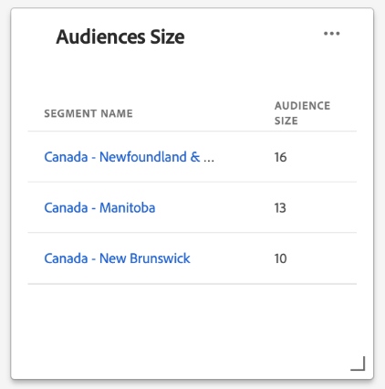

# (Beta) [!UICONTROL Panel de perfiles]

>[!IMPORTANT]
>
>La funcionalidad de tablero descrita en este documento está actualmente en fase beta y no está disponible para todos los usuarios. La documentación y las funciones están sujetas a cambios.

La interfaz de usuario (IU) de Adobe Experience Platform proporciona un tablero a través del cual puede ver información importante sobre sus datos [!DNL Real-time Customer Profile], tal como se captura durante una instantánea diaria. Esta guía describe cómo acceder y trabajar con el tablero [!UICONTROL Profiles] en la interfaz de usuario y proporciona información sobre las métricas que se muestran en el tablero.

Para obtener una descripción general de todas las funciones de perfil de la interfaz de usuario del Experience Platform, visite la [Guía de la interfaz de usuario del perfil del cliente en tiempo real](../../profile/ui/user-guide.md).

## Datos de tablero de perfil

El tablero [!UICONTROL Profiles] muestra una instantánea de los datos de atributos (registros) que su organización tiene dentro del Almacenamiento de perfiles en el Experience Platform. La instantánea no incluye datos de ningún evento (serie temporal).

Los datos de atributo de la instantánea muestran los datos exactamente como aparecen en el momento concreto en que se tomó la instantánea. En otras palabras, la instantánea no es una aproximación o muestra de los datos y el panel Perfil no se actualiza en tiempo real.

>[!NOTE]
>
>Los cambios o actualizaciones realizados en los datos desde que se tomó la instantánea no se reflejarán en el panel hasta que se tome la siguiente instantánea.

## Exploración del tablero [!UICONTROL Profiles]

Para ir al tablero [!UICONTROL Profiles] dentro de la interfaz de usuario de Platform, seleccione **[!UICONTROL Profiles]** en el carril izquierdo y, a continuación, seleccione la pestaña **[!UICONTROL Overview]** para mostrar el tablero.

### Selección de directivas de combinación

Las métricas que se muestran en el panel [!UICONTROL Perfiles] se basan en políticas de combinación que se aplican a los datos del perfil del cliente en tiempo real. Cuando los datos se agrupan desde varias fuentes, es posible que los datos contengan valores en conflicto (por ejemplo, un conjunto de datos puede enumerar a un cliente como &quot;único&quot; mientras que otro conjunto de datos puede enumerar al cliente como &quot;casado&quot;) y es tarea de la política de combinación determinar qué datos priorizar y mostrar como parte del perfil.

El tablero seleccionará automáticamente una política de combinación para mostrar, pero puede cambiar la política de combinación seleccionada mediante el menú desplegable. Para elegir otra política de combinación, seleccione la lista desplegable junto al nombre de la política de combinación y, a continuación, seleccione la política de combinación que desee ver.

>[!NOTE]
>
>El menú desplegable muestra solamente las políticas de combinación relacionadas con la clase de perfil individual XDM. Sin embargo, si la organización ha creado varias políticas de combinación, puede significar que tendrá que desplazarse para ver la lista completa de las políticas de combinación disponibles.

Para obtener más información sobre las políticas de combinación, como cómo crear, editar y declarar una directiva de combinación predeterminada para su organización, lea en primer lugar la [información general de las directivas de combinación](../../profile/merge-policies/overview.md).

### Widgets y métricas

El tablero está compuesto por widgets, que son métricas de solo lectura que proporcionan información importante sobre los datos de perfil. La fecha y hora de &quot;última actualización&quot; de un widget muestra cuándo se tomó la última instantánea de los datos.

## Widgets disponibles

Experience Platform proporciona varias utilidades que puede utilizar para visualizar distintas métricas relacionadas con los datos de perfil. Seleccione el nombre de una utilidad para obtener más información:

* [[!UICONTROL Tamaño de la audiencia]](#audience-size)
* [[!UICONTROL Perfiles añadidos]](#profiles-added)
* [[!UICONTROL Perfiles añadidos a lo largo del tiempo]](#profiles-added-over-time)
* [[!UICONTROL Perfiles por área de nombres]](#profiles-by-namespace)
* [[!UICONTROL Superposición de área de nombres]](#namespace-overlap)

### [!UICONTROL Tamaño de la audiencia] {#audience-size}

El widget **[!UICONTROL Audience size]** muestra el número total de perfiles combinados dentro del almacén de datos de perfil en el momento en que se tomó la instantánea. Este número es el resultado de la política de combinación seleccionada que se aplica a los datos de perfil para combinar fragmentos de perfil y formar un único perfil para cada individuo.

Para obtener más información sobre fragmentos y perfiles combinados, comience leyendo la sección *Fragmentos de perfil vs perfiles combinados* de la [Información general del perfil del cliente en tiempo real](../../profile/home.md).

>[!NOTE]
>
>La política de combinación utilizada para calcular esta métrica no es la misma que la política de combinación generada por el sistema utilizada para calcular [!UICONTROL Audiencias direccionables] en el panel [!UICONTROL Uso de licencias], por lo que es poco probable que el recuento de audiencias en los paneles [!UICONTROL Perfiles] y [!UICONTROL Uso de licencias] sea exactamente el mismo.

### [!UICONTROL Perfiles añadidos] {#profiles-added}

La utilidad **[!UICONTROL Profiles added]** muestra el número total de perfiles combinados que se agregaron al almacén de datos de perfil desde la última instantánea. Este número es el resultado de la política de combinación seleccionada que se aplica a los datos de perfil para combinar fragmentos de perfil y formar un único perfil para cada individuo.

### [!UICONTROL Perfiles añadidos a lo largo del tiempo] {#profiles-added-over-time}

La utilidad **[!UICONTROL Profiles added over time]** muestra el número total de perfiles combinados que se han agregado diariamente al almacén de datos de perfil durante los últimos 30 días. Este número se actualiza cada día que se toma la instantánea, por lo que si ingeryera perfiles en Platform, el número de perfiles no se reflejaría hasta que se tome la siguiente instantánea.

El recuento de perfiles agregados es el resultado de la política de combinación seleccionada que se aplica a los datos de perfil para combinar fragmentos de perfil para formar un único perfil para cada individuo.

### [!UICONTROL Perfiles por área de nombres] {#profiles-by-namespace}

La utilidad **[!UICONTROL Profiles by namespace]** muestra el desglose de áreas de nombres de identidad en todos los perfiles combinados en el almacén de perfiles. El número total de perfiles por [!UICONTROL espacio de nombres de ID] (es decir, sumando los valores mostrados para cada espacio de nombres) puede ser mayor que el número total de perfiles combinados, ya que un perfil podría tener varios espacios de nombres asociados a él. Por ejemplo, si un cliente interactúa con la marca en más de un canal, se asociarán varias áreas de nombres con ese cliente individual.

Para obtener más información sobre áreas de nombres de identidad, visite la [documentación del servicio de identidad de Adobe Experience Platform](../../identity-service/home.md).

### [!UICONTROL Superposición de área de nombres] {#namespace-overlap}

La utilidad **[!UICONTROL Namespace overlap]** muestra un diagrama de Venn o un diagrama de conjunto, que muestra la superposición de perfiles en el almacén de perfiles que contiene varias áreas de nombres de identidad.

Después de utilizar los menús desplegables del widget para seleccionar los espacios de nombres de identidad que desea comparar, aparecen círculos que muestran el tamaño relativo de cada área de nombres, con el número de perfiles que contienen ambos espacios de nombres representados por el tamaño de la superposición entre los círculos.

Si un cliente interactúa con su marca en más de un canal, se asociarán varias áreas de nombres con ese cliente individual, por lo que es probable que su organización tenga varios perfiles que contengan fragmentos de más de un área de nombres de identidad.

Para obtener más información sobre áreas de nombres de identidad, visite la [documentación del servicio de identidad de Adobe Experience Platform](../../identity-service/home.md).

## Pasos siguientes

Al seguir este documento, debería poder localizar el panel Perfiles y comprender las métricas que se muestran en los widgets disponibles. Para obtener más información sobre cómo trabajar con datos [!DNL Profile] en la interfaz de usuario del Experience Platform, consulte la [Guía de la interfaz de usuario del perfil del cliente en tiempo real](../../profile/ui/user-guide.md).
