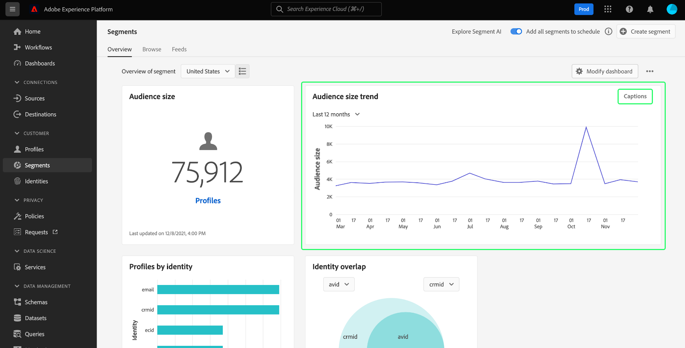
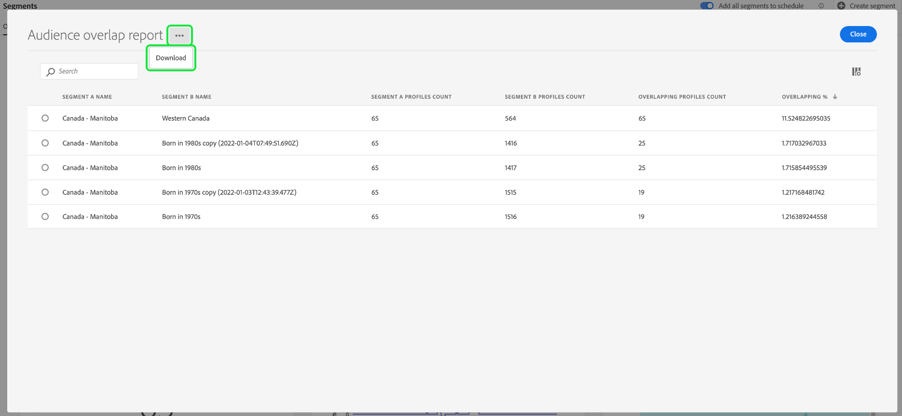
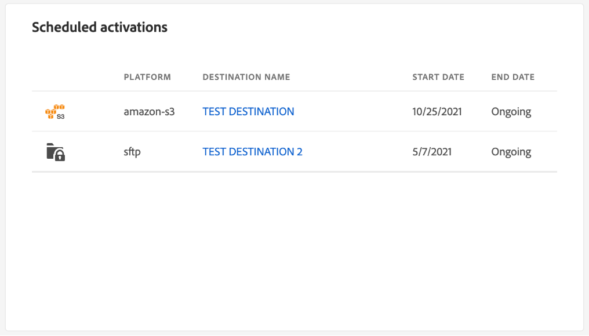

# [!UICONTROL Segmentos] tablero {#segment-dashboard}

La interfaz de usuario (IU) de Adobe Experience Platform proporciona un tablero a través del cual puede ver información importante sobre sus segmentos, tal como se captura durante una instantánea diaria. Esta guía describe cómo acceder y trabajar con el panel de segmentos en la interfaz de usuario y proporciona más información sobre las visualizaciones que se muestran en el panel.

Para obtener una descripción general de todas las funciones del servicio de segmentación de Adobe Experience Platform dentro de la interfaz de usuario de Platform, visite [Guía de la interfaz de usuario del servicio de segmentación](../../segmentation/ui/overview.md).

## [!UICONTROL Segmentos] datos de tablero

El panel de segmentos muestra una instantánea de los datos de atributo (registro) que su organización tiene dentro del Almacenamiento de perfiles en Experience Platform. La instantánea no incluye datos de ningún evento (serie temporal).

Los datos de atributo de la instantánea muestran los datos exactamente como aparecen en el momento concreto en que se tomó la instantánea. En otras palabras, la instantánea no es una aproximación o muestra de los datos y el panel de segmentos no se actualiza en tiempo real.

>[!NOTE]
>
>Los cambios o actualizaciones realizados en los datos desde que se tomó la instantánea no se reflejarán en el panel hasta que se tome la siguiente instantánea.

## Explorar el [!UICONTROL Segmentos] tablero {#explore}

Para ir a la [!UICONTROL Segmentos] tablero en la interfaz de usuario de Platform, seleccione **[!UICONTROL Segmentos]** en el carril izquierdo, seleccione la opción **[!UICONTROL Información general]** para mostrar el tablero.

>[!NOTE]
>
>Si su organización es nueva en Platform y aún no tiene conjuntos de datos de perfil activos o políticas de combinación creadas, se crea la variable [!UICONTROL Segmentos] tablero no está visible. En su lugar, la variable [!UICONTROL Información general] muestra vínculos y documentación para ayudarle a empezar con la segmentación.

### Modifique el [!UICONTROL Segmentos] tablero {#modify}

Puede modificar el aspecto del [!UICONTROL Segmentos] tablero seleccionando **[!UICONTROL Modificar tablero]**. Esto le permite mover, agregar y quitar widgets del tablero, así como acceder al **[!UICONTROL Biblioteca de utilidades]** para explorar las utilidades disponibles y crear utilidades personalizadas para su organización.

Consulte la [modificación de tableros](../customize/modify.md) y [Información general de la biblioteca de utilidades](../customize/widget-library.md) documentación para obtener más información.

### Agregar widgets {#add-widget}

Select **[!UICONTROL Agregar utilidad]** para ir a la biblioteca de widgets y ver una lista de las utilidades disponibles para agregarlas al tablero.

Desde la biblioteca de utilidades, puede examinar la selección de utilidades de segmento estándar y personalizadas. Para obtener información sobre cómo agregar utilidades, consulte la documentación de la biblioteca de utilidades sobre cómo [agregar una utilidad](../customize/widget-library.md#add-widgets).

## Seleccionar un segmento

El tablero selecciona automáticamente un segmento para mostrar, aunque puede cambiarlo con el menú desplegable o el selector de segmentos.

Para elegir un segmento diferente, seleccione la lista desplegable junto al nombre del segmento o utilice el selector de segmentos para abrir el cuadro de diálogo de selección de segmentos.

>[!IMPORTANT]
>
>En la lista de segmentos seleccionables solo se muestran los segmentos con un recuento de perfiles superior a cero.

## Widgets y métricas

El tablero de segmentos está compuesto por utilidades, que son métricas de solo lectura que proporcionan información importante sobre el segmento seleccionado.

La fecha y la hora de la instantánea más reciente se muestran en la parte superior del [!UICONTROL Información general] junto al menú desplegable de segmentos. Todos los datos del widget son precisos a partir de esa fecha y hora. La marca de tiempo de la instantánea se proporciona en UTC; no está en la zona horaria del usuario u organización individual.

## Widgets estándar {#standard-widgets}

Adobe proporciona varios widgets estándar que puede utilizar para visualizar distintas métricas relacionadas con los segmentos. También puede crear utilidades personalizadas para compartirlas con su organización mediante la [!UICONTROL Biblioteca de utilidades]. Para obtener más información sobre la creación de widgets personalizados, lea la [Información general de la biblioteca de utilidades](../customize/widget-library.md).

Para obtener más información sobre cada uno de los widgets estándar disponibles, seleccione el nombre de un widget en la siguiente lista:

* [[!UICONTROL Tamaño de la audiencia]](#audience-size)
* [[!UICONTROL Orden de activación de la audiencia]](#audience-activation-order)
* [[!UICONTROL Tendencia del tamaño de la audiencia]](#audience-size-trend)
* [[!UICONTROL Tendencia del cambio de tamaño de la audiencia]](#audience-size-change-trend)
* [[!UICONTROL Tendencia del tamaño de la audiencia por identidad]](#audience-size-trend-by-identity)
* [[!UICONTROL Superposición de audiencia]](#audience-overlap)
* [[!UICONTROL Informe de superposición de audiencia]](#audience-overlap-report)
* [[!UICONTROL Superposición de identidad]](#identity-overlap)
* [[!UICONTROL Perfiles por identidad]](#profiles-by-identity)
* [[!UICONTROL Activaciones programadas]](#scheduled-activations)

### [!UICONTROL Tamaño de la audiencia] {#audience-size}

>[!CONTEXTUALHELP]
>id="platform_dashboards_segments_audiencesize"
>title="Tamaño de la audiencia"
>abstract="Esta utilidad muestra el número total de perfiles combinados dentro del segmento seleccionado. Este número depende de la política de combinación aplicada a los datos y es correcto en el momento de la instantánea más reciente."

La variable **[!UICONTROL Tamaño de la audiencia]** muestra el número total de perfiles combinados dentro del segmento seleccionado en el momento en que se tomó la instantánea. Este número es el resultado de aplicar la política de combinación de segmentos a los datos de perfil para combinar fragmentos de perfil y formar un único perfil para cada individuo en el segmento.

Para obtener más información sobre los fragmentos y los perfiles combinados, consulte la [Resumen del perfil del cliente en tiempo real](../../profile/home.md).

### [!UICONTROL Tendencia del tamaño de la audiencia] {#audience-size-trend}

>[!CONTEXTUALHELP]
>id="platform_dashboards_segments_audiencesizetrend"
>title="Tendencia del tamaño de la audiencia"
>abstract="Esta utilidad proporciona información sobre el número total de perfiles que cumplen los criterios de **any** definición de segmento, según se captura durante la instantánea diaria, para los últimos 30 días, 90 días o 12 meses."

La variable **[!UICONTROL Tendencia del tamaño de la audiencia]** proporciona una ilustración de gráfico de líneas para el número total de perfiles que cumplen los criterios de **any** definición de segmento durante un período de tiempo determinado. La tendencia del tamaño de la audiencia se puede visualizar en periodos de 30 días, 90 días y 12 meses. El periodo de tiempo se elige en un menú desplegable del widget. El tamaño de la audiencia se refleja en el eje y y en el tiempo en el eje x.

Esta utilidad también incluye la [!UICONTROL Subtítulos] función en la que un modelo de aprendizaje automático analiza los datos de gráficos y segmentos y genera automáticamente subtítulos para describir las tendencias clave y los eventos importantes. Select **[!UICONTROL Subtítulos]** para abrir el cuadro de diálogo rótulos automáticos.

Se abre el cuadro de diálogo Subtítulos automáticos, que proporciona información sobre los datos.

Para obtener más información sobre la evaluación de segmentos y cómo los perfiles cumplen los requisitos y salen de los segmentos, consulte la [Documentación del servicio de segmentación](../../segmentation/home.md).

### [!UICONTROL Tendencia del cambio de tamaño de la audiencia] {#audience-size-change-trend}

Esta utilidad proporciona un gráfico de líneas con la diferencia en la cantidad total de perfiles que cumplen los requisitos para un segmento determinado entre las instantáneas diarias más recientes. El segmento elegido para el análisis se selecciona en la lista desplegable Información general . El período de análisis de tendencias se puede visualizar a lo largo de 30 días, 90 días y 12 meses. El periodo de tiempo se elige en un menú desplegable del widget. El tamaño de la audiencia se refleja en el eje y y en el tiempo en el eje x.

### [!UICONTROL Tendencia del tamaño de la audiencia por identidad] {#audience-size-trend-by-identity}

Esta utilidad ilustra la tendencia del tamaño de la audiencia de un segmento concreto en función del tipo de identidad elegido en el menú desplegable de la utilidad. El segmento utilizado para el análisis se selecciona en la lista desplegable Información general . El período de análisis de tendencias se puede visualizar a lo largo de 30 días, 90 días y 12 meses. El periodo de tiempo se elige en un menú desplegable del widget.

### [!UICONTROL Orden de activación de la audiencia] {#audience-activation-order}

La variable [!UICONTROL Orden de activación de la audiencia] proporciona una tabla de tres columnas que enumera las [!UICONTROL nombre de destino], el [!UICONTROL platform]y la activación [!UICONTROL date] de la audiencia. La lista está ordenada de mayor a menor según la actualización y puede albergar hasta 10 filas.

### [!UICONTROL Superposición de audiencia] {#audience-overlap}

Esta utilidad representa el número de perfiles de dos segmentos que cumplen los criterios de ambas definiciones de segmentos. Los segmentos utilizados para la comparación se seleccionan en los menús desplegables de las utilidades. El número total de perfiles contenidos dentro de la definición del segmento correspondiente se puede ver pasando el puntero sobre un círculo o la intersección del diagrama de Venn.

Esta utilidad le permite optimizar su estrategia de segmentación mediante la visualización de las similitudes en los resultados de sus definiciones de segmento.

### [!UICONTROL Informe de superposición de audiencia] {#audience-overlap-report}

Esta utilidad tabulariza los datos de superposición de audiencia de un segmento específico. Se proporciona una lista de cinco audiencias clasificadas entre los porcentajes de superposición más altos y los más bajos para el segmento elegido en el menú desplegable de la parte superior de la pantalla. Para una mayor claridad, el segmento que haya elegido aparece en la [!UICONTROL SEGMENTAR UN NOMBRE] para abrir el Navegador. El análisis de superposición de audiencias se proporciona para el segundo segmento enumerado en la variable [!UICONTROL NOMBRE DEL SEGMENTO B] para abrir el Navegador. La superposición porcentual se proporciona en la tercera columna con una precisión de doce decimales.

El informe de superposición de audiencia le ayuda a crear nuevos segmentos de alto rendimiento. La observación de superposiciones de porcentaje elevado permite suprimir audiencias e impedir que se envíe la misma audiencia a diferentes destinos. También le ayudan a identificar perspectivas ocultas que podrían ayudar a mejorar la segmentación. La superposición de porcentaje bajo ayuda a localizar perfiles únicos que se van a buscar.

Select **[!UICONTROL Ver más]** para abrir un cuadro de diálogo de pantalla completa que contenga más datos de superposición de segmentos.

La variable [!UICONTROL Informe de superposición de audiencia] se abre. Este cuadro de diálogo puede contener hasta 50 filas de análisis de superposición de audiencia divididos en seis columnas. Seleccione el icono de configuración () para quitar o agregar columnas de la tabla.

>[!NOTE]
>
>Seleccione el **[!UICONTROL Superposición]** para cambiar la clasificación de los resultados entre mayor a menor o de menor a mayor.

Para descargar todo el informe en formato de PDF, seleccione el menú de opciones (**`...`**) seguido de **[!UICONTROL Descargar]**.

Seleccione una fila del informe para abrir un diagrama de Venn del análisis de superposición. Pase el ratón sobre una sección del diagrama de Venn para ver el recuento de perfiles en un cuadro de diálogo.

Select **[!UICONTROL Cerrar]** para volver a la [!UICONTROL Segmentos] tablero.

### [!UICONTROL Superposición de identidad] {#identity-overlap}

>[!CONTEXTUALHELP]
>id="platform_dashboards_segments_identityoverlap"
>title="Superposición de identidad"
>abstract="Esta utilidad muestra la superposición de perfiles en el segmento que contienen ambas identidades seleccionadas. Los círculos muestran el tamaño relativo de cada identidad. El número de perfiles que contienen ambos espacios de nombres se representa mediante la superposición entre los círculos."

La variable **[!UICONTROL Superposición de identidad]** La utilidad muestra un diagrama de Venn o un diagrama de conjunto que muestra la superposición de perfiles en el segmento que contiene varias identidades.

Utilice los menús desplegables del widget para seleccionar las identidades que desea comparar. Los círculos muestran el tamaño relativo de cada identidad elegida, y el número de perfiles que contienen ambas áreas de nombres se representa según el tamaño de la superposición entre los círculos.

Si un cliente interactúa con su marca en más de un canal, se asociarán varias identidades con ese cliente individual, por lo que es probable que su organización tenga varios perfiles que contengan fragmentos de más de una identidad.

Para obtener más información sobre las identidades, visite [Documentación del servicio de identidad de Adobe Experience Platform](../../identity-service/home.md).

### [!UICONTROL Perfiles por identidad] {#profiles-by-identity}

>[!CONTEXTUALHELP]
>id="platform_dashboards_segments_profilesbyidentity"
>title="Perfiles por identidad"
>abstract="Esta utilidad muestra el desglose de identidades en cada perfil combinado del segmento seleccionado."

La variable **[!UICONTROL Perfiles por identidad]** muestra el desglose de identidades en cada perfil combinado del segmento seleccionado. El número total de perfiles por identidad puede ser mayor que el número total de perfiles en el segmento porque un perfil podría tener varias identidades asociadas a él. En otras palabras, sumar los valores mostrados para cada identidad puede totalizar más que el tamaño total de audiencia en el segmento porque si un cliente interactúa con su marca en más de un canal, se pueden asociar varias identidades con ese cliente individual.

Select **[!UICONTROL Subtítulos]** para abrir el cuadro de diálogo rótulos automáticos.

Un modelo de aprendizaje automático genera automáticamente perspectivas de datos analizando la distribución general y las dimensiones clave de los datos.

Para obtener más información sobre las identidades, visite [Documentación del servicio de identidad de Adobe Experience Platform](../../identity-service/home.md).

### Activaciones programadas {#scheduled-activations}

La variable [!UICONTROL Activaciones programadas] proporciona una vista tabularizada de los destinos activados más recientemente. La tabla incluye la plataforma de destino, el nombre del flujo de activación a este destino y la fecha de inicio y finalización de la activación para el segmento seleccionado. Si no se ha proporcionado una fecha de finalización para la activación, se muestra como [!UICONTROL En curso]. El segmento para análisis se selecciona en la lista desplegable de la parte superior de la página.

La utilidad le permite descubrir de un vistazo dónde y cuándo se está activando la audiencia y hace que las activaciones duplicadas o innecesarias sean más transparentes. Esta información acumulada también resalta dónde se han dejado de lado las activaciones.

## Pasos siguientes

Al seguir este documento, debería poder localizar el panel de segmentos y seleccionar un segmento para verlo. También debe comprender las métricas que se muestran en los widgets disponibles. Para obtener más información sobre el trabajo con segmentos en la interfaz de usuario del Experience Platform, consulte la [Guía de la interfaz de usuario del servicio de segmentación](../../segmentation/ui/overview.md).
