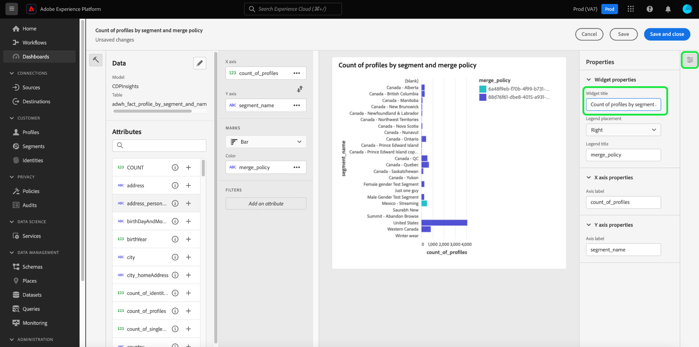

# Análisis y seguimiento del consentimiento

En el panorama de marketing actual, debe comprender y respetar las preferencias de consentimiento del cliente. Adobe Real-Time Customer Data Platform permite a los especialistas en marketing analizar el consentimiento de los clientes para generar confianza, cumplir con las normas de privacidad y ofrecer experiencias más personalizadas.

Este documento detalla cómo crear un panel de consentimiento para varios casos de uso de marketing para datos de Real-Time CDP. En concreto, se centra en cómo crear una audiencia con los atributos adecuados para sus necesidades comerciales y luego consumir las perspectivas mediante el uso de widgets preconfigurados en la interfaz de usuario de Adobe Experience Platform. También se presenta un método alternativo para crear su propio widget personalizado con la función de paneles definida por el usuario.

## Casos de uso {#use-cases}

Los casos de uso cubiertos en esta guía son las tendencias de consentimiento y la superposición de consentimiento.

- **Tendencia del consentimiento** registra la tendencia del consentimiento del usuario a lo largo del tiempo. El análisis de los cambios de preferencias de consentimiento ayuda a los especialistas en marketing a planificar y ejecutar campañas que se adapten a esos cambios de preferencias de usuario. Por ejemplo, es posible que desee ejecutar campañas educativas dirigidas, campañas de transparencia y confianza o campañas de incentivos para impulsar las opciones de consentimiento. También puede correlacionar campañas que puedan haber impactado negativamente en el consentimiento para reducir de forma proactiva la frecuencia de esas campañas.
- **Superposición de consentimiento** utiliza la superposición entre canales de consentimiento para ofrecer mensajes personalizados y coherentes en varios canales para los clientes que han dado su consentimiento a varios canales. Los especialistas en marketing pueden priorizar y asignar recursos a ciertos canales en los que un mayor grado de consentimiento y mensajería personalizada podría interesar a los clientes y generar tasas de respuesta más altas.

## Creación de audiencias consentidas {#create-consent-audiences}

Para crear un panel de consentimiento, primero debe crear una audiencia de todos los perfiles que han aceptado contactar. Para ir al Generador de segmentos de Real-Time Customer Data Platform, seleccione **[!UICONTROL Audiencias]** en el panel de navegación izquierdo de la interfaz de usuario de Experience Platform. En la ficha [!UICONTROL Cliente] del panel de [!UICONTROL Audiencias], seleccione **[!UICONTROL Crear audiencia]** en la parte superior derecha de la vista y luego **[!UICONTROL Generar reglas]**.

![Se ha resaltado el panel [!UICONTROL Audiencias] con [!UICONTROL Cliente], [!UICONTROL Audiencias] y [!UICONTROL Crear segmento].](../images/insights-use-cases/consent-analysis/create-audience.png)

Aparecerá el Generador de segmentos. A continuación, seleccione **[!UICONTROL Perfil individual de XDM]** de las opciones disponibles. Consulte la documentación para obtener más información sobre el [lienzo del generador de reglas](../../segmentation/ui/segment-builder.md#rule-builder-canvas).

![Se ha resaltado el Generador de segmentos con la carpeta de atributos [!UICONTROL XDM Individual Profile].](../images/insights-use-cases/consent-analysis/xdm-individual-profile.png)

Busque los atributos de consentimiento de las opciones disponibles. Seleccione **[!UICONTROL Consentimientos y preferencias]**.

>[!NOTE]
>
>Si ha mantenido su consentimiento de usuario en un atributo diferente al grupo de campos recomendado por Adobe, debe seleccionar esos atributos en lugar de los que se muestran a continuación.

Encontrará más información sobre la [administración del consentimiento en la documentación de segmentation](../../segmentation/tutorials/consents.md#handling-consent-in-segmentation).

![El Generador de segmentos con la carpeta de atributos [!UICONTROL Consentimiento y preferencias] resaltada.](../images/insights-use-cases/consent-analysis/consent-and-preferences.png)

Se muestran las distintas opciones de consentimiento y preferencia. Ya que esta demostración se centra en el consentimiento para contactar a través de varios canales de marketing, seleccione **[!UICONTROL Preferencias de marketing]**.

![Se ha resaltado el Generador de segmentos con la carpeta [!UICONTROL Preferencias de marketing].](../images/insights-use-cases/consent-analysis/marketing-preferences.png)

Se muestra la lista de preferencias de marketing. Aunque este caso de uso de ejemplo se centra en el correo electrónico, los SMS y las llamadas, puede generar perspectivas para cualquier otra combinación o para todas las opciones. Para cada uno de los canales, realice los siguientes pasos para crear una audiencia.

Para comenzar a configurar una audiencia, selecciona **[!UICONTROL Recibir SMS]** / **[!UICONTROL Recibir correo electrónico]** / **[!UICONTROL Recibir llamadas]**.

Aparecerá la carpeta [!UICONTROL Subscriptions]. De las opciones disponibles, seleccione y arrastre el atributo **[!UICONTROL Choice Value]** al panel central y, a continuación, seleccione el valor que desee en la lista desplegable. En este caso, seleccione **Sí (adhesión)**. A continuación, asigne un nombre a la audiencia según sus necesidades comerciales y proporcione una descripción fácil de usar.

>[!NOTE]
>
>Hay un límite flexible en el número de audiencias que se recomienda crear. Encontrará más información en la [documentación de protecciones de segmentación](../../profile/guardrails.md#segmentation-guardrails).

![Atributo [!UICONTROL Choice Value] con el valor [!UICONTROL Sí (opción de inclusión)] resaltado en el generador de segmentos. También se resaltan el nombre y la descripción de la audiencia.](../images/insights-use-cases/consent-analysis/choice-value.png)

Después de crear las audiencias necesarias, se enumeran en la pestaña [!UICONTROL Audiencias] [!UICONTROL Examinar].

>[!NOTE]
>
>Al crear una audiencia, debe esperar a que se complete el trabajo de segmentación por lotes antes de que los datos estén disponibles para empezar a crear el panel de consentimiento. La segmentación por lotes describe el proceso de mover todos los datos de perfil a la vez a través de las definiciones de segmentos para producir las audiencias correspondientes. Una vez creada, esta audiencia se guarda y almacena para que la exporte y utilice. Los segmentos por lotes se evalúan automáticamente cada 24 horas.

## Consumir perspectivas {#consume-insights}

Adobe ha creado varias perspectivas que están disponibles automáticamente en los paneles Perfiles, Audiencias y Destinos. Cualquier audiencia que cree se puede utilizar automáticamente con estas perspectivas preconfiguradas. Consulte la documentación del widget estándar para obtener una lista de las perspectivas disponibles en los paneles de [Perfiles](../guides/profiles.md#standard-widgets), [Audiencias](../guides/audiences.md#standard-widgets) y [Destinos](../guides/destinations.md).

## Solapamiento de público {#audience-overlap}

Para revisar la superposición entre dos audiencias de consentimiento cualesquiera, agregue la [!UICONTROL superposición de audiencias mediante la política de combinación] a su panel Perfiles y seleccione las audiencias que desee en los menús desplegables. Consulte la documentación para obtener instrucciones sobre cómo agregar un widget al tablero sobre la [*superposición de audiencias mediante la política de combinación*](../guides/profiles.md#audience-overlap-by-merge-policy) para obtener más información sobre insight.

<!-- Image needs updating to night mode -->

Puede ver la superposición de todas las audiencias en las que los usuarios han aceptado recibir llamadas entre todas las demás audiencias, con el informe Superposición de audiencias en el panel Audiencias. Para ver la superposición de audiencias de consentimiento, primero ve a la pestaña [!UICONTROL Audiencias] [!UICONTROL Información general]. Desde allí, puede agregar el widget [!UICONTROL informe de superposición de audiencias] al panel Audiencias. Una vez creado el widget, seleccione la audiencia **[!UICONTROL Usuario que consiente las llamadas]** en el menú desplegable Información general de audiencia en la parte superior de la página. A continuación, seleccione **[!UICONTROL Ver más]** en el widget de informe de superposición de audiencia para ver hasta 50 de las superposiciones principales y hasta 50 de las superposiciones menos importantes con respecto al segmento seleccionado.

<!-- Image needs updating to night mode -->

El cuadro de diálogo Informe de superposición de audiencias se amplía para mostrar datos adicionales de superposición de audiencias.

<!-- Image needs updating to night mode -->

## Tendencias de tamaño de público {#audience-size-trends}

Cuando crea una audiencia basada en el consentimiento, la tendencia es automática hasta 12 meses desde la fecha de creación de la audiencia. Para tener una tendencia funcional del consentimiento del cliente, agregue los siguientes widgets a la página [!UICONTROL Segmentos] [!UICONTROL Información general]. Estas perspectivas ofrecen un poderoso medio para rastrear cómo su consentimiento está cambiando con el tiempo. Incluso se correlacionan con cualquier campaña que ejecute en paralelo que pueda afectar positiva o negativamente al consentimiento. Las descripciones ofrecidas para estos widgets se aplican a un caso de uso de consentimiento.

- [Tendencia de tamaño de audiencia](../guides/audiences.md#audience-size-trend): este widget ofrece una forma de rastrear cómo ha cambiado su consentimiento respectivo con el paso del tiempo.
- [Tendencia de cambio de tamaño de audiencia](../guides/audiences.md#audience-size-change-trend): este widget rastrea cómo ha cambiado diariamente el consentimiento del cliente. Por ejemplo, si el recuento del consentimiento del cliente disminuyó en 100 000, puede ver cómo se produjo ese cambio diariamente.
- [Tendencia del tamaño de la audiencia según la identidad](../guides/audiences.md#audience-size-trend-by-identity): con este widget puede rastrear cómo ha cambiado su respectivo consentimiento con el paso del tiempo, pero aún más filtrado por una identidad específica, como un correo electrónico.

<!-- Image needs updating to night mode -->

## Panel de información general de audiencias {#audiences-overview-dashboard}

Después de crear una audiencia relacionada con el consentimiento, como &quot;Usuarios con consentimiento para SMS&quot;, puede ver información de consentimiento personalizada clave sobre su audiencia añadiendo los widgets adecuados al panel Información general de audiencias. Vaya a [!UICONTROL Audiencias] [!UICONTROL Información general] y agregue los widgets que haya elegido desde la biblioteca de widgets. Se puede cambiar el tamaño de cualquier widget que se agregue a la vista del panel y moverlo mediante la función [!UICONTROL Modificar panel]. La vista personalizada puede contener perspectivas como la tendencia a lo largo del tiempo (hasta 12 meses), la superposición con otras audiencias y la composición de identidad de la audiencia. A continuación se muestra una vista de ejemplo.

## Paneles definidos por el usuario {#usr-defined-dashboards}

También puede crear sus propios widgets con paneles definidos por el usuario. La creación de su propio widget le proporciona un control completo sobre el tipo de widget, junto con flexibilidad para agregar filtros y mucho más, directamente en Adobe Real-Time CDP.

Por ejemplo, si desea analizar la tendencia de varias audiencias de consentimiento en el mismo gráfico, de modo que pueda ver con el paso del tiempo cómo ha cambiado cada una de las preferencias de consentimiento. Este tipo de visualización es posible con paneles definidos por el usuario en pasos mínimos y una configuración única. Primero, seleccione **[!UICONTROL Paneles]** en el panel de navegación izquierdo. Aparece el área de trabajo [!UICONTROL Paneles]. A continuación, seleccione **[!UICONTROL Crear tablero]**. Encontrará instrucciones completas sobre cómo [crear un tablero y un widget personalizado](../standard-dashboards.md) en la guía de tableros definida por el usuario.

Cuando [seleccione su modelo de datos](../standard-dashboards.md#select-data-model) en el compositor de widgets, seleccione `CDPInsights` seguido de **[!UICONTROL Siguiente]**. Aparecerá el cuadro de diálogo [!UICONTROL Seleccionar tabla].

La vista siguiente muestra una lista de las tablas disponibles en el carril izquierdo. Seleccione el `adwh_fact_profile_by_segment_and_namespace_trendlines`.

Una vez que el compositor de widgets se rellene con los datos de la tabla seleccionada, realice los pasos siguientes:

- [Busque [!UICONTROL Atributos]](../standard-dashboards.md#add-filter-attributes) para `[!UICONTROL date]` y, a continuación, utilice el icono + para agregar el atributo `[!UICONTROL date]` al eje X desde el menú desplegable.
  
- Busque [!UICONTROL Atributos] de `[!UICONTROL count_of_profiles]` y, a continuación, utilice el icono + para agregar el atributo `[!UICONTROL count_of_profiles]` al eje Y desde el menú desplegable.
- Seleccione el icono `...` (elipses) en el campo [!UICONTROL Eje Y] y, a continuación, seleccione la función de agregado [!UICONTROL SUM] del menú desplegable.
  
- Seleccione el menú desplegable [!UICONTROL Marcas] y cambie el tipo de gráfico a [!UICONTROL Línea].
- Busque [!UICONTROL Atributos] para `[!UICONTROL segment_name]` y luego use el icono + para agregar `segment_name` como [!UICONTROL Filtro] del menú desplegable. Aparecerá el cuadro de diálogo [!UICONTROL Filtro: Segment_name]. Seleccione las audiencias creadas anteriormente relacionadas con el consentimiento. Para este ejemplo, seleccione **[!UICONTROL Usuarios con consentimiento para llamadas]**, **[!UICONTROL Usuarios con consentimiento para SMS]** y **[!UICONTROL Usuarios con consentimiento para correo electrónico]**, seguidos de **[!UICONTROL Aplicar]**.
- Busque [!UICONTROL Atributos] de `[!UICONTROL segment_name]` y, a continuación, seleccione el icono + para agregar `segment_name` como [!UICONTROL Color] en el menú desplegable.
- Abra [el panel [!UICONTROL Propiedades]](../standard-dashboards.md#widget-properties) y proporcione un [!UICONTROL título de widget] y una [!UICONTROL etiqueta de eje] adecuados.
  
- Seleccione **[!UICONTROL Guardar y cerrar]** para confirmar la configuración.

>[!TIP]
>
>Ahora puede cambiar el tamaño del widget o moverlo al tamaño y la posición deseados antes de guardar el tablero.

La siguiente imagen muestra cómo aparece el widget terminado y otras perspectivas personalizadas potenciales. Para obtener más información sobre los tipos de widgets que se pueden crear, consulte la [documentación del modelo de datos](../data-models/cdp-insights-data-model-b2c.md).

<!-- The diagram shows straight lines due to a lack of data, however in your environment the trends will reflect the actual changes over time. -->

## Políticas de consentimiento de seguimiento {#consent-policies}

Los paneles de consentimiento que cree capturarán únicamente la **distribución de atributos de consentimiento y preferencia**.

>[!NOTE]
>
>Para los clientes de **Adobe Healthcare Shield** o **Adobe Privacy &amp; Security Shield**, estos paneles **no** reflejan ningún seguimiento de las directivas de consentimiento. El seguimiento disponible incluye el número de directivas creadas, habilitadas y el impacto en el abono a audiencias.

## Pasos siguientes

Al leer este documento, ha aprendido a crear paneles para obtener una vista completa de las preferencias de consentimiento del cliente mediante perspectivas de Real-Time CDP. Este documento muestra cómo Real-Time CDP proporciona una solución sólida para el panorama actual centrado en la privacidad, donde la recopilación, segmentación, análisis y campañas de marketing personalizadas basadas en datos de consentimiento son cruciales para los especialistas en marketing.
