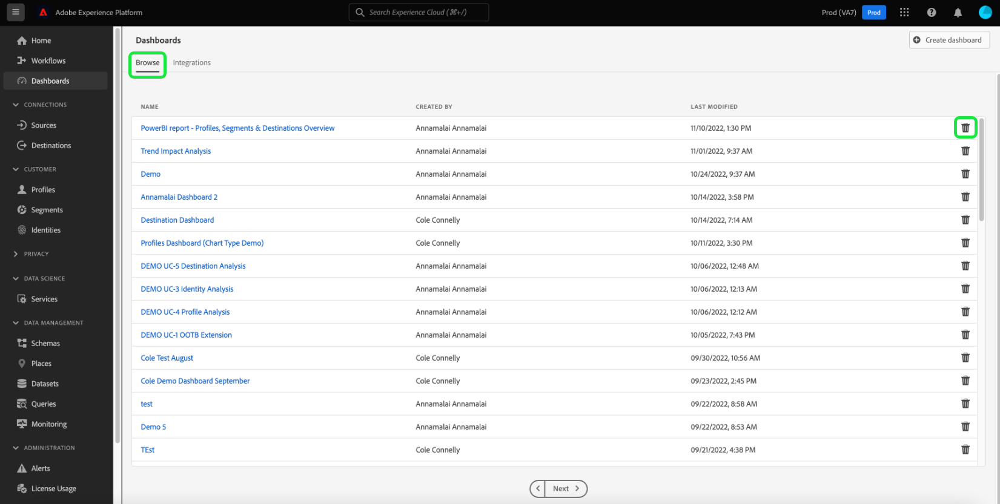

# Plantillas de informe de Power BI para paneles

La función de plantillas de informes de Power BI le permite crear informes atractivos rellenados con datos de Adobe Experience Platform. El proceso de instalación simplificado instala automáticamente los widgets estándar para el perfil del cliente en tiempo real, la segmentación y los destinos. La instalación también conecta Power BI con los modelos de datos para que pueda personalizar y ampliar fácilmente las plantillas de informes. Estos informes se pueden compartir en toda la organización sin que los destinatarios necesiten credenciales para su organización en Experience Platform.

Este documento proporciona instrucciones sobre cómo conectar Adobe Experience Platform con la aplicación de Power BI y utilizar plantillas de informes para compartir perspectivas de datos clave de Experience Platform con usuarios externos.

## Introducción

Antes de continuar con este tutorial, se recomienda tener una buena comprensión de [la composición de esquemas](../../xdm/schema/composition.md) en Experience Platform y de cómo se incluyen los atributos en el perfil del cliente en tiempo real a través del [esquema de unión](../../xdm/schema/composition.md#union).

Para instalar la integración de aplicaciones de Power BI, los usuarios deben haber adquirido primero los siguientes permisos de Experience Platform:

- Administrar consultas
- Administrar zonas protegidas

Para saber cómo asignar estos permisos, lea la documentación de [control de acceso](../../access-control/home.md).

También debe tener una cuenta de Power BI para seguir este tutorial. Para crear una cuenta, vaya a la [página principal de Power BI](https://powerbi.microsoft.com/en-us/) y siga el proceso de registro. Los usuarios de esta cuenta de Power BI también deben habilitar la configuración **Crear espacio de trabajo** en su configuración de Power BI. Esta configuración se encuentra en la configuración de inquilino del portal de administración de Power BI. Si su inquilino o empleador proporciona su cuenta, póngase en contacto con su administrador respectivo para habilitar esta configuración.

>[!NOTE]
>
>Para que la pestaña Paneles aparezca en la navegación izquierda de la interfaz de usuario de Experience Platform y la vista Inventario de paneles sea visible, debe tener acceso a cualquiera de los paneles de Perfil, Segmentación o Destino como parte de su licencia de Experience Platform.

## Instalación de la integración de aplicaciones de Power BI

En la interfaz de usuario de Experience Platform, seleccione **[!UICONTROL Paneles]** en el panel de navegación izquierdo para abrir el área de trabajo de [!UICONTROL Paneles]. La pestaña [!UICONTROL Examinar] muestra una lista de las vistas de panel disponibles actualmente. Para obtener más información acerca de cómo ver los paneles disponibles, consulte la [documentación de inventario](../inventory.md).

A continuación, seleccione la pestaña **[!UICONTROL Integraciones]**. Aparecerá la página Integración de aplicaciones de Power BI. Aquí, seleccione **[!UICONTROL Instalar]** para comenzar la instalación.

>[!NOTE]
>
>El botón [!UICONTROL Instalar] está deshabilitado a menos que tenga los permisos Administrar el servicio de consultas y Administrar zonas protegidas.

### Proporcionar credenciales

El primer paso del proceso de instalación es proporcionar credenciales que no caduquen para la integración de la aplicación de Power BI. Hay dos opciones disponibles para proporcionarlas: [[!UICONTROL Crear nuevas credenciales]](#create-new-credentials) o [[!UICONTROL Usar credenciales existentes]](#use-existing-credentials). Seleccione el conmutador adecuado para continuar.

#### Crear credenciales nuevas {#create-new-credentials}

Hay dos campos obligatorios al generar nuevas credenciales: [!UICONTROL Nombre] y [!UICONTROL Asignado a]. El campo [!UICONTROL Asignado a] está relacionado con la dirección de correo electrónico asociada a su cuenta de Power BI.

>[!IMPORTANT]
>
>La creación de credenciales que no caducan requiere que tenga asignados determinados permisos y funciones. Los permisos necesarios son Administrar zonas protegidas y Administrar integración del servicio de consultas. Las funciones requeridas son de administrador de Adobe Experience Platform y de desarrollador. Para saber cómo asignar estos permisos, lea la documentación de [control de acceso](../../access-control/home.md).

Para obtener más información sobre la generación de credenciales de servicio de consulta que no caducan, consulte la [guía de credenciales que no caducan](../../query-service/ui/credentials.md#non-expiring-credentials).

Después de generar credenciales que no caducan por primera vez, se descarga un archivo JSON en ese equipo. Este archivo JSON se puede compartir con otros usuarios como credenciales para completar el proceso de instalación.

#### Usar credenciales existentes {#use-existing-credentials}

También se puede cargar un archivo de credenciales JSON para aprobar la validación. Estos archivos JSON que contienen los valores de credencial que no caducan se descargan en el equipo local que se utiliza cuando se crea una credencial que no caduca.

>[!IMPORTANT]
>
>Para utilizar una credencial existente que no caduque, el usuario ya debe tener asignada una credencial. Si el usuario no tiene una credencial asignada y no puede crear una nueva mediante Adobe Admin Console, no podrá continuar con el proceso de instalación.

Seleccione **[!UICONTROL Cargar archivo de credenciales]** y, a continuación, seleccione el archivo JSON apropiado para cargar en el cuadro de diálogo que aparece.

Después de proporcionar las credenciales que no caducan, Experience Platform las valida automáticamente. Cuando la validación se realiza correctamente, aparece un mensaje de confirmación. Seleccione **[!UICONTROL Siguiente]** para revisar el acuerdo de consentimiento de la aplicación Power BI.

### Dar su consentimiento

Aparecerá la pantalla de consentimiento. Seleccione **[!UICONTROL Revisar consentimiento]** para abrir una nueva ventana que detalla los permisos necesarios para que Power BI acceda y utilice sus datos según sus términos de servicio y declaración de privacidad.

Seleccione **[!UICONTROL Aceptar]** para conceder permiso a Power BI para acceder a sus datos de Experience Platform y utilizarlos.

>[!NOTE]
>
>Si sale del proceso de instalación en cualquier momento antes de dar su consentimiento, la integración de la aplicación Power BI no se instalará en el inventario de paneles.

Después de dar su consentimiento, la plantilla de informe se instala automáticamente en el entorno de Power BI como parte del proceso de instalación. A continuación, Power BI utiliza las credenciales que no caducan para acceder a Experience Platform, ejecutar secuencialmente todas las consultas SQL y rellenar la plantilla de informe con los datos devueltos.

Seleccione **[!UICONTROL Finalizar]** para volver al inventario de tableros.

Ahora que la plantilla de informe de Power BI está instalada, aparece en la lista de paneles disponibles en la ficha [!UICONTROL Examinar]. Seleccione **[!UICONTROL Power BI]** de la lista para navegar al entorno de Power BI.

>[!IMPORTANT]
>
>Los administradores de Power BI deben asegurarse de que los usuarios tengan los permisos de acceso adecuados para ver estos paneles en el entorno de Power BI.

## Power BI Workspace

Después de iniciar sesión en [el espacio de trabajo de Power BI](https://dxt.powerbi.com), las plantillas de informes están disponibles para cada uno de los servicios a los que tiene acceso. Las plantillas de informe incluyen perfiles, segmentos y paneles de destinos **solamente** si tienen los permisos de vista correspondientes.

Los widgets estándar de perfiles, segmentos y destinos están disponibles en los informes de plantillas de Power BI de forma predeterminada.

>[!NOTE]
>
>Debe tener habilitados los permisos de edición de un tablero determinado para permitir que ese tablero se instale en el entorno de Power BI.

Una vez instalado un tablero en Power BI, las plantillas de informes se muestran a todos los usuarios de forma predeterminada. Si desea restringir el acceso a cualquier plantilla de informe, asegúrese de deshabilitar el acceso para los usuarios en cuestión desde el entorno de Power BI.

## Personalización de la plantilla de informe de Power BI

Mediante el uso de widgets personalizados, puede agregar atributos personalizados al modelo de datos para enriquecer las plantillas de informe que proporciona Power BI.

>[!NOTE]
>
>Los atributos que puede utilizar para los widgets personalizados dependen de lo que esté disponible en el esquema de unión. Para aprender a ver y explorar esquemas de unión en beneficio de sus widgets personalizados, consulte la [guía de la interfaz de usuario del esquema de unión](../../profile/ui/union-schema.md).

### Crear un widget personalizado

Los widgets personalizados se crean mediante la biblioteca de widgets. Consulte la [Descripción general de la biblioteca de widgets](../customize/widget-library.md) para obtener una introducción a la función y el [tutorial para crear un widget personalizado](../customize/custom-widgets.md) para obtener instrucciones específicas.

>[!IMPORTANT]
>
>Los widgets personalizados recién creados se sincronizan automáticamente **no** entre los paneles de Adobe Experience Platform y las plantillas de informes de Power BI. Los widgets personalizados creados en la interfaz de usuario de Experience Platform deben volver a crearse manualmente dentro del entorno de Power BI.

### Vuelva a crear el widget personalizado en el entorno de Power BI.

Una vez que el tablero tenga las métricas y los atributos adecuados contenidos en los widgets personalizados, podrá modificar la plantilla de informe que se muestra en el entorno de Power BI. Consulte la [documentación de Power BI](https://docs.microsoft.com/en-us/power-bi/) para obtener información sobre cómo editar un informe a través de su interfaz de usuario.

## Eliminación de la integración de aplicaciones Power BI

Para eliminar el tablero, vaya al inventario del tablero y seleccione el icono de eliminación () junto al nombre del tablero.

>[!NOTE]
>
>Solo el usuario que instaló el panel de Power BI puede eliminar la integración de la interfaz de usuario de Experience Platform.

Aparece una ventana emergente de confirmación. Seleccione **[!UICONTROL Eliminar]** para confirmar el proceso.

>[!IMPORTANT]
>
>Al eliminar el panel de Power BI de la interfaz de usuario de Experience Platform, **no** se eliminan las plantillas de informe disponibles en su entorno de Power BI. Si desea eliminar por completo la información contenida en las plantillas de informes de Power BI, debe iniciar sesión en su cuenta de Power BI y eliminar las plantillas de informes de ese entorno. Una vez eliminado, un usuario puede volver a instalar el panel de Power BI siguiendo las mismas instrucciones de instalación descritas anteriormente.

## Pasos siguientes

Al leer este documento, comprende mejor cómo se pueden integrar las plantillas de informes de Power BI en Experience Platform para compartir datos atractivos desde sus perfiles, segmentos o paneles de destinos. Consulte la [descripción general de la personalización de tableros](../customize/overview.md) para obtener más información sobre cómo personalizar los tableros.
