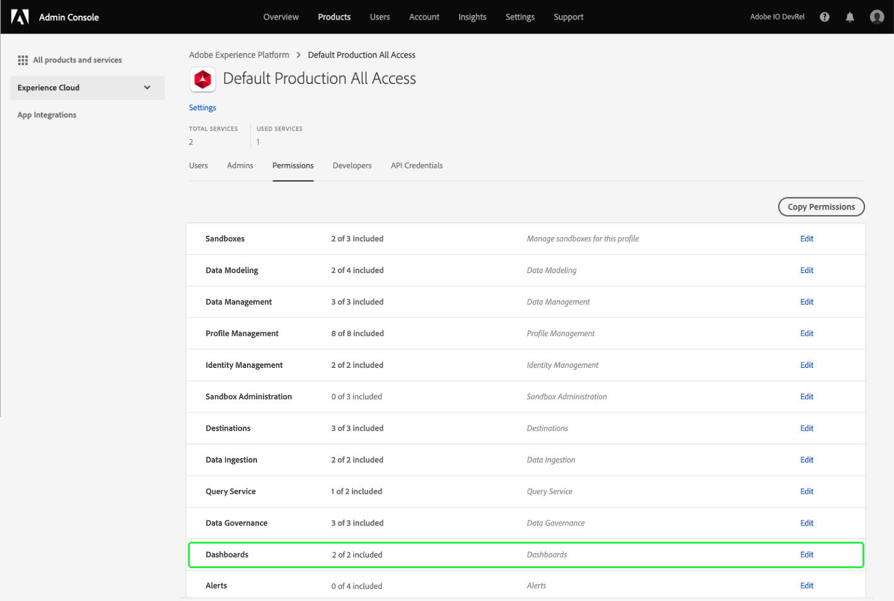

# Permisos de acceso para tableros

Para que los usuarios puedan ver, editar y actualizar los tableros, primero debe habilitar los permisos. En Adobe Experience Platform, el control de acceso se proporciona a través de Adobe Admin Console. Esta funcionalidad aprovecha los perfiles de producto de [!DNL Admin Console], que vinculan a los usuarios con permisos y entornos limitados.

Este documento proporciona un resumen de cómo proporcionar acceso a permisos de tablero específicos dentro de Admin Console. Para obtener información detallada sobre cómo obtener y asignar permisos de acceso, comience leyendo la [información general del control de acceso](../access-control/home.md).

>[!NOTE]
>
>Para configurar el control de acceso para [!DNL Experience Platform], debe tener privilegios de administrador para una organización que tenga una integración de producto [!DNL Experience Platform]. Consulte el artículo de Adobe Help Center sobre [funciones administrativas](https://helpx.adobe.com/enterprise/using/admin-roles.html) para obtener más información.

## Permisos disponibles {#available-permissions}

Existen dos permisos principales necesarios para acceder a los tableros dentro de Experience Platform. Estos permisos son:

* **Ver tablero de uso de licencias**: Este permiso permite que los usuarios tengan acceso de solo lectura al panel de uso de licencias dentro de la interfaz de usuario del Experience Platform.
* **Administrar tableros** estándar: Este permiso permite a los usuarios agregar atributos personalizados que aún no están en el almacén de datos.

Los siguientes pasos le mostrarán cómo agregar estos permisos mediante Admin Console.

## Seleccionar perfiles de producto

Para conceder acceso a los usuarios a los tableros en el Experience Platform, comience iniciando sesión en [Adobe Admin Console](https://adminconsole.adobe.com) y seleccionando **Productos** en la barra de navegación superior.

Seleccione **Adobe Experience Platform** en el menú desplegable del Experience Cloud en el panel de navegación izquierdo o en las tarjetas que aparecen en *Todos los productos y servicios*. En la página de producto de Adobe Experience Platform, seleccione el perfil de producto al que desea agregar los permisos de tablero o seleccione **Nuevo perfil** para crear un nuevo perfil de producto.

Se abre el perfil de producto seleccionado y se muestran los usuarios asociados a dicho perfil de producto. Para administrar los permisos para el perfil del producto, seleccione **Permisos**.

## Agregar o editar permisos

La pestaña **Permissions** muestra todos los permisos disponibles para el perfil del producto. Busque la fila **Tableros** y observe que actualmente dice &quot;0 de 2 incluidos&quot;, lo que significa que no hay permisos de tablero habilitados para el perfil del producto.

Para editar los permisos del tablero, seleccione **Editar** en la fila del tablero.

Se abre el cuadro de diálogo **Editar permisos**, que muestra los elementos de permiso disponibles y los elementos de permiso incluidos. Puede seleccionar el signo más (`+`) junto al permiso para agregarlo o seleccionar **+ Agregar todo** para agregar todos los permisos a la vez.

Para obtener descripciones de los permisos, consulte la sección [permisos disponibles](#available-permissions) anterior de este documento.

>[!NOTE]
>
>No es necesario habilitar todos los permisos para todos los usuarios. Según la estructura de su organización, puede que desee crear perfiles de producto independientes para determinados usuarios y conceder acceso limitado (como solo lectura).

Una vez añadidos los permisos, seleccione **Guardar** para volver al perfil del producto.

Cuando vuelva al perfil del producto, puede verificar que los permisos se hayan agregado confirmando que la fila **Tableros** muestra &quot;2 de 2 incluidos&quot;.

## Pasos siguientes

Ahora que ha añadido permisos de acceso a los tableros, los usuarios de su organización pueden empezar a ver los tableros dentro de la interfaz de usuario del Experience Platform y a realizar otras acciones en función de los permisos que haya asignado.