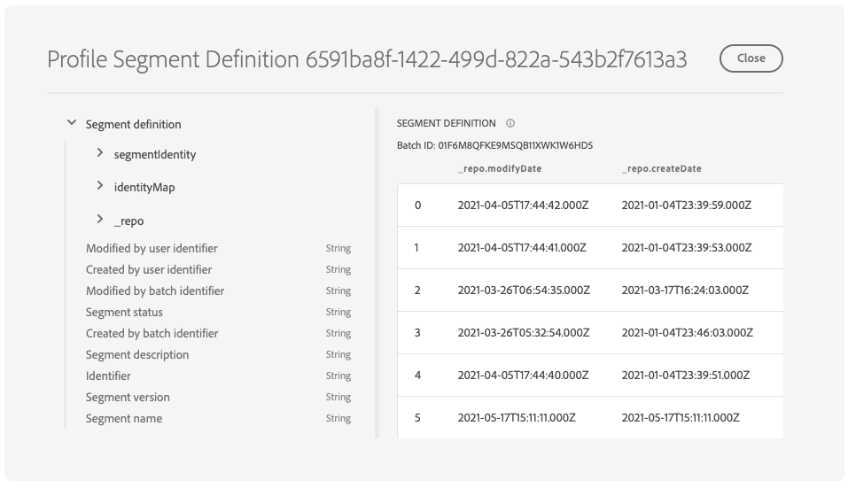

# Explorar, verificar y procesar conjuntos de datos de tableros mediante [!DNL Query Service]

Adobe Experience Platform proporciona información importante sobre los datos de perfil, segmento y destino de su organización a través de los paneles disponibles en la interfaz de usuario del Experience Platform. A continuación, puede usar Adobe Experience Platform [!DNL Query Service] para explorar, verificar y procesar los conjuntos de datos sin procesar que alimentan estos tableros en el lago de datos.

## Introducción a [!DNL Query Service]

Adobe Experience Platform [!DNL Query Service] permite a los especialistas en marketing obtener perspectivas de sus datos al permitir el uso de SQL estándar para consultar datos en el lago de datos. [!DNL Query Service] ofrece una interfaz de usuario y una API que se pueden usar para unirse a cualquier conjunto de datos en el lago de datos y capturar los resultados de la consulta como nuevos conjuntos de datos para su uso en informes, aprendizaje automático o para su incorporación al Perfil del cliente en tiempo real.

Para obtener más información sobre [!DNL Query Service] y su papel en el Experience Platform, por favor comience leyendo el [[!DNL Query Service] información general](../query-service/home.md).

## Acceso a conjuntos de datos disponibles

Puede usar [!DNL Query Service] para consultar conjuntos de datos sin procesar en tableros de perfiles, segmentos y destinos. Para ver los conjuntos de datos disponibles, en la interfaz de usuario del Experience Platform, seleccione **Conjuntos de datos** en el panel de navegación izquierdo para abrir el tablero Conjuntos de datos . El tablero enumera todos los conjuntos de datos disponibles para su organización. Se muestran los detalles de cada conjunto de datos enumerado, incluido su nombre, el esquema al que se adhiere el conjunto de datos y el estado de la ejecución de ingesta más reciente.


### Conjuntos de datos generados por el sistema

>[!IMPORTANT]
>
>Los conjuntos de datos generados por el sistema están ocultos de forma predeterminada. De forma predeterminada, la variable [!UICONTROL Examinar] solo muestra los conjuntos de datos en los que ha introducido datos.

Para ver los conjuntos de datos generados por el sistema, seleccione el icono de filtro () situado a la izquierda de la barra de búsqueda.


Aparece una barra lateral que contiene dos toggins, [!UICONTROL Incluido en el perfil] y [!UICONTROL Mostrar conjuntos de datos del sistema]. Seleccione la opción [!UICONTROL Mostrar conjuntos de datos del sistema] para incluir conjuntos de datos generados por el sistema en la lista de conjuntos de datos que se pueden explorar.


### Conjuntos de datos de atributos de perfil

Las perspectivas del panel de perfiles están vinculadas a las políticas de combinación que su organización ha definido. Para cada directiva de combinación activa, hay un conjunto de datos de atributo de perfil disponible en el lago de datos.

La convención de nomenclatura de estos conjuntos de datos es **Profile-Snapshot-Export** seguido de un valor alfanumérico aleatorio generado por el sistema. Por ejemplo: `Profile-Snapshot-Export-abbc7093-80f4-4b49-b96e-e743397d763f`.

Para comprender el esquema completo de cada conjunto de datos de exportación de instantánea de perfil, puede obtener una vista previa y explorar los conjuntos de datos [uso del visor del conjunto de datos](../catalog/datasets/user-guide.md) en la interfaz de usuario del Experience Platform.


#### Asignación de conjuntos de datos de atributos de perfil para combinar ID de directivas

El valor alfanumérico asignado a cada conjunto de datos de atributos de perfil generados por el sistema es una cadena aleatoria que se asigna a un ID de política de combinación de una de las políticas de combinación creadas por su organización. La asignación de cada ID de directiva de combinación a la cadena de conjunto de datos de atributo de perfil relacionada se mantiene en la variable `adwh_dim_merge_policies` conjunto de datos.

La variable `adwh_dim_merge_policies` el conjunto de datos contiene los siguientes campos:

* `merge_policy_name`
* `merge_policy_id`
* `merge_policy`
* `dataset_id`

Este conjunto de datos se puede explorar mediante la interfaz de usuario del Editor de consultas en Experience Platform. Para obtener más información sobre el uso del Editor de consultas, consulte la [Guía de la interfaz de usuario del Editor de consultas](../query-service/ui/user-guide.md).

### Conjunto de datos de metadatos de segmentos

Hay un conjunto de datos de metadatos de segmento disponible en el lago de datos que contiene metadatos para cada uno de los segmentos de su organización.

La convención de nomenclatura de este conjunto de datos es **Segmentdefinition-Instantánea-Exportar** seguido de un valor numérico alfa. Por ejemplo: `Segmentdefinition-Snapshot-Export-acf28952-2b6c-47ed-8f7f-016ac3c6b4e7`

Para comprender el esquema completo de cada conjunto de datos de exportación de instantánea de definición de segmento, puede obtener una vista previa y explorar los conjuntos de datos [uso del visor del conjunto de datos](../catalog/datasets/user-guide.md) en la interfaz de usuario del Experience Platform.



### Conjunto de datos de metadatos de destino

Los metadatos de todos los destinos activados de su organización están disponibles como un conjunto de datos sin procesar en el lago de datos.

La convención de nomenclatura de este conjunto de datos es **DIM_Destination**.

Para comprender el esquema completo del conjunto de datos de destino DIM, puede obtener una vista previa y explorar el conjunto de datos [uso del visor del conjunto de datos](../catalog/datasets/user-guide.md) en la interfaz de usuario del Experience Platform.


## (Beta) Informes de perspectivas de la Plataforma de datos del cliente (CDP)

>[!IMPORTANT]
>
>La función de modelos de datos de CDP Insights está en versión beta. Sus características y documentación están sujetas a cambios.

La función de modelos de datos de CDP Insights expone el SQL que alimenta la información de varios widgets de perfil, destino y segmentación. Puede personalizar estas plantillas de consulta SQLl para crear informes CDP para sus casos de uso de marketing y KPI.

El sistema de informes CDP proporciona perspectivas sobre sus datos de perfil y su relación con segmentos y destinos. Consulte la documentación del Modelo de datos de CDP Insights para obtener información detallada sobre cómo [aplique los modelos de datos de CDP Insights a sus casos de uso de KPI particulares](./cdp-insights-data-model.md).

## Consultas de ejemplo

Las siguientes consultas de ejemplo incluyen SQL de muestra que se puede utilizar en [!DNL Query Service] para explorar, verificar y procesar los conjuntos de datos sin procesar que alimentan los tableros.

### Recuento de perfiles por identidad

Esta perspectiva de perfil proporciona un desglose de identidades en todos los perfiles combinados del conjunto de datos.

>[!NOTE]
>
>El número total de perfiles por identidad (es decir, sumando los valores mostrados para cada área de nombres) puede ser mayor que el número total de perfiles combinados, ya que un perfil podría tener varias áreas de nombres asociadas. Por ejemplo, si un cliente interactúa con la marca en más de un canal, se asociarán varias áreas de nombres con ese cliente individual.

**Consulta**

```sql
Select
        Key namespace,
        count(1) count_of_profiles
     from
        (
           Select
               explode(identitymap)
           from
              Profile-Snapshot-Export-abbc7093-80f4-4b49-b96e-e743397d763f
        )
     group by
        namespace;
```

### Recuento de perfiles por segmento

Esta perspectiva de audiencia proporciona la cantidad total de perfiles combinados dentro de cada segmento en el conjunto de datos. Este número es el resultado de aplicar la política de combinación de segmentos a los datos de perfil para combinar fragmentos de perfil y formar un único perfil para cada individuo en el segmento.

```sql
Select          
        concat_ws('-', key, source_namespace) segment_id,
        count(1) count_of_profiles
      from
        (
            Select
              Upper(key) as source_namespace,
              explode(value)
            from
              (
                  Select
                    explode(Segmentmembership)
                  from
                    Profile-Snapshot-Export-abbc7093-80f4-4b49-b96e-e743397d763f
              )
        )
      group by
      segment_id
```

## Pasos siguientes

Al leer esta guía, ahora puede usar [!DNL Query Service] realizar varias consultas para explorar y procesar los conjuntos de datos sin procesar que alimentan los paneles de perfil, segmento y destinos.

Para obtener más información sobre cada tablero y sus métricas, seleccione un tablero de la lista de tableros disponibles en la navegación de documentación.
