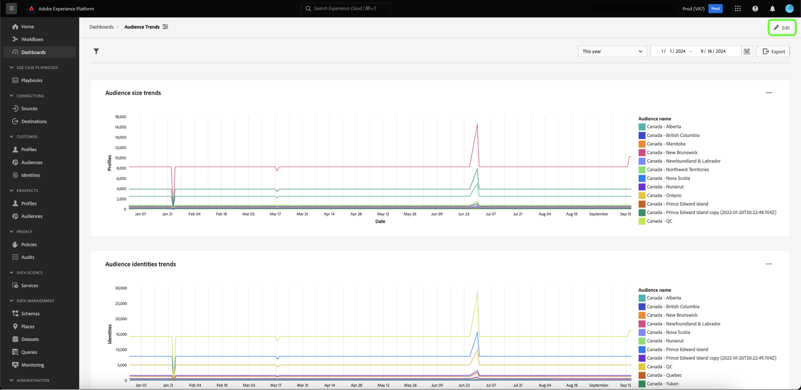

# Explorar en profundidad {#drill-through}

Las exploraciones en profundidad facilitan el análisis de datos en varias capas, ya que facilitan la navegación desde cualquier gráfico a un nuevo panel. Esta función facilita la transición de descripciones generales de alto nivel a informes detallados al estudiar tendencias, comportamiento del cliente, indicadores operativos, etc., lo que garantiza que siempre tenga el contexto que necesita.

El sistema garantiza que el análisis que comience continúe sin problemas durante toda la experiencia de obtención de detalles completa pasando automáticamente filtros globales y filtros de intervalo de fechas desde los paneles de origen a los de destino. Para facilitar la navegación entre varias capas del estudio, el sistema permite perforaciones de varios niveles.

## Creación de una obtención de detalles {#create-drill-through}

Para crear una obtención de detalles, primero seleccione **[!UICONTROL Editar]** en la vista de panel.

Seleccione los puntos suspensivos del gráfico que desea explorar en profundidad y, a continuación, seleccione **[!UICONTROL Editar]**.

En el panel [!UICONTROL Propiedades], use la opción para habilitar **[!UICONTROL Habilitar obtención de detalles]** y, a continuación, use la lista desplegable para seleccionar **[!UICONTROL Panel de destino]**. Asegúrese de que la opción para **[!UICONTROL Filtrar acceso directo]** esté habilitada y luego seleccione **[!UICONTROL Guardar y cerrar]**.

>[!INFO]
>
>Repita los pasos resaltados anteriormente para el tablero de destino para configurar una obtención de detalles de varios niveles.

## Ver una obtención de detalles {#view-drill-through}

Para ver una obtención de detalles, seleccione puntos suspensivos en el gráfico en la vista de panel y, a continuación, seleccione **[!UICONTROL Obtener detalles]**.

Se muestra el panel de destino de obtención de detalles. Puede repetir este paso si tiene obtención de detalles de varios niveles.

>[!NOTE]
>
>Todos los filtros aplicados en el panel de origen se pasan al panel de destino. Sin embargo, los filtros de fecha y los filtros globales están desactivados en los paneles secundarios.

## Eliminación de una obtención de detalles {#remove-drill-through}

Para quitar una obtención de detalles, primero seleccione **[!UICONTROL Editar]** en la vista de panel.

Seleccione los puntos suspensivos del gráfico en el que desea quitar una obtención de detalles y, a continuación, seleccione **[!UICONTROL Editar]**.

En el panel [!UICONTROL Propiedades], seleccione la opción para deshabilitar **[!UICONTROL Habilitar obtención de detalles]**, luego seleccione **[!UICONTROL Guardar y cerrar]**.

![Panel de propiedades del gráfico con la opción deshabilitada para [!UICONTROL Habilitar obtención de detalles] resaltada.](../images/sql-insights-query-pro-mode/drill-through-disable.png)

## Pasos siguientes

Después de leer este documento, ahora sabe cómo crear una obtención de detalles para el tablero. También puede aprender a generar gráficos a partir de modelos de datos existentes en la interfaz de usuario de Adobe Experience Platform con la [guía del modo de diseño guiado](../standard-dashboards.md).
