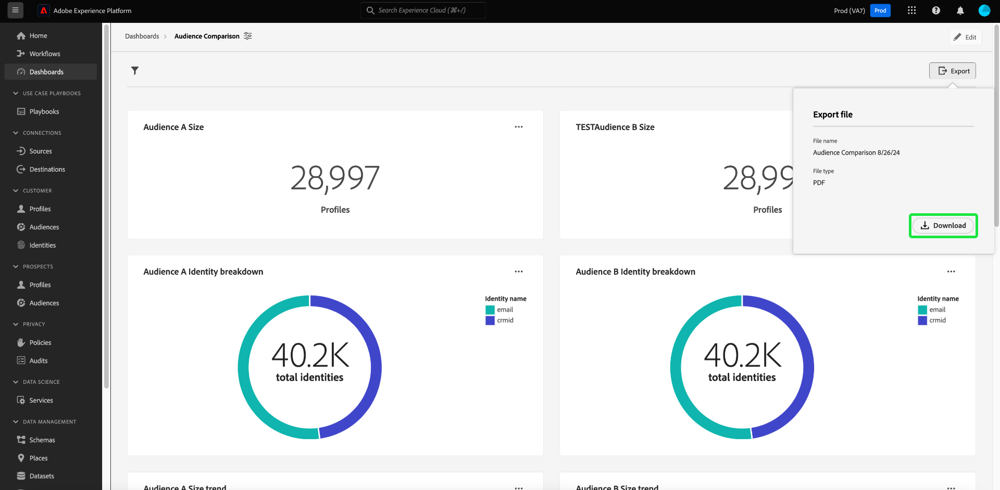

# Export PDF {#export-pdf}

Una vez que haya creado un [insight personalizado](./overview.md) con [query pro mode](./overview.md#query-pro-mode), podrá exportar los datos del gráfico en formato PDF. Esta acción se realiza desde la información general del panel personalizado.

En el área de trabajo de paneles, seleccione un panel personalizado del inventario que aparece en la ficha [!UICONTROL Examinar].

Aparecerá su tablero personalizado. A continuación, seleccione **[!UICONTROL Exportar]** en la parte superior derecha de la interfaz de usuario.

>[!NOTE]
>
>Las exportaciones solo de visualización no requieren el permiso [!UICONTROL Exportar datos del panel]. Consulte la [[!UICONTROL Documentación de ]Ver más](./view-more.md#export) para obtener más detalles.

Aparecerá el cuadro de diálogo **[!UICONTROL Exportar archivo]**. Finalmente, seleccione **[!UICONTROL Descargar]**

Aparecerá la vista previa de PDF. Seleccione **[!UICONTROL Guardar]** para completar el proceso.

