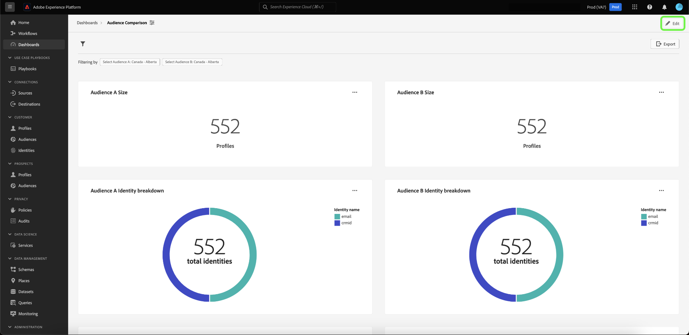
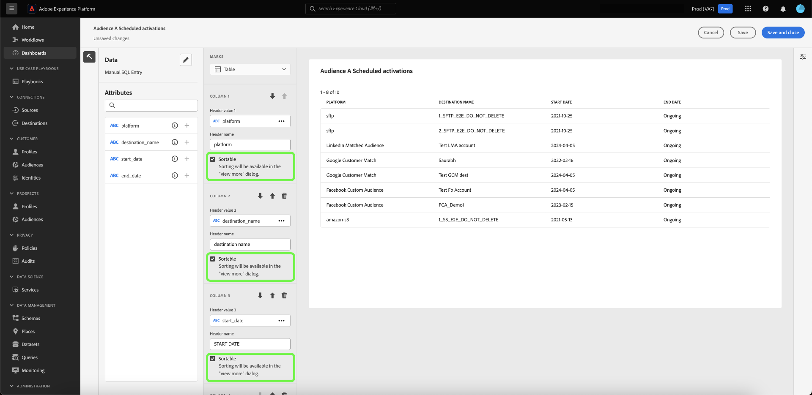
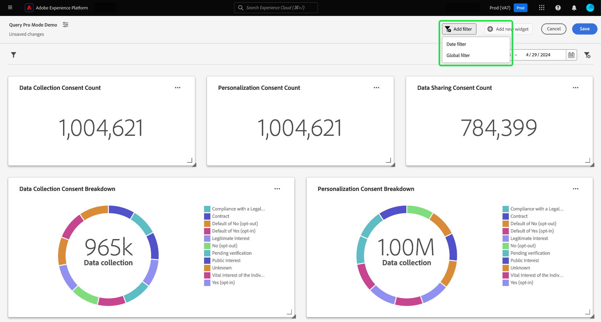

# SQL Insights para creación de informes ampliados de aplicaciones

Utilice consultas SQL personalizadas para extraer de forma eficaz perspectivas de diversos conjuntos de datos estructurados. Los técnicos pueden utilizar el modo query pro para realizar análisis complejos con SQL y luego compartir este análisis con usuarios no técnicos a través de gráficos en su panel personalizado o exportarlos en archivos CSV. Este método de creación de insight es adecuado para tablas con relaciones claras y permite un mayor grado de personalización dentro de las perspectivas y los filtros que pueden adaptarse a casos de uso específicos.

>[!IMPORTANT]
>
>El modo Query Pro solo está disponible para usuarios que hayan adquirido el [SKU de Data Distiller](../../query-service/data-distiller/overview.md).

Para generar perspectivas desde SQL, primero debe crear un panel.

## Crear un tablero personalizado {#create-custom-dashboard}

Para crear un panel personalizado, seleccione **[!UICONTROL Dashboards]** en el panel de navegación izquierdo para abrir el área de trabajo Paneles. A continuación, seleccione **[!UICONTROL Create dashboard]**.

Aparecerá el cuadro de diálogo **[!UICONTROL Create dashboard]**. Existen dos opciones para elegir el método de creación de tableros. Para crear sus perspectivas, puede usar un modelo de datos existente con [[!UICONTROL Guided design mode]](../standard-dashboards.md) o su propio SQL con [!UICONTROL Query pro mode].

<!-- Maybe reference Guided design mode in other places on UDD doc. -->

El uso de un modelo de datos existente tiene las ventajas de proporcionar un marco de trabajo estructurado, eficiente y escalable, adaptado a las necesidades específicas de su empresa. Para aprender a [crear perspectivas a partir de un modelo de datos existente](../standard-dashboards.md#create-widget), consulte la guía de panel personalizada.

Las perspectivas generadas a partir de consultas SQL ofrecen una flexibilidad y una personalización mucho mayores. Los técnicos pueden utilizar el modo query pro para realizar análisis complejos en SQL y luego compartir este análisis con usuarios no técnicos a través de esta capacidad de panel. Seleccione **[!UICONTROL Query pro mode]** seguido de **[!UICONTROL Save]**.

>[!NOTE]
>
>Una vez realizada una selección, no puede cambiarla dentro de ese panel. En su lugar, debe crear un nuevo tablero con un método de creación de tablero diferente.

![Se ha resaltado el cuadro de diálogo [!UICONTROL Create dashboard] con el modo Query pro y Guardar.](../images/sql-insights-query-pro-mode/query-pro-mode.png)

## Información general sobre el modo Query Pro {#query-pro-mode}

El modo de consulta profesional es un flujo de trabajo basado en editor SQL que le guía a través del proceso de generación de perspectivas con consultas SQL personalizadas en la interfaz de usuario de Adobe Experience Platform. Para poder generar perspectivas con consultas SQL personalizadas, primero debe crear un panel.

## Componer SQL {#compose-sql}

Una vez que haya elegido crear un tablero con el modo query pro, aparecerá el cuadro de diálogo **[!UICONTROL Enter SQL]**. Seleccione una base de datos (modelo de datos de perspectivas) para realizar una consulta desde el menú desplegable e introduzca una consulta adecuada para su conjunto de datos en el editor de query pro.

>[!NOTE]
>
>El modo de consulta profesional solo está disponible para los usuarios que hayan adquirido la SKU de Data Distiller. [[!UICONTROL Guided design mode]](../standard-dashboards.md) está disponible para que todos los usuarios creen perspectivas a partir de un modelo de datos existente.

Consulte la [guía del usuario del Editor de consultas](../../query-service/ui/user-guide.md#query-authoring) para obtener información sobre sus elementos de interfaz de usuario.

![Se ha resaltado el cuadro de diálogo [!UICONTROL Enter SQL] con el menú desplegable del conjunto de datos y el icono de ejecución. El cuadro de diálogo tiene una consulta SQL rellenada y se muestra la pestaña de parámetros de consulta.](../images/sql-insights-query-pro-mode/enter-sql-database-dropdown.png)

### Parámetros de consulta {#query-parameters}

Para incluir [filtros globales](./filters/global-filter.md) o [filtros de fecha](./filters/date-filter.md), su consulta **debe** usar parámetros de consulta. Al maquetar la instrucción en el modo query pro, debe proporcionar valores de muestra si la consulta utiliza parámetros de consulta. Los valores de ejemplo permiten ejecutar la instrucción SQL y crear el gráfico. Tenga en cuenta que los valores de ejemplo que proporcione al maquetar la instrucción se sustituirán por los valores reales que seleccione para la fecha o el filtro global durante la ejecución.

>[!IMPORTANT]
>
>Si desea utilizar un filtro global, debe colocar un parámetro de consulta en el SQL y luego vincular ese parámetro de consulta al filtro global en el compositor de widgets. En la captura de pantalla siguiente, `CONSENT_VALUE_FILTER` se usa en SQL como parámetro de consulta para un filtro global. Consulte la [documentación del filtro global](./filters/global-filter.md#enable-global-filter) para obtener más información sobre cómo hacerlo.

Para ejecutar la consulta, seleccione el icono de ejecución (). El Editor de consultas muestra la pestaña de resultados. A continuación, para confirmar la configuración y abrir el compositor de widgets, seleccione **[!UICONTROL Select]**.

>[!TIP]
>
>Si la consulta utiliza parámetros de consulta, ejecute la consulta una vez para rellenar previamente todas las claves de parámetros de consulta utilizadas. La consulta fallará, pero la interfaz de usuario muestra automáticamente la pestaña Parámetros de consulta y enumera todas las claves incluidas. Agregue los valores adecuados para las claves.

![Cuadro de diálogo [!UICONTROL Enter SQL] con entrada SQL, se muestra la ficha de resultados y se resalta la opción Seleccionar.](../images/sql-insights-query-pro-mode/enter-sql-select.png)

## Rellenar widget {#populate-widget}

El compositor de widgets ahora se rellena con las columnas del SQL ejecutado. El tipo de panel se indica en la parte superior izquierda, en este caso es [!UICONTROL Manual SQL Entry]. Seleccione el icono de lápiz () para editar el SQL en cualquier momento.

>[!TIP]
>
>Los atributos disponibles son columnas tomadas del SQL ejecutado.

Para crear su widget, utilice los atributos enumerados en la columna [!UICONTROL Attributes]. Puede utilizar la barra de búsqueda para buscar atributos o desplazarse por la lista.

### Añadir atributos {#add-attributes}

Para agregar un atributo al widget, seleccione el icono más () junto a un nombre de atributo. El menú desplegable que aparece permite agregar un atributo al gráfico desde las opciones determinadas por el SQL. Los distintos tipos de gráfico tienen diferentes opciones, como una lista desplegable de ejes X e Y.

En este ejemplo de gráfico circular, las opciones son tamaño y color. El color desglosa los resultados del gráfico de anillo y el tamaño es la métrica real utilizada. Agregue un atributo al campo [!UICONTROL Color] para dividir los resultados en colores diferentes según la composición de ese atributo.

>[!TIP]
>
>Seleccione el icono de flecha arriba y abajo () para cambiar la disposición del eje X e Y en gráficos de barras o de líneas.

Para cambiar el tipo de gráfico del widget, seleccione una de las opciones disponibles en la lista desplegable [!UICONTROL Marks]. Las opciones incluyen [!UICONTROL Line], [!UICONTROL Donut], [!UICONTROL Big number] y [!UICONTROL Bar]. Una vez seleccionada, se genera una visualización previa de la configuración actual del widget.

## Atributos de tabla avanzados {#advanced-attributes}

Para aplicar capacidades de ordenación automática a una o todas las columnas de las tablas, seleccione **[!UICONTROL Edit]** para editar todo el tablero.

Seleccione los puntos suspensivos (`...`) en el gráfico de tabla donde desea agregar la ordenación de columnas y, a continuación, seleccione **[!UICONTROL Edit]**.

Para habilitar la ordenación de cualquier columna, marque las casillas **[!UICONTROL Sortable]**.

Seleccione el icono de propiedades () en el carril derecho para abrir el panel [!UICONTROL Properties]. En el panel **[!UICONTROL Properties]**, utilice la lista desplegable para seleccionar la columna **[!UICONTROL Default sort]** y luego utilice la lista desplegable para seleccionar **[!UICONTROL Sort direction]**. Finalmente, seleccione **[!UICONTROL Save and close]**.

Para obtener más información sobre cómo usar las características de ordenación, cambio de tamaño de columnas y paginación, consulte [Ver más](./view-more.md).

## Propiedades del widget {#properties}

Seleccione el icono de propiedades () en el carril derecho para abrir el panel de propiedades. En el panel [!UICONTROL Properties], escriba un nombre para el widget en el campo de texto **[!UICONTROL Widget title]**. También puede cambiar el nombre de varios aspectos del gráfico.

>[!NOTE]
>
>Los campos específicos disponibles en la barra lateral de propiedades varían según el tipo de gráfico que esté editando.

## Guarde el widget {#save-widget}

Al guardar en el compositor de widgets, se guarda el widget localmente en el tablero. Si desea guardar el trabajo y reanudarlo más tarde, seleccione **[!UICONTROL Save]**. Un icono de verificación debajo del nombre del widget indica que el widget se ha guardado. Como alternativa, cuando esté satisfecho con el widget, seleccione **[!UICONTROL Save and close]** para que el widget esté disponible para todos los demás usuarios con acceso al tablero. Seleccione Cancelar para abandonar su trabajo y volver a su panel personalizado.

## Edite el tablero y los gráficos {#edit}

Seleccione **[!UICONTROL Edit]** para editar todo el tablero o cualquiera de sus datos. Desde el modo de edición, puede cambiar el tamaño de los widgets, editar el SQL o crear y aplicar filtros globales y temporales. Estos filtros restringen los datos mostrados en los widgets del panel. Es una forma cómoda de actualizar y ajustar rápidamente sus perspectivas para diferentes casos de uso.

Seleccione **[!UICONTROL Add filter]** para crear un [[!UICONTROL Date filter]](#create-date-filter) o un [[!UICONTROL Global filter]](#create-global-filter). Una vez creados, todos los filtros globales y de fecha están disponibles en [el icono de filtro](#select-global-filter) () de su tablero.

## Editar, duplicar o eliminar una insight

Consulte la guía de panel personalizado para obtener instrucciones sobre cómo [editar, duplicar o eliminar un widget existente](../standard-dashboards.md#duplicate).

## Próximos pasos

Después de leer este documento, ahora sabe cómo escribir consultas SQL en la interfaz de usuario de Adobe Experience Platform para generar gráficos para sus paneles personalizados. A continuación, debería aprender a enriquecer aún más los datos [creando un filtro de fecha](./filters/date-filter.md) o [creando un filtro global](./filters/global-filter.md).

También puede obtener más información sobre otras características de Perspectivas personalizadas, como [las diferentes opciones de visualización de los datos analizados por SQL](./view-more.md) o cómo [ver el SQL subyacente a sus perspectivas personalizadas](./view-sql.md).
