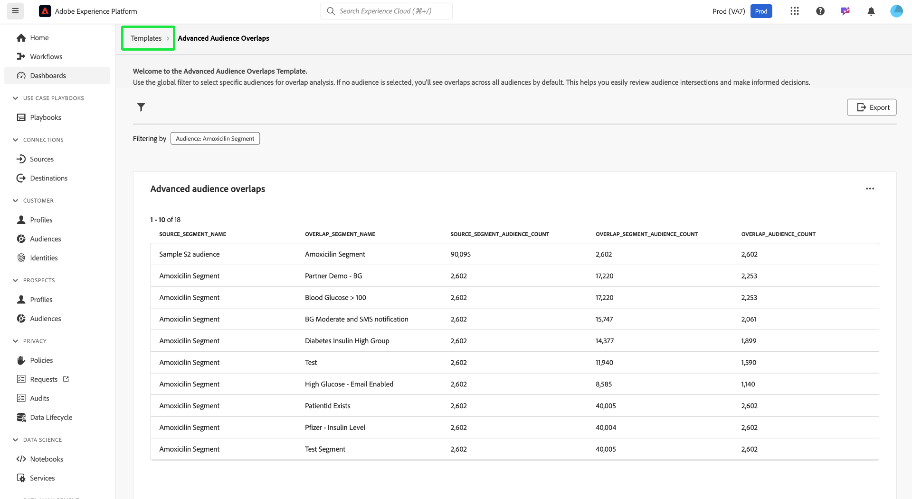

# Superposiciones de público avanzadas

Obtenga información valiosa para optimizar las estrategias de segmentación de audiencia y segmentación analizando cómo se cruzan los distintos segmentos de audiencia con el panel [!UICONTROL Superposiciones de audiencias avanzadas]. Examine las métricas tabuladas para identificar superposiciones, refinar la segmentación y reducir la mensajería redundante. En última instancia, puede utilizar estas perspectivas para crear campañas más específicas y esfuerzos de marketing eficientes. En este tablero, puede revisar las intersecciones de audiencia, aplicar filtros y realizar análisis detallados de la superposición para tomar decisiones basadas en datos y mejorar los resultados de la participación.

## Filtrar audiencias {#filter-audiences}

Para filtrar audiencias específicas para el análisis de superposición, seleccione el icono de filtro () para abrir el cuadro de diálogo [!UICONTROL Filtro]. Desde aquí puede añadir o eliminar audiencias de la plantilla de superposición para restringir el análisis.

Aparecerá el cuadro de diálogo [!UICONTROL Filtros]. Para elegir una audiencia para el análisis de superposición, seleccione un nombre de audiencia en la lista desplegable **[!UICONTROL Audiencia]**. El nombre de cualquier audiencia que agregue se mostrará con una etiqueta debajo de la lista desplegable. Una vez añadidas, puede seleccionar la &quot;X&quot; por su nombre para eliminarlas. Para quitar todos los filtros aplicados, seleccione **[!UICONTROL Borrar todo]**.

## Filtros aplicados {#applied-filters}

Una vez aplicado un filtro ([!UICONTROL Amoxicilin Segment] en el ejemplo de la captura de pantalla), los datos de audiencia mostrados se reducen. Cualquier audiencia adicional que elija agregar se mostrará junto a la etiqueta [!UICONTROL Filtrado por] sobre el gráfico [!UICONTROL Superposiciones de audiencias avanzadas].

## Tabla de superposiciones de audiencias avanzadas {#advanced-audience-overlaps-table}

La sección principal del tablero muestra la tabla [!UICONTROL Superposiciones de audiencias avanzadas], que proporciona una comparación detallada de las superposiciones de audiencias entre diferentes segmentos. Las columnas de la tabla son las siguientes:

| Nombre de columna | Descripción |
|------------------------------------|----------------------------------------------------------------------------------------------|
| **[!UICONTROL Source_Segment_Name]** | La audiencia original que se analiza (por ejemplo, &quot;Segmento de amoxicilina&quot;). |
| **[!UICONTROL Nombre_Segmento_Superpuesto]** | La audiencia cuyas superposiciones se comparan con (por ejemplo, &quot;Glucosa en sangre > 100&quot;). |
| **[!UICONTROL Source_Segment_Audience_Count]** | Número total de perfiles de la audiencia de origen. |
| **[!UICONTROL Recuento_Audiencia_Segmento_Superpuesto]** | El tamaño de la audiencia superpuesta, que varía según la superposición. |
| **[!UICONTROL Recuento_Audiencia_Superpuesto]** | El tamaño de la audiencia superpuesta real entre las audiencias de origen y superposición. |

{style="table-layout:auto"}

## Exportar perspectivas {#export-insights}

Después de filtrar y analizar las audiencias, puede exportar los datos para realizar más análisis sin conexión o generar informes. Para exportar tus datos, selecciona **[!UICONTROL Exportar]** en la parte superior derecha de la tabla. Aparecerá el cuadro de diálogo Imprimir PDF, que le permitirá guardar los datos como un PDF o imprimirlos.

Para volver a la descripción general de [!UICONTROL Template], seleccione **[!UICONTROL Templates]**.

## Pasos siguientes

Después de leer este documento, ha aprendido a analizar las intersecciones de audiencias y a tomar decisiones basadas en datos mediante el panel **[!UICONTROL Superposiciones de audiencias avanzadas]**. Para optimizar aún más las estrategias de segmentación de audiencia y segmentación, explore otras plantillas de Distiller de datos que proporcionen información valiosa. Consulte las guías de la interfaz de usuario [Tendencias de audiencia](./trends.md), [Comparación de audiencias](./comparison.md) y [Superposiciones de identidades de audiencias](./identity-overlaps.md) para seguir mejorando la participación de la audiencia y los esfuerzos de segmentación.

