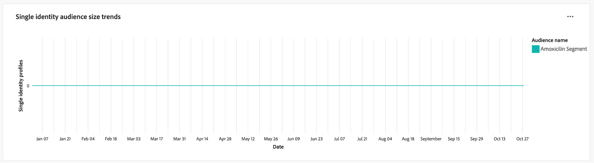

# Tendencias de público

Analice cómo cambian las audiencias con el tiempo con visualizaciones de métricas de audiencia clave en el panel [!UICONTROL Tendencias de audiencia]. Este tablero le ayuda a seguir tendencias como el crecimiento de la audiencia, el número de identidades y el recuento de perfiles de identidad única, y le permite tomar decisiones basadas en datos. Al analizar estas métricas, los especialistas en marketing pueden optimizar las estrategias de segmentación, mejorar la participación de la audiencia y refinar sus esfuerzos de segmentación para lograr campañas más efectivas.

## Filtrado de audiencias {#filter-audiences}

Para comenzar el análisis, utilice el filtro global para seleccionar las audiencias específicas y el intervalo de fechas que desea analizar. Seleccione el icono de filtro () para abrir el cuadro de diálogo **[!UICONTROL Filtro]**, donde podrá:

1. **Seleccionar una audiencia**: elige la audiencia que deseas analizar (en la captura de pantalla del ejemplo, se ha seleccionado la audiencia **Amoxicillin**).
1. **Establecer un intervalo de fechas**: elija un intervalo predefinido en el menú desplegable o seleccione manualmente las fechas de inicio y finalización utilizando los campos de calendario.

Después de definir los filtros, seleccione **[!UICONTROL Aplicar]** para actualizar el tablero. Los filtros que haya elegido se aplican y se muestran las perspectivas centradas en las audiencias seleccionadas durante un período de tiempo determinado. Los filtros personalizados garantizan que los datos sean relevantes para los objetivos del análisis.

## Gráficos de tendencias de audiencia disponibles {#available-charts}

Existen tres gráficos principales que le ayudarán a comprender las métricas de audiencia a lo largo del tiempo. Para cada gráfico, puede seleccionar los puntos suspensivos (`...`) en la parte superior derecha seguidos de [!UICONTROL Ver más] para ver un formulario tabulado de los resultados o descargar los datos como un archivo CSV para verlos en una hoja de cálculo. Para obtener más información, consulte la [Guía para ver más](../view-more.md).

>[!TIP]
>
>Puede situarse sobre una fecha específica en cualquier gráfico para mostrar el recuento de perfiles individual en un cuadro de diálogo.

### Tendencias de tamaño de audiencia {#audience-size-trends}

El gráfico **[!UICONTROL Tendencias de tamaño de audiencia]** muestra el número de perfiles dentro de la audiencia seleccionada a lo largo del tiempo. Ayuda a realizar un seguimiento del crecimiento o la reducción de audiencias. Puede utilizar este gráfico para supervisar la eficacia de la participación y comprender los cambios en el tamaño de la audiencia.

### Tendencias de identidades de audiencia {#audience-identities-trends}

El gráfico **[!UICONTROL Tendencias de identidades de audiencia]** proporciona información sobre la cantidad total de identidades dentro del segmento de audiencia. Utilice este gráfico para comprender cómo las identidades únicas contribuyen al tamaño general de la audiencia. Proporciona una indicación de la estabilidad y la participación de la audiencia.

### Tendencias de tamaño de audiencia de identidad única {#single-identity-audience-size-trends}

El gráfico **[!UICONTROL Tendencias de tamaño de audiencia de identidad única]** muestra el recuento de miembros de audiencia con una sola identidad. Esta métrica es valiosa para comprender la composición de la audiencia, especialmente en términos de singularidad de identidad, y ayuda a medir la eficacia de los esfuerzos de vinculación de identidad.

## Exportar perspectivas {#export-insights}

Después de analizar las métricas y aplicar los filtros relevantes, puede exportar los datos para realizar más análisis sin conexión o generar informes. Para ello, seleccione **[!UICONTROL Export]** en la parte superior derecha de la tabla. Aparecerá el cuadro de diálogo Imprimir PDF. Desde ese cuadro de diálogo puede guardar los datos visualizados como un PDF o imprimirlos.

## Pasos siguientes

Después de leer este documento, ha aprendido a obtener información valiosa sobre el comportamiento de la audiencia a lo largo del tiempo desde el panel **Tendencias de audiencia**. Para obtener más información sobre otras plantillas de Distiller de datos que pueden ayudarle a tomar decisiones informadas, optimizar la segmentación y mejorar las estrategias de participación, consulte las guías de interfaz de usuario [Comparación de audiencias](./comparison.md), [Superposiciones de identidades de audiencias](./identity-overlaps.md) y [Superposiciones de audiencias avanzadas](./overlaps.md).
