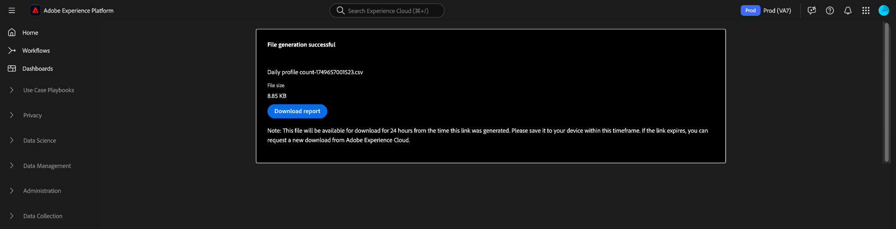
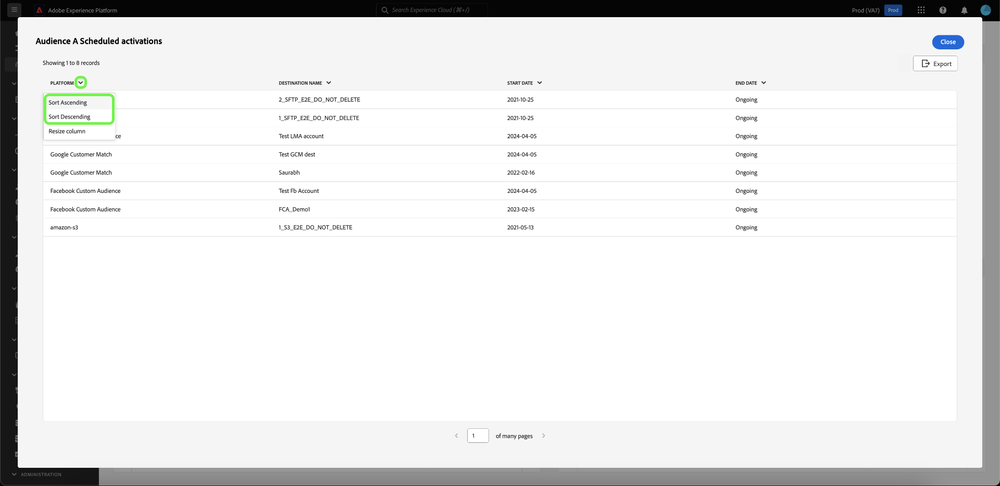

# Ver más {#view-more}

Después de crear un [insight personalizado](./overview.md) con [query pro mode](./overview.md#query-pro-mode), puede ver los datos del gráfico en varios formatos. Puede ver una tabla de los resultados o exportar los datos en formato CSV o por correo electrónico.

## Resultados tabulados {#tabulated-results}

Para cada gráfico creado con el modo query pro a través de SQL, puede ver los resultados tabulados del análisis en la interfaz de usuario de Experience Platform.

En el tablero personalizado, seleccione los puntos suspensivos (`...`) de cualquier widget para acceder a las opciones [!UICONTROL Ver más] y [!UICONTROL Ver SQL].

## Exportar {#export}

En el cuadro de diálogo **[!UICONTROL Ver más]**, exporte los datos de la tabla descargando un archivo CSV directamente o enviando un vínculo al correo electrónico para su descarga segura más tarde.

>[!IMPORTANT]
>
>Para acceder a las opciones de exportación, el administrador debe otorgarle el permiso **[!UICONTROL Exportar datos del panel]**. Si el botón [!UICONTROL Exportar] está deshabilitado, comuníquese con el administrador. Consulte la [Información general sobre el control de acceso](../../access-control/home.md) para obtener más información sobre los permisos del panel.

>[!NOTE]
>
>Las exportaciones solo de visualización no requieren el permiso [!UICONTROL Exportar datos del panel]. Por ejemplo, para exportar datos procesados desde sus [datos personalizados del panel en formato PDF](./export-pdf.md), o desde [datos del panel de la interfaz de usuario de Platform](../download.md).

### Descargar CSV {#download-csv}

En el cuadro de diálogo [!UICONTROL Ver más], seleccione **[!UICONTROL Exportar]** y, a continuación, elija **[!UICONTROL Descargar CSV]** para descargar los datos del gráfico en formato CSV.

>[!NOTE]
>
>La descarga de CSV está limitada a los 500 primeros registros.

### Enviar como correo electrónico {#send-as-email}

Para exportar más de 500 registros, seleccione **[!UICONTROL Exportar]** y elija **[!UICONTROL Enviar como correo electrónico]** en el cuadro de diálogo [!UICONTROL Exportar archivo]. Esta opción envía de forma segura un vínculo de descarga a su dirección de correo electrónico asociada a Adobe. El nombre del destinatario y la dirección de correo electrónico registrada de Adobe aparecen en la sección [!UICONTROL Destinatarios] del cuadro de diálogo.

Después de seleccionar [!UICONTROL Enviar como correo electrónico], Adobe genera un informe y envía un correo electrónico a la dirección registrada de Adobe. El correo electrónico incluye un vínculo de descarga seguro que requiere autenticación a través de Experience Platform.

>[!NOTE]
>
>Debe descargar el informe en un plazo de 24 horas tras la generación del vínculo; una vez transcurrido ese tiempo, el archivo caducará.

Para proteger los datos, Adobe aloja de forma segura los archivos exportados en lugar de enviarlos como archivos adjuntos. Access requiere autenticación a través de la interfaz de usuario de Experience Platform y Adobe comprueba que el archivo solo lo descarga el destinatario deseado.

Este método le permite exportar **hasta 10 000 registros** y garantiza el acceso seguro a datos confidenciales.

## Ordenar por columna {#sort-column}

Al ver los resultados en forma de tabla, puede utilizar la funcionalidad de ordenación para ordenar por columna en orden ascendente o descendente. En el tablero personalizado, seleccione los puntos suspensivos (`...`) de cualquier tabla para obtener acceso a la opción [!UICONTROL Ver más].

Puede ordenar las columnas seleccionando el menú desplegable junto al nombre de la columna y, a continuación, **[!UICONTROL Orden ascendente]** o **[!UICONTROL Orden descendente]**.

>[!NOTE]
>
>Las opciones [!UICONTROL Orden ascendente] y [!UICONTROL Orden descendente] solo aparecerán para las columnas que se hayan configurado con [funcionalidad de ordenación](./overview.md#advanced-attributes).

## Cambiar el tamaño de una columna {#resize-column}

Puede cambiar el tamaño de las columnas en los resultados tabulados para mejorar la legibilidad de los datos. En el tablero personalizado, seleccione los puntos suspensivos (`...`) de la tabla para obtener acceso a la opción [!UICONTROL Ver más]. Utilice el menú desplegable situado junto al nombre de la columna para cambiar su tamaño y, a continuación, seleccione **[!UICONTROL Cambiar tamaño de columna]**.

Seleccione el control deslizante y arrastre hacia la izquierda o la derecha para ajustar el tamaño de la columna según sea necesario.

## Paginación de tabla {#table-pagination}

La paginación se aplica automáticamente a las tablas en la característica [!UICONTROL Ver más], lo que elimina la necesidad de modificar manualmente las consultas SQL. Esta función garantiza que los datos se presenten en un formato más manejable, lo que facilita el proceso de navegar por conjuntos de datos grandes.

Puede ver hasta 500 registros por página. Para navegar por los registros, use **[!UICONTROL >]** ubicado en la parte inferior de la página.

## Pasos siguientes

Después de leer este documento, ahora sabe cómo ver los resultados tabulados del análisis SQL del gráfico personalizado y cómo exportar esos datos de forma segura. Consulte el documento Ver SQL para aprender a [ver el SQL subyacente a sus datos personalizados](./view-sql.md).

También puede aprender a generar gráficos a partir de modelos de datos existentes en la interfaz de usuario de Adobe Experience Platform con la [guía del modo de diseño guiado](../standard-dashboards.md).
