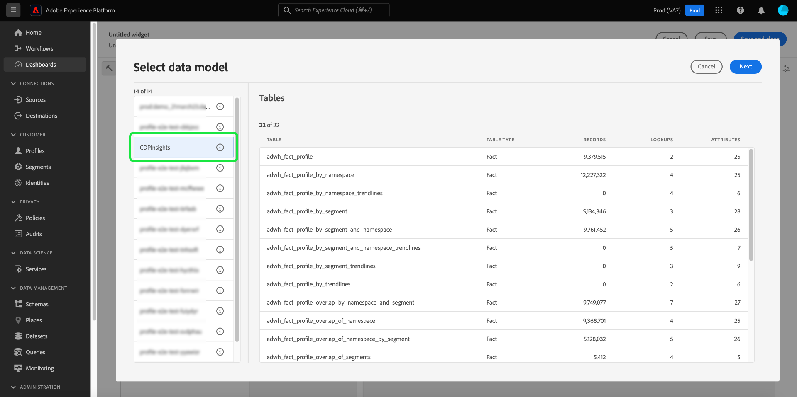

# Paneles personalizados

Utilice los paneles de Adobe Experience Platform para acelerar las perspectivas y personalizar la visualización a través de la función de paneles. Utilice esta función para crear y administrar paneles personalizados, donde puede crear, añadir y editar widgets personalizados para visualizar métricas clave relevantes para su organización.

<!-- Getting started / permissions section commented out for Beta. This will be necessary after GA only

## Getting started

To view dashboards in Adobe Experience Platform you must have the appropriate permissions enabled. Please read the [dashboards permissions documentation](./permissions.md#available-permissions) to learn how to grant users the ability to view, edit, and update Experience Platform dashboards using Adobe Admin Console. If you do not have administrator privileges for your organization, contact your product administrator to obtain the required permissions. -->

## Crear un tablero personalizado

Para crear un tablero personalizado, primero, navegue hasta el inventario del tablero. Seleccione **[!UICONTROL Paneles]** de la navegación izquierda de la IU de Platform seguida de **[!UICONTROL Crear panel]**.

Antes de agregar un tablero personalizado, el inventario de los tableros está vacío y muestra el mensaje &quot;No se encontraron tableros&quot;. Mensaje. Una vez creados, todos los tableros se enumeran en el inventario de tableros.

<!-- >[!NOTE]
>
>To edit an existing dashboard, select the dashboard name from the inventory list followed by the pencil icon ()
>{width="100" zoomable="yes"} -->

Aparecerá el cuadro de diálogo [!UICONTROL Crear tablero]. Escriba un nombre descriptivo y descriptivo para la colección de widgets que desea crear y seleccione **[!UICONTROL Guardar]**.

Los usuarios que hayan adquirido la SKU de Data Distiller tienen la opción de utilizar consultas SQL personalizadas para crear sus perspectivas. Consulte la [Guía de creación de perspectiva personalizable](./data-distiller/customizable-insights/overview.md) para obtener instrucciones sobre este flujo de trabajo.

El tablero en blanco recién creado aparecerá con el nombre elegido en la esquina superior izquierda de la vista.

## Crear un widget {#create-widget}

>[!CONTEXTUALHELP]
>id="platform_dashboards_udd_maxwidgets"
>title="Número máximo de widgets"
>abstract="Los tableros de servicio admiten hasta diez widgets. Después de añadir diez widgets al tablero, la opción [!UICONTROL Añadir nuevo widget] está desactivada y aparece en gris."

En la nueva vista del panel, seleccione **[!UICONTROL Agregar nuevo widget]** para comenzar el proceso de creación del widget.

>[!IMPORTANT]
>
>Cada tablero admite hasta diez widgets. Después de añadir diez widgets al tablero, la opción [!UICONTROL Añadir nuevo widget] está desactivada y aparece en gris.

### Compositor de widgets

Aparecerá el espacio de trabajo del compositor de widgets. A continuación, seleccione **[!UICONTROL Seleccionar datos]** para elegir el modelo de datos desde el que desea agregar atributos a los widgets.

#### Seleccionar modelo de datos {#select-data-model}

Aparecerá el cuadro de diálogo [!UICONTROL Seleccionar modelo de datos]. Seleccione un modelo de datos de la columna izquierda para mostrar una lista de vista previa de todas las tablas disponibles. El modelo de datos preconfigurado para Real-time Customer Data Platform se llama [!UICONTROL CDPInsights].

>[!TIP]
>
>Seleccione el icono de información () para ver el nombre completo del modelo de datos si es demasiado largo para mostrarlo en el carril de datos.

La lista de vista previa proporciona detalles sobre las tablas contenidas en el modelo de datos. La siguiente tabla proporciona descripciones de los campos de columna y sus valores potenciales.

| Campo de columna | Descripción |
|---|---|
| [!UICONTROL Título] | Nombre de la tabla. |
| [!UICONTROL Tipo de tabla] | El tipo de tabla. Los tipos potenciales incluyen: `fact`, `dimension` y `none`. |
| [!UICONTROL Registros] | El número de registros asociados con la tabla seleccionada. |
| [!UICONTROL Búsquedas] | Número de tablas unidas a la tabla elegida. |
| [!UICONTROL Atributos] | Número de atributos de la tabla seleccionada. |

Seleccione **[!UICONTROL Siguiente]** para confirmar la elección del modelo de datos. La vista siguiente muestra una lista de las tablas disponibles en el carril izquierdo. Seleccione una tabla para ver un desglose completo de los datos contenidos en la tabla seleccionada.

### Rellenar widget {#populate-widget}

El panel [!UICONTROL Vista previa] contiene fichas para [!UICONTROL Registros de muestra] y [!UICONTROL Atributos]. La ficha [!UICONTROL Registros de muestra] proporciona un subconjunto de los registros de la tabla seleccionada en una vista tabulada. La ficha [!UICONTROL Atributos] proporciona el nombre de atributo, el tipo de datos y la tabla de origen de todos los atributos asociados con la tabla seleccionada.

Seleccione una tabla de la lista disponible en el carril izquierdo para proporcionar datos para el widget y seleccione **[!UICONTROL Seleccionar]** para volver al compositor de widgets.

El compositor de widgets ahora se rellena con datos de la tabla elegida.

El modelo de datos y la tabla seleccionada actualmente se muestran en la parte superior del carril izquierdo, y los atributos disponibles para crear el widget se enumeran en la columna [!UICONTROL Atributos]. Puede usar la barra de búsqueda para buscar atributos en lugar de desplazarse por la lista, o bien cambiar el modelo de datos seleccionado seleccionando el icono de lápiz () en el carril izquierdo.

#### Añadir y filtrar atributos {#add-and-filter-attributes}

Seleccione el icono de agregar () junto a un nombre de atributo para agregar un atributo al widget. El menú desplegable que aparece le permite agregar un atributo como eje X, eje Y, color o filtro para el widget. El atributo [!UICONTROL Color] le permite diferenciar los resultados de las marcas de los ejes X e Y en función del color. Para ello, divide los resultados en diferentes colores según su composición de un tercer atributo.

>[!TIP]
>
>Si desea voltear la disposición de los ejes X e Y, seleccione el icono de flecha arriba y abajo () para cambiar su organización.

Para cambiar el tipo de gráfico del widget, selecciona la lista desplegable [!UICONTROL Marcas] y elige entre las opciones disponibles. Las opciones incluyen barras, puntos, marcas, líneas o áreas. Una vez seleccionada, se genera una visualización previa de la configuración actual del widget.

Al agregar un atributo como filtro, puede seleccionar qué valores desea incluir o excluir del widget. Después de agregar un filtro de la lista de atributos, aparece el cuadro de diálogo [!UICONTROL Filtro] en el que puede seleccionar o anular la selección de valores mediante su casilla de verificación.

#### Filtrado de datos históricos {#filter-historical-data}

Para filtrar los datos históricos a partir de las perspectivas generadas por el widget, agregue el atributo `date_key` como filtro y seleccione **[!UICONTROL Fecha reciente]** seguida de **[!UICONTROL Aplicar]**. Este filtro garantiza que los datos utilizados para obtener perspectivas se tomen de la instantánea del sistema más reciente.

![Se ha resaltado el cuadro de diálogo [!UICONTROL Filtro: date_key] con [!UICONTROL fecha reciente] y [!UICONTROL Aplicar].](./images/user-defined-dashboards/recent-date.png)

También puede crear un punto personalizado para filtrar los datos. Seleccione **[!UICONTROL Seleccionar fechas]** para ampliar el cuadro de diálogo con una lista de fechas disponibles. Use la casilla de verificación **[!UICONTROL Seleccionar todo]** para habilitar o deshabilitar todas las opciones disponibles, o bien active la casilla de verificación de cada día de forma individual. Finalmente, selecciona **[!UICONTROL Aplicar]** para confirmar tus opciones.

>[!NOTE]
>
>Si el atributo `date_key` ya se agregó como filtro, seleccione los puntos suspensivos seguidos de **[!UICONTROL Editar]** en las opciones desplegables para cambiar el período de filtro.

![El cuadro de diálogo [!UICONTROL Filtro: date_key] con casillas de verificación de día individuales marcadas y desmarcadas.](./images/user-defined-dashboards/select-dates.png)

### Propiedades del widget

Seleccione el icono de propiedades () en el carril derecho para abrir el panel de propiedades. En el panel [!UICONTROL Propiedades], escriba un nombre para el widget en el campo de texto [!UICONTROL Título del widget].

Desde el panel de propiedades del widget, puede editar varios aspectos del widget. Dispone del control completo para editar la ubicación de la leyenda del widget. Para mover la leyenda, seleccione la lista desplegable [!UICONTROL Ubicación de la leyenda] y elija la ubicación que desee en la lista de opciones disponibles. También puede cambiar el nombre de la etiqueta asociada con la leyenda y el eje X o Y al escribir un nombre nuevo en el campo de texto [!UICONTROL Título de leyenda] o en el campo de texto [!UICONTROL Etiqueta del eje] respectivamente.

#### Guarde el widget {#save-widget}

Al guardar en el compositor de widgets, se guarda el widget localmente en el tablero. Si desea guardar el trabajo y reanudarlo más adelante, seleccione **[!UICONTROL Guardar]**. Un icono de verificación debajo del nombre del widget indica que el widget se ha guardado. Alternativamente, cuando esté satisfecho con el widget, seleccione **[!UICONTROL Guardar y cerrar]** para que el widget esté disponible para todos los demás usuarios con acceso a su panel. Seleccione **[!UICONTROL Cancelar]** para abandonar su trabajo y regresar a su tablero personalizado.

>[!TIP]
>
>Seleccione el icono de propiedades () junto al nombre del panel para ver detalles sobre su creación. Puede cambiar el nombre del panel en el cuadro de diálogo que aparece.

Los widgets se pueden reorganizar y cambiar de tamaño en este espacio de trabajo. Seleccione **[!UICONTROL Guardar]** para conservar el nombre del tablero y el diseño configurado.

Para garantizar que cada consulta de un panel de perspectivas de Adobe Real-time Customer Data Platform tenga suficientes recursos para ejecutarse de forma eficaz, la API rastrea el uso de recursos asignando espacios de concurrencia a cada consulta. El sistema puede procesar hasta cuatro consultas simultáneas y, por lo tanto, hay cuatro ranuras de consulta simultáneas disponibles en cualquier momento. Las consultas se colocan en una cola basada en ranuras de concurrencia y, a continuación, espere en la cola hasta que haya suficientes ranuras de concurrencia disponibles.

### Editar, duplicar o eliminar un widget {#duplicate}

Una vez creado un widget, puede editar, duplicar o eliminar widgets completos desde el panel personalizado.

>[!TIP]
>
>Para cambiar entre cualquiera de los paneles personalizados existentes, seleccione Paneles en la barra de navegación izquierda y, a continuación, seleccione el nombre del panel en la lista de inventario.

Seleccione el icono de lápiz () desde la parte superior derecha del panel personalizado para entrar al modo de edición.

A continuación, seleccione los puntos suspensivos en la parte superior derecha del widget que desea editar, copiar o eliminar. Seleccione la acción adecuada en el menú desplegable.

>[!NOTE]
>
>La duplicación le permite personalizar los atributos de una perspectiva para crear un widget único sin tener que empezar desde cero. Si duplica un widget, aparecerá en el panel personalizado. A continuación, puede seleccionar los puntos suspensivos del nuevo widget, seguido de **[!UICONTROL Editar]**, para personalizar su perspectiva.

## Pasos siguientes y recursos adicionales

Al leer este documento, tiene una mejor comprensión de cómo crear un panel personalizado y cómo crear, editar y actualizar widgets personalizados para ese panel.

Para descubrir las métricas y visualizaciones preconfiguradas disponibles para los paneles de [perfiles](./guides/profiles.md#standard-widgets), [segmentos](./guides/audiences.md#standard-widgets) y [destinos](./guides/destinations.md#standard-widgets), consulte la lista de widgets estándar en su documentación respectiva.

Para reforzar su comprensión de los paneles de Experience Platform, vea el siguiente vídeo:

>[!VIDEO](https://video.tv.adobe.com/v/3409637?quality=12&learn=on)
