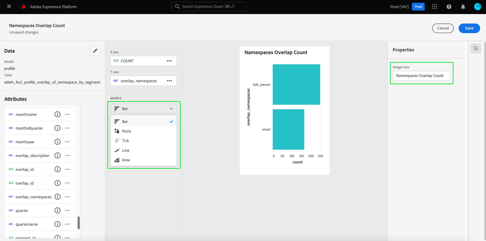

# Tableros definidos por el usuario

Los paneles de Adobe Experience Platform le ayudan a acelerar la información y a personalizar la visualización mediante la función de paneles definida por el usuario. Esta función le permite crear y administrar tableros personalizados en los que puede crear, agregar y editar widgets personalizados para visualizar métricas clave relevantes para su organización.

<!-- Getting started / permissions section commented out for Beta. This will be necessary after GA only

## Getting started

To view dashboards in Adobe Experience Platform you must have the appropriate permissions enabled. Please read the [dashboards permissions documentation](./permissions.md#available-permissions) to learn how to grant users the ability to view, edit, and update Experience Platform dashboards using Adobe Admin Console. If you do not have administrator privileges for your organization, contact your product administrator to obtain the required permissions. -->

## Crear tableros personalizados

Para crear un tablero personalizado, primero, vaya al inventario del tablero. Select **[!UICONTROL Tableros]** desde la navegación izquierda de la interfaz de usuario de Platform seguida de **[!UICONTROL Crear tablero]**.

Antes de agregar un tablero personalizado, el inventario de tableros está vacío y muestra &quot;No se encontraron tableros&quot;. mensaje. Una vez creados, todos los tableros definidos por el usuario se enumeran en el inventario de tableros.

La variable [!UICONTROL Crear tablero] se abre. Escriba un nombre descriptivo y reconocible para la colección de widgets que desee crear y seleccione **[!UICONTROL Guardar]**.

El panel en blanco recién creado aparece con el nombre elegido en la esquina superior izquierda de la vista.

## Creación de una utilidad {#create-widget}

>[!CONTEXTUALHELP]
>id="platform_dashboards_udd_maxwidgets"
>title="Número máximo de widgets"
>abstract="Los tableros definidos por el usuario admiten hasta diez widgets. Después de agregar diez widgets al tablero, la variable [!UICONTROL Agregar nueva utilidad] está desactivada y aparece en gris."

En la nueva vista de tablero, seleccione **[!UICONTROL Agregar nueva utilidad]** para iniciar el proceso de creación de la utilidad.

>[!IMPORTANT]
>
>Los tableros definidos por el usuario admiten hasta diez widgets. Después de agregar diez widgets al tablero, la variable [!UICONTROL Agregar nueva utilidad] está desactivada y aparece en gris.

### Compositor de utilidades

Aparecerá el espacio de trabajo del compositor de utilidades. A continuación, seleccione **[!UICONTROL Seleccionar datos]** para elegir el modelo de datos desde el que añadir atributos a las utilidades.

La variable [!UICONTROL Seleccionar datos] se abre. Seleccione un modelo de datos de la columna izquierda para mostrar una lista de vista previa de todas las tablas disponibles.

>[!NOTE]
>
>Actualmente, los tableros definidos por el usuario solo admiten el modelo de datos de perfil. Se admitirán más opciones.

La lista de vista previa proporciona detalles sobre las tablas contenidas en el modelo de datos. La tabla siguiente proporciona descripciones de los campos de columna y sus valores potenciales.

| Campo de columna | Descripción |
|---|---|
| [!UICONTROL Título] | Nombre de la tabla. |
| [!UICONTROL Tipo de tabla] | Tipo de tabla. Los tipos posibles incluyen: `fact`, `dimension`y `none`. |
| [!UICONTROL Búsquedas] | Número de tablas unidas a la tabla elegida. |

Select **[!UICONTROL Siguiente]** para confirmar la elección del modelo de datos. La siguiente vista muestra una lista de las tablas disponibles en el carril izquierdo. Seleccione una tabla para ver un desglose completo de los datos contenidos en la tabla seleccionada.

La variable [!UICONTROL Vista previa] El panel contiene fichas para [!UICONTROL Registros de muestra] y [!UICONTROL Atributos]. La variable [!UICONTROL Registros de muestra] proporciona un subconjunto de los registros de la tabla seleccionada en una vista tabulada. La variable [!UICONTROL Atributos] proporciona el nombre del atributo, el tipo de datos y la tabla de origen para cada atributo asociado a la tabla seleccionada.

Seleccione una tabla de la lista disponible en el carril izquierdo para proporcionar datos para el widget y seleccione **[!UICONTROL Select]** para volver al compositor de utilidades.

El compositor de utilidades ahora se rellena con datos de la tabla elegida.

El modelo de datos y la tabla seleccionada actualmente se muestran en la parte superior del carril izquierdo y los atributos disponibles para crear el widget se enumeran en la columna de atributos.

>[!TIP]
>
>Puede cambiar el modelo de datos seleccionado seleccionando el icono de lápiz () en el carril izquierdo.

Seleccione el icono añadir (./images/user-defined-dashboards/add-icon.png) al lado de un nombre de atributo para agregar un atributo al eje X o al eje Y.

A continuación, seleccione el tipo de gráfico o de gráfico en el [!UICONTROL Marcas] para generar una visualización de vista previa de la configuración actual del widget. En el [!UICONTROL Propiedades] en el lado derecho de la pantalla, escriba un nombre para el widget en la [!UICONTROL Título de la utilidad] campo de texto.

Cuando esté satisfecho con el widget, seleccione **[!UICONTROL Guardar]**. Un icono de visto debajo del nombre del widget indica que el widget se ha guardado.

>[!NOTE]
>
>Guardar en el compositor de utilidades guarda el widget localmente en el tablero. Si sale del editor de tableros sin guardar el tablero, el widget no se guardará en el tablero.

Select **[!UICONTROL Cancelar]** para volver al tablero personalizado.

>[!TIP]
>
>Seleccione el icono de configuración situado junto al nombre del tablero para ver los detalles sobre su creación. Puede cambiar el nombre del tablero en el cuadro de diálogo que aparece.

Los widgets se pueden volver a organizar y cambiar de tamaño mientras se encuentran en este espacio de trabajo. Select **[!UICONTROL Guardar]** para conservar el nombre del tablero y el diseño configurado.

## Pasos siguientes

Al leer este documento, tendrá una mejor comprensión de cómo crear un tablero personalizado y cómo crear, editar y actualizar widgets personalizados para ese tablero.

Para descubrir las métricas y visualizaciones preconfiguradas disponibles para la variable [perfiles](./guides/profiles.md#standard-widgets), [segmentos](./guides/segments.md#standard-widgets)y [destinos](./guides/destinations.md#standard-widgets) tableros, consulte la lista de utilidades estándar en su documentación respectiva.
