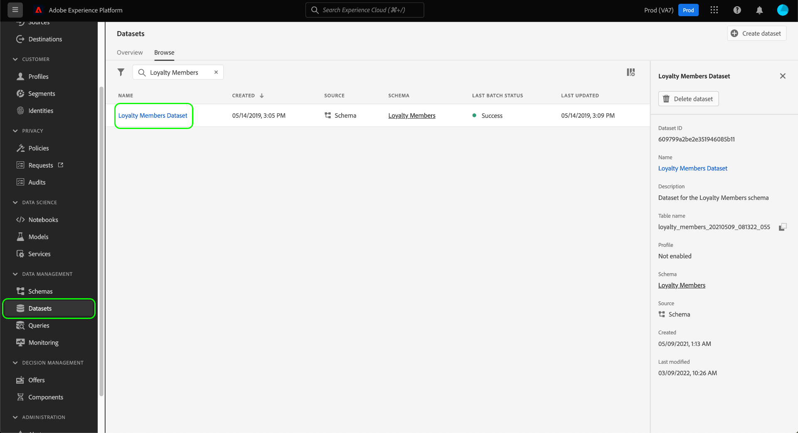

# Guía completa de administración de datos

Para controlar qué acciones de marketing se pueden realizar en determinados conjuntos de datos y campos en Adobe Experience Platform, debe configurar lo siguiente:

1. [Aplique etiquetas](#labels) a los campos de esquemas o a los conjuntos de datos completos, cuyo uso desea restringir.
1. [Configure y habilite directivas de control de datos](#policy) que determinan qué tipos de datos etiquetados se pueden usar para determinadas acciones de marketing.
1. [Aplique acciones de marketing a sus destinos](#destinations) para indicar qué directivas se aplican a los datos enviados a esos destinos.

Una vez que haya terminado de configurar las etiquetas, las directivas de gobernanza y las acciones de marketing, puede [probar la aplicación de directivas](#test) para asegurarse de que funciona según lo esperado.

Esta guía muestra el proceso completo de configuración y aplicación de una política de gobernanza de datos en la interfaz de usuario de Platform. Para obtener información más detallada sobre las funciones utilizadas en esta guía, consulte la documentación de información general sobre los siguientes temas:

* [Gobernanza de datos de Adobe Experience Platform](./home.md)
* [Etiquetas de uso de datos](./labels/overview.md)
* [Políticas de uso de datos](./policies/overview.md)
* [Aplicación de políticas](./enforcement/overview.md)

>[!NOTE]
>
>Esta guía se centra en cómo configurar y aplicar directivas sobre cómo se utilizan o activan los datos en Experience Platform. Si está intentando restringir el **acceso** a los datos para determinados usuarios de Platform de su organización, consulte la guía completa sobre el [control de acceso basado en atributos](../access-control/abac/end-to-end-guide.md) en su lugar. El control de acceso basado en atributos también utiliza etiquetas y directivas, pero para un caso de uso diferente al de la gobernanza de datos.

## Aplicar etiquetas {#labels}

>[!IMPORTANT]
>
>Las etiquetas ya no se pueden aplicar a campos individuales en el nivel de conjunto de datos. Este flujo de trabajo ha quedado obsoleto y favorece la aplicación de etiquetas en el nivel de esquema. Sin embargo, aún puede etiquetar un conjunto de datos completo. Cualquier etiqueta aplicada anteriormente a campos de conjuntos de datos individuales seguirá siendo compatible mediante la IU de Platform hasta el 31 de mayo de 2024. Para garantizar que las etiquetas sean coherentes en todos los esquemas, cualquier etiqueta adjunta anteriormente a campos de nivel de conjunto de datos debe migrarse al nivel de esquema durante el próximo año. Consulte la sección sobre [migración de etiquetas aplicadas anteriormente](#migrate-labels) para obtener instrucciones sobre cómo hacerlo.

Puede [aplicar etiquetas a un esquema](#schema-labels) para que todos los conjuntos de datos basados en ese esquema hereden las mismas etiquetas. Esto le permite administrar las etiquetas de control de datos, consentimiento y control de acceso en un solo lugar. Al aplicar restricciones de uso de datos en el nivel de esquema, el efecto se propaga de forma descendente a todos los conjuntos de datos basados en ese esquema. Las etiquetas aplicadas en el nivel de campo de esquema admiten casos de uso de control de datos y se pueden detectar en la pestaña [!UICONTROL Control de datos] del espacio de trabajo de conjuntos de datos en la columna [!UICONTROL Nombre de campo] como etiquetas de solo lectura.

Si hay un conjunto de datos específico en el que desea aplicar restricciones de uso de datos, puede [aplicar etiquetas directamente a ese conjunto de datos](#dataset-labels) o a campos específicos dentro de ese conjunto de datos.

Como alternativa, puede [aplicar etiquetas a un esquema](#schema-labels) para que todos los conjuntos de datos basados en ese esquema hereden las mismas etiquetas.

>[!NOTE]
>
>Para obtener más información sobre las distintas etiquetas de uso de datos y su uso previsto, consulte la [referencia de etiquetas de uso de datos](./labels/reference.md). Si las etiquetas principales disponibles no cubren todos los casos de uso deseados, también puede [definir sus propias etiquetas personalizadas](./labels/user-guide.md#manage-custom-labels).

### Aplicar etiquetas a todo un conjunto de datos {#dataset-labels}

Seleccione **[!UICONTROL Conjuntos de datos]** en el panel de navegación izquierdo y, a continuación, seleccione el nombre del conjunto de datos al que desee aplicar las etiquetas. Si lo desea, puede utilizar el campo de búsqueda para reducir la lista de conjuntos de datos mostrados.

Aparecerá la vista de detalles del conjunto de datos. Seleccione la pestaña **[!UICONTROL Control de datos]** para ver una lista de los campos del conjunto de datos y las etiquetas que ya se les hayan aplicado. Seleccione el icono de lápiz para editar las etiquetas de los conjuntos de datos.

Aparecerá el cuadro de diálogo [!UICONTROL Editar etiquetas de gobernanza]. Seleccione la etiqueta de gobernanza adecuada y seleccione **[!UICONTROL Guardar]**.

### Aplicación de etiquetas a un esquema {#schema-labels}

Seleccione **[!UICONTROL Esquemas]** en el panel de navegación izquierdo y, a continuación, seleccione el esquema al que desee agregar etiquetas de la lista.

>[!TIP]
>
>Si no está seguro de qué esquema se aplica a un conjunto de datos determinado, seleccione **[!UICONTROL Conjuntos de datos]** en el panel de navegación izquierdo y, a continuación, seleccione el vínculo debajo de la columna **[!UICONTROL Esquema]** para el conjunto de datos deseado. Seleccione el nombre del esquema en la ventana emergente que aparece para abrirlo en el Editor de esquemas.
>
>

La estructura del esquema aparece en el Editor de esquemas. Desde aquí, seleccione la ficha **[!UICONTROL Etiquetas]** para mostrar una vista de lista de los campos del esquema y las etiquetas que ya se les han aplicado. Seleccione las casillas de verificación situadas junto a los campos a los que desee agregar etiquetas y, a continuación, seleccione **[!UICONTROL Aplicar etiquetas de acceso y control de datos]** en el carril derecho.

>[!NOTE]
>
>Si desea agregar etiquetas a todos los campos del esquema, seleccione el icono de lápiz en la fila superior.
>
>

Aparecerá el cuadro de diálogo [!UICONTROL Aplicar etiquetas de acceso y control de datos]. Seleccione las etiquetas que desee aplicar al campo de esquema elegido. Cuando termine, seleccione **[!UICONTROL Guardar]**.

Siga los pasos anteriores para aplicar etiquetas a diferentes campos (o esquemas) según sea necesario. Cuando termine, puede continuar con el siguiente paso de [habilitar directivas de control de datos](#policy).

### Migrar etiquetas aplicadas anteriormente en el nivel de conjunto de datos {#migrate-labels}

Seleccione **[!UICONTROL Conjunto de datos]** en el panel de navegación izquierdo y, a continuación, seleccione el nombre del conjunto de datos desde el que desea migrar las etiquetas. Si lo desea, puede utilizar el campo de búsqueda para reducir la lista de conjuntos de datos mostrados.

Aparecerá la vista de detalles del conjunto de datos. Seleccione la pestaña **[!UICONTROL Control de datos]** para ver una lista de los campos del conjunto de datos y las etiquetas que ya se les hayan aplicado. Seleccione el icono Cancelar junto a cualquier etiqueta que desee eliminar de un campo. Aparecerá un cuadro de diálogo de confirmación, seleccione [!UICONTROL Quitar etiqueta] para confirmar sus opciones.

Una vez eliminada la etiqueta del campo del conjunto de datos, vaya al Editor de esquemas para agregar la etiqueta al esquema. Encontrará instrucciones sobre cómo hacerlo en la sección [sobre la aplicación de etiquetas a un esquema](#schema-labels).

>[!TIP]
>
>Puede seleccionar el nombre del esquema en el carril derecho, seguido del vínculo en el cuadro de diálogo que aparece para desplazarse al esquema adecuado.
>

Cuando haya migrado las etiquetas necesarias, asegúrese de que tiene habilitadas las [directivas de control de datos{}.](#policy)

## Habilitar políticas de gobernanza de datos {#policy}

Después de aplicar etiquetas a los esquemas o conjuntos de datos, puede crear políticas de gobernanza de datos que restrinjan las acciones de marketing para las que se pueden utilizar determinadas etiquetas.

Seleccione **[!UICONTROL Directivas]** en el panel de navegación izquierdo para ver una lista de las directivas principales definidas por el Adobe, así como las directivas personalizadas creadas anteriormente por su organización.

Cada etiqueta principal tiene asociada una directiva principal que, cuando está habilitada, aplica las restricciones de activación adecuadas a cualquier dato que contenga esa etiqueta. Para habilitar una directiva principal, selecciónela en la lista y, a continuación, seleccione la opción **[!UICONTROL Estado de la directiva]** para **[!UICONTROL Habilitada]**.

Si las políticas principales disponibles no cubren todos los casos de uso (como cuando utiliza etiquetas personalizadas que ha definido en su organización), puede definir una política personalizada en su lugar. En el área de trabajo **[!UICONTROL Políticas]**, seleccione **[!UICONTROL Crear directiva]**.

![Imagen que muestra el botón [!UICONTROL Crear directiva] seleccionado en la interfaz de usuario](./images/e2e/create-policy.png)

Aparece una ventana emergente que le solicita que seleccione el tipo de directiva que desea crear. Seleccione **[!UICONTROL directiva de control de datos]** y, a continuación, seleccione **[!UICONTROL Continuar]**.

![Imagen que muestra la opción [!UICONTROL Directiva de control de datos] seleccionada](./images/e2e/governance-policy.png)

En la pantalla siguiente, proporcione un **[!UICONTROL Nombre]** y una **[!UICONTROL Descripción]** opcionales para la directiva. En la tabla siguiente, seleccione las etiquetas que desea que compruebe esta directiva. En otras palabras, estas son las etiquetas que la directiva evitará que se utilicen para las acciones de marketing especificadas en el siguiente paso.

Si selecciona varias etiquetas, puede utilizar las opciones del carril derecho para determinar si todas las etiquetas deben estar presentes para que la directiva aplique las restricciones de uso o si solo debe estar presente una de las etiquetas. Cuando termine, seleccione **[!UICONTROL Siguiente]**.

En la pantalla siguiente, seleccione las acciones de marketing para las que esta directiva restringirá el uso de las etiquetas seleccionadas anteriormente. Haga clic en **[!UICONTROL Siguiente]** para continuar.

La pantalla final muestra un resumen de los detalles de la política y las acciones que restringirá para qué etiquetas. Seleccione **[!UICONTROL Finalizar]** para crear la directiva.

La directiva se ha creado, pero se ha establecido en [!UICONTROL Deshabilitada] de forma predeterminada. Seleccione la directiva de la lista y establezca la opción **[!UICONTROL Estado de la directiva]** en **[!UICONTROL Habilitado]** para habilitar la directiva.

Siga los pasos anteriores para crear y habilitar las directivas que necesita antes de pasar al siguiente paso.

## Administrar acciones de marketing para destinos {#destinations}

Para que las directivas habilitadas determinen con precisión qué datos se pueden activar en un destino, debe asignar acciones de marketing específicas a ese destino.

Por ejemplo, considere una directiva habilitada que impide que se usen datos que contengan una etiqueta `C2` para la acción de marketing &quot;[!UICONTROL Exportar a terceros]&quot;. Al activar datos en un destino, la directiva comprueba qué acciones de marketing están presentes en el destino. Si &quot;[!UICONTROL Exportar a terceros]&quot; está presente, al intentar activar los datos con una etiqueta `C2` se producirá una infracción de directiva. Si &quot;[!UICONTROL Exportar a terceros]&quot; no está presente, la directiva no se aplicará al destino y los datos con etiquetas `C2` se podrán activar libremente.

Al [conectar un destino en la interfaz de usuario](../destinations/ui/connect-destination.md), el paso **[!UICONTROL Gobernanza]** del flujo de trabajo le permite seleccionar las acciones de marketing que se aplican a este destino, lo que en última instancia determina qué políticas de gobernanza de datos se aplican al destino.

## Probar la aplicación de directivas {#test}

Una vez que haya etiquetado los datos, haya habilitado las políticas de control de datos y haya asignado acciones de marketing a sus destinos, puede probar si las políticas se aplican según lo esperado.

Si configura las cosas correctamente, al intentar activar datos que están restringidos por las directivas, la activación se deniega automáticamente y aparece un mensaje de infracción de directiva, en el que se describe información detallada del linaje de datos sobre la causa de la infracción.

Consulte el documento sobre [aplicación automática de directivas](./enforcement/auto-enforcement.md) para obtener más información sobre cómo interpretar los mensajes de infracción de directivas.

## Pasos siguientes

Esta guía abarcaba los pasos necesarios para configurar y aplicar directivas de gobernanza de datos en los flujos de trabajo de activación. Para obtener información más detallada sobre los componentes de control de datos implicados en esta guía, consulte la siguiente documentación:

* [Etiquetas de uso de datos](./labels/overview.md)
* [Políticas de uso de datos](./policies/overview.md)
* [Aplicación de políticas](./enforcement/overview.md)
