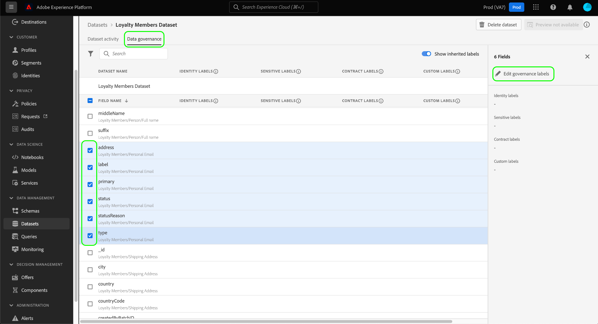
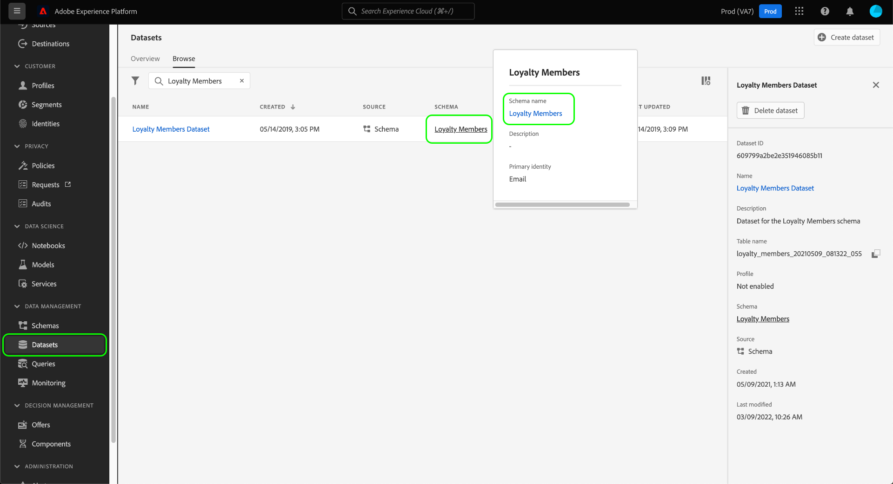
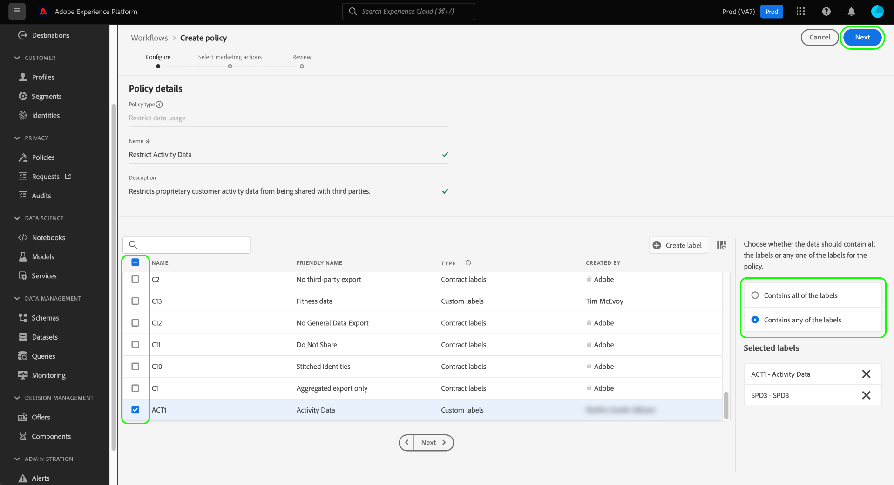

# Guía completa de control de datos

Para controlar qué acciones de marketing se pueden realizar en determinados conjuntos de datos y campos de Adobe Experience Platform, debe configurar lo siguiente:

1. [Aplicar etiquetas](#labels) a los conjuntos de datos y campos cuyo uso desea restringir.
1. [Configuración y activación de políticas de control de datos](#policy) que determinan qué tipos de datos etiquetados se pueden utilizar para determinadas acciones de marketing.
1. [Aplicar acciones de marketing a los destinos](#destinations) para indicar qué políticas se aplican a los datos enviados a esos destinos.

Una vez que haya terminado de configurar las etiquetas, las políticas de control y las acciones de marketing, puede [probar la aplicación de directivas](#test) para asegurarse de que funciona según lo esperado.

Esta guía explica el proceso completo de configuración y aplicación de una política de control de datos en la interfaz de usuario de Platform. Para obtener información más detallada sobre las funciones utilizadas en esta guía, consulte la documentación de información general sobre los siguientes temas:

* [Administración de datos de Adobe Experience Platform](./home.md)
* [Etiquetas de uso de datos](./labels/overview.md)
* [Políticas de uso de datos](./policies/overview.md)
* [Aplicación de políticas](./enforcement/overview.md)

>[!NOTE]
>
>Esta guía se centra en cómo configurar y aplicar políticas sobre cómo se utilizan o activan los datos en el Experience Platform. Si está intentando restringir **access** para conocer los datos de ciertos usuarios de Platform de su organización, consulte la guía de extremo a extremo sobre [control de acceso basado en atributos](../access-control/abac/end-to-end-guide.md) en su lugar. El control de acceso basado en atributos también utiliza etiquetas y políticas, pero para un caso de uso diferente al control de datos.

## Aplicar etiquetas {#labels}

Si hay un conjunto de datos específico en el que desea aplicar restricciones de uso de datos, puede [aplicar etiquetas directamente a ese conjunto de datos](#dataset-labels) o campos específicos dentro de ese conjunto de datos.

También puede [aplicar etiquetas a un esquema](#schema-labels) de modo que todos los conjuntos de datos basados en ese esquema hereden las mismas etiquetas.

>[!NOTE]
>
>Para obtener más información sobre las distintas etiquetas de uso de datos y el uso deseado, consulte la [referencia de etiquetas de uso de datos](./labels/reference.md). Si las etiquetas principales disponibles no abarcan todos los casos de uso deseados, puede [definir sus propias etiquetas personalizadas](./labels/user-guide.md#manage-custom-labels) también.

### Aplicar etiquetas a un conjunto de datos {#dataset-labels}

Select **[!UICONTROL Conjuntos de datos]** en la navegación de la izquierda, seleccione el nombre del conjunto de datos al que desea aplicar las etiquetas. Opcionalmente, puede utilizar el campo de búsqueda para reducir la lista de conjuntos de datos mostrados.

Aparecerá la vista de detalles del conjunto de datos. Seleccione el **[!UICONTROL Administración de datos]** para ver una lista de los campos del conjunto de datos y las etiquetas que ya se les han aplicado. Seleccione las casillas de verificación situadas junto a los campos a los que desee agregar etiquetas y, a continuación, seleccione **[!UICONTROL Editar etiquetas de control]** en el carril derecho.

>[!NOTE]
>
>Si desea agregar etiquetas a todo el conjunto de datos, active la casilla que hay junto a **[!UICONTROL Nombre del campo]** resaltado de todos los campos antes de seleccionar **[!UICONTROL Editar etiquetas de control]**.
>
>

En el cuadro de diálogo siguiente, seleccione las etiquetas que desee aplicar a los campos de conjunto de datos que eligió anteriormente. Cuando termine, seleccione **[!UICONTROL Guardar cambios]**.

Siga los pasos anteriores para aplicar etiquetas a diferentes campos (o conjuntos de datos diferentes) según sea necesario. Cuando termine, puede continuar con el siguiente paso de [activación de políticas de control de datos](#policy).

### Aplicar etiquetas a un esquema {#schema-labels}

Select **[!UICONTROL Esquemas]** en el panel de navegación izquierdo, seleccione el esquema al que desee agregar etiquetas en la lista.

>[!TIP]
>
>Si no está seguro de qué esquema se aplica a un conjunto de datos determinado, seleccione **[!UICONTROL Conjuntos de datos]** en la navegación de la izquierda, seleccione el vínculo debajo de la **[!UICONTROL Esquema]** para el conjunto de datos deseado. Seleccione el nombre del esquema en la ventana emergente que aparece para abrirlo en el Editor de esquemas.
>
>

La estructura del esquema aparece en el Editor de esquemas. Desde aquí, seleccione el **[!UICONTROL Etiquetas]** para mostrar una vista de lista de los campos del esquema y las etiquetas que ya se les han aplicado. Seleccione las casillas de verificación situadas junto a los campos a los que desee agregar etiquetas y, a continuación, seleccione **[!UICONTROL Editar etiquetas de control]** en el carril derecho.

>[!NOTE]
>
>Si desea añadir etiquetas a todos los campos del esquema, seleccione el icono de lápiz en la fila superior.
>
>

En el cuadro de diálogo siguiente, seleccione las etiquetas que desee aplicar a los campos de esquema que eligió anteriormente. Cuando termine, seleccione **[!UICONTROL Guardar]**.

Siga los pasos anteriores para aplicar etiquetas a diferentes campos (o esquemas diferentes) según sea necesario. Cuando termine, puede continuar con el siguiente paso de [activación de políticas de control de datos](#policy).

## Habilitar las políticas de control de datos {#policy}

Después de aplicar etiquetas a sus esquemas o conjuntos de datos, puede crear políticas de control de datos que restrinjan las acciones de marketing para las que se pueden utilizar ciertas etiquetas.

Select **[!UICONTROL Políticas]** en el panel de navegación de la izquierda para ver una lista de las políticas principales definidas por Adobe, así como las políticas personalizadas creadas anteriormente por su organización.

Cada etiqueta principal tiene asociada una directiva principal que, cuando está habilitada, impone las restricciones de activación adecuadas a cualquier dato que contenga esa etiqueta. Para activar una directiva principal, selecciónela en la lista y luego seleccione la opción **[!UICONTROL Estado de la política]** alternar a **[!UICONTROL Habilitado]**.

Si las directivas principales disponibles no abarcan todos los casos de uso (como cuando está empleando etiquetas personalizadas que ha definido en su organización), puede definir una directiva personalizada en su lugar. En el **[!UICONTROL Políticas]** espacio de trabajo, seleccione **[!UICONTROL Crear directiva]**.

![Imagen que muestra la variable [!UICONTROL Crear directiva] botón seleccionado en la interfaz de usuario](./images/e2e/create-policy.png)

Aparece una ventana emergente que le solicita que seleccione el tipo de política que desea crear. Select **[!UICONTROL Política de control de datos]** y, a continuación, seleccione **[!UICONTROL Continuar]**.

![Imagen que muestra la variable [!UICONTROL Política de control de datos] opción seleccionada](./images/e2e/governance-policy.png)

En la siguiente pantalla, proporcione una **[!UICONTROL Nombre]** y opcional **[!UICONTROL Descripción]** para la directiva. En la tabla siguiente, seleccione las etiquetas que desea que compruebe esta directiva. En otras palabras, estas son las etiquetas que la directiva evitará que se utilicen para las acciones de marketing que especifique en el siguiente paso.

Si selecciona varias etiquetas, puede utilizar las opciones del carril derecho para determinar si todas las etiquetas deben estar presentes para que la directiva aplique restricciones de uso o si solo debe estar presente una de las etiquetas. Cuando termine, seleccione **[!UICONTROL Siguiente]**.

En la siguiente pantalla, seleccione las acciones de marketing para las que esta directiva restringirá el uso de las etiquetas seleccionadas anteriormente. Haga clic en **[!UICONTROL Siguiente]** para continuar.

La pantalla final muestra un resumen de los detalles de la directiva y las acciones que restringirá para qué etiquetas. Select **[!UICONTROL Finalizar]** para crear la directiva.

La directiva se crea, pero se establece en [!UICONTROL Desactivado] de forma predeterminada. Seleccione la política de la lista y establezca la variable **[!UICONTROL Estado de la política]** alternar a **[!UICONTROL Habilitado]** para habilitar la directiva.

Siga los pasos anteriores para crear y habilitar las directivas que necesita antes de pasar al siguiente paso.

## Administrar acciones de marketing para destinos {#destinations}

Para que las políticas habilitadas determinen con precisión qué datos se pueden activar en un destino, debe asignar acciones de marketing específicas a ese destino.

Por ejemplo, considere una directiva habilitada que impida que los datos que contengan un `C2` no se usa para la acción de marketing &quot;[!UICONTROL Exportar a terceros]&quot;. Al activar datos en un destino, la directiva comprueba qué acciones de marketing están presentes en el destino. Si &quot;[!UICONTROL Exportar a terceros]&quot; está presente, intentando activar datos con un `C2` da como resultado una infracción de directiva. Si &quot;[!UICONTROL Exportar a terceros]&quot; no está presente, la directiva no se aplica al destino y los datos con `C2` las etiquetas se pueden activar libremente.

When [conexión de un destino en la interfaz de usuario](../destinations/ui/connect-destination.md), el **[!UICONTROL Gobierno]** del flujo de trabajo le permite seleccionar las acciones de marketing que se aplican a este destino, que en última instancia determinan qué políticas de control de datos se aplican al destino.

## Aplicación de directivas de prueba {#test}

Una vez que haya etiquetado los datos, habilitado las políticas de control de datos y asignado acciones de marketing a sus destinos, puede comprobar si las políticas se aplican según lo esperado.

Si configura las cosas correctamente, cuando intenta activar datos restringidos por las políticas, la activación se deniega automáticamente y aparece un mensaje de infracción de la política, en el que se describe información detallada del linaje de datos sobre la causa de la infracción.

Consulte el documento en [aplicación automática de directivas](./enforcement/auto-enforcement.md) para obtener más información sobre cómo interpretar los mensajes de infracción de directivas.

## Pasos siguientes

Esta guía abarcaba los pasos necesarios para configurar y aplicar políticas de control de datos en los flujos de trabajo de activación. Para obtener información más detallada sobre los componentes de control de datos implicados en esta guía, consulte la siguiente documentación:

* [Etiquetas de uso de datos](./labels/overview.md)
* [Políticas de uso de datos](./policies/overview.md)
* [Aplicación de políticas](./enforcement/overview.md)
