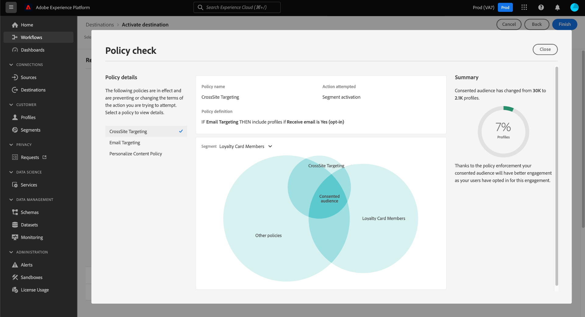

# Aplicación automática de políticas

Las etiquetas y políticas de uso de datos están disponibles para todos los usuarios de Adobe Experience Platform. Defina políticas de uso de datos y aplique etiquetas de uso de datos para garantizar que los datos confidenciales, identificables o contractuales se gestionen con precisión. Estas medidas ayudan a aplicar las reglas de control de datos de su organización sobre cómo se pueden acceder, procesar, almacenar y compartir los datos.

Para ayudar a proteger su organización de posibles riesgos y responsabilidades, Platform aplica automáticamente las políticas de uso en caso de que se produzcan violaciones al activar audiencias en los destinos.

>[!IMPORTANT]
>
>Las políticas de consentimiento y la aplicación automática de la política de consentimiento solo están disponibles para las organizaciones que han adquirido **Adobe Healthcare Shield** o **Adobe Privacy &amp; Security Shield**.

Este documento se centra en la aplicación de la gobernanza de datos y las políticas de consentimiento. Para obtener información sobre las directivas de control de acceso, consulte la documentación sobre [control de acceso basado en atributos](../../access-control/abac/overview.md).

## Requisitos previos

Esta guía requiere una comprensión práctica de los servicios de Platform implicados en la aplicación automática. Consulte la siguiente documentación para obtener más información antes de continuar con esta guía:

* [Administración de datos de Adobe Experience Platform](../home.md): El marco por el cual Platform aplica el cumplimiento del uso de datos mediante el uso de etiquetas y directivas.
* [Perfil del cliente en tiempo real](../../profile/home.md): Proporciona un perfil de consumidor unificado en tiempo real basado en datos agregados de múltiples fuentes.
* [Servicio de segmentación de Adobe Experience Platform](../../segmentation/home.md): El motor de segmentación de [!DNL Platform] se usa para crear audiencias a partir de los perfiles de clientes en función de los comportamientos y atributos de los clientes.
* [Destinos](../../destinations/home.md): los destinos son integraciones prediseñadas con aplicaciones de uso común que permiten la activación perfecta de datos de Platform para campañas de marketing entre canales, campañas por correo electrónico, publicidad segmentada y mucho más.

## Flujo de aplicación {#flow}

El diagrama siguiente ilustra cómo la aplicación de directivas está integrada en el flujo de datos de activación de audiencia:

Cuando se activa una audiencia por primera vez, [!DNL Policy Service] comprueba las directivas aplicables en función de los siguientes factores:

* Las etiquetas de uso de datos aplicadas a campos y conjuntos de datos dentro de la audiencia que se va a activar.
* El propósito de marketing del destino.
* Los perfiles que han aceptado ser incluidos en la activación de audiencia, en función de las políticas de consentimiento configuradas.

>[!NOTE]
>
>Si hay etiquetas de uso de datos que solo se hayan aplicado a ciertos campos dentro de un conjunto de datos (en lugar de todo el conjunto de datos), la aplicación de esas etiquetas de nivel de campo en la activación solo se produce en las siguientes condiciones:
>
>* Los campos se utilizan en la audiencia.
>* Los campos se configuran como atributos proyectados para el destino final.

## Linaje de datos {#lineage}

El linaje de datos desempeña un papel clave en la forma en que se aplican las políticas en Platform. En términos generales, el linaje de datos hace referencia al origen de un conjunto de datos y a lo que le sucede (o a dónde se mueve) a lo largo del tiempo.

En el contexto de la gobernanza de datos, el linaje permite que las etiquetas de uso de datos se propaguen desde esquemas a servicios descendentes que consumen sus datos, como el perfil del cliente en tiempo real y los destinos. Esto permite evaluar y aplicar las políticas en varios puntos clave del recorrido de los datos a través de Platform y proporciona contexto a los consumidores de datos para saber por qué se ha producido una infracción de política.

En Experience Platform, la aplicación de políticas se refiere al siguiente linaje:

1. Los datos se incorporan a Platform y se almacenan en **conjuntos de datos**.
1. Los perfiles de cliente se identifican y construyen a partir de esos conjuntos de datos combinando fragmentos de datos de acuerdo con la **política de combinación**.
1. Los grupos de perfiles se dividen en **audiencias** según atributos comunes.
1. Las audiencias se han activado para los **destinos** descendentes.

Cada etapa de la cronología anterior representa una entidad que puede contribuir a la aplicación de las políticas, como se indica en la tabla siguiente:

| Fase de linaje de datos | Función en la aplicación de políticas |
| --- | --- |
| Conjunto de datos | Los conjuntos de datos contienen etiquetas de uso de datos (aplicadas en el nivel de campo de esquema o en todo el nivel de conjunto de datos) que definen para qué casos de uso se puede utilizar todo el conjunto de datos o campos específicos. Se producirán infracciones de directivas si se utiliza un conjunto de datos o un campo que contenga determinadas etiquetas para un fin restringido por una directiva.  Todos los atributos de consentimiento recopilados de sus clientes también se almacenan en conjuntos de datos. Si tiene acceso a las políticas de consentimiento, los perfiles que no cumplan los requisitos de atributo de consentimiento de las políticas se excluirán de las audiencias activadas en un destino. |
| Política de combinación | Las políticas de combinación son las reglas que utiliza Platform para determinar la prioridad que se dará a los datos al combinar fragmentos de varios conjuntos de datos. Se producirán infracciones de directivas si las políticas de combinación se configuran de modo que los conjuntos de datos con etiquetas restringidas se activen en un destino. Consulte la [descripción general de las políticas de combinación](../../profile/merge-policies/overview.md) para obtener más información. |
| Público | Las reglas de segmentación definen qué atributos se deben incluir desde los perfiles del cliente. Según los campos que incluya una definición de segmento, la audiencia heredará las etiquetas de uso aplicadas a esos campos. Se producirán violaciones de política si activa una audiencia cuyas etiquetas heredadas estén restringidas por las políticas aplicables del destino de destino, según su caso de uso de marketing. |
| Destino | Al configurar un destino, se puede definir una acción de marketing (a veces denominada caso de uso de marketing). Este caso de uso se correlaciona con una acción de marketing tal como se define en una directiva. En otras palabras, la acción de marketing que defina para un destino determina qué políticas de uso de datos y políticas de consentimiento son aplicables a ese destino.  Las violaciones de políticas de uso de datos se producen si activa una audiencia cuyas etiquetas de uso están restringidas para la acción de marketing del destino de destino.  (Beta) Cuando se activa una audiencia, los perfiles que no contienen los atributos de consentimiento necesarios para la acción de marketing (según se definen en las directivas de consentimiento) se excluyen de la audiencia activada. |

>[!IMPORTANT]
>
>Algunas políticas de uso de datos pueden especificar dos o más etiquetas con una relación AND. Por ejemplo, una directiva podría restringir una acción de marketing si las etiquetas `C1` Y `C2` están presentes, pero no restringe la misma acción si solo una de esas etiquetas está presente.
>
>En cuanto a la aplicación automática, el marco de control de datos no considera la activación de audiencias independientes en un destino como una combinación de datos. Por lo tanto, la directiva de ejemplo `C1 AND C2` es **NOT** obligatorio si estas etiquetas se incluyen en audiencias independientes. En su lugar, esta directiva solo se aplica cuando ambas etiquetas están presentes en la misma audiencia tras la activación.

Cuando se producen violaciones de directivas, los mensajes resultantes que aparecen en la interfaz de usuario proporcionan herramientas útiles para explorar el linaje de datos que contribuye a la infracción para ayudar a resolver el problema. En la siguiente sección se proporcionan más detalles.

## Mensajes de aplicación de políticas {#enforcement}

Las secciones siguientes describen los diferentes mensajes de aplicación de políticas que aparecen en la IU de Platform:

* [Infracción de directiva de uso de datos](#data-usage-violation)
* [Evaluación de directiva de consentimiento](#consent-policy-evaluation)

### Infracción de directiva de uso de datos {#data-usage-violation}

Si se produce una infracción de directiva al intentar activar una audiencia (o al [hacer ediciones en una audiencia ya activada](#policy-enforcement-for-activated-audiences)), la acción se impide y aparece una ventana emergente que indica que se han violado una o más directivas. Una vez que se ha activado una infracción, el botón **[!UICONTROL Guardar]** se desactiva para la entidad que está modificando hasta que se actualicen los componentes adecuados para cumplir con las políticas de uso de datos.

Seleccione un nombre de directiva para mostrar los detalles de esa infracción.

El mensaje de infracción proporciona un resumen de la directiva que se ha violado, incluidas las condiciones que la directiva está configurada para comprobar, la acción específica que activó la infracción y una lista de posibles soluciones para el problema.

Debajo del resumen de la infracción se muestra un gráfico de linaje de datos, que le permite visualizar qué conjuntos de datos, políticas de combinación, audiencias y destinos participaron en la infracción de política. La entidad que está cambiando actualmente aparece resaltada en el gráfico, indicando en qué punto del flujo se produce la infracción. Puede seleccionar un nombre de entidad dentro del gráfico para abrir la página de detalles de la entidad en cuestión.

También puede usar el icono **[!UICONTROL Filter]** () para filtrar las entidades mostradas por categoría. Se deben seleccionar al menos dos categorías para que se muestren los datos.

Seleccione **[!UICONTROL Vista de lista]** para mostrar el linaje de datos como una lista. Para volver al gráfico visual, seleccione **[!UICONTROL Vista de ruta]**.

#### Etiquetas aplicadas correctamente {#labels-successfully-applied}

Si crea políticas de uso de datos antes de etiquetar los campos de esquema, puede encontrar un cuadro de diálogo de infracción de política de gobernanza en cuanto aplique las etiquetas al esquema. En este caso, puede etiquetar correctamente parte del esquema. La ficha [!UICONTROL Etiquetas aplicadas correctamente] indica qué etiquetas se aplicaron correctamente, ya que no hay restricciones de directiva en ese campo.

Utilice el diagrama de linaje de datos para comprender qué otros cambios de configuración se deben realizar antes de agregar la etiqueta al campo de esquema.

![Cuadro de diálogo de infracción de directiva con [!UICONTROL Etiquetas aplicadas correctamente] ficha resaltada.](../images/enforcement/labels-successfully-applied.png)

### Evaluación de directiva de consentimiento {#consent-policy-evaluation}

Al activar una audiencia en un destino, puede ver cómo las [políticas de consentimiento](../policies/user-guide.md#consent-policy) afectan a distintos porcentajes de perfiles incluidos en la activación.

>[!NOTE]
>
>Las políticas de consentimiento solo están disponibles para organizaciones que han adquirido Adobe Healthcare Shield o Adobe Privacy &amp; Security Shield.

#### Mejora de la política de consentimiento para medios de pago {#consent-policy-enhancement}

Se ha realizado una mejora en la aplicación de la política de consentimiento en los destinos [batch](../../destinations/destination-types.md#file-based) y [streaming](../../destinations/destination-types.md#streaming-destinations), incluidas las activaciones de medios pagados. Esta mejora está disponible para los clientes de Privacy and Security Shield o Healthcare Shield, y elimina de forma proactiva los perfiles de los destinos de lote y de flujo continuo a medida que cambia el estado del consentimiento. También garantiza que los cambios de consentimiento se propaguen inmediatamente para que la audiencia adecuada siempre esté segmentada.

Estas mejoras garantizan una mayor confianza en la estrategia de marketing, ya que eliminan la necesidad de que los especialistas en marketing agreguen manualmente atributos de consentimiento a su expresión de segmento. Esto garantiza que no se segmenten perfiles de forma involuntaria para ninguna experiencia de marketing una vez que se haya retirado el consentimiento o ya no se cumpla la política de consentimiento. Las políticas de consentimiento de marketing que establecen reglas sobre cómo se deben administrar los datos de consentimiento o preferencia en varios flujos de trabajo de marketing ahora se aplican automáticamente en los flujos de trabajo de activación en las soluciones descendentes.

>[!NOTE]
>
>No hay cambios en la interfaz de usuario como resultado de esta mejora.

#### Evaluación previa a la activación

Una vez que llegue al paso **[!UICONTROL Revisar]** al [activar un destino](../../destinations/ui/activation-overview.md), seleccione **[!UICONTROL Ver directivas aplicadas]**.

Aparece un cuadro de diálogo de comprobación de directivas que muestra una previsualización de cómo las directivas de consentimiento afectan a la audiencia consentida de las audiencias activadas.

El cuadro de diálogo muestra la audiencia consentida para una audiencia a la vez. Para ver la evaluación de directivas para una audiencia diferente, utilice el menú desplegable situado encima del diagrama para seleccionar una de la lista.

Utilice el carril izquierdo para cambiar entre las políticas de consentimiento aplicables a la audiencia seleccionada. Las directivas que no están seleccionadas se representan en la sección &quot;[!UICONTROL Otras directivas]&quot; del diagrama.

El diagrama muestra la superposición entre tres grupos de perfiles:

1. Perfiles aptos para la audiencia seleccionada
1. Perfiles aptos para la política de consentimiento seleccionada
1. Perfiles que cumplen los requisitos para las demás directivas de consentimiento aplicables a la audiencia (denominadas &quot;[!UICONTROL Otras directivas]&quot; en el diagrama)

Los perfiles que cumplen los tres grupos anteriores representan la audiencia consentida, resumida en el carril derecho.

Pase el ratón sobre una de las audiencias del diagrama para ver el número de perfiles que contiene.

La audiencia consentida se representa mediante la superposición central del diagrama y se puede resaltar como las otras secciones.

#### Ejecución de ejecución de flujo

Cuando se activan los datos en un destino, los detalles de la ejecución del flujo muestran el número de identidades que se excluyeron debido a las políticas de consentimiento activas.

## Aplicación de políticas para audiencias activadas {#policy-enforcement-for-activated-audiences}

La aplicación de directivas sigue aplicándose a las audiencias una vez activadas, lo que restringe cualquier cambio en una audiencia o en su destino que pueda provocar una infracción de directiva. Debido a cómo funciona [linaje de datos](#lineage) en la aplicación de políticas, cualquiera de las siguientes acciones puede potencialmente déclencheur una infracción:

* Actualización de etiquetas de uso de datos
* Cambio de conjuntos de datos para una audiencia
* Cambio de predicados de audiencia
* Cambio de configuraciones de destino

Déclencheur Si alguna de las acciones anteriores infringe alguna, se impide guardar esa acción y se muestra un mensaje de infracción de directiva, lo que garantiza que las audiencias activadas sigan cumpliendo las políticas de uso de datos cuando se modifiquen.

## Pasos siguientes

Este documento abarcaba cómo funciona la aplicación automática de directivas en Experience Platform. Para ver los pasos sobre cómo integrar mediante programación la aplicación de políticas en sus aplicaciones mediante llamadas API, consulte la guía sobre [aplicación basada en API](./api-enforcement.md).
