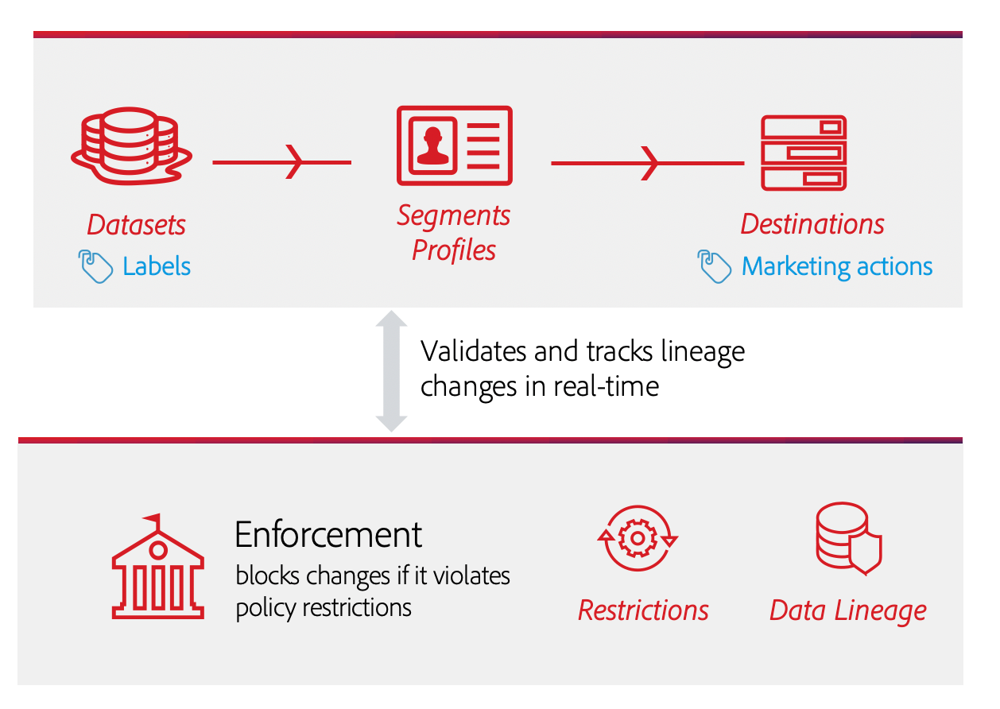
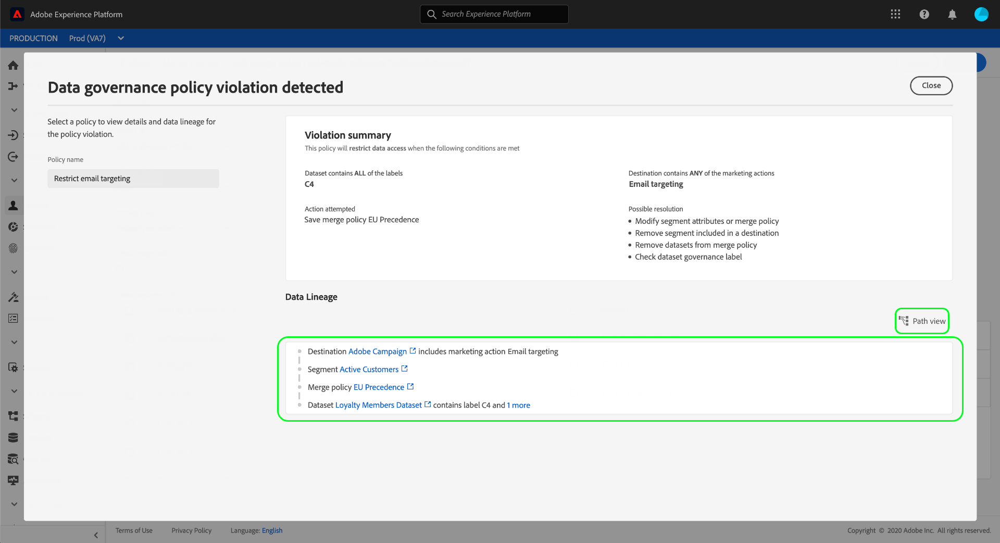

# Aplicación automática de políticas

Una vez etiquetados los datos y definidas las políticas de uso, puede imponer el cumplimiento de las políticas en el uso de los datos. Al activar segmentos de audiencia en destinos, Adobe Experience Platform aplica automáticamente las directivas de uso en caso de que se produzcan infracciones.

## Requisitos previos

Esta guía requiere un conocimiento práctico de los servicios de la Plataforma que intervienen en la aplicación automática. Consulte la siguiente documentación para obtener más información antes de continuar con esta guía:

* [Administración](../home.md) de datos de Adobe Experience Platform: El marco por el cual la Plataforma impone el cumplimiento del uso de datos mediante el uso de etiquetas y políticas.
* [Perfil](../../profile/home.md) del cliente en tiempo real: Proporciona un perfil de consumo unificado y en tiempo real basado en datos agregados de varias fuentes.
* [Servicio](../../segmentation/home.md) de segmentación de Adobe Experience Platform: Motor de segmentación dentro del  [!DNL Platform] que se utiliza para crear segmentos de audiencia a partir de los perfiles del cliente en función de los comportamientos y atributos del cliente.
* [Destinos](../../destinations/home.md): Los destinos son integraciones prediseñadas con aplicaciones de uso común que permiten la activación sin fisuras de datos desde la Plataforma para campañas de marketing en canal cruzado, campañas por correo electrónico, publicidad dirigida y mucho más.

## Flujo de aplicación {#flow}

El diagrama siguiente ilustra cómo se integra la aplicación de políticas en el flujo de datos de la activación de segmentos:

Cuando se activa un segmento por primera vez, [!DNL Policy Service] comprueba si hay infracciones de directivas en función de los siguientes factores:

* Las etiquetas de uso de datos aplicadas a los campos y conjuntos de datos dentro del segmento que se va a activar.
* El propósito de marketing del destino.

>[!NOTE]
>
>Si hay etiquetas de uso de datos que solo se han aplicado a determinados campos dentro de un conjunto de datos (en lugar de a todo el conjunto de datos), la aplicación de las etiquetas de nivel de campo en la activación solo se produce bajo las siguientes condiciones:
>
>* Los campos se utilizan en la definición del segmento.
>* Los campos se configuran como atributos proyectados para el destino de destinatario.

## Línea de datos {#lineage}

El linaje de datos juega un papel clave en la forma en que se aplican las políticas en la plataforma. En términos generales, el linaje de datos se refiere al origen de un conjunto de datos y a lo que le sucede (o a dónde se mueve) con el tiempo.

En el contexto de [!DNL Data Governance], el linaje permite que las etiquetas de uso de datos se propaguen de los conjuntos de datos a los servicios de flujo descendente que consumen sus datos, como Perfiles y destinos de clientes en tiempo real. Esto permite que las políticas se evalúen y apliquen en varios puntos clave del viaje de los datos a través de la plataforma, y proporciona contexto a los consumidores de datos sobre el motivo por el que se produjo una infracción de las políticas.

En Experience Platform, la aplicación de las políticas tiene que ver con el siguiente linaje:

1. Los datos se ingieren en la plataforma y se almacenan en **datasets**.
1. Los perfiles del cliente se identifican y construyen a partir de esos conjuntos de datos mediante la combinación de fragmentos de datos según la **directiva de combinación**.
1. Los grupos de perfiles se dividen en **segmentos** según atributos comunes.
1. Los segmentos se activan en **destinos** descendentes.

Cada etapa del calendario anterior representa una entidad que puede contribuir a que se infrinja una política, como se indica en el cuadro siguiente:

| Etapa del linaje de datos | Función en la aplicación de políticas |
| --- | --- |
| Conjunto de datos | Los conjuntos de datos contienen etiquetas de uso de datos (aplicadas a nivel de conjunto de datos o campo) que definen los casos de uso para los que se puede utilizar todo el conjunto de datos o campos específicos. Se producirán infracciones de directiva si se utiliza un conjunto de datos o un campo que contenga ciertas etiquetas para un propósito que una política restrinja. |
| Combinar directiva | Las políticas de combinación son las reglas que utiliza la plataforma para determinar cómo se priorizarán los datos al combinar fragmentos de varios conjuntos de datos. Se producirán infracciones de directiva si las directivas de combinación están configuradas de modo que los conjuntos de datos con etiquetas restringidas se activen en un destino. Consulte la guía de [políticas de combinación](../../profile/ui/merge-policies.md) para obtener más información. |
| Segmento | Las reglas de segmentos definen qué atributos deben incluirse a partir de los perfiles del cliente. Según los campos que incluya una definición de segmento, el segmento heredará las etiquetas de uso aplicadas para esos campos. Se producirán infracciones de directiva si activa un segmento cuyas etiquetas heredadas están restringidas por las políticas aplicables del destino de destinatario, según el caso de uso de la mercadotecnia. |
| Destino | Al configurar un destino, se puede definir una acción de mercadotecnia (a veces denominada caso de uso de mercadotecnia). Este caso de uso se correlaciona con una acción de marketing tal como se define en una directiva de uso de datos. En otras palabras, el caso de uso de mercadotecnia que defina para un destino determina qué políticas de uso de datos son aplicables a dicho destino. Se producirán infracciones de directiva si activa un segmento cuyas etiquetas de uso están restringidas por las políticas aplicables del destino de destinatario. |

Cuando se producen infracciones de política, los mensajes resultantes que aparecen en la interfaz de usuario proporcionan herramientas útiles para explorar el linaje de datos de contribución de la infracción para ayudar a resolver el problema. En la siguiente sección se proporcionan más detalles.

## Mensajes de infracción de directiva {#enforcement}

Si se produce una infracción de directiva al intentar activar un segmento (o [realizar modificaciones en un segmento ya activado](#policy-enforcement-for-activated-segments)), se evita la acción y aparece una ventana emergente que indica que se han infringido una o más directivas. Una vez que se ha activado una infracción, el botón **[!UICONTROL Guardar]** se desactiva para la entidad que está modificando hasta que se actualicen los componentes adecuados para cumplir con las políticas de uso de datos.

Seleccione una infracción de directiva en la columna izquierda de la ventana emergente para mostrar los detalles de dicha infracción.

El mensaje de infracción proporciona un resumen de la política violada, incluyendo las condiciones para las que se configura la política, la acción específica que activó la infracción y una lista de posibles resoluciones para el problema.

Debajo del resumen de infracciones se muestra un gráfico del linaje de datos que le permite visualizar los conjuntos de datos, las políticas de combinación, los segmentos y los destinos que participaron en la infracción de la directiva. La entidad que está cambiando actualmente se resalta en el gráfico, indicando qué punto del flujo está causando que se produzca la infracción. Puede seleccionar un nombre de entidad dentro del gráfico para abrir la página de detalles de la entidad en cuestión.

También puede utilizar el icono **[!UICONTROL Filtro]** () para filtrar las entidades mostradas por categoría. Se deben seleccionar al menos dos categorías para que se muestren los datos.

Seleccione **[!UICONTROL vista de Lista]** para mostrar el linaje de datos como una lista. Para volver al gráfico visual, seleccione **[!UICONTROL vista de ruta]**.

## Aplicación de políticas para segmentos activados {#policy-enforcement-for-activated-segments}

La aplicación de políticas sigue aplicándose a los segmentos después de activarlos, lo que restringe cualquier cambio en un segmento o en su destino que pueda provocar una infracción de la política. Debido a cómo [funciona el linaje de datos](#lineage) en la aplicación de políticas, cualquiera de las siguientes acciones puede potencialmente desencadenar una infracción:

* Actualización de etiquetas de uso de datos
* Cambio de conjuntos de datos para un segmento
* Cambio de predicados de segmentos
* Cambio de las configuraciones de destino

Si alguna de las acciones anteriores desencadena una infracción, se evita que se guarde esa acción y se muestra un mensaje de infracción de directiva, lo que garantiza que los segmentos activados sigan cumpliendo con las directivas de uso de datos al modificarse.

## Pasos siguientes

Este documento abarcaba el funcionamiento de la aplicación automática de las políticas en el Experience Platform. Para ver los pasos sobre cómo integrar mediante programación la aplicación de políticas en sus aplicaciones mediante llamadas de API, consulte la guía sobre [aplicación basada en API](./api-enforcement.md).