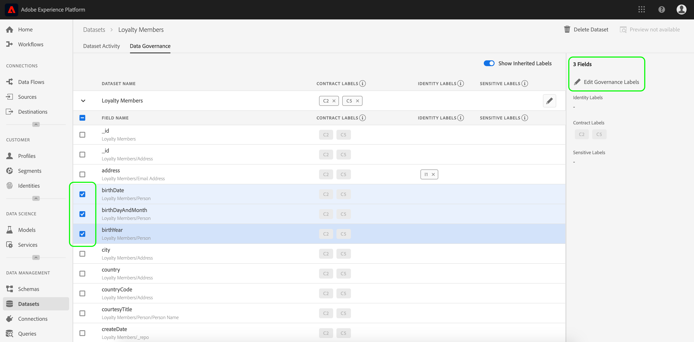

# Guía del usuario de etiquetas de uso de datos

Esta guía del usuario describe los pasos para trabajar con etiquetas de uso de datos (también conocidas como etiquetas DULE) en la interfaz de usuario de la plataforma de experiencia. Antes de utilizar la guía, consulte la descripción general [de la gobernanza de](../home.md) datos para obtener una introducción más sólida al marco de trabajo DULE.

## Administración de etiquetas de uso de datos en el nivel de conjunto de datos

Para administrar las etiquetas de uso de datos en el nivel de conjunto de datos, debe seleccionar un conjunto de datos existente o crear uno nuevo. Después de iniciar sesión en Adobe Experience Platform, seleccione **[!UICONTROL Datasets]** en el panel de navegación izquierdo para abrir el espacio de trabajo _Datasets_ . Esta página lista todos los conjuntos de datos creados que pertenecen a su organización, junto con detalles útiles relacionados con cada conjunto de datos.

En la siguiente sección se proporcionan los pasos para crear un nuevo conjunto de datos al que aplicar etiquetas. Si desea editar las etiquetas de un conjunto de datos existente, seleccione el conjunto de datos de la lista y continúe con la [adición de las etiquetas de uso de datos al conjunto de datos](#add-labels).

### Crear un nuevo conjunto de datos

>[!NOTE] En este ejemplo, se crea un conjunto de datos con un esquema preconfigurado del Modelo de datos de experiencia (XDM). Para obtener más información sobre los esquemas XDM, consulte la descripción general [del sistema](../../xdm/home.md) XDM y [conceptos básicos de la composición](../../xdm/schema/composition.md)de esquemas.

Para crear un nuevo conjunto de datos, haga clic en **[!UICONTROL Create Dataset]** en la esquina superior derecha del _[!UICONTROL Datasets]_espacio de trabajo.

Aparece la _[!UICONTROL Create Dataset]_pantalla. Desde aquí, haga clic en **[!UICONTROL Create Dataset from Schema]**.

Aparece la pantalla _[!UICONTROL Select Schema]_, que lista todos los esquemas disponibles que puede utilizar para crear un conjunto de datos. Haga clic en el botón de radio situado junto a un esquema para seleccionarlo. La_[!UICONTROL Schemas]_ sección del lado derecho muestra detalles adicionales sobre el esquema seleccionado. Una vez que haya seleccionado un esquema, haga clic en **[!UICONTROL Next]**.

Aparece la pantalla _Configurar conjunto de datos_ . Proporcione un **nombre** (obligatorio) y una **descripción** (opcional, pero recomendada) para el nuevo conjunto de datos y haga clic en **[!UICONTROL Finish]**.

Se abre la _[!UICONTROL Dataset Activity]_página con información sobre el conjunto de datos recién creado. En este ejemplo, el conjunto de datos se denomina &quot;Miembros de lealtad&quot;, por lo que la navegación superior muestra_ Conjuntos de datos > Miembros _de lealtad.

### Añadir etiquetas de uso de datos al conjunto de datos {#add-labels}

Después de crear un nuevo conjunto de datos o seleccionar un conjunto de datos existente en la lista del _[!UICONTROL Datasets]_espacio de trabajo, haga clic en **[!UICONTROL Data Governance]**para abrir el_[!UICONTROL Data Governance]_ espacio de trabajo. El espacio de trabajo permite administrar etiquetas de uso de datos en el nivel de conjunto de datos y en el nivel de campo.

Para editar las etiquetas de uso de datos en el nivel de conjunto de datos, haga clic en el inicio del lápiz junto al nombre del conjunto de datos.

Se abre el _[!UICONTROL Edit Governance Labels]_cuadro de diálogo. Dentro del cuadro de diálogo, marque las casillas junto a las etiquetas que desee aplicar al conjunto de datos. Recuerde que estas etiquetas serán heredadas por todos los campos dentro del conjunto de datos. El encabezado se actualiza a medida que marca cada casilla y muestra las etiquetas que ha elegido._[!UICONTROL Applied Labels]_ Una vez que haya seleccionado las etiquetas que desee, haga clic en **[!UICONTROL Save Changes]**.

 

El espacio de trabajo vuelve a aparecer y muestra las etiquetas que se han aplicado en el nivel de conjunto de datos. _[!UICONTROL Data Governance]_También puede ver que las etiquetas se heredan a cada uno de los campos dentro del conjunto de datos.

Observe que aparece una &quot;x&quot; junto a las etiquetas en el nivel de conjunto de datos, lo que le permite eliminar las etiquetas. Las etiquetas heredadas al lado de cada campo no tienen una &quot;x&quot; junto a ellas y aparecen &quot;atenuadas&quot; sin capacidad para eliminarlas o editarlas. Esto se debe a que los campos **heredados son de solo** lectura, lo que significa que no se pueden quitar en el nivel de campo.

El **[!UICONTROL Show Inherited Labels]** conmutador está activado de forma predeterminada, lo que permite ver las etiquetas heredadas del conjunto de datos a sus campos. Al desactivar la opción, se ocultan todas las etiquetas heredadas del conjunto de datos.

## Administración de etiquetas de uso de datos en el nivel de campo de conjunto de datos

Si continúa el flujo de trabajo para [agregar y editar etiquetas de uso de datos a nivel](#add-labels)de conjunto de datos, también puede administrar etiquetas a nivel de campo dentro del espacio de trabajo del _[!UICONTROL Data Governance]_conjunto de datos.

Para aplicar etiquetas de uso de datos a un campo individual, seleccione la casilla de verificación situada junto al nombre del campo y haga clic en **[!UICONTROL Edit Governance Labels]**.

Aparecerá el _[!UICONTROL Edit Governance Labels]_cuadro de diálogo. El cuadro de diálogo muestra encabezados que muestran campos seleccionados, etiquetas aplicadas y etiquetas heredadas. Observe que las etiquetas heredadas (C2 y C5) aparecen atenuadas en el cuadro de diálogo. Son etiquetas de solo lectura heredadas del nivel de conjunto de datos y, por lo tanto, solo se pueden editar en el nivel de conjunto de datos.

 

Seleccione las etiquetas de nivel de campo haciendo clic en la casilla de verificación situada junto a cada etiqueta que desee utilizar. Al seleccionar etiquetas, el encabezado se actualiza para mostrar las etiquetas aplicadas a los campos mostrados en el _[!UICONTROL Applied Labels]__[!UICONTROL Selected Fields]_ encabezado. Una vez que haya terminado de seleccionar etiquetas de nivel de campo, haga clic en **[!UICONTROL Save Changes]**.

 

El espacio de trabajo vuelve a aparecer, que ahora muestra las etiquetas de nivel de campo seleccionadas en la fila junto al nombre del campo. _[!UICONTROL Data Governance]_Observe que la etiqueta de nivel de campo tiene una &quot;x&quot; junto a ella, lo que le permite quitar la etiqueta.

Puede repetir estos pasos para continuar agregando y editando etiquetas de campo para campos adicionales, incluso seleccionando varios campos para aplicar etiquetas de campo simultáneamente.

Es importante recordar que la herencia se mueve sólo desde el nivel superior hacia abajo (conjunto de datos → campos), lo que significa que las etiquetas aplicadas en el nivel de campo no se propagan a otros campos o conjuntos de datos.

## Pasos siguientes

Ahora que ha agregado etiquetas de uso de datos a nivel de conjunto de datos y campo, puede empezar a ingestar datos en la plataforma de experiencia. Para obtener más información, lea la documentación [sobre la ingestión de](../../ingestion/home.md)datos para obtener inicios.

Ahora también puede definir directivas de uso de datos en función de las etiquetas que haya aplicado. Para obtener más información, consulte la descripción general [de las directivas de uso de](../policies/overview.md)datos.

## Recursos adicionales

El siguiente vídeo está diseñado para admitir su comprensión del Gobierno de datos y describe cómo aplicar etiquetas a un conjunto de datos y a campos individuales.

>[!VIDEO](https://video.tv.adobe.com/v/29709?quality=12&enable10seconds=on&speedcontrol=on)
