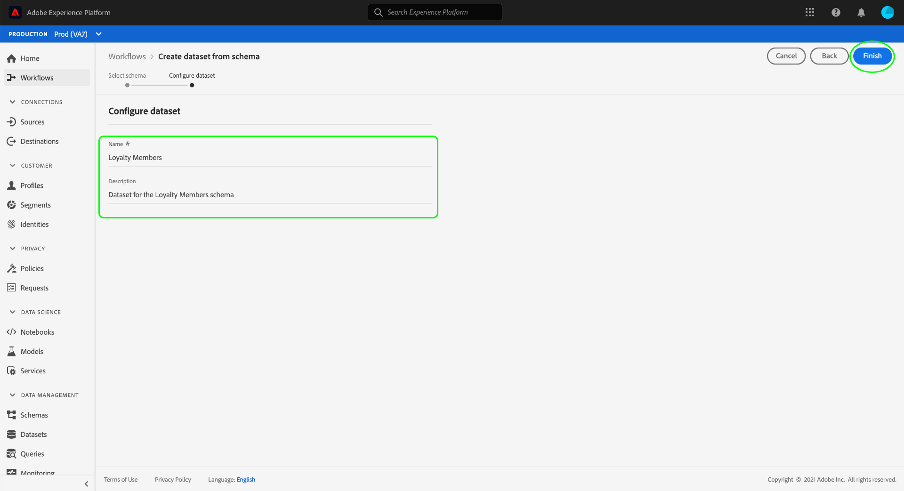
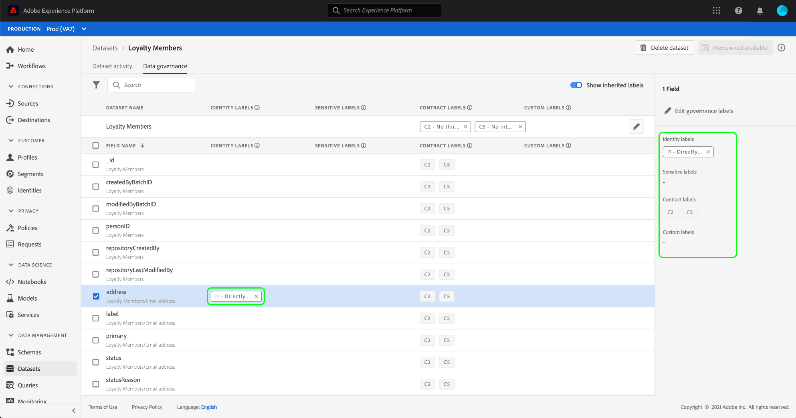

# Administrar etiquetas de uso de datos en la interfaz de usuario

Esta guía del usuario describe los pasos para trabajar con etiquetas de uso de datos dentro de la variable [!DNL Experience Platform] interfaz de usuario.

## Administrar etiquetas en el nivel de conjunto de datos

>[!IMPORTANT]
>
>La aplicación de etiquetas en el nivel de conjunto de datos solo se admite para casos de uso de control de datos. Si intenta crear directivas de acceso para los datos, debe [aplicar etiquetas al esquema](../../xdm/tutorials/labels.md) en el que se basa el conjunto de datos. Consulte la descripción general sobre [control de acceso basado en atributos](../../access-control/abac/overview.md) para obtener más información.

Para administrar las etiquetas de uso de datos en el nivel de conjunto de datos, debe seleccionar un conjunto de datos existente o crear uno nuevo. Después de iniciar sesión en Adobe Experience Platform, seleccione **[!UICONTROL Conjuntos de datos]** en el panel de navegación izquierdo para abrir el **[!UICONTROL Conjuntos de datos]** espacio de trabajo. Esta página enumera todos los conjuntos de datos creados que pertenecen a su organización, junto con detalles útiles relacionados con cada conjunto de datos.

En la siguiente sección se proporcionan los pasos para crear un nuevo conjunto de datos al que aplicar etiquetas. Si desea editar las etiquetas de un conjunto de datos existente, seleccione el conjunto de datos de la lista y continúe con [adición de etiquetas de uso de datos al conjunto de datos](#add-labels).

### Crear un nuevo conjunto de datos

>[!NOTE]
>
>En este ejemplo, se crea un conjunto de datos mediante una [!DNL Experience Data Model] (XDM). Para obtener más información sobre los esquemas XDM, consulte la [Información general del sistema XDM](../../xdm/home.md) y [conceptos básicos de la composición del esquema](../../xdm/schema/composition.md).

Para crear un nuevo conjunto de datos, seleccione **[!UICONTROL Crear conjunto de datos]** en la esquina superior derecha del **[!UICONTROL Conjuntos de datos]** espacio de trabajo.

La variable **[!UICONTROL Crear conjunto de datos]** se abre. Desde aquí, seleccione **[!UICONTROL Crear conjunto de datos a partir del esquema]**.

La variable **[!UICONTROL Seleccionar esquema]** , que enumera todos los esquemas disponibles que puede utilizar para crear un conjunto de datos. Seleccione el botón de opción situado junto a un esquema para seleccionarlo. La variable **[!UICONTROL Esquemas]** a la derecha muestra detalles adicionales sobre el esquema seleccionado. Una vez seleccionado un esquema, seleccione **[!UICONTROL Siguiente]**.

La variable **[!UICONTROL Configurar conjunto de datos]** se abre. Proporcione un nombre (obligatorio) y una descripción (opcional, pero recomendada) para el nuevo conjunto de datos y, a continuación, seleccione **[!UICONTROL Finalizar]**.

La variable **[!UICONTROL Actividad de conjunto de datos]** , mostrando información sobre el conjunto de datos recién creado. En este ejemplo, el conjunto de datos se llama &quot;Miembros de lealtad&quot;, por lo que se muestra la navegación superior **Conjuntos de datos > Miembros de fidelidad**.

### Agregar etiquetas de uso de datos al conjunto de datos {#add-labels}

Después de crear un conjunto de datos nuevo o de seleccionar un conjunto de datos existente de la lista en la **[!UICONTROL Conjuntos de datos]** espacio de trabajo, seleccione **[!UICONTROL Administración de datos]** para abrir el **[!UICONTROL Administración de datos]** espacio de trabajo. El espacio de trabajo le permite administrar etiquetas de uso de datos en el nivel de conjunto de datos y en el nivel de campo.

Para editar las etiquetas de uso de datos en el nivel de conjunto de datos, comience seleccionando el icono de lápiz junto al nombre del conjunto de datos.

La variable **[!UICONTROL Editar etiquetas de administración]** se abre. Dentro del cuadro de diálogo, marque las casillas junto a las etiquetas que desee aplicar al conjunto de datos. Recuerde que estas etiquetas serán heredadas por todos los campos dentro del conjunto de datos. La variable **[!UICONTROL Etiquetas aplicadas]** el encabezado se actualiza a medida que marca cada casilla y muestra las etiquetas que ha elegido. Una vez seleccionadas las etiquetas que desee, seleccione **[!UICONTROL Guardar cambios]**.

La variable **[!UICONTROL Administración de datos]** workspace vuelve a aparecer, mostrando las etiquetas que ha aplicado en el nivel de conjunto de datos. También puede ver que las etiquetas se heredan de cada uno de los campos dentro del conjunto de datos.

Observe que aparece una &quot;x&quot; junto a las etiquetas en el nivel de conjunto de datos, lo que le permite eliminar las etiquetas. Las etiquetas heredadas junto a cada campo no tienen una &quot;x&quot; junto a ellas y aparecen &quot;atenuadas&quot; sin capacidad para eliminarlas o editarlas. Esto se debe a que **los campos heredados son de solo lectura**, lo que significa que no se pueden eliminar en el nivel de campo.

La variable **[!UICONTROL Mostrar etiquetas heredadas]** está activada de forma predeterminada, lo que le permite ver las etiquetas heredadas del conjunto de datos a sus campos. Si desactiva la opción , se ocultarán todas las etiquetas heredadas del conjunto de datos.

## Administrar etiquetas en el nivel de campo del conjunto de datos

>[!IMPORTANT]
>
>La aplicación de etiquetas en el nivel de campo del conjunto de datos solo se admite para casos de uso de control de datos. Si intenta crear directivas de acceso para los datos, debe [aplicar etiquetas al esquema](../../xdm/tutorials/labels.md) en el que se basa el conjunto de datos. Consulte la descripción general sobre [control de acceso basado en atributos](../../access-control/abac/overview.md) para obtener más información.

Continuación del flujo de trabajo para [agregar y editar etiquetas de uso de datos en el nivel de conjunto de datos](#add-labels), también puede administrar etiquetas de nivel de campo dentro del **[!UICONTROL Administración de datos]** espacio de trabajo para ese conjunto de datos.

Para aplicar etiquetas de uso de datos a un campo individual, active la casilla que hay junto al nombre del campo y, a continuación, seleccione **[!UICONTROL Editar etiquetas de administración]**.

La variable **[!UICONTROL Editar etiquetas de administración]** se abre. El cuadro de diálogo muestra los encabezados que muestran los campos seleccionados, las etiquetas aplicadas y las etiquetas heredadas. Observe que las etiquetas heredadas (C2 y C5) aparecen atenuadas en el cuadro de diálogo. Son etiquetas de solo lectura heredadas del nivel de conjunto de datos y, por lo tanto, solo se pueden editar en el nivel de conjunto de datos.

Para seleccionar etiquetas de nivel de campo, seleccione la casilla que hay junto a cada etiqueta que desee utilizar. Al seleccionar etiquetas, la variable **[!UICONTROL Etiquetas aplicadas]** actualizaciones de encabezado para mostrar las etiquetas aplicadas a los campos mostrados en la **[!UICONTROL Campos seleccionados]** encabezado. Una vez que haya terminado de seleccionar etiquetas de nivel de campo, seleccione **[!UICONTROL Guardar cambios]**.

La variable **[!UICONTROL Administración de datos]** workspace vuelve a aparecer, que ahora muestra las etiquetas de nivel de campo seleccionadas en la fila junto al nombre del campo. Observe que la etiqueta de nivel de campo tiene una &quot;x&quot; junto a ella, lo que le permite eliminar la etiqueta.

Puede repetir estos pasos para seguir añadiendo y editando etiquetas de campo para campos adicionales, incluida la selección de varios campos para aplicar etiquetas de nivel de campo simultáneamente.

Es importante recordar que la herencia se desplaza solo del nivel superior hacia abajo (conjunto de datos → campos), lo que significa que las etiquetas aplicadas en el nivel de campo no se propagan a otros campos o conjuntos de datos.

## Administrar etiquetas en el nivel de esquema

Puede añadir etiquetas directamente a un esquema o campos dentro de él. Cualquier campo aplicado en el nivel de esquema se propagará a todos los conjuntos de datos basados en ese esquema.

Consulte el tutorial en [administración de etiquetas de nivel de esquema](../../xdm/tutorials/labels.md) para obtener más información.

## Administrar etiquetas personalizadas {#manage-custom-labels}

>[!CONTEXTUALHELP]
>id="platform_governance_createlabels"
>title="Creación de etiquetas"
>abstract="Las etiquetas permiten categorizar los conjuntos de datos y campos según las políticas de uso que se aplican a esos datos. Platform proporciona un conjunto estándar de etiquetas para usar, pero también puede crear etiquetas personalizadas específicas de su organización."

Puede crear sus propias etiquetas de uso personalizadas en la **[!UICONTROL Políticas]** espacio de trabajo [!DNL Experience Platform] IU. Select **[!UICONTROL Políticas]** en el panel de navegación izquierdo, seleccione **[!UICONTROL Etiquetas]** para ver una lista de etiquetas existentes. Desde aquí, seleccione **[!UICONTROL Crear etiqueta]**.

La variable **[!UICONTROL Crear etiqueta]** se abre. A partir de aquí, proporcione la siguiente información para la nueva etiqueta:

* **[!UICONTROL Identificador]**: Identificador único de la etiqueta. Este valor se utiliza con fines de búsqueda y, por lo tanto, debe ser corto y conciso.
* **[!UICONTROL Nombre]**: Un nombre descriptivo para la etiqueta.
* **[!UICONTROL Descripción]**: (Opcional) Una descripción de la etiqueta para proporcionar un contexto adicional.

Cuando termine, seleccione **[!UICONTROL Crear]**.

El cuadro de diálogo se cierra y la etiqueta personalizada recién creada aparece en la lista debajo de la etiqueta **[!UICONTROL Etiquetas]** pestaña .

La etiqueta ahora se puede seleccionar en **[!UICONTROL Etiquetas personalizadas]** al editar etiquetas de uso para conjuntos de datos y campos, o al crear políticas de uso de datos.

 

## Pasos siguientes

Ahora que ha agregado etiquetas de uso de datos en el conjunto de datos y el nivel de campo, puede empezar a introducir datos en [!DNL Experience Platform]. Para obtener más información, comience leyendo el [documentación de ingesta de datos](../../ingestion/home.md).

Ahora también puede definir políticas de uso de datos basadas en las etiquetas aplicadas. Para obtener más información, consulte la [información general sobre las políticas de uso de datos](../policies/overview.md).

## Recursos adicionales

El siguiente vídeo pretende comprender mejor la administración de datos y describe cómo aplicar etiquetas a un conjunto de datos y a campos individuales.

>[!VIDEO](https://video.tv.adobe.com/v/29709?quality=12&enable10seconds=on&speedcontrol=on)
