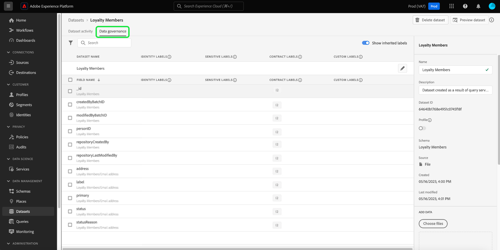

# Administración de etiquetas de uso de datos en la IU {#user-guide}

>[!CONTEXTUALHELP]
>id="platform_privacyConsole_dataGovernance_description"
>title="Gobernanza del uso de datos en Platform"
>abstract="<h2>Descripción</h2>
El marco de trabajo de control de datos en Experience Platform le permite etiquetar atributos y esquemas según las restricciones de uso de datos y configurar políticas que identifiquen y respeten estas restricciones para acciones de marketing específicas.
"

Esta guía del usuario describe los pasos para trabajar con etiquetas de uso de datos en [!DNL Experience Platform] interfaz de usuario.

## Administrar etiquetas {#manage-labels}

Para aplicar etiquetas a los datos, necesita el **[!UICONTROL Administrar etiquetas de uso]** Permiso de uso en la zona protegida de producción. Para crear una etiqueta personalizada, también debe tener derechos administrativos en el perfil del producto. Cada organización solo tiene una lista de etiquetas aplicables y, actualmente, no se admite la eliminación de etiquetas.

Consulte la guía sobre cómo [configuración de permisos](https://experienceleague.adobe.com/docs/platform-learn/getting-started-for-data-architects-and-data-engineers/configure-permissions.html) o el [información general de control de acceso](../../access-control/home.md) para obtener más información sobre cómo asignar un permiso. Si no tiene acceso al Admin Console de su organización, póngase en contacto con el administrador de la organización.

## Administrar etiquetas en el nivel de esquema

Puede agregar etiquetas directamente a un esquema o campos dentro de ese esquema. Cualquier campo aplicado en el nivel de esquema se propagará a todos los conjuntos de datos basados en ese esquema.

Para administrar etiquetas de uso de datos en el nivel de esquema, debe seleccionar un esquema existente o crear uno nuevo. Después de iniciar sesión en Adobe Experience Platform, seleccione **[!UICONTROL Esquemas]** en el panel de navegación izquierdo para abrir **[!UICONTROL Esquemas]** workspace. Esta página lista todos los esquemas creados que pertenecen a su organización, junto con detalles útiles relacionados con cada esquema.

En la siguiente sección se proporcionan los pasos para crear un nuevo esquema al que aplicar etiquetas. Si desea editar las etiquetas para un esquema existente, seleccione el esquema en la lista y vaya directamente a [adición de etiquetas de uso de datos al esquema](#add-labels).

### Creación de un nuevo esquema

Para crear un nuevo esquema, seleccione **[!UICONTROL Crear esquema]** en la esquina superior derecha de la **[!UICONTROL Esquemas]** workspace. Consulte la guía de [Cómo crear un esquema con el Editor de esquemas](../../xdm/tutorials/create-schema-ui.md#create) para obtener instrucciones completas. Como alternativa, puede [crear un esquema con la API de Registro de esquemas](../../xdm/tutorials/create-schema-api.md) si es necesario.

### Añadir etiquetas de uso de datos a un esquema {#add-labels-to-schema}

Después de crear un nuevo esquema o seleccionar un esquema existente de la lista en la [!UICONTROL Examinar] de la pestaña [!UICONTROL Esquemas] En Workspace, seleccione un campo del esquema en el Editor de esquemas. En el [!UICONTROL Propiedades del campo] barra lateral, seleccione **[!UICONTROL Aplicar etiquetas de acceso y de gobernanza de datos]**.

Aparece un cuadro de diálogo que le permite aplicar y administrar etiquetas de uso de datos en el nivel de esquema y en el nivel de campo. Consulte el tutorial XDM para obtener instrucciones completas sobre [Adición o edición de etiquetas de uso de datos para esquemas XDM](../../xdm/tutorials/labels.md#select-schema-field).

### Añadir etiquetas de uso de datos a un conjunto de datos específico {#add-labels-to-dataset}

>[!CONTEXTUALHELP]
>id="platform_privacyConsole_dataGovernance_instructions"
>title="Instrucciones"
>abstract="<ol><li>Seleccione <a href="https://experienceleague.adobe.com/docs/experience-platform/data-governance/labels/user-guide.html?lang=es">Conjuntos de datos</a> en la navegación de la izquierda y el conjunto de datos cuyos datos desee restringir.</li><li>En la vista de detalles del conjunto de datos, seleccione la pestaña <b>Gobernanza de datos</b>.</li><li>Seleccione los campos del conjunto de datos que desea limitar y, a continuación, <b>Editar etiquetas de gobernanza</b> para etiquetar los datos según las restricciones de uso.</li><li>Después de etiquetar los datos, seleccione <a href="https://experienceleague.adobe.com/docs/experience-platform/data-governance/policies/overview.html?lang=es">Directivas</a> en la navegación izquierda y <b>Crear directiva</b>.</li><li>Elija crear una <a href="https://experienceleague.adobe.com/docs/experience-platform/data-governance/policies/user-guide.html?lang=es#create-governance-policy">Directiva de gobernanza de datos</a> y, a continuación, las etiquetas de uso de datos que le aplicará.</li><li>Seleccione las acciones de marketing que denegará la directiva para los datos que contengan esas etiquetas. Una vez creada la directiva, selecciónela en la lista y habilítela con el botón de alternancia del carril derecho.</li><li>Para cada directiva habilitada, Platform evita que los datos que contienen las etiquetas especificadas se utilicen para las acciones de marketing definidas. Esta aplicación tiene lugar automáticamente cuando intenta activar datos etiquetados en un destino con acciones de marketing asociadas (casos de uso).</li></ol>"

>[!IMPORTANT]
>
>Las etiquetas ya no se pueden aplicar a campos de nivel de conjunto de datos. Este flujo de trabajo ha quedado obsoleto y favorece la aplicación de etiquetas en el nivel de esquema. Cualquier etiqueta aplicada anteriormente en el nivel de objeto del conjunto de datos seguirá siendo compatible mediante la IU de Platform hasta el 31 de mayo de 2024. Para garantizar que las etiquetas sean coherentes en todos los esquemas, cualquier etiqueta adjunta anteriormente a campos de nivel de conjunto de datos debe migrarse al nivel de esquema durante el próximo año. Consulte la documentación para obtener instrucciones sobre [cómo migrar etiquetas aplicadas anteriormente del conjunto de datos al nivel de esquema](../e2e.md#migrate-labels).

Las etiquetas se pueden aplicar a todo el conjunto de datos desde el **[!UICONTROL Gobernanza de datos]** de la pestaña **[!UICONTROL Conjuntos de datos]** workspace. El espacio de trabajo le permite administrar etiquetas de uso de datos en el nivel de conjunto de datos.

![El [!UICONTROL Gobernanza de datos] de la pestaña [!UICONTROL Conjuntos de datos] espacio de trabajo con Gobernanza de datos resaltado.](../images/labels/dataset-governance.png)

Para editar las etiquetas de uso de datos en el nivel de conjunto de datos, comience seleccionando el icono de lápiz () en la fila del nombre del conjunto de datos.

![El [!UICONTROL Gobernanza de datos] de la pestaña [!UICONTROL Conjuntos de datos] workspace con el icono de lápiz de edición resaltado.](../images/labels/dataset-level-edit.png)

El **[!UICONTROL Editar etiquetas de gobernanza]** se abre. En el cuadro de diálogo, marque las casillas junto a las etiquetas que desee aplicar al conjunto de datos. Recuerde que todos los campos del conjunto de datos heredarán estas etiquetas. El **[!UICONTROL Etiquetas aplicadas]** el encabezado se actualiza a medida que marca cada casilla y muestra las etiquetas que ha elegido. Una vez seleccionadas las etiquetas deseadas, seleccione **[!UICONTROL Guardar cambios]**.

El **[!UICONTROL Gobernanza de datos]** workspace vuelve a aparecer y muestra las etiquetas que ha aplicado en el nivel de conjunto de datos en la fila inicial de la tabla. También puede ver las etiquetas, indicadas por tarjetas individuales, que se heredan hasta cada uno de los campos dentro del conjunto de datos.

![El [!UICONTROL Gobernanza de datos] de la pestaña [!UICONTROL Conjuntos de datos] espacio de trabajo con etiquetas de nivel de conjunto de datos aplicadas y etiquetas de campo de conjunto de datos heredadas resaltadas.](../images/labels/applied-dataset-labels.png)

### Eliminación de etiquetas de un conjunto de datos {#remove-labels-from-a-dataset}

Las etiquetas agregadas en el nivel del conjunto de datos tienen una &quot;x&quot; junto a su tarjeta. Esto le permite eliminar las etiquetas de todo el conjunto de datos. Las etiquetas heredadas junto a cada campo no tienen una &quot;x&quot; junto a ellas y aparecen &quot;atenuadas&quot;. Estos **las etiquetas heredadas son de solo lectura**, lo que significa que no se pueden eliminar ni editar en el nivel de campo.

<!-- ## View labels at the dataset field level {#view-labels-at-dataset-field-level} -->

<!-- To view labels inherited by the dataset from the schema level, select **[!UICONTROL Datasets]** to navigate to the datasets workspace and select the relevant dataset from the list. 

Next, select the **[!UICONTROL Data Governance]** tab to show the labels that have been applied to the dataset. You can also see that the labels are inherited down to each of the fields within the dataset.

The inherited labels beside each field do not have an "x" next to them and appear "greyed out" with no ability to remove or edit. This is because **inherited fields are read-only**, meaning they cannot be removed at the field level. -->

<!--Beleive can cut above here  -->

El **[!UICONTROL Mostrar etiquetas heredadas]** Esta opción está activada de forma predeterminada, lo que le permite ver cualquier etiqueta heredada desde el esquema a sus campos. Al desactivar, se ocultan las etiquetas heredadas dentro del conjunto de datos.

<!-- Labels applied to the dataset appear in read-only form within the **[!UICONTROL Data Governance]** view for that dataset. 

 -->

>[!NOTE]
>
>Las etiquetas que se aplicaban antes de que la función de etiquetado de conjuntos de datos quedara obsoleta se pueden eliminar del conjunto de datos buscando el conjunto de datos correspondiente y seleccionando el icono Cancelar de la etiqueta.
>
>Consulte la documentación para obtener instrucciones sobre [cómo migrar etiquetas aplicadas anteriormente del conjunto de datos al nivel de esquema](../e2e.md#migrate-labels).

## Administrar etiquetas personalizadas {#manage-custom-labels}

>[!CONTEXTUALHELP]
>id="platform_governance_createlabels"
>title="Creación de etiquetas"
>abstract="Las etiquetas permiten clasificar los conjuntos de datos y campos según las directivas de uso que se aplican a esos datos. Platform proporciona un conjunto estándar de etiquetas para su uso, pero también puede crear etiquetas personalizadas específicas de su organización."

Puede crear sus propias etiquetas de uso personalizadas dentro de la variable **[!UICONTROL Políticas]** workspace en [!DNL Experience Platform] IU. Seleccionar **[!UICONTROL Políticas]** en el panel de navegación izquierdo, seleccione **[!UICONTROL Etiquetas]** para ver una lista de etiquetas existentes. Desde aquí, seleccione **[!UICONTROL Crear etiqueta]**.

El **[!UICONTROL Crear etiqueta]** aparece el cuadro de diálogo. A partir de aquí, proporcione la siguiente información para la nueva etiqueta:

* **[!UICONTROL Nombre]**: Un identificador único para la etiqueta. Este valor se utiliza con fines de búsqueda y, por lo tanto, debe ser corto y conciso.
* **[!UICONTROL Nombre descriptivo]**: Un nombre para mostrar descriptivo para la etiqueta.
* **[!UICONTROL Descripción]**: (Opcional) Una descripción de la etiqueta para proporcionar un contexto adicional.

Cuando termine, seleccione **[!UICONTROL Crear]**.

El cuadro de diálogo se cierra y la etiqueta personalizada recién creada aparece en la lista debajo de **[!UICONTROL Etiquetas]** pestaña.

La etiqueta ahora se puede seleccionar en **[!UICONTROL Etiquetas personalizadas]** al editar etiquetas de uso para conjuntos de datos y campos, o al crear políticas de uso de datos.

## Pasos siguientes

Ahora que ha agregado etiquetas de uso de datos en el conjunto de datos y nivel de campo, puede empezar a introducir datos en [!DNL Experience Platform]. Para obtener más información, comience leyendo el [documentación de ingesta de datos](../../ingestion/home.md).

Ahora también puede definir políticas de uso de datos basadas en las etiquetas aplicadas. Para obtener más información, consulte la [información general sobre políticas de uso de datos](../policies/overview.md).

<!-- The workflow of this video is now outdated. This can be enabled once the video has been updated

## Additional resources

The following video is intended to support your understanding of Data Governance, and outlines how to apply labels to a dataset and individual fields.

>[!VIDEO](https://video.tv.adobe.com/v/29709?quality=12&enable10seconds=on&speedcontrol=on) -->
