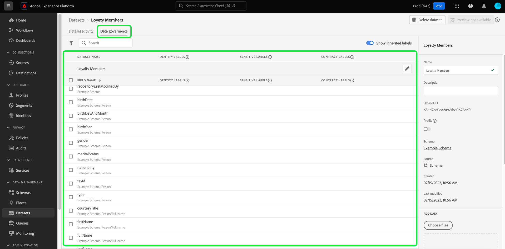

# Administrar etiquetas de uso de datos en la interfaz de usuario

Esta guía del usuario describe los pasos para trabajar con etiquetas de uso de datos en la interfaz de usuario [!DNL Experience Platform]. Antes de utilizar la guía, consulte [[!DNL Data Governance] overview](../home.md) para obtener una introducción más sólida al marco [!DNL Data Governance].

## Administrar etiquetas en el nivel de conjunto de datos

Para administrar las etiquetas de uso de datos en el nivel de conjunto de datos, debe seleccionar un conjunto de datos existente o crear uno nuevo. Después de iniciar sesión en Adobe Experience Platform, seleccione **[!UICONTROL Datasets]** en el panel de navegación izquierdo para abrir el espacio de trabajo **[!UICONTROL Datasets]**. Esta página enumera todos los conjuntos de datos creados que pertenecen a su organización, junto con detalles útiles relacionados con cada conjunto de datos.

En la siguiente sección se proporcionan los pasos para crear un nuevo conjunto de datos al que aplicar etiquetas. Si desea editar las etiquetas de un conjunto de datos existente, seleccione el conjunto de datos de la lista y avance [agregando etiquetas de uso de datos al conjunto de datos](#add-labels).

### Crear un nuevo conjunto de datos

>[!NOTE]
>
>En este ejemplo, se crea un conjunto de datos con un esquema preconfigurado [!DNL Experience Data Model] (XDM). Para obtener más información sobre los esquemas XDM, consulte [Información general del sistema XDM](../../xdm/home.md) y [conceptos básicos de la composición del esquema](../../xdm/schema/composition.md).

Para crear un nuevo conjunto de datos, seleccione **[!UICONTROL Crear conjunto de datos]** en la esquina superior derecha del espacio de trabajo **[!UICONTROL Conjuntos de datos]**.

Aparece la pantalla **[!UICONTROL Crear conjunto de datos]**. Desde aquí, seleccione **[!UICONTROL Crear conjunto de datos desde esquema]**.

Aparece la pantalla **[!UICONTROL Seleccionar esquema]**, que enumera todos los esquemas disponibles que puede utilizar para crear un conjunto de datos. Seleccione el botón de opción situado junto a un esquema para seleccionarlo. La sección **[!UICONTROL Esquemas]** del lado derecho muestra detalles adicionales sobre el esquema seleccionado. Una vez que haya seleccionado un esquema, seleccione **[!UICONTROL Next]**.

Aparece la pantalla **[!UICONTROL Configurar conjunto de datos]**. Proporcione un nombre (obligatorio) y una descripción (opcional, pero recomendada) para el nuevo conjunto de datos y, a continuación, seleccione **[!UICONTROL Finish]**.

Aparece la página **[!UICONTROL Actividad del conjunto de datos]**, que muestra información sobre el conjunto de datos recién creado. En este ejemplo, el conjunto de datos se llama &quot;Miembros de lealtad&quot;, por lo que la navegación superior muestra **Conjuntos de datos > Miembros de lealtad**.

### Agregar etiquetas de uso de datos al conjunto de datos {#add-labels}

Después de crear un conjunto de datos nuevo o de seleccionar un conjunto de datos existente de la lista en el espacio de trabajo **[!UICONTROL Datasets]** , seleccione **[!UICONTROL Control de datos]** para abrir el espacio de trabajo **[!UICONTROL Administración de datos]** . El espacio de trabajo le permite administrar etiquetas de uso de datos en el nivel de conjunto de datos y en el nivel de campo.

Para editar las etiquetas de uso de datos en el nivel de conjunto de datos, comience seleccionando el icono de lápiz junto al nombre del conjunto de datos.

Se abre el cuadro de diálogo **[!UICONTROL Editar etiquetas de control]**. Dentro del cuadro de diálogo, marque las casillas junto a las etiquetas que desee aplicar al conjunto de datos. Recuerde que estas etiquetas serán heredadas por todos los campos dentro del conjunto de datos. El encabezado **[!UICONTROL Etiquetas aplicadas]** se actualiza conforme marca cada casilla y muestra las etiquetas seleccionadas. Una vez seleccionadas las etiquetas deseadas, seleccione **[!UICONTROL Guardar cambios]**.

El espacio de trabajo **[!UICONTROL Administración de datos]** vuelve a aparecer y muestra las etiquetas que ha aplicado en el nivel de conjunto de datos. También puede ver que las etiquetas se heredan de cada uno de los campos dentro del conjunto de datos.

Observe que aparece una &quot;x&quot; junto a las etiquetas en el nivel de conjunto de datos, lo que le permite eliminar las etiquetas. Las etiquetas heredadas junto a cada campo no tienen una &quot;x&quot; junto a ellas y aparecen &quot;atenuadas&quot; sin posibilidad de eliminarlas o editarlas. Esto se debe a que **los campos heredados son de solo lectura**, lo que significa que no se pueden eliminar en el nivel de campo.

La opción **[!UICONTROL Mostrar etiquetas heredadas]** está activada de forma predeterminada, lo que permite ver las etiquetas heredadas del conjunto de datos a sus campos. Si desactiva la opción , se ocultarán todas las etiquetas heredadas del conjunto de datos.

## Administrar etiquetas en el nivel de campo

Continuando con el flujo de trabajo para [agregar y editar etiquetas de uso de datos en el nivel de conjunto de datos](#add-labels), también puede administrar etiquetas a nivel de campo dentro del espacio de trabajo **[!UICONTROL Administración de datos]** para ese conjunto de datos.

Para aplicar etiquetas de uso de datos a un campo individual, active la casilla que hay junto al nombre del campo y, a continuación, seleccione **[!UICONTROL Editar etiquetas de administración]**.

Aparece el cuadro de diálogo **[!UICONTROL Editar etiquetas de control]**. El cuadro de diálogo muestra los encabezados que muestran los campos seleccionados, las etiquetas aplicadas y las etiquetas heredadas. Observe que las etiquetas heredadas (C2 y C5) aparecen atenuadas en el cuadro de diálogo. Son etiquetas de solo lectura heredadas del nivel de conjunto de datos y, por lo tanto, solo se pueden editar en el nivel de conjunto de datos.

Para seleccionar etiquetas de nivel de campo, seleccione la casilla que hay junto a cada etiqueta que desee utilizar. Al seleccionar etiquetas, el encabezado **[!UICONTROL Etiquetas aplicadas]** se actualiza para mostrar las etiquetas aplicadas a los campos mostrados en el encabezado **[!UICONTROL Campos seleccionados]**. Cuando haya terminado de seleccionar etiquetas de nivel de campo, seleccione **[!UICONTROL Guardar cambios]**.

El espacio de trabajo **[!UICONTROL Control de datos]** vuelve a aparecer, y ahora muestra las etiquetas de nivel de campo seleccionadas en la fila junto al nombre del campo. Observe que la etiqueta de nivel de campo tiene una &quot;x&quot; junto a ella, lo que le permite eliminar la etiqueta.

Puede repetir estos pasos para seguir añadiendo y editando etiquetas de campo para campos adicionales, incluida la selección de varios campos para aplicar etiquetas de nivel de campo simultáneamente.

Es importante recordar que la herencia se desplaza solo del nivel superior hacia abajo (conjunto de datos → campos), lo que significa que las etiquetas aplicadas en el nivel de campo no se propagan a otros campos o conjuntos de datos.

## Administrar etiquetas personalizadas

Puede crear sus propias etiquetas de uso personalizadas en el espacio de trabajo **[!UICONTROL Directivas]** en la interfaz de usuario [!DNL Experience Platform]. Seleccione **[!UICONTROL Directivas]** en el panel de navegación izquierdo y, a continuación, seleccione **[!UICONTROL Etiquetas]** para ver una lista de etiquetas existentes. Desde aquí, seleccione **[!UICONTROL Crear etiqueta]**.

Aparece el cuadro de diálogo **[!UICONTROL Crear etiqueta]**. A partir de aquí, proporcione la siguiente información para la nueva etiqueta:

* **[!UICONTROL Identificador]**: Identificador único de la etiqueta. Este valor se utiliza con fines de búsqueda y, por lo tanto, debe ser corto y conciso.
* **[!UICONTROL Nombre]**: Un nombre descriptivo para la etiqueta.
* **[!UICONTROL Descripción]**: (Opcional) Una descripción de la etiqueta para proporcionar un contexto adicional.

Cuando termine, seleccione **[!UICONTROL Crear]**.

El cuadro de diálogo se cierra y la etiqueta personalizada recién creada aparece en la lista de la pestaña **[!UICONTROL Etiquetas]**.

La etiqueta ahora se puede seleccionar en **[!UICONTROL Etiquetas personalizadas]** al editar etiquetas de uso para conjuntos de datos y campos, o al crear políticas de uso de datos.

 

## Pasos siguientes

Ahora que ha agregado etiquetas de uso de datos en el conjunto de datos y en el nivel de campo, puede empezar a introducir datos en [!DNL Experience Platform]. Para obtener más información, comience leyendo la [documentación sobre ingesta de datos](../../ingestion/home.md).

Ahora también puede definir políticas de uso de datos basadas en las etiquetas aplicadas. Para obtener más información, consulte la [descripción general de las políticas de uso de datos](../policies/overview.md).

## Recursos adicionales

El siguiente vídeo está diseñado para admitir su comprensión de [!DNL Data Governance] y describe cómo aplicar etiquetas a un conjunto de datos y a campos individuales.

>[!VIDEO](https://video.tv.adobe.com/v/29709?quality=12&enable10seconds=on&speedcontrol=on)
