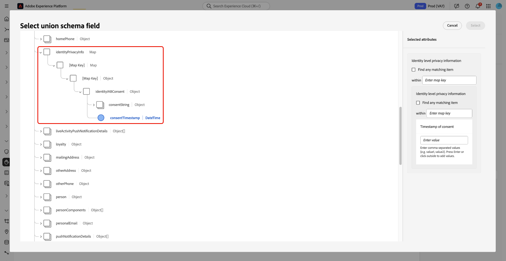

# Referencia de creación de reglas de política de consentimiento

Utilice esta referencia en la lógica de regla avanzada para establecer reglas precisas y legalmente válidas en la cláusula **[!UICONTROL Then]** del Creador de directivas de consentimiento en Adobe Experience Platform.

![La interfaz del generador de directivas de consentimiento que resalta la sección de cláusula [!UICONTROL Then], donde los usuarios definen las condiciones de regla.](../images/policies/multiple-rules.png)

Descubra cómo se aplican las reglas de política a la estructura y los tipos de los datos de consentimiento para aplicar con precisión las preferencias de consentimiento de los clientes.

Lea este documento para aprender a filtrar perfiles basados en el consentimiento navegando hasta los campos de contenedor del esquema XDM y seleccionando un campo primitivo. A continuación, utilice el operador adecuado para definir el valor exacto que debe coincidir con un perfil.

## Requisitos previos

Antes de usar esta referencia, asegúrese de que la configuración de la directiva de consentimiento esté completa y de que comprende los conceptos básicos de la arquitectura de datos y el marco de trabajo de gobernanza de Adobe Experience Platform.

Asegúrese de cumplir los siguientes requisitos previos:

* **Configuración de directiva completada**: ha creado o comenzado a crear una directiva de consentimiento en la interfaz de usuario de Adobe Experience Platform. Para ver los pasos detallados, consulte la [guía del usuario sobre directivas de uso de datos](user-guide.md#consent-policy).

* **Familiaridad con las estructuras de datos**: esta referencia requiere conocimientos prácticos de los siguientes conceptos principales:
   * **XDM y esquema de unión**: comprenda cómo las estructuras del modelo de datos de Experience definen las relaciones de datos y cómo el esquema de unión representa los perfiles unificados de clientes. Consulte la [descripción general del sistema XDM](../../xdm/home.md) para obtener más información.
   * **Marco de control de datos**: Descubra cómo Adobe Experience Platform aplica las políticas de uso de datos y las reglas de control. Consulte la [descripción general de control de datos](../home.md) para obtener detalles.
   * **Procesamiento de consentimiento del cliente**: comprenda cómo se recopilan, almacenan y aplican los datos de consentimiento dentro de los flujos de trabajo de experiencia del cliente. Consulte la [descripción general del procesamiento de consentimiento](../../landing/governance-privacy-security/consent/adobe/overview.md).

## Conceptos principales: campos primitivos y de contenedor

Lea esta sección para conocer cómo las reglas de política de consentimiento utilizan diferentes tipos de campo en esquemas XDM. Comprender la distinción entre campos primitivos y contenedores ayuda a seleccionar el campo y el operador correctos al definir las condiciones de la directiva.

### Tipos de campo y lógica de regla admitidos

Las políticas de consentimiento admiten varios tipos de campos, cada uno con operadores específicos para crear condiciones de regla. Los tipos de campo se agrupan en dos categorías: **tipos de contenedor** y **tipos primitivos**.

### Tipos de contenedor (navegación de esquema)

Los tipos de contenedor organizan los datos de consentimiento, pero no se pueden utilizar directamente en las condiciones de la directiva. Sirven como rutas de navegación para llegar a los campos primitivos que contienen valores reales.

| Tipo de contenedor | Descripción |
|----------------|-------------|
| **Objeto** | Un contenedor con un esquema fijo que contiene varios campos de diferentes tipos. |
| **Matriz** | Un contenedor que contiene varios valores del mismo tipo. |
| **Mapa** | Contenedor con claves dinámicas que puede contener objetos u otros tipos de campos. |

>[!IMPORTANT]
>
>Los campos de contenedor no se pueden seleccionar directamente en las condiciones de la directiva de consentimiento. Debe navegar a contenedores para seleccionar **campos primitivos** (como cadena, número o booleano) para la generación de reglas. Los operadores de contenedor solo se utilizan para la navegación de esquema, no para establecer condiciones de directiva.

### Tipos primitivos (condiciones de regla)

Los campos primitivos contienen los valores de datos de consentimiento reales (por ejemplo, `true` o `"weekly"`) y son los únicos tipos de campo que se pueden usar para definir condiciones de directiva.

La siguiente tabla describe cada tipo primitivo admitido y los operadores disponibles.

| Tipo primitivo | Operadores admitidos | Descripción |
|----------------|---------------------|-------------|
| **Cadena** | `is equal to`, `is not equal to`, `exists`, `does not exist` | Atributos de consentimiento basados en texto. |
| **Número** | `is equal to`, `is not equal to`, `is greater than`, `is less than`, `exists`, `does not exist` | Atributos numéricos de consentimiento. |
| **Booleano** | `is equal to`, `is not equal to` | Valores de consentimiento verdaderos o falsos. |
| **Fecha** | `is equal to`, `is not equal to`, `exists`, `does not exist` | Atributos de consentimiento basados en fecha. |


## Uso de estructuras de datos complejas

Lea esta sección para aprender a desplazarse por los contenedores anidados en el esquema de consentimiento para llegar a los campos primitivos. Presenta patrones de esquema comunes y explica cómo las estructuras más profundas permiten una lógica de consentimiento más granular.

### Gestión de estructuras de esquema anidadas y complejas

Los esquemas de consentimiento complejos suelen incluir estructuras de contenedor anidadas que admiten la administración de datos flexible y escalable. Dado que las reglas de directivas solo pueden hacer referencia a campos primitivos, debe desplazarse por las jerarquías de contenedores para llegar a los campos que se pueden utilizar en las condiciones de directiva de consentimiento. Un anidado más profundo permite una segmentación de reglas más granular y específica.

Los patrones de contenedor anidado comunes incluyen:

* **Mapa del mapa**: claves dinámicas que contienen otros mapas.
* **Mapa del objeto**: claves dinámicas que contienen objetos con esquemas fijos.
* **Matriz de mapa**: matrices que contienen mapas con claves dinámicas.
* **Matriz de objeto**: matrices que contienen objetos con esquemas fijos.
* **Objeto con propiedades de matriz o asignación**: objetos que incluyen campos de matriz o asignación.

### Ejemplo de estructura de campo

La siguiente estructura sirve como referencia visual para los ejemplos de reglas a lo largo de esta guía.

```
consent.marketing (Object)
├── email (Boolean)
├── sms (Boolean)
├── preferences (Map with dynamic keys)
│   ├── "email_preferences" (Object)
│   │   ├── frequency (String)
│   │   └── channels (Array of Strings)
│   ├── "sms_preferences" (Object)
│   │   ├── frequency (String)
│   │   └── opt_in_time (Date)
│   └── "push_preferences" (Object)
│       ├── frequency (String)
│       └── categories (Array of Strings)
└── lastUpdated (Date)
```

## Generación avanzada de reglas por tipo de campo

Lea esta sección para obtener instrucciones detalladas sobre la creación de reglas de política de consentimiento basadas en el tipo de campo. Aprenderá a configurar la lógica de reglas para booleanos, mapas, objetos y matrices para capturar condiciones de consentimiento precisas.

### Componentes y pasos de creación de reglas

La creación de reglas de política de consentimiento efectivas requiere comprender cómo navegar por la estructura de esquema y aplicar los operadores correctos para cada tipo de campo. Cada regla sigue el mismo enfoque básico: vaya a un campo primitivo, seleccione el operador adecuado y defina la condición que debe cumplirse.

Siga estos pasos para crear una regla:

1. **Seleccionar un campo**: navegue por los campos de contenedor para llegar a un campo primitivo.
2. **Elegir un operador**: seleccione el operador admitido por el tipo de campo.
   
3. **Establecer un valor** - Defina el valor o condición que debe coincidir.
4. **Coincidir claves de asignación**: elija si desea establecer como destino una clave específica o una coincidencia en todas las claves de un mapa.
5. **Agregar condiciones** - Combine varias reglas usando la lógica AND u OR según sea necesario.

### Uso de campos booleanos (lógica de consentimiento implícita)

Los campos booleanos almacenan valores de consentimiento verdaderos o falsos y representan los atributos de consentimiento más comunes. El operador `is not equal to` le permite incluir perfiles que no se han excluido explícitamente, lo que admite escenarios de consentimiento implícitos.

**Operadores booleanos y resultados**

| Operador | Valor | Resultado |
|----------|-------|--------|
| `is equal to` | `true` | Incluye perfiles con consentimiento explícito (`true`). |
| `is equal to` | `false` | Incluye perfiles con exclusión explícita (`false`). |
| `is not equal to` | `true` | Incluye perfiles sin consentimiento explícito (`false` o que faltan). |
| `is not equal to` | `false` | Incluye perfiles que no se han excluido explícitamente (`true` o que faltan). |

**Ejemplo: consentimiento implícito de correo electrónico**

```
Field: consent.marketing.email (boolean)
Operator: is not equal to
Value: false
Result: Includes profiles who have not explicitly opted out of email marketing (includes both true and missing/null values).
```

### Trabajo con campos de asignación (preferencias dinámicas)

Los campos de asignación almacenan pares de clave-valor con claves dinámicas, a diferencia de los objetos que tienen esquemas fijos. Los mapas se utilizan a menudo en centros de preferencias donde se pueden añadir nuevas categorías sin actualizaciones de esquema. Puede segmentar claves específicas o utilizar la coincidencia de caracteres comodín en todas las claves.

**Coincidencia de clave específica**

Utilice este método para dirigirse a una categoría de preferencias específica.

```
Field: consent.preferences["email_preferences"].frequency (string) - navigated to from the map container
Operator: is equal to
Value: "weekly"
Result: Includes profiles who set the email frequency to weekly (for the "email_preferences" key)
```

**Cualquier clave que coincida**

Utilice la opción de casilla de verificación &quot;**[!UICONTROL find any matching item]**&quot; para hacer coincidir todas las claves dinámicas de un mapa.


```
Field: consent.preferences.*.frequency (string)
Operator: is equal to
Value: "weekly"
Result: Includes profiles who set frequency to weekly in ANY preference category (for example, email_preferences, sms_preferences, or push_preferences)
```

### Trabajo con campos de objeto (navegación fija)

Los campos de objeto actúan como contenedores con esquemas fijos. Solo se utilizan para la navegación y no se puede hacer referencia a ellos directamente en las condiciones de la directiva.

**Ejemplo de navegación**

```
consent.marketing (object) → consent.marketing.email (boolean)
```

**Ejemplo de caso de uso:**

```
Field: consent.marketing.email (Boolean) - navigated to from the object
Operator: is equal to
Value: true
Result: Include profiles who have explicitly consented to marketing emails
```


### Trabajo con campos de matriz (varios valores)

Los campos de matriz contienen varios valores del mismo tipo y requieren un control diferente en función de si almacenan objetos o primitivos. Las opciones de navegación y operador varían según el tipo de matriz.

**Matriz de ejemplos primitivos**

Utilice el operador `contains` para identificar perfiles basados en valores específicos dentro de una matriz.

```
Field: consent.communication_channels (array of strings)
Operator: contains
Value: "email"
Result: Include profiles who have consented to email communication
```

**Ejemplo de matriz de objetos**

Navegue hasta la matriz para acceder a campos primitivos dentro de objetos anidados.

```
Field: consent.preferences["email_preferences"].categories[].type - navigated to from the array
Operator: is equal to
Value: "promotional"
Result: Include profiles where any email category is "promotional"
```

## Combinación de reglas con lógica compleja

En esta sección se explica cómo combinar varias condiciones de regla mediante la lógica AND u OR. Aprenderá cómo los operadores lógicos trabajan juntos para definir políticas de consentimiento avanzadas con varias condiciones.

### Combinación de varias condiciones (lógica AND u OR)

Puede combinar varias condiciones de regla utilizando la lógica AND u OR para crear políticas de consentimiento más sofisticadas destinadas a segmentos de perfil específicos.\
La lógica **AND** requiere que todas las condiciones sean verdaderas, lo que produce coincidencias de audiencia más reducidas.\
La lógica **OR** permite que cualquier condición sea verdadera, lo que expande el alcance de la audiencia.

En la interfaz de directiva de consentimiento, utilice el selector de lógica que aparece entre las condiciones de regla para cambiar entre la lógica AND y OR.

### Ejemplo de regla compleja general

El siguiente ejemplo combina el estado de consentimiento básico con la frecuencia de preferencia para crear un segmento de destino.

```
Field: consent.marketing.email
Operator: is equal to true
AND
Field: consent.preferences.frequency
Operator: is not equal to "daily"
Result: Include profiles who consent to email marketing but not to a daily frequency
```

### Lógica avanzada para matrices de objetos

Al combinar condiciones dentro de matrices de objetos, el comportamiento depende de si utiliza la lógica AND u OR entre las condiciones.

**Ejemplo: matriz de objetos con condiciones AND**

Use la lógica AND cuando todas las condiciones deban aplicarse al elemento de matriz *same*.

```
Field: consent.preferences["email_preferences"].categories[].enabled (boolean)
Operator: is equal to
Value: true
AND
Field: consent.preferences["email_preferences"].categories[].type (string)
Operator: is equal to
Value: "promotional"
Result: Includes profiles where the same category entry has both enabled=true and type="promotional".
Note: AND conditions apply to the same array entry. Using OR logic would include profiles if any array entry matches any of the conditions.
```

>[!TIP]
>
>**Prácticas recomendadas para la lógica AND**
>
>Tenga en cuenta estos comportamientos clave al crear condiciones de matriz basadas en AND:
>
>* Use la lógica AND cuando todas las condiciones deban aplicarse al **mismo elemento de matriz**.
>* Recuerde que Y crea un objetivo restrictivo (menos perfiles coincidirán).
>* No espere que la lógica AND coincida en varias entradas de matriz; se aplica dentro de cada entrada.
>* Evite utilizar la lógica AND cuando necesite una coincidencia flexible entre las entradas.

>[!IMPORTANT]
>
>Con la lógica AND, cada entrada de matriz debe satisfacer todas las condiciones especificadas a la vez. Este comportamiento es ideal cuando necesita hacer coincidir atributos combinados, como categorías que están habilitadas y son promocionales.

>[!NOTE]
>
>La lógica AND se aplica a la misma entrada de matriz **solo para matrices de objetos.**\
>Para matrices de valores primitivos, la lógica AND se evalúa en el nivel de campo en toda la matriz.

**Ejemplo: matriz de objetos con condiciones OR**

Utilice la lógica OR para crear coincidencias de audiencia inclusivas, permitiendo que cualquier condición sea verdadera en las entradas de la matriz.

```
Field: consent.preferences["email_preferences"].categories[].enabled (boolean)
Operator: is equal to
Value: true
OR
Field: consent.preferences["email_preferences"].categories[].type (string)
Operator: is equal to
Value: "newsletter"
Result: Includes profiles where any category entry has enabled=true or any entry has type="newsletter".
Note: OR logic allows matching across different array entries. One entry can meet the first condition while another meets the second.
```

### Próximos pasos

Después de crear y perfeccionar las reglas de directiva de consentimiento, utilice los siguientes recursos para finalizar la configuración, validar la aplicación de directivas y revisar los modelos de datos subyacentes.

* **Flujo de trabajo de creación de directivas**: Implemente las reglas definidas en la interfaz de usuario del generador de directivas con la [Guía de la interfaz de usuario de directivas de consentimiento](user-guide.md#consent-policy.md)
* **Evaluación y aplicación de directivas de consentimiento**: compruebe cómo la directiva habilitada afecta a la activación de audiencias y al uso de datos de perfil. Consulte la [Guía automática de aplicación de directivas](../enforcement/auto-enforcement.md) para obtener más información
* **Tipos de datos de consentimiento XDM**: haga referencia a las estructuras de esquema específicas y a las definiciones de campo para los atributos de consentimiento utilizados en las reglas de directiva. Consulte la guía de [Consentimientos XDM y preferencias de tipo de datos](../../xdm/data-types/consents.md).
