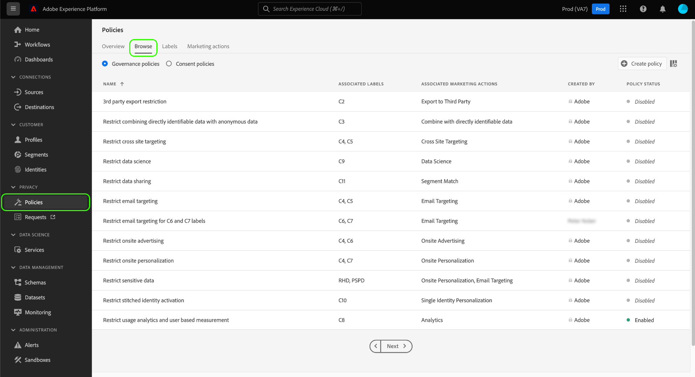
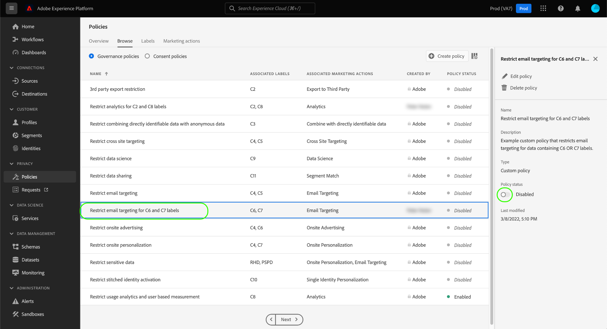
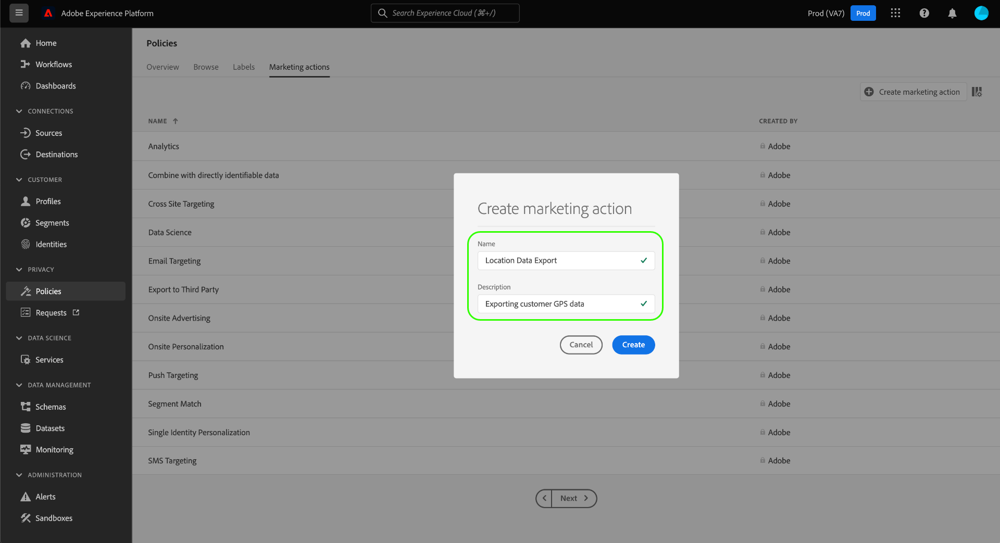

# Guía del usuario de directivas de uso de datos

Adobe Experience Platform [!DNL Data Governance] proporciona una interfaz de usuario que le permite crear y administrar políticas de uso de datos. Este documento proporciona información general sobre las acciones que puede realizar en el espacio de trabajo **Directivas** de la interfaz de [!DNL Experience Platform] usuario.

>[!IMPORTANT]
>
>Todas las directivas de uso de datos (incluidas las directivas principales proporcionadas por Adobe) están deshabilitadas de forma predeterminada. Para que una política individual se considere para su aplicación, debe habilitarla manualmente. Consulte la sección sobre la [activación de políticas](#enable) para ver los pasos sobre cómo hacerlo en la interfaz de usuario.

## Requisitos previos 

Esta guía requiere una comprensión práctica de los siguientes [!DNL Experience Platform] conceptos:

- [[!DNL Data Governance]](../home.md)
- [Directivas de uso de datos](./overview.md)

## Directivas de uso de datos de vista {#view-policies}

En la [!DNL Experience Platform] interfaz de usuario, haga clic en **[!UICONTROL Directivas]** para abrir el espacio de trabajo **[!UICONTROL Directivas]** . En la ficha **[!UICONTROL Examinar]** , puede ver una lista de las directivas disponibles, incluidas las etiquetas asociadas, las acciones de marketing y el estado.

Haga clic en una directiva de la lista para vista de su descripción y tipo. Si se selecciona una directiva personalizada, se muestran controles adicionales para editar, eliminar o [habilitar/deshabilitar la directiva](#enable).

## Crear una directiva de uso de datos personalizada {#create-policy}

Para crear una nueva directiva de uso de datos personalizada, haga clic en **[!UICONTROL Crear directiva]** en la esquina superior derecha de la ficha **[!UICONTROL Examinar]** en el espacio de trabajo **[!UICONTROL Directivas]** .

Aparece el flujo de trabajo **[!UICONTROL Crear directiva]** . Inicio proporcionando un nombre y una descripción para la nueva directiva.

A continuación, seleccione las etiquetas de uso de datos en las que se basará la directiva. Al seleccionar varias etiquetas, se le da la opción de elegir si los datos deben contener todas las etiquetas o sólo una de ellas para que la política se aplique. Haga clic en **[!UICONTROL Siguiente]** cuando termine.

Aparece el paso **[!UICONTROL Seleccionar acciones]** de mercadotecnia. Elija las acciones de mercadotecnia correspondientes en la lista proporcionada y haga clic en **[!UICONTROL Siguiente]** para continuar.

>[!NOTE]
>
>Al seleccionar varias acciones de marketing, la política las interpreta como una regla &quot;O&quot;. En otras palabras, la política se aplica si se realiza **cualquiera** de las acciones de marketing seleccionadas.

Aparece el paso **[!UICONTROL Revisar]** , que le permite revisar los detalles de la nueva directiva antes de crearla. Una vez que esté satisfecho, haga clic en **[!UICONTROL Finalizar]** para crear la directiva.

Vuelve a aparecer la ficha **[!UICONTROL Examinar]** , que ahora lista la directiva recién creada con el estado &quot;Borrador&quot;. Para habilitar la directiva, consulte la siguiente sección.

## Habilitar o deshabilitar una directiva de uso de datos {#enable}

Todas las directivas de uso de datos (incluidas las directivas principales proporcionadas por Adobe) están deshabilitadas de forma predeterminada. Para que una política individual se considere para su aplicación, debe habilitarla manualmente a través de la API o la interfaz de usuario.

Puede habilitar o deshabilitar las directivas desde la ficha **[!UICONTROL Examinar]** del espacio de trabajo **[!UICONTROL Directivas]** . Seleccione una directiva personalizada de la lista para mostrar sus detalles a la derecha. En **[!UICONTROL Estado]**, seleccione el botón de alternancia para habilitar o deshabilitar la directiva.

## Acciones de mercadotecnia de vista {#view-marketing-actions}

En el espacio de trabajo **[!UICONTROL Directivas]** , seleccione la ficha Acciones **[!UICONTROL de]** marketing para la vista de una lista de acciones de marketing disponibles definidas por Adobe y su propia organización.

## Crear una acción de mercadotecnia {#create-marketing-action}

Para crear una nueva acción de mercadotecnia personalizada, haga clic en **[!UICONTROL Crear acción]** de mercadotecnia en la esquina superior derecha de la ficha Acciones **[!UICONTROL de]** mercadotecnia en el espacio de trabajo **[!UICONTROL Directivas]** .

Aparece el cuadro de diálogo **[!UICONTROL Crear acción]** de marketing. Escriba un nombre y una descripción para la acción de marketing y haga clic en **[!UICONTROL Crear]**.

La acción recién creada aparece en la ficha Acciones **[!UICONTROL de]** mercadotecnia. Ahora puede usar la acción de marketing al [crear nuevas directivas](#create-policy)de uso de datos.

## Editar o eliminar una acción de mercadotecnia {#edit-delete-marketing-action}

>[!NOTE]
>
>Solo se pueden editar las acciones de mercadotecnia personalizadas definidas por su organización. Las acciones de marketing definidas por Adobe no se pueden cambiar ni eliminar.

En el espacio de trabajo **[!UICONTROL Directivas]** , seleccione la ficha Acciones **[!UICONTROL de]** marketing para la vista de una lista de acciones de marketing disponibles definidas por Adobe y su propia organización. Seleccione una acción de marketing personalizada de la lista y, a continuación, utilice los campos proporcionados en la sección derecha para editar los detalles de la acción de marketing.

Si las directivas de uso existentes no están utilizando la acción de marketing, puede eliminarla haciendo clic en **[!UICONTROL Eliminar acción]** de marketing.

>[!NOTE]
>
>Si se intenta eliminar una acción de marketing que está utilizando una directiva existente, aparecerá un mensaje de error que indicará que el intento de eliminación ha fallado.

## Pasos siguientes

Este documento proporciona información general sobre cómo administrar las políticas de uso de datos en la [!DNL Experience Platform] interfaz de usuario. Para ver los pasos sobre cómo administrar las directivas mediante el uso de [!DNL Policy Service API], consulte la guía [para](../api/getting-started.md)desarrolladores. Para obtener información sobre cómo aplicar políticas de uso de datos, consulte la descripción general [de la aplicación de](../enforcement/overview.md)políticas.

En el siguiente vídeo se muestra cómo trabajar con las políticas de uso en la [!DNL Experience Platform] interfaz de usuario:

>[!VIDEO](https://video.tv.adobe.com/v/32977?quality=12&learn=on)