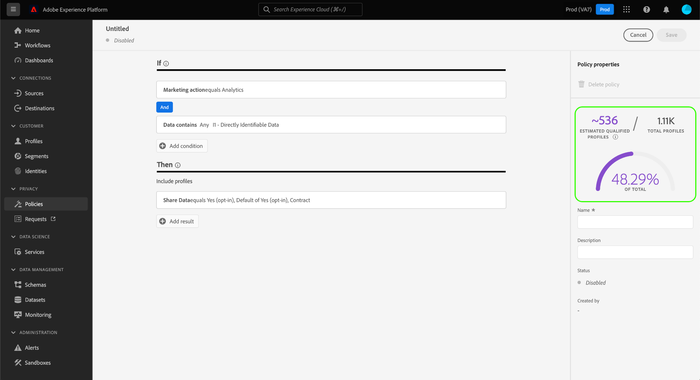

# Administrar las políticas de uso de datos en la IU {#user-guide}

>[!CONTEXTUALHELP]
>id="platform_privacyConsole_dataUsagePolicies_description"
>title="Integración y aplicación del consentimiento del cliente en los datos de perfil"
>abstract="<h2>Descripción</h2>
Experience Platform le permite integrar los datos de consentimiento que ha recopilado de sus clientes en sus respectivos perfiles. A continuación, puede configurar directivas de consentimiento para determinar si estos datos se pueden incluir en segmentos activados en determinados destinos.
"

Este documento explica cómo usar el espacio de trabajo **[!UICONTROL Policies]** en la interfaz de usuario de Adobe Experience Platform para crear y administrar directivas de uso de datos.

>[!NOTE]
>
>Para obtener información sobre cómo administrar las directivas de control de acceso en la interfaz de usuario, consulte la [guía de la interfaz de usuario de control de acceso basada en atributos](../../access-control/abac/ui/policies.md).

>[!IMPORTANT]
>
>Todas las políticas de uso de datos (incluidas las políticas principales proporcionadas por Adobe) están desactivadas de forma predeterminada. Para que una directiva individual pueda considerarse para su aplicación, debe habilitarla manualmente. Consulte la sección sobre [habilitar directivas](#enable) para ver los pasos que debe seguir en la interfaz de usuario.

## Requisitos previos

Esta guía requiere una comprensión práctica de los siguientes [!DNL Experience Platform] conceptos:

* [Gobernanza de datos](../home.md)
* [Políticas de uso de datos](./overview.md)

## Ver directivas existentes {#view-policies}

En la interfaz de usuario [!DNL Experience Platform], seleccione **[!UICONTROL Policies]** para abrir el área de trabajo **[!UICONTROL Policies]**. En la ficha **[!UICONTROL Browse]**, puede ver una lista de las directivas disponibles, incluidas las etiquetas asociadas, las acciones de marketing y el estado.

Si tiene acceso a las directivas de consentimiento, seleccione la opción **[!UICONTROL Consent policies]** para verlas en la pestaña [!UICONTROL Browse].

Seleccione una política de la lista para ver su descripción y tipo. Si se selecciona una directiva personalizada, se muestran controles adicionales para editar, eliminar o [habilitar o deshabilitar la directiva](#enable).

## Crear una directiva personalizada {#create-policy}

Para crear una nueva directiva de uso de datos personalizada, seleccione **[!UICONTROL Create policy]** en la esquina superior derecha de la ficha **[!UICONTROL Browse]** en el área de trabajo **[!UICONTROL Policies]**.

Aparecerá el cuadro de diálogo [!UICONTROL Choose type of policy]. Seleccione una [política de consentimiento](#consent-policy) o una [política de control de datos](#create-governance-policy).

### Uso conjunto de la gobernanza de datos y las políticas de consentimiento {#combine-policies}

>[!NOTE]
>
>Actualmente, las políticas de consentimiento solo están disponibles para las organizaciones que han adquirido Adobe Healthcare Shield o Adobe Privacy &amp; Security Shield.

Las políticas de gobernanza y consentimiento se pueden usar juntas para crear reglas sólidas para gobernar audiencias asignadas a un destino. Las políticas de consentimiento son de naturaleza inclusiva, lo que significa que dictan qué perfiles se pueden incluir en cada experiencia de marketing. Por el contrario, las directivas de gobernanza excluyen el uso de atributos etiquetados específicos para que no se configuren para la activación.

Con este comportamiento, puede configurar una combinación de directivas y reglas de consentimiento que incluyan los perfiles correctos, pero que impidan incluir datos que vayan en contra de las reglas organizativas establecidas. Un ejemplo de escenario sería, en el que desee excluir la inclusión de datos confidenciales pero que aún puedan dirigirse a usuarios con consentimiento para su marketing a través de los medios sociales. Los pasos necesarios para este escenario se describen en la infografía siguiente.

### Creación de una política de gobernanza de datos {#create-governance-policy}

Aparece el flujo de trabajo **[!UICONTROL Create policy]**. Comience proporcionando un nombre y una descripción para la nueva directiva.

A continuación, seleccione las etiquetas de uso de datos en las que se basará la directiva. Al seleccionar varias etiquetas, se le da la opción de elegir si los datos deben contener todas las etiquetas o solo una de ellas para que se aplique la directiva. Seleccione **[!UICONTROL Next]** cuando haya terminado.

Aparecerá el paso **[!UICONTROL Select marketing actions]**. Elija las acciones de marketing adecuadas en la lista proporcionada y, a continuación, seleccione **[!UICONTROL Next]** para continuar.

>[!NOTE]
>
>Al seleccionar varias acciones de marketing, la directiva las interpreta como una regla &quot;O&quot;. En otras palabras, la directiva se aplica si se realizan **cualquiera** de las acciones de marketing seleccionadas.

Aparece el paso **[!UICONTROL Review]**, que le permite revisar los detalles de la nueva directiva antes de crearla. Una vez que esté satisfecho, seleccione **[!UICONTROL Finish]** para crear la directiva.

Vuelve a aparecer la pestaña **[!UICONTROL Browse]**, que ahora enumera la directiva recién creada en el estado &quot;Borrador&quot;. Para habilitar la directiva, consulte la siguiente sección.

### Crear una directiva de consentimiento {#consent-policy}

>[!CONTEXTUALHELP]
>id="platform_privacyConsole_dataUsagePolicies_instructions"
>title="Instrucciones"
>abstract="<ul><li>Asegúrese de introducir datos de preferencias en los esquemas de unión a través del conector de origen OneTrust o del esquema XDM estándar para el consentimiento.</li><li>Seleccione <a href="https://experienceleague.adobe.com/docs/experience-platform/data-governance/policies/overview.html?lang=es">Directivas</a> en la navegación izquierda y, a continuación, <a href="https://experienceleague.adobe.com/docs/experience-platform/data-governance/policies/user-guide.html?lang=es#create-governance-policy">Crear directiva</a>.</li><li>En la sección <b>Si</b>, describa las condiciones o acciones que activarán la comprobación de la directiva.</li><li>En la sección <b>Entonces</b>, introduzca los atributos de consentimiento que deben estar presentes para que un perfil se incluya en la acción que activó la directiva.</li><li>Seleccione <b>Guardar</b> para crear la directiva. Para habilitar la directiva, seleccione el botón de alternancia <b>Estado</b> en el carril derecho.</li><li>Experience Platform aplica automáticamente las directivas de consentimiento habilitadas cuando activa segmentos en destinos y proporciona detalles sobre cómo afectan al tamaño del público.</li><li>Para obtener más ayuda con esta función, consulte la guía de <a href="https://experienceleague.adobe.com/docs/experience-platform/data-governance/policies/user-guide.html?lang=es#consent-policy">creación de directivas de consentimiento</a> en Experience League.</li></ul>"

>[!IMPORTANT]
>
>Las políticas de consentimiento solo están disponibles para las organizaciones que han adquirido **Adobe Healthcare Shield** o **Adobe Privacy &amp; Security Shield**.

Si elige crear una política de consentimiento, aparece una nueva pantalla que le permite configurar la nueva política.

Para utilizar directivas de consentimiento, debe tener atributos de consentimiento presentes en los datos de perfil. Consulte la guía sobre el procesamiento de consentimiento de [en Experience Platform](../../landing/governance-privacy-security/consent/adobe/overview.md) para ver los pasos detallados sobre cómo incluir los atributos necesarios en el esquema de unión.

Las políticas de consentimiento se componen de dos componentes lógicos:

* **[!UICONTROL If]**: condición que almacenará en déclencheur la comprobación de directivas. Esto puede basarse en una acción de marketing determinada que se esté realizando, en la presencia de ciertas etiquetas de uso de datos o en una combinación de ambas.
* **[!UICONTROL Then]**: los atributos de consentimiento que deben estar presentes para que un perfil se incluya en la acción que activó la directiva.

>[!NOTE]
>
>Las políticas de consentimiento admiten la creación avanzada de reglas con varios tipos de campos y operadores. Para obtener una referencia completa de los tipos de campos, operadores y ejemplos de creación de reglas admitidos, consulte la [Referencia de reglas de directivas de consentimiento](./consent-policy-rule-building-reference.md).

#### Configuración de condiciones {#consent-conditions}

>[!CONTEXTUALHELP]
>id="platform_governance_policies_consentif"
>title="Condición “If”"
>abstract="Comience definiendo las condiciones que activarán la comprobación de directivas. Las condiciones pueden incluir ciertas acciones de marketing que se están realizando, ciertas etiquetas de gobernanza de datos que están presentes o una combinación de ambas. Utilice la lógica AND/OR para crear relaciones condicionales complejas entre varias condiciones."

En la sección **[!UICONTROL If]**, seleccione las acciones de marketing o las etiquetas de uso de datos que deben almacenar en déclencheur esta directiva. Seleccione **[!UICONTROL View all]** y **[!UICONTROL Select labels]** para ver las listas completas de acciones y etiquetas de marketing disponibles, respectivamente.

Una vez que haya agregado al menos una condición, puede seleccionar **[!UICONTROL Add condition]** para continuar agregando más condiciones según sea necesario, eligiendo el tipo de condición apropiado del menú desplegable.

Si selecciona más de una condición, puede utilizar el icono que aparece entre ellas para cambiar la relación condicional entre &quot;AND&quot; y &quot;OR&quot;.

#### Seleccionar atributos de consentimiento {#consent-attributes}

>[!CONTEXTUALHELP]
>id="platform_governance_policies_consentthen"
>title="Condición “Then”"
>abstract="Una vez definida la condición “If”, utilice la sección “Then” para seleccionar al menos un atributo de consentimiento del esquema de unión. Debe navegar por los campos contenedores (Objeto, Mapa, Matriz) para llegar a los campos primitivos (Cadena, Número, Booleano, etc.) para la creación de reglas. Este campo primitivo es el atributo que debe estar presente para que los perfiles se incluyan en la acción regida por esta directiva."

En la sección **[!UICONTROL Then]**, seleccione al menos un atributo de consentimiento del esquema de unión. Este es el atributo que debe estar presente para que los perfiles se incluyan en la acción regida por esta directiva. Puede elegir una de las opciones sugeridas o seleccionar **[!UICONTROL View all]** para elegir el atributo directamente desde el esquema de unión.

>[!NOTE]
>
>Las directivas de consentimiento admiten tipos de campos primitivos (cadena, número, booleano, fecha) y tipos de contenedores (objeto, mapa, matriz). Puede desplazarse a los contenedores para seleccionar atributos específicos y aplicar la lógica AND/OR para combinar reglas. Para obtener una referencia completa de los tipos de campo, operadores y ejemplos de creación de reglas admitidos, consulte la [referencia de creación de reglas de directivas de consentimiento](./consent-policy-rule-building-reference.md).

Si selecciona **[!UICONTROL View all]**, aparecerá el cuadro de diálogo **[!UICONTROL Select consent attribute]**. Seleccione los atributos de consentimiento que desea que compruebe esta directiva. Como alternativa, en este cuadro de diálogo, puede seleccionar **[!UICONTROL Advanced Schema search]** para elegir un campo primitivo anidado que se evaluará como parte de la directiva. Seleccione **[!UICONTROL Done]** para confirmar la configuración.

### Búsqueda avanzada de esquemas {#advanced-schema-search}

En el diálogo **[!UICONTROL Select consent attribute]**, seleccione **[!UICONTROL Advanced Schema search]** para abrir el cuadro de diálogo **[!UICONTROL Select union schema field]**. Desde esta vista, seleccione atributos de nivel raíz o anidados de tipos de campo primitivos como cadena, número, booleano y fecha, así como tipos de contenedor como objeto, mapa y matriz.

#### Campos de valor fijo para una condición de directiva {#fixed-value-fields}

Al seleccionar un campo de valor fijo como condición de directiva, el panel [!UICONTROL Selected attributes] muestra los valores predefinidos definidos definidos en el esquema de datos.

>[!NOTE]
>
>Si un campo está configurado con un conjunto fijo de valores (por ejemplo, como una enumeración u otro vocabulario controlado), el generador de directivas aplica esa restricción para garantizar que las condiciones se evalúen únicamente en relación con datos válidos y estandarizados.

Para mantener la calidad y la coherencia de los datos, la IU procesa estos valores como casillas de verificación seleccionables en lugar de campos de texto libre. Este método reduce la validación manual y ayuda a que la directiva de consentimiento evalúe los datos de forma fiable.

Para definir la condición, seleccione las casillas de verificación de los valores que desea que evalúe la directiva.

#### Asignar campos de tipo de datos para una condición de directiva {#map-data-type-fields}

Al seleccionar un campo primitivo contenido en un tipo de datos Map, aparecen opciones de configuración adicionales en el panel **[!UICONTROL Selected attributes]**. Utilice estas opciones para configurar las comprobaciones de consentimiento en varias claves sin necesidad de una directiva independiente para cada clave. Este método de configuración simplifica la administración de directivas al reducir el número de directivas que debe crear.

##### Configurar atributos de tipo de datos de Map {#configure-map-attributes}

Para configurar un atributo de tipo Map, siga los pasos a continuación:

En el diagrama de esquema de unión, seleccione un campo primitivo (como una cadena o un número) contenido dentro de un tipo de datos Map. El panel **[!UICONTROL Selected attributes]** se actualiza para mostrar opciones de configuración adicionales para ese campo.

En el panel **[!UICONTROL Selected attributes]**, configure cómo la directiva evalúa las claves de asignación seleccionando o desactivando la casilla de verificación **[!UICONTROL Find any matching item]**.

| Opción | Acción | Comportamiento de política |
| --- | --- | --- |
| **[!UICONTROL Find any matching item]** casilla de verificación **seleccionada** | El campo de texto **[!UICONTROL within]** está deshabilitado. | La directiva comprueba **cada clave** del mapa. Cualquier clave en la que el campo anidado cumpla la condición de valor se considera una coincidencia para la directiva. Esto resulta útil para aplicar el cumplimiento global en atributos de clave dinámica. |
| **[!UICONTROL Find any matching item]** casilla de verificación **no seleccionada** | Debe escribir un nombre de clave específico en el campo de texto **[!UICONTROL within]**. | La directiva comprueba únicamente la clave de asignación especificada en el campo **[!UICONTROL within]**. Solo coinciden los perfiles en los que el campo anidado de una clave específica cumple con el valor definido. Esto resulta útil para directivas dirigidas a un programa específico o clave de frecuencia (por ejemplo, `frequencyMap.m1`). |

Introduzca el valor del campo primitivo seleccionado que la directiva debe evaluar. Por ejemplo, si el tipo de campo es `Integer`, escriba un valor numérico.

Seleccione **[!UICONTROL Select]** para confirmar la configuración y volver al generador de directivas.

Después de seleccionar al menos un atributo de consentimiento, el panel **[!UICONTROL Policy properties]** se actualiza para mostrar el número estimado de perfiles incluidos en esta directiva, junto con el porcentaje de perfiles afectados en el almacén de perfiles. El recuento estimado de perfiles se actualiza automáticamente al cambiar la configuración de la directiva.

Para agregar atributos de consentimiento adicionales, seleccione **[!UICONTROL Add result]**. Esto crea otra regla para incluir perfiles basados en esos atributos.

>[!NOTE]
>
>Para editar un atributo existente, seleccione el nombre del atributo y, a continuación, seleccione el icono de lápiz (). Se abre el cuadro de diálogo **[!UICONTROL Select union schema field]** para que realice los cambios.
>
>

Siga agregando o ajustando condiciones y atributos de consentimiento hasta que la directiva coincida con sus necesidades. Cuando termine, escriba un nombre y una descripción (opcional) y, a continuación, seleccione **[!UICONTROL Save]** para crear la directiva.

La directiva de consentimiento ahora se crea y su estado se establece en [!UICONTROL Disabled] de forma predeterminada. Para habilitar la directiva de inmediato, seleccione la opción **[!UICONTROL Status]** en el carril derecho.

#### Verificar aplicación de políticas

Después de crear y habilitar una directiva de consentimiento, puede obtener una vista previa de cómo afecta a las audiencias consentidas al activar segmentos en los destinos. Consulte la sección sobre [evaluación de directivas de consentimiento](../enforcement/auto-enforcement.md#consent-policy-evaluation) para obtener más información.

## Habilitar o deshabilitar una directiva {#enable}

Todas las políticas de uso de datos (incluidas las políticas principales proporcionadas por Adobe) están desactivadas de forma predeterminada. Para que una directiva individual se considere para su aplicación, debe habilitarla manualmente mediante la API o la interfaz de usuario.

Puede habilitar o deshabilitar directivas desde la ficha **[!UICONTROL Browse]** en el área de trabajo **[!UICONTROL Policies]**. Seleccione una directiva personalizada de la lista para mostrar sus detalles a la derecha. En **[!UICONTROL Status]**, seleccione el botón de alternancia para habilitar o deshabilitar la directiva.

## Ver acciones de marketing {#view-marketing-actions}

En el área de trabajo **[!UICONTROL Policies]**, seleccione la pestaña **[!UICONTROL Marketing actions]** para ver una lista de las acciones de marketing disponibles definidas por Adobe y su propia organización.

## Creación de una acción de marketing {#create-marketing-action}

Para crear una nueva acción de marketing personalizada, seleccione **[!UICONTROL Create marketing action]** en la esquina superior derecha de la ficha **[!UICONTROL Marketing actions]** en el área de trabajo **[!UICONTROL Policies]**.

Aparecerá el cuadro de diálogo **[!UICONTROL Create marketing action]**. Escriba un nombre y una descripción para la acción de marketing y seleccione **[!UICONTROL Create]**.

La acción recién creada aparece en la ficha **[!UICONTROL Marketing actions]**. Ahora puede usar la acción de marketing al [crear nuevas políticas de uso de datos](#create-policy).

## Editar o eliminar una acción de marketing {#edit-delete-marketing-action}

>[!NOTE]
>
>Solo se pueden editar las acciones de marketing personalizadas definidas por su organización. Las acciones de marketing definidas por Adobe no se pueden cambiar ni eliminar.

En el área de trabajo **[!UICONTROL Policies]**, seleccione la pestaña **[!UICONTROL Marketing actions]** para ver una lista de las acciones de marketing disponibles definidas por Adobe y su propia organización. Seleccione una acción de marketing personalizada de la lista y, a continuación, utilice los campos proporcionados en la sección derecha para editar los detalles de la acción de marketing.

Si ninguna política de uso existente está usando la acción de marketing, puede eliminarla seleccionando **[!UICONTROL Delete marketing action]**.

>[!NOTE]
>
>Si se intenta eliminar una acción de marketing que está siendo utilizada por una directiva existente, aparecerá un mensaje de error que indica que se ha producido un error en el intento de eliminación.

## Próximos pasos

Este documento proporciona información general sobre cómo administrar las directivas de uso de datos en la interfaz de usuario de [!DNL Experience Platform]. Para obtener información sobre cómo administrar directivas mediante [!DNL Policy Service API], consulte la [guía para desarrolladores](../api/getting-started.md). Para obtener información sobre cómo aplicar directivas de uso de datos, consulte la [descripción general de aplicación de directivas](../enforcement/overview.md).

El siguiente vídeo proporciona una demostración de cómo trabajar con directivas de uso en la interfaz de usuario de [!DNL Experience Platform]:

>[!VIDEO](https://video.tv.adobe.com/v/37128?captions=spa&quality=12&learn=on)
