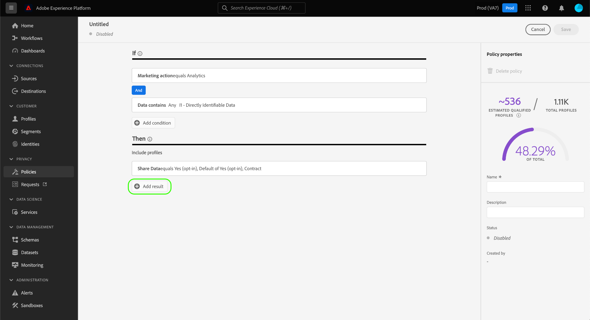

# Administrar las políticas de uso de datos en la IU {#user-guide}

>[!CONTEXTUALHELP]
>id="platform_privacyConsole_dataUsagePolicies_description"
>title="Integración y aplicación del consentimiento del cliente en los datos de perfil"
>abstract="<h2>Descripción</h2>
Experience Platform le permite integrar los datos de consentimiento que ha recopilado de sus clientes en sus respectivos perfiles. A continuación, puede configurar directivas de consentimiento para determinar si estos datos se pueden incluir en segmentos activados en determinados destinos.
"

Este documento explica cómo usar el espacio de trabajo **[!UICONTROL Políticas]** en la interfaz de usuario de Adobe Experience Platform para crear y administrar políticas de uso de datos.

>[!NOTE]
>
>Para obtener información sobre cómo administrar las directivas de control de acceso en la interfaz de usuario, consulte la [guía de la interfaz de usuario de control de acceso basada en atributos](../../access-control/abac/ui/policies.md).

>[!IMPORTANT]
>
>Todas las políticas de uso de datos (incluidas las políticas principales proporcionadas por Adobe) están desactivadas de forma predeterminada. Para que una directiva individual pueda considerarse para su aplicación, debe habilitarla manualmente. Consulte la sección sobre [habilitar directivas](#enable) para ver los pasos que debe seguir en la interfaz de usuario.

## Requisitos previos

Esta guía requiere una comprensión práctica de los siguientes [!DNL Experience Platform] conceptos:

* [Gobernanza de datos](../home.md)
* [Políticas de uso de datos](./overview.md)

## Ver directivas existentes {#view-policies}

En la interfaz de usuario de [!DNL Experience Platform], seleccione **[!UICONTROL Directivas]** para abrir el área de trabajo de **[!UICONTROL Directivas]**. En la ficha **[!UICONTROL Examinar]**, puede ver una lista de las directivas disponibles, incluidas sus etiquetas asociadas, las acciones de marketing y el estado.

Si tiene acceso a las directivas de consentimiento, seleccione la opción **[!UICONTROL Políticas de consentimiento]** para verlas en la pestaña [!UICONTROL Examinar].

Seleccione una política de la lista para ver su descripción y tipo. Si se selecciona una directiva personalizada, se muestran controles adicionales para editar, eliminar o [habilitar o deshabilitar la directiva](#enable).

## Crear una directiva personalizada {#create-policy}

Para crear una nueva directiva de uso de datos personalizada, selecciona **[!UICONTROL Crear directiva]** en la esquina superior derecha de la pestaña **[!UICONTROL Examinar]** del área de trabajo **[!UICONTROL Directivas]**.

Dependiendo de si forma parte de la versión beta de las directivas de consentimiento, se produce una de las siguientes situaciones:

* Si no forma parte de la versión beta, se le redirige inmediatamente al flujo de trabajo para [crear una directiva de control de datos](#create-governance-policy).
* Si forma parte de la versión beta, un cuadro de diálogo proporciona una opción adicional para [crear una directiva de consentimiento](#consent-policy).
  

### Uso conjunto de la gobernanza de datos y las políticas de consentimiento {#combine-policies}

>[!NOTE]
>
>Actualmente, las políticas de consentimiento solo están disponibles para las organizaciones que han adquirido Adobe Healthcare Shield o Adobe Privacy &amp; Security Shield.

Las políticas de gobernanza y consentimiento se pueden usar juntas para crear reglas sólidas para gobernar audiencias asignadas a un destino. Las políticas de consentimiento son de naturaleza inclusiva, lo que significa que dictan qué perfiles se pueden incluir en cada experiencia de marketing. Por el contrario, las directivas de gobernanza excluyen el uso de atributos etiquetados específicos para que no se configuren para la activación.

Con este comportamiento, puede configurar una combinación de directivas y reglas de consentimiento que incluyan los perfiles correctos, pero que impidan incluir datos que vayan en contra de las reglas organizativas establecidas. Un ejemplo de escenario sería, en el que desee excluir la inclusión de datos confidenciales pero que aún puedan dirigirse a usuarios con consentimiento para su marketing a través de los medios sociales. Los pasos necesarios para este escenario se describen en la infografía siguiente.

### Creación de una política de gobernanza de datos {#create-governance-policy}

Aparece el flujo de trabajo **[!UICONTROL Crear directiva]**. Comience proporcionando un nombre y una descripción para la nueva directiva.

A continuación, seleccione las etiquetas de uso de datos en las que se basará la directiva. Al seleccionar varias etiquetas, se le da la opción de elegir si los datos deben contener todas las etiquetas o solo una de ellas para que se aplique la directiva. Seleccione **[!UICONTROL Siguiente]** cuando haya terminado.

Aparece el paso **[!UICONTROL Seleccionar acciones de marketing]**. Elija las acciones de marketing apropiadas de la lista proporcionada y, a continuación, seleccione **[!UICONTROL Siguiente]** para continuar.

>[!NOTE]
>
>Al seleccionar varias acciones de marketing, la directiva las interpreta como una regla &quot;O&quot;. En otras palabras, la directiva se aplica si se realizan **cualquiera** de las acciones de marketing seleccionadas.

Aparece el paso **[!UICONTROL Revisar]**, que le permite revisar los detalles de la nueva directiva antes de crearla. Una vez que esté satisfecho, seleccione **[!UICONTROL Finalizar]** para crear la directiva.

Vuelve a aparecer la pestaña **[!UICONTROL Examinar]**, que ahora enumera la directiva recién creada en el estado &quot;Borrador&quot;. Para habilitar la directiva, consulte la siguiente sección.

### Crear una directiva de consentimiento {#consent-policy}

>[!CONTEXTUALHELP]
>id="platform_privacyConsole_dataUsagePolicies_instructions"
>title="Instrucciones"
>abstract="<ul><li>Asegúrese de introducir datos de preferencias en los esquemas de unión a través del conector de origen OneTrust o del esquema XDM estándar para el consentimiento.</li><li>Seleccione <a href="https://experienceleague.adobe.com/docs/experience-platform/data-governance/policies/overview.html?lang=es">Directivas</a> en la navegación izquierda y, a continuación, <a href="https://experienceleague.adobe.com/docs/experience-platform/data-governance/policies/user-guide.html?lang=es#create-governance-policy">Crear directiva</a>.</li><li>En la sección <b>Si</b>, describa las condiciones o acciones que activarán la comprobación de la directiva.</li><li>En la sección <b>Entonces</b>, introduzca los atributos de consentimiento que deben estar presentes para que un perfil se incluya en la acción que activó la directiva.</li><li>Seleccione <b>Guardar</b> para crear la directiva. Para habilitar la directiva, seleccione el botón de alternancia <b>Estado</b> en el carril derecho.</li><li>Experience Platform aplica automáticamente las directivas de consentimiento habilitadas cuando activa segmentos en destinos y proporciona detalles sobre cómo afectan al tamaño de la audiencia.</li><li>Para obtener más ayuda con esta función, consulte la guía de <a href="https://experienceleague.adobe.com/docs/experience-platform/data-governance/policies/user-guide.html?lang=es#consent-policy">creación de directivas de consentimiento</a> en Experience League.</li></ul>"

>[!IMPORTANT]
>
>Las políticas de consentimiento solo están disponibles para las organizaciones que han adquirido **Adobe Healthcare Shield** o **Adobe Privacy &amp; Security Shield**.

Si elige crear una política de consentimiento, aparece una nueva pantalla que le permite configurar la nueva política.

Para utilizar directivas de consentimiento, debe tener atributos de consentimiento presentes en los datos de perfil. Consulte la guía sobre el procesamiento de consentimiento de [en Experience Platform](../../landing/governance-privacy-security/consent/adobe/overview.md) para ver los pasos detallados sobre cómo incluir los atributos necesarios en el esquema de unión.

Las políticas de consentimiento se componen de dos componentes lógicos:

* **[!UICONTROL If]**: La condición que almacenará en déclencheur la comprobación de directivas. Esto puede basarse en una acción de marketing determinada que se esté realizando, en la presencia de ciertas etiquetas de uso de datos o en una combinación de ambas.
* **[!UICONTROL Then]**: atributos de consentimiento que deben estar presentes para que un perfil se incluya en la acción que activó la directiva.

#### Configuración de condiciones {#consent-conditions}

>[!CONTEXTUALHELP]
>id="platform_governance_policies_consentif"
>title="Condición “If”"
>abstract="Comience definiendo las condiciones que activarán la comprobación de directivas. Las condiciones pueden incluir la realización de determinadas acciones de marketing, la presencia de ciertas etiquetas de gobernanza de datos o una combinación de ambas."

En la sección **[!UICONTROL If]**, seleccione las acciones de marketing o las etiquetas de uso de datos que deben almacenar en déclencheur esta directiva. Seleccione **[!UICONTROL Ver todas]** y **[!UICONTROL Seleccionar etiquetas]** para ver las listas completas de acciones y etiquetas de marketing disponibles, respectivamente.

Una vez que haya agregado al menos una condición, puede seleccionar **[!UICONTROL Agregar condición]** para continuar agregando más condiciones según sea necesario, eligiendo el tipo de condición apropiado del menú desplegable.

Si selecciona más de una condición, puede utilizar el icono que aparece entre ellas para cambiar la relación condicional entre &quot;AND&quot; y &quot;OR&quot;.

#### Seleccionar atributos de consentimiento {#consent-attributes}

>[!CONTEXTUALHELP]
>id="platform_governance_policies_consentthen"
>title="Condición “Then”"
>abstract="Una vez definida la condición “If”, utilice la sección “Then” para seleccionar al menos un atributo de consentimiento del esquema de unión. Este es el atributo que debe estar presente para que los perfiles se incluyan en la acción regulada por esta directiva."

En la sección **[!UICONTROL Then]**, seleccione al menos un atributo de consentimiento del esquema de unión. Este es el atributo que debe estar presente para que los perfiles se incluyan en la acción regida por esta directiva. Puede elegir una de las opciones proporcionadas en la lista o seleccionar **[!UICONTROL Ver todas]** para elegir el atributo directamente desde el esquema de unión.

Al seleccionar el atributo de consentimiento, elija los valores del atributo que desea que compruebe esta directiva.

Después de seleccionar al menos un atributo de consentimiento, el panel **[!UICONTROL Propiedades de la directiva]** se actualiza para mostrar el número estimado de perfiles que se permitirían con esta directiva, incluido el porcentaje del almacén total de perfiles. Esta estimación se actualiza automáticamente a medida que ajusta la configuración de la directiva.

Para agregar más atributos de consentimiento a la directiva, seleccione **[!UICONTROL Agregar resultado]**.

Puede seguir agregando y ajustando condiciones y atributos de consentimiento a la directiva según sea necesario. Cuando esté satisfecho con la configuración, proporcione un nombre y una descripción opcional para la directiva antes de seleccionar **[!UICONTROL Guardar]**.

La directiva de consentimiento se ha creado y su estado se ha establecido en [!UICONTROL Deshabilitado] de forma predeterminada. Para habilitar la directiva de inmediato, seleccione la opción **[!UICONTROL Status]** en el carril derecho.

#### Verificar aplicación de políticas

Después de crear y habilitar una directiva de consentimiento, puede obtener una vista previa de cómo afecta a las audiencias consentidas al activar segmentos en los destinos. Consulte la sección sobre [evaluación de directivas de consentimiento](../enforcement/auto-enforcement.md#consent-policy-evaluation) para obtener más información.

## Habilitar o deshabilitar una directiva {#enable}

Todas las políticas de uso de datos (incluidas las políticas principales proporcionadas por Adobe) están desactivadas de forma predeterminada. Para que una directiva individual se considere para su aplicación, debe habilitarla manualmente mediante la API o la interfaz de usuario.

Puede habilitar o deshabilitar directivas desde la ficha **[!UICONTROL Examinar]** del área de trabajo **[!UICONTROL Directivas]**. Seleccione una directiva personalizada de la lista para mostrar sus detalles a la derecha. En **[!UICONTROL Estado]**, seleccione el botón de alternancia para habilitar o deshabilitar la directiva.

## Ver acciones de marketing {#view-marketing-actions}

En el área de trabajo **[!UICONTROL Políticas]**, seleccione la pestaña **[!UICONTROL Acciones de marketing]** para ver una lista de las acciones de marketing disponibles definidas por Adobe y su propia organización.

## Creación de una acción de marketing {#create-marketing-action}

Para crear una nueva acción de marketing personalizada, selecciona **[!UICONTROL Crear acción de marketing]** en la esquina superior derecha de la pestaña **[!UICONTROL Acciones de marketing]** del área de trabajo **[!UICONTROL Políticas]**.

Aparecerá el cuadro de diálogo **[!UICONTROL Crear acción de marketing]**. Escriba un nombre y una descripción para la acción de marketing y, a continuación, seleccione **[!UICONTROL Crear]**.

La acción recién creada aparece en la ficha **[!UICONTROL Acciones de marketing]**. Ahora puede usar la acción de marketing al [crear nuevas políticas de uso de datos](#create-policy).

## Editar o eliminar una acción de marketing {#edit-delete-marketing-action}

>[!NOTE]
>
>Solo se pueden editar las acciones de marketing personalizadas definidas por su organización. Las acciones de marketing definidas por Adobe no se pueden cambiar ni eliminar.

En el área de trabajo **[!UICONTROL Políticas]**, seleccione la pestaña **[!UICONTROL Acciones de marketing]** para ver una lista de las acciones de marketing disponibles definidas por Adobe y su propia organización. Seleccione una acción de marketing personalizada de la lista y, a continuación, utilice los campos proporcionados en la sección derecha para editar los detalles de la acción de marketing.

Si ninguna directiva de uso existente está usando la acción de marketing, puede eliminarla seleccionando **[!UICONTROL Eliminar acción de marketing]**.

>[!NOTE]
>
>Si se intenta eliminar una acción de marketing que está siendo utilizada por una directiva existente, aparecerá un mensaje de error que indica que se ha producido un error en el intento de eliminación.

## Pasos siguientes

Este documento proporciona información general sobre cómo administrar las directivas de uso de datos en la interfaz de usuario de [!DNL Experience Platform]. Para obtener información sobre cómo administrar directivas mediante [!DNL Policy Service API], consulte la [guía para desarrolladores](../api/getting-started.md). Para obtener información sobre cómo aplicar directivas de uso de datos, consulte la [descripción general de aplicación de directivas](../enforcement/overview.md).

El siguiente vídeo proporciona una demostración de cómo trabajar con directivas de uso en la interfaz de usuario de [!DNL Experience Platform]:

>[!VIDEO](https://video.tv.adobe.com/v/37128?quality=12&learn=on&captions=spa)
