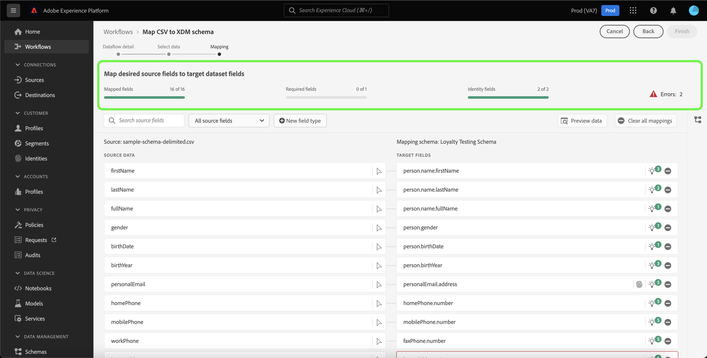

# Guía de la interfaz de usuario de preparación de datos

Este documento proporciona instrucciones sobre cómo utilizar las funciones de preparación de datos en la interfaz de usuario de Adobe Experience Platform para asignar archivos CSV a un esquema XDM.

## Primeros pasos

Este tutorial requiere una comprensión práctica de los siguientes componentes de Platform:

* [[!DNL Experience Data Model (XDM)] Sistema](../../xdm/home.md): El marco estandarizado mediante el cual Platform organiza los datos de experiencia del cliente.
   * [Aspectos básicos de la composición del esquema](../../xdm/schema/composition.md): Obtenga información sobre los componentes básicos de los esquemas XDM, incluidos los principios clave y las prácticas recomendadas en la composición de esquemas.
   * [Tutorial del Editor de esquemas](../../xdm/tutorials/create-schema-ui.md): Obtenga información sobre cómo crear esquemas personalizados mediante la interfaz de usuario del Editor de esquemas.
* [Servicio de identidad](../../identity-service/home.md): Obtenga una mejor visión de los clientes individuales y su comportamiento al unir identidades entre dispositivos y sistemas.
* [[!DNL Real-time Customer Profile]](../../profile/home.md): Proporciona un perfil de cliente unificado y en tiempo real basado en datos agregados de varias fuentes.
* [Fuentes](../../sources/home.md): Experience Platform permite la ingesta de datos de varias fuentes, al mismo tiempo que le ofrece la capacidad de estructurar, etiquetar y mejorar los datos entrantes mediante los servicios de Platform.

## Detalles de flujo de datos

>[!TIP]
>
>Puede acceder a los detalles del flujo de datos seleccionando cualquier fuente del catálogo de fuentes. Para obtener más información, consulte la [información general sobre fuentes](../../sources/home.md).

Para poder asignar los datos CSV a un esquema XDM, primero debe establecer los detalles del flujo de datos.

La variable [!UICONTROL Detalles de flujo de datos] permite seleccionar si desea introducir los datos CSV en un conjunto de datos de destino existente o en un nuevo conjunto de datos de destino. Un conjunto de datos existente viene con un esquema de destino pregenerado al que asignar los datos, mientras que un nuevo conjunto de datos requiere que seleccione un esquema existente o que cree un nuevo esquema al que asignar los datos.

### Usar un conjunto de datos de destino existente

Para introducir los datos CSV en un conjunto de datos existente, seleccione **[!UICONTROL Conjunto de datos existente]**. Puede recuperar un conjunto de datos existente mediante la variable [!UICONTROL Búsqueda avanzada] o desplazándose por la lista de conjuntos de datos existentes en el menú desplegable.

Con un conjunto de datos seleccionado, proporcione un nombre para el flujo de datos y una descripción opcional.

Durante este proceso, también puede habilitar [!UICONTROL Diagnóstico de errores] y [!UICONTROL Ingesta parcial]. [!UICONTROL Diagnóstico de errores] permite generar mensajes de error detallados para cualquier registro erróneo que se produzca en el flujo de datos, mientras que [!UICONTROL Ingesta parcial] le permite introducir datos que contengan errores, hasta un umbral determinado que defina manualmente. Consulte la [información general sobre la ingesta parcial de lotes](../../ingestion/batch-ingestion/partial.md) para obtener más información.

### Usar un nuevo conjunto de datos de destino

Para introducir los datos CSV en un nuevo conjunto de datos, seleccione **[!UICONTROL Nuevo conjunto de datos]** y, a continuación, proporcione un nombre de conjunto de datos de salida y una descripción opcional. A continuación, seleccione un esquema para asignarlo mediante la variable [!UICONTROL Búsqueda avanzada] o desplazándose por la lista de esquemas existentes en el menú desplegable.

Con un esquema seleccionado, proporcione un nombre para el flujo de datos y una descripción opcional y, a continuación, aplique la variable [!UICONTROL Diagnóstico de errores] y [!UICONTROL Ingesta parcial] configuración que desee para el flujo de datos. Cuando termine, seleccione **[!UICONTROL Siguiente]**.

## Seleccionar datos

La variable [!UICONTROL Seleccionar datos] , lo que le proporciona una interfaz para cargar los archivos locales y previsualizar su estructura y contenido. Select **[!UICONTROL Elegir archivos]** para cargar un archivo CSV desde el sistema local. Como alternativa, puede arrastrar y soltar el archivo CSV que desea cargar en el [!UICONTROL Arrastrar y soltar archivos] panel.

>[!TIP]
>
>Actualmente, la carga de archivos locales solo admite los archivos CSV. El tamaño máximo de archivo para cada archivo es de 1 GB.

Una vez cargado el archivo, la interfaz de vista previa se actualiza para mostrar el contenido y la estructura del archivo.

Según el archivo, puede seleccionar un delimitador de columna, como tabulaciones, comas, barras verticales o un delimitador de columna personalizado para los datos de origen. Seleccione el **[!UICONTROL Delimitador]** flecha desplegable y, a continuación, seleccione el delimitador apropiado en el menú.

Cuando termine, seleccione **[!UICONTROL Siguiente]**.

## Asignación

La variable **[!UICONTROL asignación]** La interfaz de le proporciona una herramienta completa para asignar campos de origen del esquema de origen a los campos XDM de destino correspondientes en el esquema de destino.

### Explicación de la interfaz de asignación

La interfaz de asignación incluye un panel que proporciona información sobre el estado de los campos de asignación en el contexto del flujo de trabajo de ingesta. El panel muestra los siguientes detalles sobre los campos de asignación:

| Propiedad | Descripción |
| --- | --- |
| [!UICONTROL Campos asignados] | Muestra el número total de campos de origen asignados a un campo XDM de destino, independientemente de los errores. |
| [!UICONTROL Campos requeridos] | Muestra el número de campos de asignación necesarios. |
| [!UICONTROL Campos de identidad] | Muestra el número total de campos de asignación definidos como identidad. Estos campos de asignación se representan mediante un icono de huella digital. |
| [!UICONTROL Errores] | Muestra el número de campos de asignación erróneos. |

La interfaz de asignación también proporciona un panel de opciones que puede elegir para interactuar o filtrar mejor a través de los campos de asignación.

Para buscar un conjunto de asignaciones determinado, seleccione **[!UICONTROL Buscar campos de origen]** e introduzca el nombre de los datos de origen que desea aislar.

Select **[!UICONTROL Todos los campos de origen]** para ver un menú desplegable de opciones de filtrado para reducir mejor la vista de la interfaz de asignación.

Las opciones de filtrado son:

| Campos de origen | Descripción |
| --- | --- |
| [!UICONTROL Todos los campos de origen] | Esta opción muestra todos los campos de origen del esquema de origen. Esta opción se muestra de forma predeterminada. |
| [!UICONTROL Campos requeridos] | Esta opción filtra el esquema de origen para mostrar solo los campos necesarios para completar la asignación. |
| [!UICONTROL Campos de identidad] | Esta opción filtra el esquema de origen para mostrar solo los campos marcados para Identity. |
| [!UICONTROL Campos asignados] | Esta opción filtra el esquema de origen para mostrar solo los campos que ya se han asignado. |
| [!UICONTROL Campos sin asignar] | Esta opción filtra el esquema de origen para mostrar solo los campos que aún no se han asignado. |
| [!UICONTROL Campos con recomendación] | Esta opción filtra el esquema de origen para mostrar solo los campos que contienen recomendaciones de asignación. |

Select **[!UICONTROL Campos con errores]** para ver todos los campos de asignación con errores.

Se muestra una vista aislada de los campos de asignación erróneos, lo que le permite solucionar errores mediante recomendaciones de asignación inteligente o a través del árbol de asignación manual.

### Añadir un nuevo tipo de campo

Puede añadir un nuevo campo de asignación o un campo calculado seleccionando **[!UICONTROL Nuevo tipo de campo]**.

#### Nuevo campo de asignación

Para añadir un nuevo campo de asignación, seleccione **[!UICONTROL Nuevo tipo de campo]** y, a continuación, seleccione **[!UICONTROL Añadir nuevo campo]** del menú desplegable que aparece.

A continuación, seleccione el campo de origen que desee añadir del árbol de esquema de origen que aparece y, a continuación, seleccione **[!UICONTROL Select]**.

La interfaz de asignación se actualiza con el campo de origen seleccionado y un campo de destino vacío. Select **[!UICONTROL Asignar campo de destino]** para empezar a asignar el nuevo campo de origen a su campo XDM de destino adecuado.

Aparece un árbol de esquema de destino interactivo que le permite recorrer manualmente el esquema de destino y encontrar el campo XDM de destino adecuado para el campo de origen.

Cuando termine, seleccione el icono de esquema para cerrar la interfaz de esquema de destino.

#### Campos calculados {#calculated-fields}

Los campos calculados permiten que se creen valores en función de los atributos del esquema de entrada. Estos valores se pueden asignar a atributos en el esquema de destino y se les puede proporcionar un nombre y una descripción para facilitar la referencia. Los campos calculados tienen una longitud máxima de 4096 caracteres.

Para crear un campo calculado, seleccione **[!UICONTROL Nuevo tipo de campo]** y, a continuación, seleccione **[!UICONTROL Añadir campo calculado]**

La variable **[!UICONTROL Crear campo calculado]** aparece. El cuadro de diálogo izquierdo contiene los campos, las funciones y los operadores admitidos en los campos calculados. Seleccione una de las pestañas para empezar a añadir funciones, campos u operadores al editor de expresiones.

| Tabulación | Descripción |
| --- | ----------- |
| [!UICONTROL Función] | La pestaña funciones enumera las funciones disponibles para transformar los datos. Para obtener más información sobre las funciones que puede utilizar en los campos calculados, consulte la guía de [uso de las funciones de preparación de datos (Mapper)](../functions.md). |
| [!UICONTROL Campo] | La pestaña fields enumera los campos y atributos disponibles en el esquema de origen. |
| [!UICONTROL Operador] | La pestaña operadores enumera los operadores disponibles para transformar los datos. |

Puede añadir manualmente campos, funciones y operadores con el editor de expresiones del centro. Seleccione el editor para comenzar a crear una expresión. Una vez finalizado, seleccione **[!UICONTROL Guardar]** para continuar.

### Importar asignación {#import}

Puede reutilizar la asignación de un flujo de datos existente para reducir el tiempo de configuración manual del consumo de datos y limitar los errores. Select **[!UICONTROL Importar asignación]** para reutilizar una asignación existente.

La variable [!UICONTROL Importar asignación] , que le proporciona una lista de flujos de datos entre los que elegir.

Seleccione el icono de vista previa para previsualizar la asignación del flujo de datos seleccionado.

La ventana de vista previa permite inspeccionar la asignación existente antes de importarla al flujo de datos. Una vez verificada la asignación, puede seleccionar **[!UICONTROL Atrás]** para volver a la lista de flujos de datos e inspeccionar otro conjunto de asignaciones, o puede seleccionar **[!UICONTROL Select]** para continuar.

También puede seleccionar la asignación que desea importar de la ventana de lista de flujos de datos. Seleccione el flujo de datos que contiene la asignación que desea importar y, a continuación, seleccione **[!UICONTROL Select]** para continuar.

La interfaz se actualiza con la asignación que ha importado.

>[!NOTE]
>
>Los conjuntos de asignaciones existentes que establezca o las recomendaciones de asignación de ML se sustituyen por la asignación importada desde un flujo de datos existente.

Select **[!UICONTROL Vista previa de datos]** para ver los resultados de asignación de hasta 100 filas de datos de ejemplo del conjunto de datos seleccionado.

Durante la vista previa, la columna de identidad se prioriza como el primer campo, ya que es la información clave necesaria al validar los resultados de la asignación. Cuando termine, seleccione **[!UICONTROL Cerrar]**.

Para quitar todos los campos de asignación, seleccione **[!UICONTROL Borrar todas las asignaciones]**.

### Uso de la interfaz de asignación

Platform proporciona automáticamente recomendaciones inteligentes para campos asignados automáticamente en función del esquema o conjunto de datos de destino que haya seleccionado. Puede ajustar manualmente las reglas de asignación para adaptarlas a sus casos de uso o corregir cualquier campo de asignación duplicado para borrar cualquier error.

Seleccione el icono de bombilla en el campo de destino que desee ajustar.

La variable [!UICONTROL Asignación de recomendaciones] aparece el panel emergente con una lista de campos de destino recomendados que se pueden asignar a un campo de origen determinado. De forma predeterminada, la primera recomendación se aplica automáticamente.

A veces, hay más de una recomendación disponible para el esquema de origen. Cuando esto sucede, la tarjeta de asignación muestra la recomendación más destacada, seguida de un icono que contiene el número de recomendaciones adicionales disponibles. Al seleccionar el icono de la bombilla se mostrará una lista de las recomendaciones adicionales. Para elegir una de las recomendaciones alternativas, seleccione la casilla que hay junto a la recomendación a la que desea asignar.

Desde aquí puede cambiar el campo de destino seleccionado para corregir un error o hacer coincidir su caso de uso.

También puede seleccionar **[!UICONTROL Seleccionar manualmente]** para utilizar manualmente el árbol de asignación de esquema de destino interactivo.

La interfaz de asignación de esquema de destino aparece en la misma vista que los campos de asignación, lo que permite modificar los pares de asignación dentro de la misma pantalla. Seleccione el campo de destino que se adapte a su caso de uso o corrija sus errores.

Cuando termine, seleccione **[!UICONTROL Finalizar]** para continuar.

## Pasos siguientes

Al leer este documento, ha asignado correctamente un archivo CSV a un esquema XDM de destino mediante la interfaz de asignación en la interfaz de Platform. Consulte los siguientes documentos para obtener más información:

* [Resumen de la preparación de datos](../home.md)
* [Resumen de fuentes](../../sources/home.md)
* [Monitorizar flujos de datos de fuentes en la interfaz de usuario](../../dataflows/ui/monitor-sources.md)
