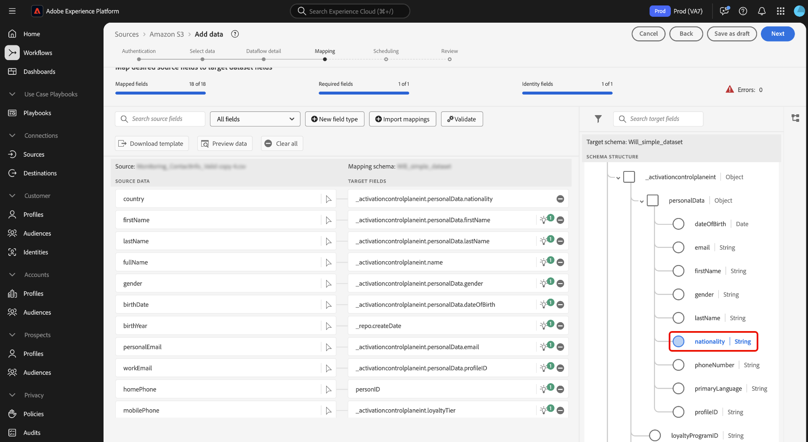

# Guía de IU de preparación de datos

Lea esta guía para aprender a utilizar las funciones de asignación de [preparación de datos](../home.md) en la interfaz de usuario de Adobe Experience Platform para asignar archivos CSV a un esquema [Experience Data Model (XDM)](../../xdm/home.md).

## Introducción

Este tutorial requiere una comprensión práctica de los siguientes componentes de Platform:

* [[!DNL Experience Data Model (XDM)] Sistema](../../xdm/home.md): El marco estandarizado mediante el cual Platform organiza los datos de experiencia del cliente.
   * [Aspectos básicos de la composición de esquemas](../../xdm/schema/composition.md): obtenga información sobre los componentes básicos de los esquemas XDM, incluidos los principios clave y las prácticas recomendadas en la composición de esquemas.
   * [Tutorial del editor de esquemas](../../xdm/tutorials/create-schema-ui.md): Aprenda a crear esquemas personalizados mediante la interfaz de usuario del editor de esquemas.
* [Servicio de identidad](../../identity-service/home.md): obtenga una mejor vista de los clientes individuales y su comportamiento al unir identidades entre dispositivos y sistemas.
* [[!DNL Real-Time Customer Profile]](../../profile/home.md): proporciona un perfil de consumidor unificado y en tiempo real basado en los datos agregados de varias fuentes.
* [Fuentes](../../sources/home.md): Experience Platform permite la ingesta de datos de varias fuentes, al tiempo que le ofrece la capacidad de estructurar, etiquetar y mejorar los datos entrantes mediante los servicios de Platform.

## Acceso a la interfaz de asignación en la IU

Puede acceder a la interfaz de asignación en la interfaz de usuario a través de dos rutas diferentes.

1. En la interfaz de usuario de Experience Platform, seleccione **[!UICONTROL Flujos de trabajo]** en el panel de navegación izquierdo y, a continuación, seleccione **[!UICONTROL Asignar CSV a esquema XDM]**. A continuación, proporcione los detalles del flujo de datos y seleccione los datos que desea introducir. Cuando termine, se le redirigirá a la interfaz de asignación, donde podrá configurar la asignación entre los datos de origen y un esquema XDM.
2. También puede acceder a la interfaz de asignación a través del espacio de trabajo de orígenes.

## Asignación de archivos CSV a un esquema XDM

Utilice la interfaz de asignación y el conjunto de herramientas completo que proporciona para asignar correctamente campos de datos del esquema de origen a sus campos XDM de destino adecuados en el esquema de destino.

### Explicación de la interfaz de asignación {#mapping-interface}

Consulte el panel en la parte superior de la interfaz para obtener información sobre el estado de los campos de asignación en el contexto del flujo de trabajo de ingesta. El panel muestra los siguientes detalles sobre los campos de asignación:

| Propiedad | Descripción |
| --- | --- |
| [!UICONTROL Campos asignados] | Muestra el número total de campos de origen que se han asignado a un campo XDM de destino, independientemente de los errores. |
| [!UICONTROL Campos obligatorios] | Muestra el número de campos de asignación requeridos. |
| [!UICONTROL Campos de identidad] | Muestra el número total de campos de asignación definidos como identidad. Estos campos de asignación se representan mediante un icono de huella digital. |
| [!UICONTROL Errores] | Muestra el número de campos de asignación erróneos. |

{style="table-layout:auto"}

A continuación, puede utilizar las opciones enumeradas en el encabezado para interactuar mejor o filtrar por los campos de asignación.

| Opción | Descripción |
| --- | --- |
| [!UICONTROL Campos de origen de búsqueda] | Utilice la barra de búsqueda para desplazarse a un campo de origen específico. |
| [!UICONTROL Todos los campos] | Seleccione **[!UICONTROL Todos los campos]** para ver un menú desplegable de opciones según las cuales filtrar las asignaciones. Las opciones de filtrado disponibles incluyen:<ul><li>**[!UICONTROL Campos obligatorios]**: Filtra la interfaz para mostrar solo los campos necesarios para completar el flujo de trabajo.</li><li> **[!UICONTROL Campos de identidad]**: filtra la interfaz para mostrar solo los campos marcados como identidades.</li><li>**[!UICONTROL Campos asignados]**: Filtra la interfaz para mostrar solo los campos que ya se han asignado.</li><li>**[!UICONTROL Campos no asignados]**: Filtra la interfaz para mostrar solo los campos que aún no se han asignado.</li><li>**[!UICONTROL Campos con errores]**: Filtra la interfaz para mostrar solo los campos que tienen errores.</li></ul> |
| [!UICONTROL Nuevo tipo de campo] | Seleccione **[!UICONTROL Nuevo tipo de campo]** para agregar un nuevo campo o un campo calculado. Para obtener más información, lea la sección sobre [agregar un nuevo tipo de campo](#add-a-new-field-type). |
| [!UICONTROL Importar asignaciones] | Seleccione **[!UICONTROL Importar asignaciones]** para importar asignaciones de un archivo o flujo de datos existente. Para obtener más información, lea la sección sobre [importación de asignaciones](#import-mapping). |
| [!UICONTROL Validar] | Seleccione **[!UICONTROL Validar]** para comprobar si hay errores en las asignaciones. |
| [!UICONTROL Descargar plantilla] | Seleccione **[!UICONTROL Descargar plantilla]** para exportar y descargar un archivo CSV de sus asignaciones. |
| [!UICONTROL Vista previa de datos] | Seleccione **[!UICONTROL Vista previa de datos]** para usar el panel de vista previa e inspeccionar la estructura y el contenido del conjunto de datos de origen. |
| [!UICONTROL Borrar todo] | Seleccione **[!UICONTROL Borrar todo]** para eliminar todas las asignaciones de la interfaz. |

{style="table-layout:auto"}

### Añadir un nuevo tipo de campo {#add-a-new-field-type}

Puede agregar un nuevo campo de asignación o un campo calculado seleccionando **[!UICONTROL Nuevo tipo de campo]**.

#### Nuevo campo de asignación

Para agregar un nuevo campo de asignación, seleccione **[!UICONTROL Nuevo tipo de campo]** y, a continuación, seleccione **[!UICONTROL Agregar nuevo campo]** en el menú desplegable que aparece.

A continuación, seleccione el campo de origen que desee agregar desde el árbol de esquema de origen que aparece y, a continuación, seleccione **[!UICONTROL Seleccionar]**.

La interfaz de asignación se actualiza con el campo de origen seleccionado y un campo de destino vacío. Seleccione **[!UICONTROL Asignar campo de destino]** para comenzar a asignar el nuevo campo de origen a su campo XDM de destino apropiado.

Aparece un árbol de esquema de destino interactivo, que le permite atravesar manualmente el esquema de destino y encontrar el campo XDM de destino adecuado para el campo de origen.

#### Campos calculados {#calculated-fields}

Los campos calculados permiten crear valores basados en los atributos del esquema de entrada. Estos valores se pueden asignar a atributos en el esquema de destino y se les puede proporcionar un nombre y una descripción para facilitar la referencia. Los campos calculados tienen una longitud máxima de 4096 caracteres.

Para crear un campo calculado, seleccione **[!UICONTROL Nuevo tipo de campo]** y luego seleccione **[!UICONTROL Agregar campo calculado]**

Aparece la ventana **[!UICONTROL Crear campo calculado]**. Utilice la interfaz para introducir los campos calculados y consulte el cuadro de diálogo de la izquierda para ver los campos, funciones y operadores admitidos.

| Tabulación | Descripción |
| --- | ----------- |
| [!UICONTROL Función] | La pestaña functions enumera las funciones disponibles para transformar los datos. Para obtener más información acerca de las funciones que puede usar en los campos calculados, lea la guía de [uso de las funciones de preparación de datos (asignador)](../functions.md). |
| [!UICONTROL Campo] | La pestaña fields enumera los campos y atributos disponibles en el esquema de origen. |
| [!UICONTROL Operador] | La pestaña operadores enumera los operadores disponibles para transformar los datos. |

Puede añadir manualmente campos, funciones y operadores utilizando el editor de expresiones en el centro. Seleccione el editor para empezar a crear una expresión. Una vez que haya terminado, seleccione **[!UICONTROL Guardar]** para continuar.

### Importar asignación {#import-mapping}

Puede reducir el tiempo de configuración manual del proceso de ingesta de datos y limitar los errores mediante la funcionalidad de asignación de importación de la preparación de datos. Se pueden importar asignaciones desde un flujo existente o desde un archivo exportado.

>[!BEGINTABS]

>[!TAB Importar asignación desde flujo]

Si tiene varios flujos de datos basados en archivos de origen y esquemas de destino similares, puede importar la asignación existente y reutilizarla para nuevos flujos de datos.

Para importar asignaciones de un flujo de datos existente, seleccione **[!UICONTROL Importar asignaciones]** y luego seleccione **[!UICONTROL Importar asignación desde flujo]**.

A continuación, utilice la ventana emergente para localizar el flujo de datos cuya asignación desea importar. Durante este paso, también puede utilizar la función de búsqueda para aislar un flujo de datos específico y recuperar sus asignaciones. Cuando termine, seleccione **[!UICONTROL Seleccionar]**.

>[!TAB Importar asignación desde archivo]

En algunos casos, es posible que deba implementar un gran número de asignaciones para los datos. Puede hacerlo manualmente con la interfaz de asignación, pero también puede exportar la plantilla de asignación y configurar las asignaciones en una hoja de cálculo sin conexión para ahorrar tiempo y evitar tiempos de espera de usuario en Experience Platform.

Para importar asignaciones de un archivo exportado, seleccione **[!UICONTROL Importar asignaciones]** y, a continuación, seleccione **[!UICONTROL Importar asignación desde el archivo]**.

A continuación, utilice la ventana [!UICONTROL Cargar plantilla] para descargar una copia CSV de sus asignaciones. A continuación, puede configurar las asignaciones localmente en el dispositivo mediante cualquier software compatible con la edición de tipos de archivo CSV. Durante este paso, debe asegurarse de que solo utiliza los campos proporcionados en el archivo de origen y en el esquema de destino.

+++Seleccione esta opción para ver un ejemplo de un archivo de asignación exportado

+++

Cuando termine, seleccione **[!UICONTROL Cargar archivo]** y seleccione el archivo csv actualizado de sus asignaciones. Espere un momento para que el sistema se procese y, a continuación, seleccione **[!UICONTROL Listo]**.

>[!ENDTABS]

Una vez completadas las asignaciones, ahora puede seleccionar **[!UICONTROL Finalizar]** y continuar con el siguiente paso para completar el flujo de datos.

## Pasos siguientes

Ahora puede asignar correctamente un archivo CSV a un esquema XDM de destino mediante la interfaz de asignación en la interfaz de usuario de Experience Platform. Para obtener más información, lea los siguientes documentos:

* [Resumen de preparación de datos](../home.md)
* [Información general de fuentes](../../sources/home.md)
* [Monitorización de orígenes y flujos de datos en la IU](../../dataflows/ui/monitor-sources.md)
