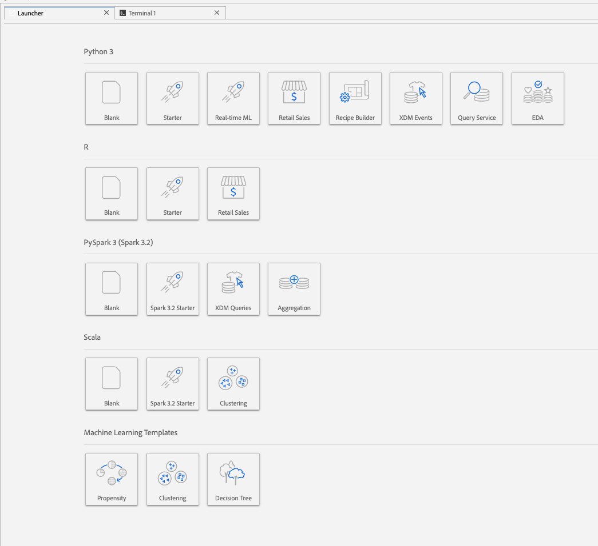

# Analizar los datos con portátiles

Este tutorial se centra en cómo utilizar los equipos portátiles Jupyter, creados dentro de Data Science Workspace, para acceder, explorar y visualizar sus datos. Al final de este tutorial, debe comprender algunas de las funciones que ofrece Jupyter Notebooks para comprender mejor sus datos.

Se introducen los siguientes conceptos:

- **[!DNL JupyterLab]:** [[!DNL JupyterLab]](https://blog.jupyter.org/jupyterlab-is-ready-for-users-5a6f039b8906) es la interfaz basada en web de próxima generación para Project Jupyter y está estrechamente integrada en [!DNL Adobe Experience Platform].
- **Lotes:** Los conjuntos de datos están formados por lotes. Un lote es un conjunto de datos recopilados durante un período de tiempo y procesados juntos como una sola unidad. Se crean nuevos lotes cuando se agregan datos a un conjunto de datos.
- **SDK de acceso a datos (obsoleto):** El SDK de acceso a datos ya no se utiliza. Utilice el [[!DNL Platform SDK]](../authoring/platform-sdk.md) guía.

## Explorar blocs de notas en Data Science Workspace

En esta sección, se exploran los datos que anteriormente se incorporaban al esquema de ventas minoristas.

Data Science Workspace permite a los usuarios crear [!DNL Jupyter Notebooks] a través de [!DNL JupyterLab] plataforma en la que pueden crear y editar flujos de trabajo de aprendizaje automático. [!DNL JupyterLab] es una herramienta de colaboración servidor-cliente que permite a los usuarios editar documentos del bloc de notas a través de un explorador web. Estos blocs de notas pueden contener tanto código ejecutable como elementos de texto enriquecido. Para nuestros fines, utilizaremos Markdown para la descripción del análisis y el ejecutable [!DNL Python] código para realizar análisis y exploración de datos.

### Elija el espacio de trabajo

Al iniciar [!DNL JupyterLab], tenemos una interfaz web para Jupyter Notebooks. Dependiendo del tipo de cuaderno que escojamos, se iniciará un núcleo correspondiente.

Al comparar qué entorno utilizar, debemos tener en cuenta las limitaciones de cada servicio. Por ejemplo, si utilizamos la variable [pandas](https://pandas.pydata.org/) biblioteca con [!DNL Python], como usuario normal, el límite de RAM es de 2 GB. Incluso como usuario de energía, estaríamos limitados a 20 GB de RAM. Si se trata de cálculos más grandes, tendría sentido utilizarlos [!DNL Spark] que ofrece 1,5 TB que se comparte con todas las instancias del bloc de notas.

De forma predeterminada, la fórmula Tensorflow funciona en un clúster de GPU y Python se ejecuta dentro de un clúster de CPU.

### Crear un bloc de notas nuevo

En el [!DNL Adobe Experience Platform] IU, seleccione [!UICONTROL Ciencia de datos] en el menú superior para llevarle a Data Science Workspace. En esta página, seleccione [!DNL JupyterLab] para abrir el [!DNL JupyterLab] lanzador. Debería ver una página similar a esta.



En nuestro tutorial, se utilizará [!DNL Python] 3 en Jupyter Notebook para mostrar cómo acceder y explorar los datos. En la página Lanzador, se proporcionan muestras de portátiles. Utilizaremos la receta de ventas minoristas para [!DNL Python] 3.


La fórmula de ventas minoristas es un ejemplo independiente que utiliza el mismo conjunto de datos de ventas minoristas para mostrar cómo se pueden explorar y visualizar los datos en Jupyter Notebook. Además, el cuaderno de notas va más allá con capacitación y verificación. Encontrará más información sobre este bloc de notas específico en esta [tutorial](../walkthrough.md).

### Acceso a datos

>[!NOTE]
>
>La variable `data_access_sdk_python` está en desuso y ya no se recomienda. Consulte la [conversión del SDK de acceso a datos a Platform SDK](../authoring/platform-sdk.md) tutorial para convertir el código. Los mismos pasos que se indican a continuación se siguen aplicando para este tutorial.

Pasaremos a acceder a los datos internamente desde [!DNL Adobe Experience Platform] y datos externos. Usaremos el `data_access_sdk_python` para acceder a datos internos como conjuntos de datos y esquemas XDM. Para los datos externos, se utilizan los paneles [!DNL Python] biblioteca.

#### Datos externos

Con el bloc de notas Venta minorista abierto, busque el encabezado &quot;Cargar datos&quot;. Lo siguiente [!DNL Python] el código utiliza pandas&#39; `DataFrame` estructura de datos y [read_csv()](https://pandas.pydata.org/pandas-docs/stable/generated/pandas.read_csv.html#pandas.read_csv) para leer el CSV alojado en [!DNL Github] en el DataFrame:


La estructura de datos DataFrame de Pandas es una estructura de datos etiquetada bidimensional. Para ver rápidamente las dimensiones de nuestros datos, podemos usar la variable `df.shape`. Esto devuelve un tuple que representa la dimensión del DataFrame:


Por último, podemos echar un vistazo a cómo se ven nuestros datos. Podemos usar `df.head(n)` para ver la primera `n` filas del DataFrame:


#### [!DNL Experience Platform] data

Ahora vamos a seguir accediendo [!DNL Experience Platform] datos.

##### Por ID de conjunto de datos

Para esta sección, se utiliza el conjunto de datos de ventas minoristas, que es el mismo conjunto de datos utilizado en el bloc de notas de muestra de ventas minoristas.

En Jupyter Notebook, puede acceder a sus datos desde el **Datos** ficha  a la izquierda. Al seleccionar la pestaña , se proporcionan dos carpetas. Seleccione el **[!UICONTROL Conjuntos de datos]** carpeta.


Ahora, en el directorio Conjuntos de datos, puede ver todos los conjuntos de datos introducidos. Tenga en cuenta que puede tardar un minuto en cargar todas las entradas si el directorio está muy poblado con conjuntos de datos.

Dado que el conjunto de datos es el mismo, queremos reemplazar los datos de carga de la sección anterior que utiliza datos externos. Seleccione el bloque de código de **Cargar datos** y presione la tecla **&#39;d&#39;** en el teclado dos veces. Asegúrese de que el foco esté en el bloque y no en el texto. Puede pulsar **&#39;esc&#39;** para omitir el enfoque del texto antes de pulsar **&#39;d&#39;** dos veces.

Ahora, podemos hacer clic en el botón `Retail-Training-<your-alias>` y seleccione la opción &quot;Explorar datos en el bloc de notas&quot; en la lista desplegable. Aparecerá una entrada de código ejecutable en el bloc de notas.

>[!TIP]
>
>Consulte la [[!DNL Platform SDK]](../authoring/platform-sdk.md) para convertir el código.

```PYTHON
from data_access_sdk_python.reader import DataSetReader
from datetime import date
reader = DataSetReader()
df = reader.load(data_set_id="xxxxxxxx", ims_org="xxxxxxxx@AdobeOrg")
df.head()
```

Si está trabajando en otros núcleos que no sean [!DNL Python], consulte [esta página](https://github.com/adobe/acp-data-services-dsw-reference/wiki/Accessing-Data-on-the-Platform) para acceder a los datos del [!DNL Adobe Experience Platform].

Si selecciona la celda ejecutable y pulsa el botón de reproducción en la barra de herramientas, se ejecutará el código ejecutable. El resultado de `head()` será una tabla con las claves de su conjunto de datos como columnas y las primeras n filas en el conjunto de datos. `head()` acepta un argumento integer para especificar cuántas líneas se van a generar. De forma predeterminada, es 5.


Si reinicia el núcleo y vuelve a ejecutar todas las celdas, debería obtener los mismos resultados que antes.


### Exploración de los datos

Ahora que podemos acceder a sus datos, centrémonos en los propios datos mediante estadísticas y visualización. El conjunto de datos que estamos usando es un conjunto de datos minorista que proporciona información diversa sobre 45 almacenes diferentes en un día determinado. Algunas características de un `date` y `store` incluya lo siguiente:
- `storeType`
- `weeklySales`
- `storeSize`
- `temperature`
- `regionalFuelPrice`
- `markDown`
- `cpi`
- `unemployment`
- `isHoliday`

#### Resumen estadístico

Podemos aprovechar [!DNL Python's] biblioteca pandas para obtener el tipo de datos de cada atributo. El resultado de la siguiente llamada nos proporcionará información sobre el número de entradas y el tipo de datos de cada una de las columnas:

```PYTHON
df.info()
```


Esta información es útil, ya que conocer el tipo de datos de cada columna nos permitirá saber cómo tratar los datos.

Ahora veamos el resumen estadístico. Solo se mostrarán los tipos de datos numéricos, por lo que `date`, `storeType`y `isHoliday` no se genera:

```PYTHON
df.describe()
```


Con esto, podemos ver que hay 6435 instancias para cada característica. Además, se proporciona información estadística como media, desviación estándar (std), min, max e intercuarartiles. Esto nos proporciona información sobre la desviación de los datos. En la siguiente sección, analizaremos la visualización que funciona junto con esta información para darnos una buena comprensión de nuestros datos.

Mirar los valores mínimo y máximo de `store`, podemos ver que hay 45 almacenes únicos que representan los datos. También hay `storeTypes` que diferencian lo que es una tienda. Podemos ver la distribución de `storeTypes` haciendo lo siguiente:


Esto significa que 22 tiendas son de `storeType` `A`, 17 son `storeType` `B`y 6 son `storeType` `C`.

#### Visualización de datos

Ahora que conocemos los valores de los marcos de datos, queremos complementar esto con visualizaciones para que las cosas sean más claras y fáciles de identificar patrones. Los gráficos también son útiles para transmitir resultados a una audiencia. Algunas [!DNL Python] las bibliotecas que son útiles para la visualización incluyen:
- [Matplotlib](https://matplotlib.org/)
- [pandas](https://pandas.pydata.org/)
- [seaborn](https://seaborn.pydata.org/)
- [diagrama de tráfico](https://ggplot2.tidyverse.org/)

En esta sección, analizaremos rápidamente algunas ventajas para utilizar cada biblioteca.

[Matplotlib](https://matplotlib.org/) es el más antiguo [!DNL Python] paquete de visualización. Su objetivo es hacer que &quot;las cosas fáciles sean fáciles y difíciles posibles&quot;. Esto tiende a ser cierto, ya que el paquete es extremadamente poderoso pero también viene con complejidad. No siempre es fácil obtener un gráfico de aspecto razonable sin tardar una cantidad considerable de tiempo y esfuerzo.

[Pandas](https://pandas.pydata.org/) se utiliza principalmente para su objeto DataFrame, que permite la manipulación de datos con la indexación integrada. Sin embargo, los pandas también incluyen una funcionalidad de trazado integrada que se basa en matplotlib.

[seaborn](https://seaborn.pydata.org/) es un paquete creado sobre matplotlib. Su objetivo principal es hacer que los gráficos predeterminados sean más atractivos visualmente y simplificar la creación de gráficos complicados.

[diagrama de tráfico](https://ggplot2.tidyverse.org/) es un paquete también construido sobre matplotlib. Sin embargo, la diferencia principal es que la herramienta es un puerto de ggplot2 para R. Similar a Seaborn, el objetivo es mejorar sobre matplotlib. Los usuarios familiarizados con ggplot2 para R deben tener en cuenta esta biblioteca.


##### Univar gráficos

Los gráficos uniformes son gráficos de una variable individual. Para visualizar los datos se utiliza un gráfico univariado común: el gráfico de cajas y whiskies.

Utilizando nuestro conjunto de datos minoristas de antes, podemos generar el gráfico de cajas y whiskys para cada una de las 45 tiendas y sus ventas semanales. El diagrama se genera mediante la variable `seaborn.boxplot` función.


Para mostrar la distribución de datos se utiliza un diagrama de cajas y de whiskies. Las líneas exteriores del trazado muestran los cuartiles superior e inferior, mientras que el cuadro abarca el intervalo intercuartil. La línea del cuadro marca la mediana. Cualquier punto de datos que supere 1,5 veces el cuartil superior o inferior se marcará como un círculo. Estos puntos se consideran periféricos.

##### Gráficos multivariados

Los gráficos multivariados se utilizan para ver la interacción entre variables. Con la visualización, los científicos de datos pueden ver si hay correlaciones o patrones entre las variables. Un gráfico multivariable común es una matriz de correlación. Con una matriz de correlación, las dependencias entre varias variables se cuantifican con el coeficiente de correlación.

Con el mismo conjunto de datos comercial, podemos generar la matriz de correlación.


Fíjense en la diagonal de 1&#39;s hacia abajo en el centro. Esto muestra que cuando se compara una variable con sí misma, tiene una correlación positiva completa. Una correlación positiva fuerte tendrá una magnitud más cercana a 1, mientras que las correlaciones débiles estarán más cerca de 0. La correlación negativa se muestra con un coeficiente negativo que muestra una tendencia inversa.


## Pasos siguientes

Este tutorial trata sobre cómo crear un nuevo bloc de notas de Jupyter en el espacio de trabajo de ciencia de datos y cómo acceder a los datos tanto externamente como desde [!DNL Adobe Experience Platform]. Específicamente, seguimos los siguientes pasos:
- Crear un nuevo bloc de notas de Jupyter
- Acceso a conjuntos de datos y esquemas
- Explorar conjuntos de datos

Ahora está listo para continuar con el [sección siguiente](../models-recipes/package-source-files-recipe.md) para empaquetar una fórmula e importarla a Data Science Workspace.
