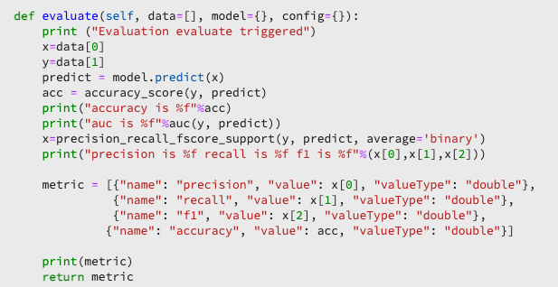

# Crear un modelo con portátiles de JupyterLab

Este tutorial le guía por los pasos necesarios para crear un modelo utilizando la plantilla de generador de fórmulas de blocs de notas de JupyterLab .

## Conceptos introducidos:

- **Fórmulas:** Una fórmula es el término del Adobe para una especificación de modelo y es un contenedor de nivel superior que representa un aprendizaje automático específico, un algoritmo AI o un conjunto de algoritmos, lógica de procesamiento y configuración necesarios para crear y ejecutar un modelo entrenado.
- **Modelo:** Un modelo es una instancia de una fórmula de aprendizaje automático que se enseña mediante datos y configuraciones históricos para resolver un caso de uso empresarial.
- **Formación:** La formación es el proceso de aprendizaje de patrones y perspectivas a partir de datos etiquetados.
- **Puntuación:** La puntuación es el proceso de generación de perspectivas a partir de datos mediante un modelo entrenado.

## Descargar los recursos necesarios {#assets}

Antes de continuar con este tutorial, debe crear los esquemas y conjuntos de datos necesarios. Visite el tutorial para [creación de esquemas y conjuntos de datos del modelo de propensión de Luma](../models-recipes/create-luma-data.md) para descargar los recursos necesarios y configurar los requisitos previos.

## Introducción a [!DNL JupyterLab] entorno de bloc de notas

La creación de una fórmula desde cero se puede realizar dentro de [!DNL Data Science Workspace]. Para empezar, vaya a [Adobe Experience Platform](https://platform.adobe.com) y seleccione **[!UICONTROL Portátiles]** a la izquierda. Para crear un bloc de notas nuevo, seleccione la plantilla Generador de fórmulas en el [!DNL JupyterLab Launcher].

La variable [!UICONTROL Generador de fórmulas] El bloc de notas le permite ejecutar ejecuciones de capacitación y puntuación dentro del bloc de notas. Esto le proporciona flexibilidad para realizar cambios en sus `train()` y `score()` métodos entre la ejecución de experimentos en los datos de capacitación y puntuación. Una vez que esté satisfecho con los resultados de la formación y puntuación, puede crear una fórmula y además publicarla como un modelo utilizando la fórmula para modelar la funcionalidad.

>[!NOTE]
>
>La variable [!UICONTROL Generador de fórmulas] el bloc de notas admite trabajar con todos los formatos de archivo, pero actualmente la funcionalidad crear fórmula solo admite [!DNL Python].


Al seleccionar la variable [!UICONTROL Generador de fórmulas] bloc de notas desde el lanzador, el bloc de notas se abre en una nueva ficha.

En la nueva ficha del bloc de notas de la parte superior, se carga una barra de herramientas que contiene tres acciones adicionales: **[!UICONTROL Tren]**, **[!UICONTROL Puntuación]** y **[!UICONTROL Crear fórmula]**. Estos iconos solo aparecen en la sección [!UICONTROL Generador de fórmulas] bloc de notas. Se proporciona más información sobre estas acciones [en la sección formación y puntuación](#training-and-scoring) después de crear la fórmula en el bloc de notas.


## Introducción a [!UICONTROL Generador de fórmulas] bloc de notas

En la carpeta de recursos proporcionada se encuentra un modelo de propensión de Luma `propensity_model.ipynb`. Con la opción cargar bloc de notas en JupyterLab, cargue el modelo proporcionado y abra el bloc de notas.


El resto de este tutorial cubre los siguientes archivos predefinidos en el bloc de notas del modelo de propensión:

- [Archivo de requisitos](#requirements-file)
- [Archivos de configuración](#configuration-files)
- [Cargador de datos de formación](#training-data-loader)
- [Cargador de datos de puntuación](#scoring-data-loader)
- [Archivo de canalización](#pipeline-file)
- [Archivo de evaluador](#evaluator-file)
- [Archivo de almacenamiento de datos](#data-saver-file)

El siguiente tutorial de vídeo explica el bloc de notas del modelo de propensión de Luma:

>[!VIDEO](https://video.tv.adobe.com/v/333570)

### Archivo de requisitos {#requirements-file}

El archivo de requisitos se utiliza para declarar bibliotecas adicionales que desee utilizar en el modelo. Puede especificar el número de versión si hay una dependencia. Para buscar bibliotecas adicionales, visite [anaconda.org](https://anaconda.org). Para aprender a dar formato al archivo de requisitos, visite [Conda](https://docs.conda.io/projects/conda/en/latest/user-guide/tasks/manage-environments.html#creating-an-environment-file-manually). La lista de bibliotecas principales que ya se están utilizando incluye:

```JSON
python=3.6.7
scikit-learn
pandas
numpy
data_access_sdk_python
```

>[!NOTE]
>
>Las bibliotecas o versiones específicas que agregue pueden ser incompatibles con las bibliotecas anteriores. Además, si decide crear un archivo de entorno manualmente, la variable `name` no se permite sobrescribir el campo.

Para el bloc de notas del modelo de propensión de Luma, no es necesario actualizar los requisitos.

### Archivos de configuración {#configuration-files}

Los archivos de configuración, `training.conf` y `scoring.conf`, se utilizan para especificar los conjuntos de datos que desea utilizar para la formación y la puntuación, así como para añadir hiperparámetros. Existen configuraciones independientes para la capacitación y la puntuación.

Para que un modelo ejecute la formación, debe proporcionar la variable `trainingDataSetId`, `ACP_DSW_TRAINING_XDM_SCHEMA`y `tenantId`. Además, para la puntuación, debe proporcionar la variable `scoringDataSetId`, `tenantId`y `scoringResultsDataSetId `.

Para buscar el conjunto de datos y los ID de esquema, vaya a la pestaña data .  en los blocs de notas de la barra de navegación izquierda (debajo del icono de carpeta). Se deben proporcionar tres ID de conjunto de datos diferentes. La variable `scoringResultsDataSetId` se utiliza para almacenar los resultados de puntuación del modelo y debe ser un conjunto de datos vacío. Estos conjuntos de datos se hicieron anteriormente en la variable [Recursos necesarios](#assets) paso a paso.


La misma información se puede encontrar en [Adobe Experience Platform](https://platform.adobe.com/) en el **[Esquema](https://platform.adobe.com/schema)** y **[Conjuntos de datos](https://platform.adobe.com/dataset/overview)** pestañas.

Una vez finalizada la prueba, la configuración de la formación y la puntuación debe ser similar a la siguiente captura de pantalla:


De forma predeterminada, se establecen los siguientes parámetros de configuración al entrenar y puntuar datos:

- `ML_FRAMEWORK_IMS_USER_CLIENT_ID`
- `ML_FRAMEWORK_IMS_TOKEN`
- `ML_FRAMEWORK_IMS_ML_TOKEN`
- `ML_FRAMEWORK_IMS_TENANT_ID`

## Información sobre el cargador de datos de formación {#training-data-loader}

El propósito del cargador de datos de formación es crear instancias de los datos utilizados para crear el modelo de aprendizaje automático. Normalmente, hay dos tareas que realiza el cargador de datos de capacitación:

- Carga de datos desde [!DNL Platform]
- Preparación de datos e ingeniería de características

Las dos secciones siguientes se ocupan de la carga de datos y la preparación de datos.

### Carga de datos {#loading-data}

Este paso utiliza la variable [dataframe pandas](https://pandas.pydata.org/pandas-docs/stable/generated/pandas.DataFrame.html). Los datos se pueden cargar desde archivos en [!DNL Adobe Experience Platform] mediante las opciones [!DNL Platform] SDK (`platform_sdk`), o bien, desde fuentes externas que utilizan pandas&#39; `read_csv()` o `read_json()` funciones.

- [[!DNL Platform SDK]](#platform-sdk)
- [Fuentes externas](#external-sources)

>[!NOTE]
>
>En el bloc de notas del Creador de fórmulas, los datos se cargan mediante la variable `platform_sdk` cargador de datos.

### SDK de [!DNL Platform] {#platform-sdk}

Para ver un tutorial en profundidad sobre el uso de la variable `platform_sdk` cargador de datos, visite [Guía del SDK de plataforma](../authoring/platform-sdk.md). Este tutorial proporciona información sobre la autenticación de compilación, la lectura básica de datos y la escritura básica de datos.

### Fuentes externas {#external-sources}

Esta sección le muestra cómo importar un archivo JSON o CSV a un objeto pandas. La documentación oficial de la biblioteca pandas puede encontrarse aquí:
- [read_csv](https://pandas.pydata.org/pandas-docs/stable/generated/pandas.read_csv.html)
- [read_json](https://pandas.pydata.org/pandas-docs/stable/generated/pandas.read_json.html)

En primer lugar, aquí tiene un ejemplo de importación de un archivo CSV. La variable `data` es la ruta al archivo CSV. Esta variable se importó desde la variable `configProperties` en el [sección anterior](#configuration-files).

```PYTHON
df = pd.read_csv(data)
```

También puede importar desde un archivo JSON. La variable `data` es la ruta al archivo CSV. Esta variable se importó desde la variable `configProperties` en el [sección anterior](#configuration-files).

```PYTHON
df = pd.read_json(data)
```

Ahora los datos se encuentran en el objeto dataframe y se pueden analizar y manipular en la variable [sección siguiente](#data-preparation-and-feature-engineering).

## Archivo de carga de datos de formación

En este ejemplo, los datos se cargan mediante el SDK de Platform. La biblioteca se puede importar en la parte superior de la página incluyendo la línea :

`from platform_sdk.dataset_reader import DatasetReader`

A continuación, puede usar la variable `load()` método para obtener el conjunto de datos de formación de la variable `trainingDataSetId` tal como se establece en la configuración (`recipe.conf`).

```PYTHON
def load(config_properties):
    print("Training Data Load Start")

    #########################################
    # Load Data
    #########################################    
    client_context = get_client_context(config_properties)
    dataset_reader = DatasetReader(client_context, dataset_id=config_properties['trainingDataSetId'])
```

>[!NOTE]
>
>Como se menciona en la sección [Sección Archivo de configuración](#configuration-files), se establecen los siguientes parámetros de configuración al acceder a los datos desde el Experience Platform mediante `client_context = get_client_context(config_properties)`:
> - `ML_FRAMEWORK_IMS_USER_CLIENT_ID`
> - `ML_FRAMEWORK_IMS_TOKEN`
> - `ML_FRAMEWORK_IMS_ML_TOKEN`
> - `ML_FRAMEWORK_IMS_TENANT_ID`


Ahora que dispone de sus datos, puede empezar con la preparación de datos y la ingeniería de funciones.

### Preparación de datos e ingeniería de características {#data-preparation-and-feature-engineering}

Una vez cargados los datos, estos deben limpiarse y prepararse. En este ejemplo, el objetivo del modelo es predecir si un cliente va a solicitar un producto o no. Como el modelo no está buscando productos específicos, no es necesario `productListItems` y, por lo tanto, se suelta la columna. A continuación, se sueltan columnas adicionales que solo contienen un valor único o dos valores en una sola columna. Al entrenar un modelo, es importante mantener solamente datos útiles que ayuden a predecir su objetivo.


Una vez que haya descartado los datos innecesarios, puede empezar a trabajar con el ingeniería de características. Los datos de demostración utilizados para este ejemplo no contienen información de sesión. Normalmente, le interesa tener datos sobre las sesiones actuales y pasadas de un cliente en particular. Debido a la falta de información de la sesión, este ejemplo en su lugar imita las sesiones actuales y pasadas a través de la demarcación del recorrido.


Una vez finalizada la demarcación, los datos se etiquetan y se crea un recorrido.


A continuación, las funciones se crean y dividen en pasado y presente. A continuación, todas las columnas que son innecesarias se borran, lo que le deja con los recorridos actuales y anteriores para los clientes de Luma. Estos recorridos contienen información como si un cliente compró un artículo y el recorrido que tomó antes de la compra.


## Cargador de datos de puntuación {#scoring-data-loader}

El procedimiento para cargar los datos para la puntuación es similar al de cargar los datos de capacitación. Si observa de cerca el código, puede ver que todo es igual excepto para la variable `scoringDataSetId` en el `dataset_reader`. Esto se debe a que se utiliza la misma fuente de datos de Luma para la formación y la puntuación.

Si desea utilizar distintos archivos de datos para la formación y la puntuación, el cargador de datos de capacitación y puntuación es independiente. Esto le permite realizar un procesamiento previo adicional, como asignar los datos de capacitación a los datos de puntuación si es necesario.

## Archivo de canalización {#pipeline-file}

La variable `pipeline.py` incluye lógica para la formación y la puntuación.

El propósito de la formación es crear un modelo utilizando características y etiquetas en el conjunto de datos de capacitación. Después de elegir el modelo de formación, debe ajustar el conjunto de datos de formación x e y al modelo y la función devuelve el modelo entrenado.

>[!NOTE]
> 
>Las funciones hacen referencia a la variable de entrada utilizada por el modelo de aprendizaje automático para predecir las etiquetas.


La variable `score()` debe contener el algoritmo de puntuación y devolver una medición para indicar el rendimiento del modelo. La variable `score()` utiliza las etiquetas del conjunto de datos de puntuación y el modelo entrenado para generar un conjunto de funciones predichas. Estos valores predichos se comparan con las características reales del conjunto de datos de puntuación. En este ejemplo, la variable `score()` utiliza el modelo entrenado para predecir características usando las etiquetas del conjunto de datos de puntuación. Se devuelven las funciones predichas.


## Archivo de evaluador {#evaluator-file}

La variable `evaluator.py` contiene lógica sobre cómo se desea evaluar la fórmula entrenada, así como sobre cómo se deben dividir los datos de capacitación.

### Dividir el conjunto de datos {#split-the-dataset}

La fase de preparación de datos para formación requiere dividir el conjunto de datos que se utilizará para la capacitación y la prueba. Esta `val` los datos se utilizan implícitamente para evaluar el modelo una vez que se han entrenado. Este proceso es independiente de la puntuación.

Esta sección muestra los `split()` que carga datos en el bloc de notas y luego limpia los datos eliminando columnas no relacionadas en el conjunto de datos. Desde allí, puede realizar ingeniería de funciones, que es el proceso para crear funciones relevantes adicionales a partir de las funciones sin procesar existentes en los datos.


### Evaluar el modelo entrenado {#evaluate-the-trained-model}

La variable `evaluate()` se realiza una vez entrenado el modelo y devuelve una métrica para indicar el rendimiento del modelo. La variable `evaluate()` utiliza las etiquetas de conjuntos de datos de prueba y el modelo entrenado para predecir un conjunto de funciones. Estos valores predichos se comparan con las características reales del conjunto de datos de prueba. En este ejemplo, las métricas utilizadas son `precision`, `recall`, `f1`y `accuracy`. Observe que la función devuelve un valor `metric` que contiene una matriz de métricas de evaluación. Estas métricas se utilizan para evaluar el rendimiento del modelo entrenado.



Adición `print(metric)` permite ver los resultados de la métrica.


## Archivo de almacenamiento de datos {#data-saver-file}

La variable `datasaver.py` contiene el `save()` y se usa para guardar la predicción mientras se prueba la puntuación. La variable `save()` toma la predicción y usa [!DNL Experience Platform Catalog] API, escribe los datos en el `scoringResultsDataSetId` ha especificado en su `scoring.conf` archivo. Puede


## Capacitación y puntuación {#training-and-scoring}

Cuando haya terminado de realizar cambios en el bloc de notas y quiera entrenar la fórmula, puede seleccionar los botones asociados en la parte superior de la barra para crear una ejecución de formación en la celda. Al seleccionar el botón, aparece un registro de comandos y salidas del script de capacitación en el bloc de notas (debajo de la sección `evaluator.py` ). Conda primero instala todas las dependencias y luego se inicia la formación.

Tenga en cuenta que debe ejecutar la formación al menos una vez para poder ejecutar la puntuación. Al seleccionar la variable **[!UICONTROL Ejecutar puntuación]** se marcará en el modelo entrenado que se generó durante la formación. La secuencia de comandos de puntuación aparece en `datasaver.py`.

Para depurar, si desea ver la salida oculta, agregue `debug` al final de la celda de salida y vuelva a ejecutarla.


## Crear una fórmula {#create-recipe}

Cuando haya terminado de editar la fórmula y esté satisfecho con la salida de formación/puntuación, puede crear una fórmula a partir del bloc de notas seleccionando **[!UICONTROL Crear fórmula]** en la parte superior derecha.


Después de seleccionar **[!UICONTROL Crear fórmula]**, se le pedirá que introduzca un nombre de fórmula. Este nombre representa la fórmula real creada en [!DNL Platform].


Una vez seleccionada **[!UICONTROL Ok]**, comienza el proceso de creación de la fórmula. Esto puede tardar algún tiempo y se muestra una barra de progreso en lugar del botón crear fórmula. Una vez finalizado, puede seleccionar la opción **[!UICONTROL Ver fórmulas]** para llevarlo a la **[!UICONTROL Fórmulas]** ficha **[!UICONTROL Modelos ML]**


>[!CAUTION]
>
> - No elimine ninguna de las celdas del archivo
> - No edite el `%%writefile` línea en la parte superior de las celdas del archivo
> - No cree recetas en distintos blocs de notas al mismo tiempo


## Pasos siguientes {#next-steps}

Al completar este tutorial, ha aprendido a crear un modelo de aprendizaje automático en la [!UICONTROL Generador de fórmulas] bloc de notas. También ha aprendido a utilizar el flujo de trabajo del bloc de notas a la fórmula.

Para seguir aprendiendo a trabajar con recursos dentro de [!DNL Data Science Workspace], visite el [!DNL Data Science Workspace] lista desplegable de fórmulas y modelos .