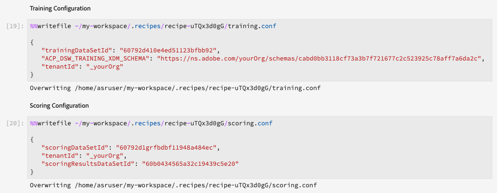
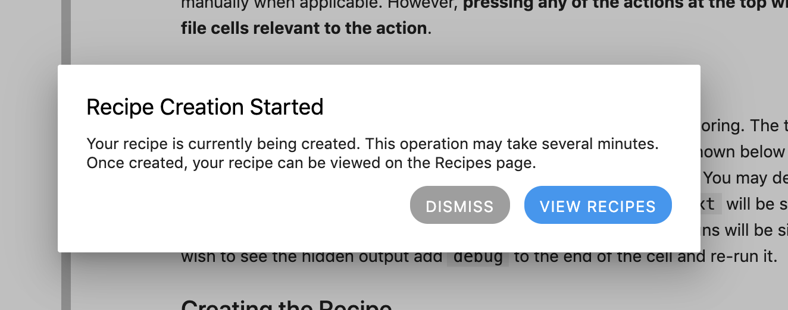

# Crear un modelo con JupyterLab Notebooks

>[!NOTE]
>
>La Espacio de trabajo de ciencia de datos ya no está disponible para su compra.
>
>Esta documentación está destinada a clientes existentes con derechos previos a Data Science Espacio de trabajo.

Este tutorial le guía por los pasos necesarios para crear un modelo mediante el plantilla generador de fórmula de blocs de notas de JupyterLab.

## Conceptos introducidos:

- **Fórmulas:** Una fórmula es el término del Adobe para una especificación de modelo y es un contenedor de nivel superior que representa un aprendizaje automático específico, un algoritmo de IA o un conjunto de algoritmos, una lógica de procesamiento y una configuración necesarios para generar y ejecutar un modelo entrenado.
- **Modelo:** Un modelo es una instancia de una fórmula de aprendizaje automático que se ha entrenado con datos históricos y configuraciones para resolver un caso de uso empresarial.
- **Formación:** La formación es el proceso de aprendizaje de patrones y perspectivas a partir de datos etiquetados.
- **Puntuación:** La puntuación es el proceso de generar información a partir de los datos utilizando un modelo entrenado.

## Descargar los recursos necesarios {#assets}

Antes de continuar con este tutorial, debe crear los esquemas y conjuntos de datos necesarios. Visite el tutorial de [creación de los esquemas y conjuntos de datos del modelo de tendencia de Luma](../models-recipes/create-luma-data.md) para descargar los recursos necesarios y configurar los requisitos previos.

## Introducción al entorno de bloc de notas [!DNL JupyterLab]

La creación de una fórmula desde cero se puede realizar dentro de [!DNL Data Science Workspace]. Para empezar, ve a [Adobe Experience Platform](https://platform.adobe.com) y selecciona la pestaña **[!UICONTROL Notebooks]** que hay a la izquierda. Para crear un nuevo bloc de notas, seleccione la plantilla Generador de fórmulas de [!DNL JupyterLab Launcher].

El bloc de notas [!UICONTROL Generador de fórmulas] le permite ejecutar ejecuciones de entrenamiento y puntuación dentro del bloc de notas. Esto le proporciona la flexibilidad para realizar cambios en los métodos `train()` y `score()` entre la ejecución de experimentos en los datos de entrenamiento y puntuación. Una vez que esté satisfecho con los resultados de la formación y la puntuación, puede crear una fórmula y, además, publicarla como modelo utilizando la fórmula para modelar la funcionalidad.

>[!NOTE]
>
>El bloc de notas [!UICONTROL Generador de fórmulas] admite trabajar con todos los formatos de archivo, pero actualmente la funcionalidad Crear fórmula solo admite [!DNL Python].


Al seleccionar el bloc de notas [!UICONTROL Generador de fórmulas] del iniciador, el bloc de notas se abre en una nueva ficha.

En la nueva pestaña del bloc de notas de la parte superior, se carga una barra de herramientas que contiene tres acciones adicionales: **[!UICONTROL Entrenar]**, **[!UICONTROL Puntuación]** y **[!UICONTROL Crear fórmula]**. Estos iconos sólo aparecen en el bloc de notas [!UICONTROL Generador de fórmulas]. Se proporciona más información sobre estas acciones [en la sección de formación y puntuación](#training-and-scoring) después de crear la fórmula en el bloc de notas.


## Introducción al bloc de notas del [!UICONTROL Generador] de recetas

En la carpeta de activos proporcionada hay un modelo `propensity_model.ipynb`de tendencia de Luma. Con la opción cargar bloc de notas de JupyterLab, cargar el modelo proporcionado y abra el bloc de notas.


El resto de este tutorial cubre los archivos siguientes predefinidos en el bloc de notas del modelo de propensión:

- [Archivo de requisitos](#requirements-file)
- [Archivos de configuración](#configuration-files)
- [Cargador de datos de capacitación](#training-data-loader)
- [Cargador de datos de puntuación](#scoring-data-loader)
- [Archivo de canalización](#pipeline-file)
- [Archivo de evaluador](#evaluator-file)
- [Archivo de Data Saver](#data-saver-file)

El siguiente tutorial de vídeo explica el portátil del modelo de tendencia de Luma:

>[!VIDEO](https://video.tv.adobe.com/v/333570)

### Archivo de requisitos {#requirements-file}

El archivo de requisitos se utiliza para declarar bibliotecas adicionales que desea utilizar en el modelo. Puede especificar el número de versión si hay una dependencia. Para buscar bibliotecas adicionales, visita [anaconda.org](https://anaconda.org). Para aprender a dar formato al archivo de requisitos, visita [Conda](https://docs.conda.io/projects/conda/en/latest/user-guide/tasks/manage-environments.html#creating-an-environment-file-manually). La lista de bibliotecas principales que ya se utilizan incluye:

```JSON
python=3.6.7
scikit-learn
pandas
numpy
data_access_sdk_python
```

>[!NOTE]
>
>Las bibliotecas o versiones específicas que agregue pueden ser incompatibles con los bibliotecas anteriores. Además, si elige crear un archivo de entorno manualmente, no se permite que se sobrescriba el `name` campo.

Para el portátil del modelo de propensión de Luma, no es necesario actualizar los requisitos.

### Archivos de configuración {#configuration-files}

Los archivos de configuración, y `scoring.conf`, se utilizan para especificar los conjuntos de datos que desea utilizar para aprendizaje y puntuación, `training.conf` así como para agregar hiperparámetros. Existen configuraciones independientes para la aprendizaje y la puntuación.

Para que un modelo ejecute aprendizaje, debe proporcionar los elementos , `trainingDataSetId``ACP_DSW_TRAINING_XDM_SCHEMA`, y `tenantId`. Además, para la puntuación, debe proporcionar el `scoringDataSetId`, `tenantId`, y `scoringResultsDataSetId `.

Para buscar los ID de conjunto de datos y esquema, vaya a la pestaña Datos de pestaña  datos de los blocs de notas en la barra de navegación izquierda (debajo del icono de carpeta). Deben proporcionarse tres ID de conjunto de datos diferentes. Se `scoringResultsDataSetId` utiliza para tienda los resultados de la puntuación del modelo y debe ser un conjunto de datos vacío. Estos conjuntos de datos se realizaron anteriormente en el [paso activos](#assets) requerido.


La misma información se puede encontrar en [Adobe Experience Platform en las pestañas Esquema y **[Conjuntos](https://platform.adobe.com/dataset/overview)](https://platform.adobe.com/schema)****de**[ datos.](https://platform.adobe.com/)

Una vez que compita, su configuración de aprendizaje y puntuación debe ser similar a la siguiente captura de pantalla:



De forma predeterminada, se establecen los siguientes parámetros de configuración al entrenar y puntuar datos:

- `ML_FRAMEWORK_IMS_USER_CLIENT_ID`
- `ML_FRAMEWORK_IMS_TOKEN`
- `ML_FRAMEWORK_IMS_ML_TOKEN`
- `ML_FRAMEWORK_IMS_TENANT_ID`

## Explicación del cargador de datos de formación {#training-data-loader}

El propósito del cargador de datos de formación es crear una instancia de los datos utilizados para crear el modelo de aprendizaje automático. Normalmente, el cargador de datos de formación realiza dos tareas:

- Cargando datos de [!DNL Platform]
- Preparación de datos e ingeniería de características

Las dos secciones siguientes se sobrecargarán al cargar datos y preparar datos.

### Cargando datos {#loading-data}

Este paso usa el marco de datos [pandas](https://pandas.pydata.org/pandas-docs/stable/generated/pandas.DataFrame.html). Los datos se pueden cargar desde archivos de [!DNL Adobe Experience Platform] mediante el SDK [!DNL Platform] (`platform_sdk`) o desde fuentes externas mediante las funciones `read_csv()` o `read_json()` de los pandas.

- [[!DNL Platform SDK]](#platform-sdk)
- [Fuentes externas](#external-sources)

>[!NOTE]
>
>En el bloc de notas del Generador de recetas, los datos se cargan a través del cargador de `platform_sdk` datos.

### SDK de [!DNL Platform] {#platform-sdk}

Para obtener una tutorial detallada sobre el uso del cargador de `platform_sdk` datos, visita el guía del SDK de [Platform](../authoring/platform-sdk.md). Este tutorial proporciona información sobre la autenticación versión, la lectura básica de datos y la escritura básica de datos.

### Fuentes externas {#external-sources}

En esta sección se muestra cómo importar un archivo JSON o CSV a un objeto pandas. La documentación oficial de la biblioteca de pandas se puede encontrar aquí:
- [read_csv](https://pandas.pydata.org/pandas-docs/stable/generated/pandas.read_csv.html)
- [read_json](https://pandas.pydata.org/pandas-docs/stable/generated/pandas.read_json.html)

En primer lugar, se muestra un ejemplo de importación de un archivo CSV. El argumento `data` es la ruta al archivo CSV. Esta variable se importó desde `configProperties` en la [sección anterior](#configuration-files).

```PYTHON
df = pd.read_csv(data)
```

También puede importar desde un archivo JSON. El argumento `data` es la ruta al archivo CSV. Esta variable se importó desde `configProperties` en la [sección anterior](#configuration-files).

```PYTHON
df = pd.read_json(data)
```

Ahora sus datos se encuentran en el objeto dataframe y se pueden analizar y manipular en la [siguiente sección](#data-preparation-and-feature-engineering).

## Archivo de cargador de datos de formación

En este ejemplo, los datos se cargan mediante el SDK de Platform. La biblioteca se puede importar en la parte superior de la página incluyendo la línea:

`from platform_sdk.dataset_reader import DatasetReader`

A continuación, puede utilizar el método `load()` para obtener el conjunto de datos de aprendizaje de `trainingDataSetId`, tal como se ha establecido en el archivo de configuración (`recipe.conf`).

```PYTHON
def load(config_properties):
    print("Training Data Load Start")

    #########################################
    # Load Data
    #########################################    
    client_context = get_client_context(config_properties)
    dataset_reader = DatasetReader(client_context, dataset_id=config_properties['trainingDataSetId'])
```

>[!NOTE]
>
>Como se menciona en la [sección del archivo de configuración](#configuration-files), se establecen los siguientes parámetros de configuración al obtener acceso a los datos del Experience Platform mediante `client_context = get_client_context(config_properties)`:
> - `ML_FRAMEWORK_IMS_USER_CLIENT_ID`
> - `ML_FRAMEWORK_IMS_TOKEN`
> - `ML_FRAMEWORK_IMS_ML_TOKEN`
> - `ML_FRAMEWORK_IMS_TENANT_ID`

Ahora que tiene los datos, puede empezar con la preparación de datos y la ingeniería de funciones.

### Preparación de datos e ingeniería de funciones {#data-preparation-and-feature-engineering}

Una vez cargados los datos, deben limpiarse y prepararse para su uso. En este ejemplo, el objetivo del modelo es predecir si un cliente va a pedir un producto o no. Como el modelo no está mirando productos específicos, no necesita `productListItems` y, por lo tanto, se suelta la columna. A continuación, se sueltan columnas adicionales que solo contienen un valor único o dos valores en una sola columna. Al aprendizaje un modelo, es importante mantener solo datos útiles que ayuden a predecir su objetivo.


Una vez que haya eliminado los datos innecesarios, puede comenzar la ingeniería de características. Los datos de demostración utilizados en este ejemplo no contienen ninguna información de sesión. Normalmente, querría tener datos sobre las sesiones actuales y pasadas para un cliente en particular. Debido a la falta de información de la sesión, este ejemplo imita las sesiones actuales y pasadas a través de la demarcación del recorrido.


Una vez completada la demarcación, los datos se etiquetan y se crea un recorrido.


A continuación, las funciones se crean y dividen en pasado y presente. A continuación, se eliminan todas las columnas que sean innecesarias, lo que le deja con los recorridos anteriores y actuales para los clientes de Luma. Estos recorridos contienen información como si un cliente compró un artículo y los recorridos que tomó antes de la compra.


## Cargador de datos de puntuación {#scoring-data-loader}

El procedimiento para cargar datos para la puntuación es similar a cargar datos de formación. Si observa detenidamente el código, verá que todo es igual excepto `scoringDataSetId` en `dataset_reader`. Esto se debe a que se utiliza la misma fuente de datos de Luma tanto para la formación como para la puntuación.

Si desea utilizar diferentes archivos de datos para la formación y la puntuación, el cargador de datos de formación y puntuación son independientes. Esto le permite realizar un preprocesamiento adicional, como asignar los datos de formación a los datos de puntuación si es necesario.

## Archivo de canalización {#pipeline-file}

El archivo `pipeline.py` incluye lógica para aprendizaje y puntuación.

El propósito de aprendizaje es crear un modelo utilizando características y etiquetas en su aprendizaje conjunto de datos. Después de elegir su modelo aprendizaje, debe ajustar sus aprendizaje conjunto de datos x e y al modelo y la función devuelve el modelo entrenado.

>[!NOTE]
> 
>Las características hacen referencia a los variable de entrada utilizados por el modelo de aprendizaje automático para predecir las etiquetas.


La `score()` función debe contener el algoritmo de puntuación y devolver una medición para indicar el éxito del modelo. La `score()` función utiliza las etiquetas de puntuación conjunto de datos y el modelo entrenado para generar un conjunto de entidades previstas. Estos valores de predicción se comparan con las características reales del conjunto de datos de puntuación. En este ejemplo, la `score()` función utiliza el modelo entrenado para predecir entidades mediante las etiquetas del conjunto de datos de puntuación. Se devuelven las características previstas.


## Archivo de evaluador {#evaluator-file}

El `evaluator.py` archivo contiene lógica sobre cómo desea evaluar su fórmula entrenado, así como cómo se debe dividir su datos de capacitación.

### Dividir el conjunto de datos {#split-the-dataset}

La fase de preparación de datos para la formación requiere la división del conjunto de datos que se va a utilizar para la formación y las pruebas. Estos datos de `val` se usan implícitamente para evaluar el modelo después de que se haya entrenado. Este proceso es independiente de la puntuación.

Esta sección muestra la función `split()` que carga datos en el bloc de notas y, a continuación, limpia los datos eliminando las columnas no relacionadas del conjunto de datos. A partir de ahí, puede realizar la ingeniería de funciones, que es el proceso para crear funciones relevantes adicionales a partir de funciones sin procesar existentes en los datos.


### Evaluar el modelo entrenado {#evaluate-the-trained-model}

La `evaluate()` función se realiza después de entrenar el modelo y devuelve un Métrica para indicar el éxito del modelo. La `evaluate()` función utiliza las etiquetas de conjunto de datos de prueba y el modelo entrenado para predecir un conjunto de características. Estos valores predichos se comparan entonces con las funciones reales del conjunto de datos de prueba. En este ejemplo, las métricas utilizadas son `precision`, `recall`, `f1` y `accuracy`. Observe que la función devuelve un objeto `metric` que contiene una matriz de métricas de evaluación. Estas métricas se utilizan para evaluar el rendimiento del modelo entrenado.


Agregar `print(metric)` le permite ver los resultados de las métricas.


## Archivo de ahorro de datos {#data-saver-file}

El `datasaver.py` archivo contiene la función y se utiliza para guardar la predicción mientras se prueba la `save()` puntuación. La `save()` función toma su predicción y, mediante [!DNL Experience Platform Catalog] API, escribe los datos en el `scoringResultsDataSetId` archivo especificado `scoring.conf` . Usted puede


## Entrenamiento y puntuación {#training-and-scoring}

Cuando haya terminado de realizar cambios en el bloc de notas y desee entrenar la fórmula, puede seleccionar los botones asociados en la parte superior de la barra para crear una ejecución de formación en la celda. Al seleccionar el botón, aparece un registro de comandos y salidas del script de formación en el bloc de notas (en la celda `evaluator.py`). Conda instala primero todas las dependencias y, a continuación, se inicia la formación.

Tenga en cuenta que debe ejecutar la formación al menos una vez antes de poder ejecutar la puntuación. Si se selecciona el botón **[!UICONTROL Ejecutar puntuación]**, se puntuará el modelo entrenado que se generó durante la formación. El script de puntuación aparece en `datasaver.py`.

Para fines de depuración, si desea ver el resultado oculta, agréguelo `debug` al final de la celda de salida y vuelva a ejecutarlo.


## Crear una fórmula {#create-recipe}

Cuando haya terminado de editar la fórmula y esté satisfecho con la salida de formación/puntuación, puede crear una fórmula a partir del bloc de notas seleccionando **[!UICONTROL Crear fórmula]** en la parte superior derecha.


Después de seleccionar **[!UICONTROL Crear fórmula]**, se le pedirá que escriba un nombre de fórmula. Este nombre representa la fórmula real creada en [!DNL Platform].


Una vez que seleccione **[!UICONTROL Ok]**, comienza el proceso de creación de fórmula. Esto puede tardar algún tiempo y se muestra una barra de progreso en lugar del botón Crear fórmula. Una vez finalizado, puede seleccionar el botón **[!UICONTROL Ver fórmulas]** para llevarlo a la ficha **[!UICONTROL Recetas]** en **[!UICONTROL Modelos ML]**



>[!CAUTION]
>
> - No elimine ninguna de las celdas del archivo
> - No edite la línea situada en la `%%writefile` parte superior de las celdas del archivo
> - No cree recetas en diferentes blocs de notas al mismo tiempo

## Pasos siguientes {#next-steps}

Al completar este tutorial, habrá aprendido a crear un modelo de aprendizaje automático en el bloc de notas Generador  de recetas. También ha aprendido a ejercitar el cuaderno para fórmula flujo de trabajo.

Para continuar aprendiendo a trabajar con recursos dentro de [!DNL Data Science Workspace], visite la lista desplegable de fórmulas y modelos de [!DNL Data Science Workspace].