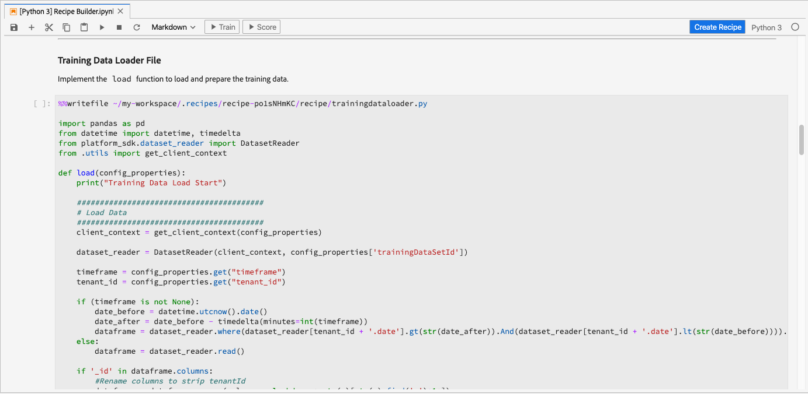

# Crear una fórmula con equipos portátiles Jupyter

Este tutorial irá a dos secciones principales. Primero, creará un modelo de aprendizaje automático con una plantilla dentro de [!DNL JupyterLab Notebook]. A continuación, ejercerá el flujo de trabajo del bloc de notas a la fórmula dentro de [!DNL JupyterLab] para crear una fórmula dentro de [!DNL Data Science Workspace].

## Conceptos introducidos:

- **Fórmulas:** una fórmula es el término de Adobe para una especificación de modelo y es un contenedor de nivel superior que representa un aprendizaje automático específico, un algoritmo AI o un conjunto de algoritmos, una lógica de procesamiento y una configuración necesarios para crear y ejecutar un modelo capacitado y, por tanto, ayuda a resolver problemas empresariales específicos.
- **Modelo:** Un modelo es una instancia de una fórmula de aprendizaje automático que se enseña usando datos históricos y configuraciones para resolver un caso de uso comercial.
- **Formación:** Formación es el proceso de aprendizaje de patrones y perspectivas a partir de datos etiquetados.
- **Puntuación:** Puntuación es el proceso de generación de perspectivas a partir de datos mediante un modelo capacitado.

## Empiece con el entorno del portátil [!DNL JupyterLab]

La creación de una fórmula desde cero se puede realizar dentro de [!DNL Data Science Workspace]. Para inicio, vaya a [Adobe Experience Platform](https://platform.adobe.com) y haga clic en la ficha **[!UICONTROL Equipos portátiles]** de la izquierda. Para crear un nuevo bloc de notas, seleccione la plantilla Generador de fórmulas en [!DNL JupyterLab Launcher].

El bloc de notas [!UICONTROL Generador de fórmulas] permite ejecutar ejecuciones de puntuación y capacitación dentro del bloc de notas. Esto le ofrece la flexibilidad de realizar cambios en sus métodos `train()` y `score()` entre la ejecución de experimentos en los datos de capacitación y puntuación. Una vez que esté satisfecho con los resultados de la capacitación y la puntuación, puede crear una fórmula para utilizarla en [!DNL Data Science Workspace] utilizando el bloc de notas para la funcionalidad de fórmula integrada en el bloc de notas del Creador de fórmulas.

>[!NOTE]
>
>El bloc de notas del Generador de fórmulas admite trabajar con todos los formatos de archivo, pero actualmente la funcionalidad Crear fórmula solo admite [!DNL Python].


Al hacer clic en el bloc de notas del Creador de fórmulas desde el iniciador, el bloc de notas se abre en la ficha. La plantilla utilizada en el bloc de notas es la fórmula Python Retail Sales Forecasting (Previsión de ventas minoristas de Python) que también se encuentra en [este repositorio público](https://github.com/adobe/experience-platform-dsw-reference/tree/master/recipes/python/retail/)

Observará que en la barra de herramientas hay tres acciones adicionales: **[!UICONTROL Train]**, **[!UICONTROL Puntuación]** y **[!UICONTROL Crear fórmula]**. Estos iconos solo aparecen en el bloc de notas [!UICONTROL Generador de fórmulas]. Se hablará de más información sobre estas acciones [en la sección de capacitación y puntuación](#training-and-scoring) después de crear la fórmula en el bloc de notas.


## Edite los archivos de fórmulas

Para realizar modificaciones en los archivos de fórmulas, vaya a la celda de Jupyter correspondiente a la ruta de archivo. Por ejemplo, si desea realizar cambios en `evaluator.py`, busque `%%writefile demo-recipe/evaluator.py`.

Inicio realizando los cambios necesarios en la celda y, cuando termine, simplemente ejecute la celda. El comando `%%writefile filename.py` escribirá el contenido de la celda en `filename.py`. Deberá ejecutar manualmente la celda de cada archivo con cambios.

>[!NOTE]
>
>Debe ejecutar las celdas manualmente cuando corresponda.

## Introducción al bloc de notas del Creador de fórmulas

Ahora que conoce los conceptos básicos del entorno del portátil [!DNL JupyterLab], puede empezar a mirar los archivos que conforman una fórmula de modelo de aprendizaje automático. Los archivos de los que hablaremos se muestran aquí:

- [Archivo de requisitos](#requirements-file)
- [Archivos de configuración](#configuration-files)
- [Cargador de datos de formación](#training-data-loader)
- [Cargador de datos de puntuación](#scoring-data-loader)
- [Archivo de canalización](#pipeline-file)
- [Archivo de evaluador](#evaluator-file)
- [Archivo de Data Saver](#data-saver-file)

### Archivo de requisitos {#requirements-file}

El archivo de requisitos se utiliza para declarar bibliotecas adicionales que desee utilizar en la fórmula. Puede especificar el número de versión si hay una dependencia. Para buscar bibliotecas adicionales, visite [anaconda.org](https://anaconda.org). Para obtener información sobre cómo dar formato al archivo de requisitos, visite [Conda](https://docs.conda.io/projects/conda/en/latest/user-guide/tasks/manage-environments.html#creating-an-environment-file-manually). La lista de las bibliotecas principales que ya se están utilizando incluye:

```JSON
python=3.6.7
scikit-learn
pandas
numpy
data_access_sdk_python
```

>[!NOTE]
>
>Las bibliotecas o versiones específicas que agregue pueden ser incompatibles con las bibliotecas anteriores. Además, si decide crear un archivo entorno manualmente, el campo `name` no se puede anular.

### Archivos de configuración {#configuration-files}

Los archivos de configuración, `training.conf` y `scoring.conf`, se utilizan para especificar los conjuntos de datos que desea utilizar para la capacitación y la puntuación, así como para agregar hiperparámetros. Existen configuraciones independientes para la capacitación y la puntuación.

Los usuarios deben completar las siguientes variables antes de ejecutar la formación y la puntuación:
- `trainingDataSetId`
- `ACP_DSW_TRAINING_XDM_SCHEMA`
- `scoringDataSetId`
- `ACP_DSW_SCORING_RESULTS_XDM_SCHEMA`
- `scoringResultsDataSetId`

Para buscar el conjunto de datos y los ID de esquema, vaya a la ficha Datos de los blocs de notas de la barra de navegación izquierda (debajo del icono de carpeta).


La misma información se puede encontrar en [Adobe Experience Platform](https://platform.adobe.com/) en las fichas **[Esquema](https://platform.adobe.com/schema)** y **[Conjuntos de datos](https://platform.adobe.com/dataset/overview)**.

De forma predeterminada, se establecen los siguientes parámetros de configuración al acceder a los datos:

- `ML_FRAMEWORK_IMS_USER_CLIENT_ID`
- `ML_FRAMEWORK_IMS_TOKEN`
- `ML_FRAMEWORK_IMS_ML_TOKEN`
- `ML_FRAMEWORK_IMS_TENANT_ID`

## Cargador de datos de capacitación {#training-data-loader}

El objetivo del cargador de datos de formación es crear instancias de los datos utilizados para crear el modelo de aprendizaje automático. Normalmente, hay dos tareas que el cargador de datos de formación realizará:
- Cargar datos de [!DNL Platform]
- Preparación de datos e ingeniería de características

Las dos secciones siguientes abarcarán la carga de datos y la preparación de datos.

### Cargando datos {#loading-data}

Este paso utiliza el nombre de datos [pandas](https://pandas.pydata.org/pandas-docs/stable/generated/pandas.DataFrame.html). Los datos se pueden cargar desde archivos en [!DNL Adobe Experience Platform] mediante el [!DNL Platform] SDK (`platform_sdk`) o desde fuentes externas mediante las funciones `read_csv()` o `read_json()` de pandas.

- [[!DNL Platform SDK]](#platform-sdk)
- [Fuentes externas](#external-sources)

>[!NOTE]
>
>En el bloc de notas del Creador de fórmulas, los datos se cargan mediante el cargador de datos `platform_sdk`.

### [!DNL Platform] SDK {#platform-sdk}

Para ver un tutorial detallado sobre el uso del cargador de datos `platform_sdk`, visite la [guía del SDK de la plataforma](../authoring/platform-sdk.md). Este tutorial proporciona información sobre la autenticación de compilación, la lectura básica de datos y la escritura básica de datos.

### Fuentes externas {#external-sources}

Esta sección muestra cómo importar un archivo JSON o CSV a un objeto pandas. La documentación oficial de la biblioteca de pandas puede encontrarse aquí:
- [read_csv](https://pandas.pydata.org/pandas-docs/stable/generated/pandas.read_csv.html)
- [read_json](https://pandas.pydata.org/pandas-docs/stable/generated/pandas.read_json.html)

En primer lugar, aquí se muestra un ejemplo de importación de un archivo CSV. El argumento `data` es la ruta al archivo CSV. Esta variable se importó desde `configProperties` en la [sección anterior](#configuration-files).

```PYTHON
df = pd.read_csv(data)
```

También puede importar desde un archivo JSON. El argumento `data` es la ruta al archivo CSV. Esta variable se importó desde `configProperties` en la [sección anterior](#configuration-files).

```PYTHON
df = pd.read_json(data)
```

Ahora los datos están en el objeto dataframe y se pueden analizar y manipular en la [siguiente sección](#data-preparation-and-feature-engineering).

### Desde el SDK de plataforma

Puede cargar datos con el SDK de plataforma. La biblioteca se puede importar en la parte superior de la página incluyendo la línea:

`from platform_sdk.dataset_reader import DatasetReader`

Luego usamos el método `load()` para obtener el conjunto de datos de capacitación del archivo `trainingDataSetId` como se configuró en el archivo de configuración (`recipe.conf`).

```PYTHON
def load(config_properties):
    print("Training Data Load Start")

    #########################################
    # Load Data
    #########################################    
    client_context = get_client_context(config_properties)
    
    dataset_reader = DatasetReader(client_context, config_properties['trainingDataSetId'])
    
    timeframe = config_properties.get("timeframe")
    tenant_id = config_properties.get("tenant_id")
```

>[!NOTE]
>
>Como se indica en la sección [Archivo de configuración](#configuration-files), al acceder a los datos desde Experience Platform mediante `client_context` se establecen los siguientes parámetros de configuración:
> - `ML_FRAMEWORK_IMS_USER_CLIENT_ID`
> - `ML_FRAMEWORK_IMS_TOKEN`
> - `ML_FRAMEWORK_IMS_ML_TOKEN`
> - `ML_FRAMEWORK_IMS_TENANT_ID`


Ahora que tiene sus datos, puede comenzar con la preparación de datos y la ingeniería de características.

### Preparación de datos e ingeniería de características {#data-preparation-and-feature-engineering}

Una vez cargados los datos, éstos se preparan y luego se dividen en los `train` y `val` conjuntos de datos. A continuación se muestra el código de muestra:

```PYTHON
#########################################
# Data Preparation/Feature Engineering
#########################################
dataframe.date = pd.to_datetime(dataframe.date)
dataframe['week'] = dataframe.date.dt.week
dataframe['year'] = dataframe.date.dt.year

dataframe = pd.concat([dataframe, pd.get_dummies(dataframe['storeType'])], axis=1)
dataframe.drop('storeType', axis=1, inplace=True)
dataframe['isHoliday'] = dataframe['isHoliday'].astype(int)

dataframe['weeklySalesAhead'] = dataframe.shift(-45)['weeklySales']
dataframe['weeklySalesLag'] = dataframe.shift(45)['weeklySales']
dataframe['weeklySalesDiff'] = (dataframe['weeklySales'] - dataframe['weeklySalesLag']) / dataframe['weeklySalesLag']
dataframe.dropna(0, inplace=True)

dataframe = dataframe.set_index(dataframe.date)
dataframe.drop('date', axis=1, inplace=True) 
```

En este ejemplo, se están realizando cinco tareas en el conjunto de datos original:
- agregar columnas `week` y `year`
- convertir `storeType` en una variable de indicador
- convertir `isHoliday` en una variable numérica
- offset `weeklySales` para obtener valor de ventas futuro y pasado
- dividir datos, por fecha, en `train` y `val` dataset

En primer lugar, se crean las columnas `week` y `year` y la columna `date` original se convierte a [!DNL Python] [datetime](https://pandas.pydata.org/pandas-docs/stable/generated/pandas.to_datetime.html). Los valores de semana y año se extraen del objeto datetime.

A continuación, `storeType` se convierte en tres columnas que representan los tres tipos de almacén diferentes (`A`, `B` y `C`). Cada uno contendrá un valor booleano para el estado que `storeType` es verdadero. Se eliminará la columna `storeType`.

De manera similar, `weeklySales` cambia el booleano `isHoliday` a una representación numérica, uno o cero.

Estos datos se dividen entre `train` y `val` dataset.

La función `load()` debe completarse con el conjunto de datos `train` y `val` como resultado.

### Cargador de datos de puntuación {#scoring-data-loader}

El procedimiento para cargar datos para la puntuación es similar al de cargar datos de capacitación en la función `split()`. Utilizamos el SDK de acceso a datos para cargar datos desde el `scoringDataSetId` que se encuentra en nuestro archivo `recipe.conf`.

```PYTHON
def load(config_properties):

    print("Scoring Data Load Start")

    #########################################
    # Load Data
    #########################################
    client_context = get_client_context(config_properties)

    dataset_reader = DatasetReader(client_context, config_properties['scoringDataSetId'])
    timeframe = config_properties.get("timeframe")
    tenant_id = config_properties.get("tenant_id")
```

Después de cargar los datos, se realiza la preparación de los datos y la ingeniería de características.

```PYTHON
    #########################################
    # Data Preparation/Feature Engineering
    #########################################
    if '_id' in dataframe.columns:
        #Rename columns to strip tenantId
        dataframe = dataframe.rename(columns = lambda x : str(x)[str(x).find('.')+1:])
        #Drop id, eventType and timestamp
        dataframe.drop(['_id', 'eventType', 'timestamp'], axis=1, inplace=True)

    dataframe.date = pd.to_datetime(dataframe.date)
    dataframe['week'] = dataframe.date.dt.week
    dataframe['year'] = dataframe.date.dt.year

    dataframe = pd.concat([dataframe, pd.get_dummies(dataframe['storeType'])], axis=1)
    dataframe.drop('storeType', axis=1, inplace=True)
    dataframe['isHoliday'] = dataframe['isHoliday'].astype(int)

    dataframe['weeklySalesAhead'] = dataframe.shift(-45)['weeklySales']
    dataframe['weeklySalesLag'] = dataframe.shift(45)['weeklySales']
    dataframe['weeklySalesDiff'] = (dataframe['weeklySales'] - dataframe['weeklySalesLag']) / dataframe['weeklySalesLag']
    dataframe.dropna(0, inplace=True)

    dataframe = dataframe.set_index(dataframe.date)
    dataframe.drop('date', axis=1, inplace=True)

    print("Scoring Data Load Finish")

    return dataframe
```

Dado que el propósito de nuestro modelo es predecir futuras ventas semanales, deberá crear un conjunto de datos de puntuación utilizado para evaluar el rendimiento de la predicción del modelo.

Este bloc de notas del Generador de fórmulas hace esto compensando nuestras ventas semanales a partir de 7 días. Observe que hay mediciones para 45 almacenes cada semana para que pueda desplazar los `weeklySales` valores 45 datasets hacia adelante en una nueva columna llamada `weeklySalesAhead`.

```PYTHON
df['weeklySalesAhead'] = df.shift(-45)['weeklySales']
```

Del mismo modo, puede crear una columna `weeklySalesLag` desplazando hacia atrás 45. Con esto también puede calcular la diferencia en las ventas semanales y almacenarlas en la columna `weeklySalesDiff`.

```PYTHON
df['weeklySalesLag'] = df.shift(45)['weeklySales']
df['weeklySalesDiff'] = (df['weeklySales'] - df['weeklySalesLag']) / df['weeklySalesLag']
```

Dado que está desactivando los `weeklySales` puntos de datos 45 conjuntos de datos hacia adelante y 45 conjuntos de datos hacia atrás para crear nuevas columnas, los primeros y últimos 45 puntos de datos tendrán valores NaN. Puede eliminar estos puntos de nuestro conjunto de datos mediante la función `df.dropna()` que elimina todas las filas que tienen valores NaN.

```PYTHON
df.dropna(0, inplace=True)
```

La función `load()` del cargador de datos de puntuación debe completarse con el conjunto de datos de puntuación como resultado.

### Archivo de canalización {#pipeline-file}

El archivo `pipeline.py` incluye lógica para la formación y la puntuación.

### Capacitación {#training}

El propósito de la formación es crear un modelo con las funciones y etiquetas de su conjunto de datos de formación.

>[!NOTE]
> 
>Las funciones hacen referencia a la variable de entrada utilizada por el modelo de aprendizaje automático para predecir las etiquetas.

La función `train()` debe incluir el modelo de capacitación y devolver el modelo capacitado. En la [documentación de la guía del usuario &quot;scikit-learn&quot;](https://scikit-learn.org/stable/user_guide.html) se encuentran algunos ejemplos de distintos modelos.

Después de elegir el modelo de formación, ajustará el conjunto de datos de formación x e y al modelo y la función devolverá el modelo entrenado. Un ejemplo que lo muestra es el siguiente:

```PYTHON
def train(configProperties, data):

    print("Train Start")

    #########################################
    # Extract fields from configProperties
    #########################################
    learning_rate = float(configProperties['learning_rate'])
    n_estimators = int(configProperties['n_estimators'])
    max_depth = int(configProperties['max_depth'])


    #########################################
    # Fit model
    #########################################
    X_train = data.drop('weeklySalesAhead', axis=1).values
    y_train = data['weeklySalesAhead'].values

    seed = 1234
    model = GradientBoostingRegressor(learning_rate=learning_rate,
                                      n_estimators=n_estimators,
                                      max_depth=max_depth,
                                      random_state=seed)

    model.fit(X_train, y_train)

    print("Train Complete")

    return model
```

Tenga en cuenta que, según la aplicación, tendrá argumentos en su función `GradientBoostingRegressor()`. `xTrainingDataset` debe contener las características utilizadas para la formación, mientras  `yTrainingDataset` que debe contener las etiquetas.

### Puntuación {#scoring}

La función `score()` debe contener el algoritmo de puntuación y devolver una medición para indicar el rendimiento del modelo. La función `score()` utiliza las etiquetas de conjuntos de datos de puntuación y el modelo capacitado para generar un conjunto de funciones predichas. Estos valores predichos se comparan con las características reales del conjunto de datos de puntuación. En este ejemplo, la función `score()` utiliza el modelo entrenado para predecir las características mediante las etiquetas del conjunto de datos de puntuación. Se devuelven las características predichas.

```PYTHON
def score(configProperties, data, model):

    print("Score Start")

    X_test = data.drop('weeklySalesAhead', axis=1).values
    y_test = data['weeklySalesAhead'].values
    y_pred = model.predict(X_test)

    data['prediction'] = y_pred
    data = data[['store', 'prediction']].reset_index()
    data['date'] = data['date'].astype(str)

    print("Score Complete")

    return data
```

### Archivo de evaluador {#evaluator-file}

El archivo `evaluator.py` contiene la lógica de cómo desea evaluar la fórmula entrenada, así como de cómo deben dividirse los datos de capacitación. En el ejemplo de ventas minoristas, se incluirá la lógica para cargar y preparar los datos de capacitación. Pasaremos por las dos secciones siguientes.

### Dividir el conjunto de datos {#split-the-dataset}

La fase de preparación de datos para la capacitación requiere dividir el conjunto de datos que se utilizará para la capacitación y las pruebas. Estos datos `val` se utilizarán implícitamente para evaluar el modelo después de que se haya entrenado. Este proceso es independiente de la puntuación.

Esta sección mostrará la función `split()` que primero cargará datos en el bloc de notas y luego limpiará los datos eliminando columnas no relacionadas en el conjunto de datos. Desde allí, podrá realizar ingeniería de funciones, que es el proceso para crear funciones relevantes adicionales a partir de las funciones sin procesar existentes en los datos. A continuación se puede ver un ejemplo de este proceso junto con una explicación.

La función `split()` se muestra a continuación. El dataframe proporcionado en el argumento se dividirá en las variables `train` y `val` que se devolverá.

```PYTHON
def split(self, configProperties={}, dataframe=None):
    train_start = '2010-02-12'
    train_end = '2012-01-27'
    val_start = '2012-02-03'
    train = dataframe[train_start:train_end]
    val = dataframe[val_start:]

    return train, val
```

### Evalúe el modelo capacitado {#evaluate-the-trained-model}

La función `evaluate()` se realiza después de que se capacite al modelo y devuelve una métrica para indicar el rendimiento del modelo. La función `evaluate()` utiliza las etiquetas de conjunto de datos de prueba y el modelo Capacitado para predecir un conjunto de características. Estos valores predichos se comparan con las características reales del conjunto de datos de prueba. Los algoritmos de puntuación comunes incluyen:
- [Error medio de porcentaje absoluto (MAPE)](https://en.wikipedia.org/wiki/Mean_absolute_percentage_error)
- [Error absoluto medio (MAE)](https://en.wikipedia.org/wiki/Mean_absolute_error)
- [Error de raíz media cuadrada (RMSE)](https://en.wikipedia.org/wiki/Root-mean-square_deviation)


La función `evaluate()` de la muestra de ventas minoristas se muestra a continuación:

```PYTHON
def evaluate(self, data=[], model={}, configProperties={}):
    print ("Evaluation evaluate triggered")
    val = data.drop('weeklySalesAhead', axis=1)
    y_pred = model.predict(val)
    y_actual = data['weeklySalesAhead'].values
    mape = np.mean(np.abs((y_actual - y_pred) / y_actual))
    mae = np.mean(np.abs(y_actual - y_pred))
    rmse = np.sqrt(np.mean((y_actual - y_pred) ** 2))

    metric = [{"name": "MAPE", "value": mape, "valueType": "double"},
                {"name": "MAE", "value": mae, "valueType": "double"},
                {"name": "RMSE", "value": rmse, "valueType": "double"}]

    return metric
```

Observe que la función devuelve un objeto `metric` que contiene una matriz de métricas de evaluación. Estas métricas se utilizarán para evaluar el rendimiento del modelo capacitado.

### Archivo de Data Saver {#data-saver-file}

El archivo `datasaver.py` contiene la función `save()` para guardar la predicción mientras se prueba la puntuación. La función `save()` tomará la predicción y utilizará las API [!DNL Experience Platform Catalog], escribirá los datos en el `scoringResultsDataSetId` que especificó en su archivo `scoring.conf`.

El ejemplo utilizado en la fórmula de muestra de ventas minoristas se muestra aquí. Tenga en cuenta el uso de la biblioteca `DataSetWriter` para escribir datos en la plataforma:

```PYTHON
from data_access_sdk_python.writer import DataSetWriter

def save(configProperties, prediction):
    print("Datasaver Start")
    print("Setting up Writer")

    catalog_url = "https://platform.adobe.io/data/foundation/catalog"
    ingestion_url = "https://platform.adobe.io/data/foundation/import"

    writer = DataSetWriter(catalog_url=catalog_url,
                           ingestion_url=ingestion_url,
                           client_id=configProperties['ML_FRAMEWORK_IMS_USER_CLIENT_ID'],
                           user_token=configProperties['ML_FRAMEWORK_IMS_TOKEN'],
                           service_token=configProperties['ML_FRAMEWORK_IMS_ML_TOKEN'])

    print("Writer Configured")

    writer.write(data_set_id=configProperties['scoringResultsDataSetId'],
                 dataframe=prediction,
                 ims_org=configProperties['ML_FRAMEWORK_IMS_TENANT_ID'])

    print("Write Done")
    print("Datasaver Finish")
    print(prediction)
```

## Capacitación y puntuación {#training-and-scoring}

Cuando haya terminado de realizar cambios en el bloc de notas y quiera entrenar la fórmula, puede hacer clic en los botones asociados en la parte superior de la barra para crear una ejecución de formación en la celda. Al hacer clic en el botón, aparecerá un registro de comandos y resultados del script de capacitación en el bloc de notas (debajo de la celda `evaluator.py`). Conda primero instala todas las dependencias y luego se inicia la formación.

Tenga en cuenta que debe ejecutar la formación al menos una vez para poder ejecutar la puntuación. Al hacer clic en el botón **[!UICONTROL Ejecutar Puntuación]**, se anotará en el modelo entrenado que se generó durante la capacitación. La secuencia de comandos de puntuación aparecerá en `datasaver.py`.

Para depurar, si desea ver la salida oculta, agregue `debug` al final de la celda de salida y vuelva a ejecutarla.

## Crear fórmula {#create-recipe}

Cuando haya terminado de editar la fórmula y esté satisfecho con el resultado de la prueba/puntuación, puede crear una fórmula a partir del bloc de notas pulsando **[!UICONTROL Crear fórmula]** en la navegación superior derecha.



Después de pulsar el botón, se le pedirá que introduzca un nombre de fórmula. Este nombre representa la fórmula real creada en [!DNL Platform].


Una vez que presione **[!UICONTROL Ok]** podrá navegar a la nueva fórmula en [Adobe Experience Platform](https://platform.adobe.com/). Puede hacer clic en el botón **[!UICONTROL Fórmulas de Vista]** para ir a la ficha **[!UICONTROL Fórmulas]** en **[!UICONTROL Modelos ML]**


Una vez completado el proceso, la fórmula tendrá este aspecto:


>[!CAUTION]
>
> - No eliminar ninguna de las celdas de archivo
> - No edite la línea `%%writefile` en la parte superior de las celdas del archivo
> - No crear fórmulas en diferentes blocs de notas al mismo tiempo


## Pasos siguientes {#next-steps}

Al completar este tutorial, ha aprendido a crear un modelo de aprendizaje automático en el bloc de notas del Creador de fórmulas. También ha aprendido a ejercitar el flujo de trabajo del bloc de notas a la fórmula dentro del bloc de notas para crear una fórmula dentro de [!DNL Data Science Workspace].

Para seguir aprendiendo a trabajar con recursos dentro de [!DNL Data Science Workspace], visite la lista desplegable [!DNL Data Science Workspace] fórmulas y modelos.

## Recursos adicionales {#additional-resources}

El siguiente vídeo está diseñado para ayudarle a crear e implementar modelos.

>[!VIDEO](https://video.tv.adobe.com/v/30575?quality=12&enable10seconds=on&speedcontrol=on)


