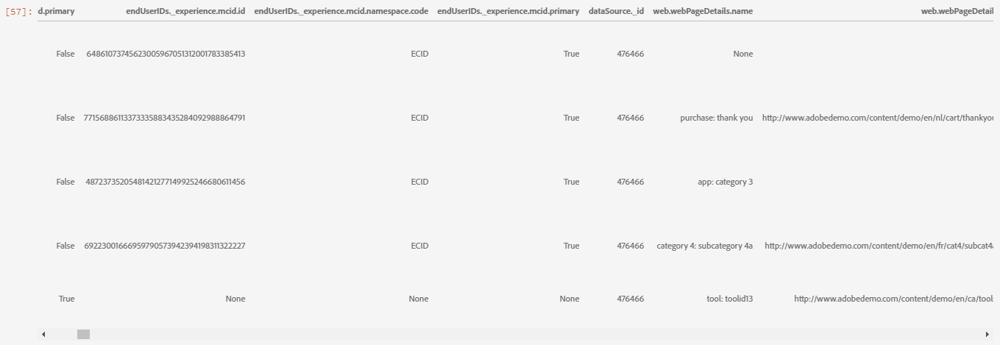

# Exploración de datos basados en web para modelos predictivos mediante el uso del portátil de análisis de datos exploratoria (EDA)

El portátil de análisis de datos exploratoria (EDA) está diseñado para ayudarle a descubrir patrones en los datos, comprobar la integridad de los datos y resumir los datos relevantes para modelos predictivos.

El ejemplo de portátil EDA se optimizó teniendo en cuenta los datos basados en web y consta de dos partes. La primera parte inicio con el uso del servicio de Consulta para la vista de las tendencias y las instantáneas de datos. A continuación, con un objetivo en mente para la análisis de datos exploratorios, los datos se agregan a nivel de perfil y visitante.

La segunda parte inicio realizando una análisis descriptiva de los datos agregados mediante bibliotecas Python. Este bloc de notas muestra visualizaciones como histogramas, gráficos de puntos, gráficos de cuadros y una matriz de correlación para obtener perspectivas procesables utilizadas para determinar qué características pueden resultar más útiles para predecir un objetivo.

## Primeros pasos

Antes de leer esta guía, consulte la [[!DNL JupyterLab] guía del usuario](./overview.md) para obtener una introducción de alto nivel a [!DNL JupyterLab] y su función dentro de Data Science Workspace. Además, si utiliza sus propios datos, consulte la documentación para obtener acceso a [datos en [!DNL Jupyterlab] blocs de notas](./access-notebook-data.md). Esta guía contiene información importante sobre los límites de datos de los portátiles.

Este bloc de notas utiliza un conjunto de datos de valores medios en forma de datos de Adobe Analytics Experience Eventos que se encuentran en el Analysis Workspace de Analytics. Para utilizar el bloc de notas EDA, debe definir la tabla de datos con los siguientes valores `target_table` y `target_table_id`. Se puede utilizar cualquier conjunto de datos de valores intermedios.

Para encontrar estos valores, siga los pasos descritos en la sección [escribir en un conjunto de datos en python](./access-notebook-data.md#write-python) de la guía de acceso a datos de JupyterLab. El nombre del conjunto de datos (`target_table`) se encuentra en el directorio del conjunto de datos. Una vez que haga clic con el botón secundario en el conjunto de datos para explorar o escribir datos en un bloc de notas, se proporciona una ID de conjunto de datos (`target_table_id`) en la entrada de código ejecutable.

## Detección de datos

Esta sección contiene los pasos de configuración y consultas de ejemplo utilizadas para las tendencias de vista, tales como &quot;las diez ciudades principales por actividad del usuario&quot; o &quot;los diez productos más vistos&quot;.

### Configuración de bibliotecas

JupyterLab admite varias bibliotecas. El siguiente código se puede pegar y ejecutar en una celda de código para recopilar e instalar todos los paquetes necesarios utilizados en este ejemplo. Puede utilizar paquetes adicionales o alternativos fuera de este ejemplo para su propia análisis de datos. Para obtener una lista de los paquetes admitidos, copie y pegue `!pip list --format=columns` en una celda nueva.

```python
!pip install colorama
import chart_studio.plotly as py
import plotly.graph_objs as go
from plotly.offline import iplot
from scipy import stats
import numpy as np
import warnings
warnings.filterwarnings('ignore')
from scipy.stats import pearsonr
import matplotlib.pyplot as plt
from scipy.stats import pearsonr
import pandas as pd
import math
import re
import seaborn as sns
from datetime import datetime
import colorama
from colorama import Fore, Style
pd.set_option('display.max_columns', None)
pd.set_option('display.max_rows', None)
pd.set_option('display.width', 1000)
pd.set_option('display.expand_frame_repr', False)
pd.set_option('display.max_colwidth', -1)
```

### Conectar a Adobe Experience Platform [!DNL Query Service]

[!DNL JupyterLab] en plataforma le permite utilizar SQL en un  [!DNL Python] bloc de notas para acceder a los datos a través del servicio [ de ](https://www.adobe.com/go/query-service-home-en)Consulta. El acceso a los datos a través de [!DNL Query Service] puede ser útil para tratar con grandes datasets debido a sus tiempos de ejecución superiores. Tenga en cuenta que la consulta de datos mediante [!DNL Query Service] tiene un límite de tiempo de procesamiento de diez minutos.

Antes de utilizar [!DNL Query Service] en [!DNL JupyterLab], asegúrese de comprender bien la sintaxis [[!DNL Query Service] SQL](https://www.adobe.com/go/query-service-sql-syntax-en).

Para utilizar el servicio de Consulta en JupyterLab, primero debe crear una conexión entre el portátil Python que trabaja y el servicio de Consulta. Esto se puede lograr ejecutando la siguiente celda.

```python
qs_connect()
```

### Definir el conjunto de datos de valores medios para la exploración

Para comenzar a consultar y explorar datos, se debe proporcionar una tabla de conjuntos de datos de valores medios. Copie y reemplace los valores `table_name` y `table_id` por sus propios valores de tabla de datos.

```python
target_table = "table_name"
target_table_id = "table_id"
```

Una vez completada, esta celda debe tener un aspecto similar al siguiente ejemplo:

```python
target_table = "cross_industry_demo_midvalues"
target_table_id = "5f7c40ef488de5194ba0157a"
```

### Explorar el conjunto de datos para las fechas disponibles

Mediante la celda que se proporciona a continuación, puede realizar la vista del intervalo de fechas cubierto en la tabla. El propósito de explorar el número de días, la primera fecha y la última fecha es ayudar a seleccionar un intervalo de fechas para mayor análisis.

```python
%%read_sql -c QS_CONNECTION
SELECT distinct Year(timestamp) as Year, Month(timestamp) as Month, count(distinct DAY(timestamp)) as Count_days, min(DAY(timestamp)) as First_date, max(DAY(timestamp)) as Last_date, count(timestamp) as Count_hits
from {target_table}
group by Month(timestamp), Year(timestamp)
order by Year, Month;
```

La ejecución de la celda produce el siguiente resultado:


### Configurar fechas para la detección de conjuntos de datos

Después de determinar las fechas disponibles para la detección de conjuntos de datos, es necesario actualizar los parámetros siguientes. Las fechas configuradas en esta celda solo se utilizan para la detección de datos en forma de consultas. Las fechas se actualizan nuevamente a intervalos adecuados para la análisis de datos exploratorios más adelante en esta guía.

```python
target_year = "2020" ## The target year
target_month = "02" ## The target month
target_day = "(01,02,03)" ## The target days
```

### Detección de conjuntos de datos

Una vez configurados todos los parámetros, iniciados [!DNL Query Service] y con un intervalo de fechas, estará listo para empezar a leer filas de datos. Debe limitar el número de filas leídas.

```python
from platform_sdk.dataset_reader import DatasetReader
from datetime import date
dataset_reader = DatasetReader(PLATFORM_SDK_CLIENT_CONTEXT, dataset_id=target_table_id)
# If you do not see any data or would like to expand the default date range, change the following query
Table = dataset_reader.limit(5).read()
```

Para vista del número de columnas disponibles en el conjunto de datos, utilice la siguiente celda:

```python
print("\nNumber of columns:",len(Table.columns))
```

Para vista de las filas del conjunto de datos, utilice la siguiente celda. En este ejemplo, el número de filas está limitado a cinco.

```python
Table.head(5)
```



Una vez que tenga una idea de qué datos contiene el conjunto de datos, puede ser valioso desglosar aún más el conjunto de datos. En este ejemplo, se muestran los nombres de columna y los tipos de datos de cada una de las columnas, mientras que el resultado se utiliza para comprobar si el tipo de datos es correcto o no.

```python
ColumnNames_Types = pd.DataFrame(Table.dtypes)
ColumnNames_Types = ColumnNames_Types.reset_index()
ColumnNames_Types.columns = ["Column_Name", "Data_Type"]
ColumnNames_Types
```


### Exploración de tendencias de conjuntos de datos

La siguiente sección contiene cuatro consultas de ejemplo utilizadas para explorar tendencias y patrones en los datos. Los ejemplos que se proporcionan a continuación no son exhaustivos, pero abarcan algunas de las características que se examinan con mayor frecuencia.

**Recuento de actividades por hora para un día determinado**

Esta consulta analiza el número de acciones y clics a lo largo del día. El resultado se representa en forma de tabla que contiene métricas en el recuento de actividades de cada hora del día.

```sql
%%read_sql query_2_df -c QS_CONNECTION

SELECT Substring(timestamp, 12, 2)                        AS Hour, 
       Count(enduserids._experience.aaid.id) AS Count 
FROM   {target_table}
WHERE  Year(timestamp) = {target_year} 
       AND Month(timestamp) = {target_month}  
       AND Day(timestamp) in {target_day}
GROUP  BY Hour
ORDER  BY Hour;
```


Después de confirmar que la consulta funciona, los datos pueden presentarse en un histograma de diagrama uniforme para la claridad visual.

```python
trace = go.Bar(
    x = query_2_df['Hour'],
    y = query_2_df['Count'],
    name = "Activity Count"
)

layout = go.Layout(
    title = 'Activity Count by Hour of Day',
    width = 1200,
    height = 600,
    xaxis = dict(title = 'Hour of Day'),
    yaxis = dict(title = 'Count')
)

fig = go.Figure(data = [trace], layout = layout)
iplot(fig)
```


**Las 10 páginas más visitadas de un día determinado**

Esta consulta analiza las páginas más vistas de un día determinado. El resultado se representa en forma de tabla que contiene métricas en el nombre de la página y el recuento de vistas de la página.

```sql
%%read_sql query_4_df -c QS_CONNECTION

SELECT web.webpagedetails.name                 AS Page_Name, 
       Sum(web.webpagedetails.pageviews.value) AS Page_Views 
FROM   {target_table}
WHERE  Year(timestamp) = {target_year}
       AND Month(timestamp) = {target_month}
       AND Day(timestamp) in {target_day}
GROUP  BY web.webpagedetails.name 
ORDER  BY page_views DESC 
LIMIT  10;
```

Después de confirmar que la consulta funciona, los datos pueden presentarse en un histograma de diagrama uniforme para la claridad visual.

```python
trace = go.Bar(
    x = query_4_df['Page_Name'],
    y = query_4_df['Page_Views'],
    name = "Page Views"
)

layout = go.Layout(
    title = 'Top Ten Viewed Pages For a Given Day',
    width = 1000,
    height = 600,
    xaxis = dict(title = 'Page_Name'),
    yaxis = dict(title = 'Page_Views')
)

fig = go.Figure(data = [trace], layout = layout)
iplot(fig)
```


**Diez ciudades principales agrupadas por actividad del usuario**

Esta consulta analiza de qué ciudades se originan los datos.

```sql
%%read_sql query_6_df -c QS_CONNECTION

SELECT concat(placeContext.geo.stateProvince, ' - ', placeContext.geo.city) AS state_city, 
       Count(timestamp)                                                     AS Count
FROM   {target_table}
WHERE  Year(timestamp) = {target_year}
       AND Month(timestamp) = {target_month}
       AND Day(timestamp) in {target_day}
GROUP  BY state_city
ORDER  BY Count DESC
LIMIT  10;
```

Después de confirmar que la consulta funciona, los datos pueden presentarse en un histograma de diagrama uniforme para la claridad visual.

```python
trace = go.Bar(
    x = query_6_df['state_city'],
    y = query_6_df['Count'],
    name = "Activity by City"
)

layout = go.Layout(
    title = 'Top Ten Cities by User Activity',
    width = 1200,
    height = 600,
    xaxis = dict(title = 'City'),
    yaxis = dict(title = 'Count')
)

fig = go.Figure(data = [trace], layout = layout)
iplot(fig)
```


**Los diez productos vistos más visitados**

Esta consulta proporciona una lista de los diez productos más visitados. En el ejemplo siguiente, la función `Explode()` se utiliza para devolver cada producto del objeto `productlistitems` a su propia fila. Esto le permite realizar una consulta anidada a vistas de productos acumuladas para diferentes SKU.

```sql
%%read_sql query_7_df -c QS_CONNECTION

SELECT Product_List_Items.sku AS Product_SKU,
       Sum(Product_Views) AS Total_Product_Views
FROM  (SELECT Explode(productlistitems) AS Product_List_Items, 
              commerce.productviews.value   AS Product_Views 
       FROM   {target_table}
       WHERE  Year(timestamp) = {target_year}
              AND Month(timestamp) = {target_month}
              AND Day(timestamp) in {target_day}
              AND commerce.productviews.value IS NOT NULL) 
GROUP BY Product_SKU 
ORDER BY Total_Product_Views DESC
LIMIT  10;
```

Después de confirmar que la consulta funciona, los datos pueden presentarse en un histograma de diagrama uniforme para la claridad visual.

```python
trace = go.Bar(
    x = "SKU-" + query_7_df['Product_SKU'],
    y = query_7_df['Total_Product_Views'],
    name = "Product View"
)

layout = go.Layout(
    title = 'Top Ten Viewed Products',
    width = 1200,
    height = 600,
    xaxis = dict(title = 'SKU'),
    yaxis = dict(title = 'Product View Count')
)

fig = go.Figure(data = [trace], layout = layout)
iplot(fig)
```


Después de explorar las tendencias y los patrones de los datos, debe tener una buena idea de qué características desea crear para predecir un objetivo. El barrido de tablas puede resaltar rápidamente la forma de cada atributo de datos, evidentes tergiversaciones y grandes valores periféricos en los valores y inicios para sugerir relaciones de candidatos para explorar entre atributos.

## Análisis de datos exploratorios

La análisis de datos exploratorios se utiliza para perfeccionar su comprensión de los datos y crear una intuición para preguntas convincentes que pueden utilizarse como base para el modelado.

Después de finalizar el paso de detección de datos, habrá explorado los datos a nivel de evento con algunas agregaciones a nivel de evento, ciudad o ID de usuario para ver las tendencias de un día. Aunque estos datos son importantes, no ofrecen un panorama completo. Todavía no comprende qué impulsa una compra en el sitio web.

Para comprender esto, necesita acumulados datos a nivel de perfil/visitante, definir un objetivo de compra y aplicar conceptos estadísticos como correlación, gráficos de cajas y diagramas de puntos. Estos métodos se utilizan para comparar patrones de actividades para compradores y no compradores en la ventana de predicción que defina.

En esta sección se crean y exploran las siguientes funciones:

- `COUNT_UNIQUE_PRODUCTS_PURCHASED`:: Número de productos únicos comprados.
- `COUNT_CHECK_OUTS`:: Número de cierres de compra.
- `COUNT_PURCHASES`:: Número de compras.
- `COUNT_INSTANCE_PRODUCTADDS`:: Número de instancias de adición de productos.
- `NUMBER_VISITS` :: Número de visitas.
- `COUNT_PAID_SEARCHES`:: Número de búsquedas pagas.
- `DAYS_SINCE_VISIT`:: Número de días transcurridos desde la última visita.
- `TOTAL_ORDER_REVENUE`:: Ingresos totales del pedido.
- `DAYS_SINCE_PURCHASE`:: Número de días desde la compra anterior.
- `AVG_GAP_BETWEEN_ORDERS_DAYS`:: La brecha promedio entre las compras en días.
- `STATE_CITY`:: Contiene el estado y la ciudad.

Antes de continuar con la agregación de datos, debe definir los parámetros para la variable de predicción utilizada en la análisis de datos exploratorios. En otras palabras, ¿qué desea del modelo de ciencia de datos? Los parámetros comunes incluyen un objetivo, un período de predicción y un período de análisis.

Si utiliza el bloc de notas EDA, debe reemplazar los valores siguientes antes de continuar.

```python
goal = "commerce.`order`.purchaseID" #### prediction variable
goal_column_type = "numerical" #### choose either "categorical" or "numerical"
prediction_window_day_start = "2020-01-01" #### YYYY-MM-DD
prediction_window_day_end = "2020-01-31" #### YYYY-MM-DD
analysis_period_day_start = "2020-02-01" #### YYYY-MM-DD
analysis_period_day_end = "2020-02-28" #### YYYY-MM-DD

### If the goal is a categorical goal then select threshold for the defining category and creating bins. 0 is no order placed, and 1 is at least one order placed:
threshold = 1
```

### Agregación de datos para la creación de funciones y objetivos

Para comenzar la análisis exploratoria, debe crear un objetivo a nivel de perfil, seguido de agregar el conjunto de datos. En este ejemplo, se proporcionan dos consultas. La primera consulta contiene la creación de un objetivo. La segunda consulta debe actualizarse para incluir variables distintas de las de la primera consulta. Es posible que desee actualizar el `limit` para su consulta. Después de realizar las siguientes consultas, los datos agregados ya están disponibles para la exploración.

```sql
%%read_sql target_df -d -c QS_CONNECTION

SELECT DISTINCT endUserIDs._experience.aaid.id                  AS ID,
       Count({goal})                                            AS TARGET
FROM   {target_table}
WHERE DATE(TIMESTAMP) BETWEEN '{prediction_window_day_start}' AND '{prediction_window_day_end}'
GROUP BY endUserIDs._experience.aaid.id;
```

```sql
%%read_sql agg_data -d -c QS_CONNECTION

SELECT z.*, z1.state_city as STATE_CITY
from
((SELECT y.*,a2.AVG_GAP_BETWEEN_ORDERS_DAYS as AVG_GAP_BETWEEN_ORDERS_DAYS
from
(select a1.*, f.DAYS_SINCE_PURCHASE as DAYS_SINCE_PURCHASE
from
(SELECT DISTINCT a.ID  AS ID,
COUNT(DISTINCT Product_Items.SKU) as COUNT_UNIQUE_PRODUCTS_PURCHASED,
COUNT(a.check_out) as COUNT_CHECK_OUTS,
COUNT(a.purchases) as COUNT_PURCHASES, 
COUNT(a.product_list_adds) as COUNT_INSTANCE_PRODUCTADDS,
sum(CASE WHEN a.search_paid = 'TRUE' THEN 1 ELSE 0 END) as COUNT_PAID_SEARCHES,
DATEDIFF('{analysis_period_day_end}', MAX(a.date_a)) as DAYS_SINCE_VISIT,
ROUND(SUM(Product_Items.priceTotal * Product_Items.quantity), 2) AS TOTAL_ORDER_REVENUE
from 
(SELECT endUserIDs._experience.aaid.id as ID,
commerce.`checkouts`.value as check_out,
commerce.`order`.purchaseID as purchases, 
commerce.`productListAdds`.value as product_list_adds,
search.isPaid as search_paid,
DATE(TIMESTAMP) as date_a,
Explode(productlistitems) AS Product_Items
from {target_table}
Where DATE(TIMESTAMP) BETWEEN '{analysis_period_day_start}' AND '{analysis_period_day_end}') as a
group by a.ID) as a1
left join 
(SELECT DISTINCT endUserIDs._experience.aaid.id as ID,
DATEDIFF('{analysis_period_day_end}', max(DATE(TIMESTAMP))) as DAYS_SINCE_PURCHASE
from {target_table}
where DATE(TIMESTAMP) BETWEEN '{analysis_period_day_start}' AND '{analysis_period_day_end}'
and commerce.`order`.purchaseid is not null
GROUP BY endUserIDs._experience.aaid.id) as f
on f.ID = a1.ID
where a1.COUNT_PURCHASES>0) as y
left join
(select ab.ID, avg(DATEDIFF(ab.ORDER_DATES, ab.PriorDate)) as AVG_GAP_BETWEEN_ORDERS_DAYS
from
(SELECT distinct endUserIDs._experience.aaid.id as ID, TO_DATE(DATE(TIMESTAMP)) as ORDER_DATES, 
TO_DATE(LAG(DATE(TIMESTAMP),1) OVER (PARTITION BY endUserIDs._experience.aaid.id ORDER BY DATE(TIMESTAMP))) as PriorDate
FROM {target_table}
where DATE(TIMESTAMP) BETWEEN '{analysis_period_day_start}' AND '{analysis_period_day_end}'
AND commerce.`order`.purchaseid is not null) AS ab
where ab.PriorDate is not null
GROUP BY ab.ID) as a2
on a2.ID = y.ID) z    
left join
(select t.ID, t.state_city from
(
SELECT DISTINCT endUserIDs._experience.aaid.id as ID,
concat(placeContext.geo.stateProvince, ' - ', placeContext.geo.city) as state_city, 
ROW_NUMBER() OVER(PARTITION BY endUserIDs._experience.aaid.id ORDER BY DATE(TIMESTAMP) DESC) AS ROWNUMBER
FROM   {target_table}
WHERE  DATE(TIMESTAMP) BETWEEN '{analysis_period_day_start}' AND '{analysis_period_day_end}') as t
where t.ROWNUMBER = 1) z1
on z.ID = z1.ID)
limit 500000;
```

### Combinar las características del conjunto de datos agregado con un objetivo

La siguiente celda se utiliza para combinar las funciones del conjunto de datos agregado descrito en el ejemplo anterior con el objetivo de predicción.

```python
Data = pd.merge(agg_data,target_df, on='ID',how='left')
Data['TARGET'].fillna(0, inplace=True)
```

Las tres celdas de ejemplo siguientes se utilizan para asegurarse de que la combinación se ha realizado correctamente.

`Data.shape` devuelve el número de columnas seguido del número de filas, por ejemplo: (11913, 12).

```python
Data.shape
```

`Data.head(5)` devuelve una tabla con 5 filas de datos. La tabla devuelta contiene las 12 columnas de datos agregados asignados a un ID de perfil.

```python
Data.head(5)
```


Esta celda imprime el número de perfiles únicos.

```python
print("Count of unique profiles :", (len(Data)))
```

### Detectar valores y valores periféricos que faltan

Una vez que haya completado la agregación de datos y la haya combinado con su objetivo, deberá revisar los datos a veces referidos como una comprobación del estado de los datos.

Este proceso implica identificar los valores y valores periféricos que faltan. Cuando se identifican los problemas, la siguiente tarea es elaborar estrategias específicas para abordarlos.

>[!NOTE]
>
>Durante este paso, puede detectar daños en los valores que pueden indicar un error en el proceso de registro de datos.

```python
Missing = pd.DataFrame(round(Data.isnull().sum()*100/len(Data),2))
Missing.columns =['Percentage_missing_values'] 
Missing['Features'] = Missing.index
```

La siguiente celda se utiliza para visualizar los valores que faltan.

```python
trace = go.Bar(
    x = Missing['Features'],
    y = Missing['Percentage_missing_values'],
    name = "Percentage_missing_values")

layout = go.Layout(
    title = 'Missing values',
    width = 1200,
    height = 600,
    xaxis = dict(title = 'Features'),
    yaxis = dict(title = 'Percentage of missing values')
)

fig = go.Figure(data = [trace], layout = layout)
iplot(fig)
```


Después de detectar los valores que faltan, es fundamental identificar valores periféricos. Las estadísticas paramétricas como la media, la desviación estándar y la correlación son muy sensibles a valores periféricos. Además, las hipótesis de los procedimientos estadísticos comunes, como las regresiones lineales, se basan también en estas estadísticas. Esto significa que los periféricos pueden arruinar una análisis.

Para identificar valores periféricos, en este ejemplo se utiliza el rango intercuartil. El rango intercuartil (IQR) es el rango entre el primer y el tercer cuartil (percentiles 25 y 75). En este ejemplo se recopilan todos los puntos de datos que caen en 1,5 veces el IQR por debajo del percentil 25 o 1,5 veces el IQR por encima del porcentaje 75. Los valores comprendidos en cualquiera de estos dos parámetros se definen como valores periféricos en la siguiente celda.

>[!TIP]
>
>La corrección de valores periféricos requiere que usted conozca el negocio y la industria en los que está trabajando. A veces, no se puede dejar caer una observación sólo porque es un caso atípico. Los valores atípicos pueden ser observaciones legítimas y a menudo son las más interesantes. Para obtener más información sobre la eliminación de valores periféricos, visite el [paso opcional de limpieza de datos](#optional-data-clean).

```python
TARGET = Data.TARGET

Data_numerical = Data.select_dtypes(include=['float64', 'int64'])
Data_numerical.drop(['TARGET'],axis = 1,inplace = True)
Data_numerical1 = Data_numerical

for i in range(0,len(Data_numerical1.columns)):
    Q1 = Data_numerical1.iloc[:,i].quantile(0.25)
    Q3 = Data_numerical1.iloc[:,i].quantile(0.75)
    IQR = Q3 - Q1
    Data_numerical1.iloc[:,i] = np.where(Data_numerical1.iloc[:,i]<(Q1 - 1.5 * IQR),np.nan, np.where(Data_numerical1.iloc[:,i]>(Q3 + 1.5 * IQR),
                                                                                                    np.nan,Data_numerical1.iloc[:,i]))
    
Outlier = pd.DataFrame(round(Data_numerical1.isnull().sum()*100/len(Data),2))
Outlier.columns =['Percentage_outliers'] 
Outlier['Features'] = Outlier.index   
```

Como siempre, es importante visualizar los resultados.

```python
trace = go.Bar(
    x = Outlier['Features'],
    y = Outlier['Percentage_outliers'],
    name = "Percentage_outlier")

layout = go.Layout(
    title = 'Outliers',
    width = 1200,
    height = 600,
    xaxis = dict(title = 'Features'),
    yaxis = dict(title = 'Percentage of outliers')
)

fig = go.Figure(data = [trace], layout = layout)
iplot(fig)
```


### Análisis Univariate

Una vez que los datos se han corregido por falta de valores y valores atípicos, puede realizar el inicio de la análisis. Existen tres tipos de análisis: análisis univariada, bivariada y multivariada. La análisis uniforme toma datos, resume y encuentra patrones en los datos usando relaciones de una sola variable. La análisis de variables busca más de una variable a la vez, mientras que la análisis multivariada observa tres o más variables a la vez.

El siguiente ejemplo genera una tabla para visualizar la distribución de las funciones.

```python
Data_numerical = Data.select_dtypes(include=['float64', 'int64'])
distribution = pd.DataFrame([Data_numerical.count(),Data_numerical.mean(),Data_numerical.quantile(0), Data_numerical.quantile(0.01),
                             Data_numerical.quantile(0.05),Data_numerical.quantile(0.25), Data_numerical.quantile(0.5),
                        Data_numerical.quantile(0.75),  Data_numerical.quantile(0.95),Data_numerical.quantile(0.99), Data_numerical.max()])
distribution = distribution.T
distribution.columns = ['Count', 'Mean', 'Min', '1st_perc','5th_perc','25th_perc', '50th_perc','75th_perc','95th_perc','99th_perc','Max']
distribution
```


Una vez que haya distribuido las funciones, puede crear gráficos de datos visualizados mediante una matriz. Las siguientes celdas se utilizan para visualizar la tabla anterior con datos numéricos.

```python
A = sns.palplot(sns.color_palette("Blues"))
```

```python
for column in Data_numerical.columns[0:]:
    plt.figure(figsize=(5, 4))
    plt.ticklabel_format(style='plain', axis='y')
    sns.distplot(Data_numerical[column], color = A, kde=False, bins=6, hist_kws={'alpha': 0.4});
```


### Datos categóricos

La agrupación de datos categóricos se utiliza para comprender los valores contenidos en cada una de las columnas de datos agregados y sus distribuciones. Este ejemplo utiliza las 10 categorías principales para ayudarle a trazar las distribuciones. Es importante tener en cuenta que puede haber miles de valores únicos contenidos en una columna. No se quiere representar un argumento repleto que lo haga ilegible. Teniendo en cuenta su objetivo comercial, la agrupación de datos ofrece resultados más significativos.

```python
Data_categorical = Data.select_dtypes(include='object')
Data_categorical.drop(['ID'], axis = 1, inplace = True, errors = 'ignore')
```

```python
for column in Data_categorical.columns[0:]:
    if (len(Data_categorical[column].value_counts())>10):
        plt.figure(figsize=(12, 8))
        sns.countplot(x=column, data = Data_categorical, order = Data_categorical[column].value_counts().iloc[:10].index, palette="Set2");
    else:
        plt.figure(figsize=(12, 8))
        sns.countplot(x=column, data = Data_categorical, palette="Set2");
```


### Eliminar columnas con un solo valor distintivo

Las columnas que solo tienen el valor uno no agregan información a la análisis y se pueden eliminar.

```python
for col in Data.columns:
    if len(Data[col].unique()) == 1:
        if col == 'TARGET':
            print(Fore.RED + '\033[1m' + 'WARNING : TARGET HAS A SINGLE UNIQUE VALUE, ANY BIVARIATE ANALYSIS (NEXT STEP IN THIS NOTEBOOK) OR PREDICTION WILL BE MEANINGLESS' + Fore.RESET + '\x1b[21m')
        elif col == 'ID':
            print(Fore.RED + '\033[1m' + 'WARNING : THERE IS ONLY ONE PROFILE IN THE DATA, ANY BIVARIATE ANALYSIS (NEXT STEP IN THIS NOTEBOOK) OR PREDICTION WILL BE MEANINGLESS' + Fore.RESET + '\x1b[21m')
        else:
            print('Dropped column :',col)
            Data.drop(col,inplace=True,axis=1)
```

Una vez eliminadas las columnas de un solo valor, compruebe si hay errores en las columnas restantes mediante el comando `Data.columns` en una celda nueva.

### Corregir para valores que faltan

La siguiente sección contiene algunos métodos de muestra para corregir los valores que faltan. Evento, aunque en los datos anteriores solo una columna tenía un valor que faltaba, las celdas de ejemplo por debajo de los valores correctos para todos los tipos de datos. Se incluyen:

- Tipos de datos numéricos: entrada 0 o máx., si procede
- Tipos de datos categóricos: valor modal de entrada

```python
#### Select only numerical data
Data_numerical = Data.select_dtypes(include=['float64', 'int64'])

#### For columns that contain days we impute max days of history for null values, for rest all we impute 0

# Imputing days with max days of history
Days_cols = [col for col in Data_numerical.columns if 'DAYS_' in col]
d1 = datetime.strptime(analysis_period_day_start, "%Y-%m-%d")
d2 = datetime.strptime(analysis_period_day_end, "%Y-%m-%d")
A = abs((d2 - d1).days)

for column in Days_cols:
    Data[column].fillna(A, inplace=True)

# Imputing 0
Data_numerical = Data.select_dtypes(include=['float64', 'int64'])
Missing_numerical = Data_numerical.columns[Data_numerical.isnull().any()].tolist()

for column in Missing_numerical:
    Data[column].fillna(0, inplace=True)
```

```python
#### Correct for missing values in categorical columns (Replace with mode)
Data_categorical = Data.select_dtypes(include='object')
Missing_cat = Data_categorical.columns[Data_categorical.isnull().any()].tolist() 
for column in Missing_cat:
    Data[column].fillna(Data[column].mode()[0], inplace=True)
```

Una vez completados, los datos limpios están listos para la análisis bivariada.

### Análisis binaria

La análisis binaria se utiliza para ayudar a comprender la relación entre dos conjuntos de valores, como las características y una variable de destinatario. Dado que los distintos gráficos se ocupan de tipos de datos categóricos y numéricos, esta análisis debe realizarse por separado para cada tipo de datos. Se recomiendan los siguientes gráficos para la análisis bivariada:

- **Correlación**: Un coeficiente de correlación es la medida de la fuerza de una relación entre dos características. La correlación tiene valores entre -1 y 1, donde: 1 indica una relación positiva fuerte, -1 indica una relación negativa fuerte y un resultado de cero indica que no hay relación alguna.
- **Diagrama** de pares: Los gráficos de pares son una manera sencilla de visualizar las relaciones entre cada variable. Genera una matriz de relaciones entre cada variable en los datos.
- **Mapa** de calor: Los mapas de calor son el coeficiente de correlación para todas las variables del conjunto de datos.
- **Diagrama** de cajas: Los gráficos de cuadros son una forma estandarizada de mostrar la distribución de datos en función de un resumen de cinco números (mínimo, primer cuartil (primer trimestre), mediana, tercer cuartil (tercer trimestre) y máxima).
- **Diagrama** de recuento: Un diagrama de recuento es como un histograma o un gráfico de barras para algunas características categóricas. Muestra el número de incidencias de un elemento en función de un determinado tipo de categoría.

Para comprender la relación entre la variable &#39;objetivo&#39; y los predictores/características, se utilizan gráficos basados en tipos de datos. Para las características numéricas, debe utilizar un diagrama de cuadro si la variable &#39;objetivo&#39; es categórica, como así también, un diagrama de pares y un mapa de calor si la variable &#39;objetivo&#39; es numérica.

Para las características categóricas, debe utilizar un contador si la variable &#39;objetivo&#39; es categórica, como así también un gráfico de cuadro si la variable &#39;objetivo&#39; es numérica. El uso de estos métodos ayuda a comprender las relaciones. Estas relaciones pueden tener la forma de características, o predictores y un objetivo.

**Predictores numéricos**

```python
if len(Data) == 1:
    print(Fore.RED + '\033[1m' + 'THERE IS ONLY ONE PROFILE IN THE DATA, BIVARIATE ANALYSIS IS NOT APPLICABLE, PLEASE INCLUDE AT LEAST ONE MORE PROFILE TO DO BIVARIATE ANALYSIS')
elif len(Data['TARGET'].unique()) == 1:
    print(Fore.RED + '\033[1m' + 'TARGET HAS A SINGLE UNIQUE VALUE, BIVARIATE ANALYSIS IS NOT APPLICABLE, PLEASE INCLUDE PROFILES WITH ATLEAST ONE DIFFERENT VALUE OF TARGET TO DO BIVARIATE ANALYSIS')
else:
    if (goal_column_type == "categorical"):
        TARGET_categorical = pd.DataFrame(np.where(TARGET>=threshold,"1","0"))
        TARGET_categorical.rename(columns={TARGET_categorical.columns[0]: "TARGET_categorical" }, inplace = True)
        Data_numerical = Data.select_dtypes(include=['float64', 'int64'])
        Data_numerical.drop(['TARGET'],inplace=True,axis=1)
        Data_numerical = pd.concat([Data_numerical, TARGET_categorical.astype(int)], axis = 1)
        ncols_for_charts = len(Data_numerical.columns)-1
        nrows_for_charts = math.ceil(ncols_for_charts/4)
        fig, axes = plt.subplots(nrows=nrows_for_charts, ncols=4, figsize=(18, 15))
        for idx, feat in enumerate(Data_numerical.columns[:-1]):
            ax = axes[int(idx // 4), idx % 4]
            sns.boxplot(x='TARGET_categorical', y=feat, data=Data_numerical, ax=ax)
            ax.set_xlabel('')
            ax.set_ylabel(feat)
            fig.tight_layout();
    else:
        Data_numerical = Data.select_dtypes(include=['float64', 'int64'])
        TARGET = pd.DataFrame(Data_numerical.TARGET)
        Data_numerical = Data.select_dtypes(include=['float64', 'int64'])
        Data_numerical.drop(['TARGET'],inplace=True,axis=1)
        Data_numerical = pd.concat([Data_numerical, TARGET.astype(int)], axis = 1)
        for i in Data_numerical.columns[:-1]:
            sns.pairplot(x_vars=i, y_vars=['TARGET'], data=Data_numerical, height = 4)
        f, ax = plt.subplots(figsize = (10,8))
        corr = Data_numerical.corr()
```

La ejecución de la celda produce los siguientes resultados:


**Predictores categóricos**

El siguiente ejemplo se utiliza para trazar y vista las tablas de frecuencia de las 10 principales categorías de cada variable categórica.

```python
if len(Data) == 1:
    print(Fore.RED + '\033[1m' + 'THERE IS ONLY ONE PROFILE IN THE DATA, BIVARIATE ANALYSIS IS NOT APPLICABLE, PLEASE INCLUDE AT LEAST ONE MORE PROFILE TO DO BIVARIATE ANALYSIS')
elif len(Data['TARGET'].unique()) == 1:
    print(Fore.RED + '\033[1m' + 'TARGET HAS A SINGLE UNIQUE VALUE, BIVARIATE ANALYSIS IS NOT APPLICABLE, PLEASE INCLUDE PROFILES WITH ATLEAST ONE DIFFERENT VALUE OF TARGET TO DO BIVARIATE ANALYSIS')
else:
    if (goal_column_type == "categorical"):
        TARGET_categorical = pd.DataFrame(np.where(TARGET>=threshold,"1","0"))
        TARGET_categorical.rename(columns={TARGET_categorical.columns[0]: "TARGET_categorical" }, inplace = True)
        Data_categorical = Data.select_dtypes(include='object')
        Data_categorical.drop(["ID"], axis =1, inplace = True)
        Cat_columns = Data_categorical
        Data_categorical = pd.concat([TARGET_categorical,Data_categorical], axis =1)
        for column in Cat_columns.columns:
            A = Data_categorical[column].value_counts().iloc[:10].index
            Data_categorical1 = Data_categorical[Data_categorical[column].isin(A)]
            plt.figure(figsize=(12, 8))
            sns.countplot(x="TARGET_categorical",hue=column, data = Data_categorical1, palette = 'Blues')
            plt.xlabel("GOAL")
            plt.ylabel("COUNT")
            plt.show();
    else:
        Data_categorical = Data.select_dtypes(include='object')
        Data_categorical.drop(["ID"], axis =1, inplace = True)
        Target = Data.TARGET
        Data_categorical = pd.concat([Data_categorical,Target], axis =1)
        for column in Data_categorical.columns[:-1]:
            A = Data_categorical[column].value_counts().iloc[:10].index
            Data_categorical1 = Data_categorical[Data_categorical[column].isin(A)]
            sns.catplot(x=column, y="TARGET", kind = "boxen", data =Data_categorical1, height=5, aspect=13/5);
```

La ejecución de la celda produce el siguiente resultado:


### Características numéricas importantes

Mediante la análisis de correlación, puede crear una lista de las diez principales funciones numéricas importantes. Todas estas funciones se pueden usar para predecir la función &#39;objetivo&#39;. Esta lista se puede utilizar como lista de funciones para cuando se crea el inicio del modelo.

```python
if len(Data) == 1:
    print(Fore.RED + '\033[1m' + 'THERE IS ONLY ONE PROFILE IN THE DATA, BIVARIATE ANALYSIS IS NOT APPLICABLE, PLEASE INCLUDE AT LEAST ONE MORE PROFILE TO FIND IMPORTANT VARIABLES')
elif len(Data['TARGET'].unique()) == 1:
    print(Fore.RED + '\033[1m' + 'TARGET HAS A SINGLE UNIQUE VALUE, BIVARIATE ANALYSIS IS NOT APPLICABLE, PLEASE INCLUDE PROFILES WITH ATLEAST ONE DIFFERENT VALUE OF TARGET TO FIND IMPORTANT VARIABLES')
else:
    Data_numerical = Data.select_dtypes(include=['float64', 'int64'])
    Correlation = pd.DataFrame(Data_numerical.drop("TARGET", axis=1).apply(lambda x: x.corr(Data_numerical.TARGET)))
    Correlation['Corr_abs'] = abs(Correlation)
    Correlation = Correlation.sort_values(by = 'Corr_abs', ascending = False)
    Imp_features = pd.DataFrame(Correlation.index[0:10])
    Imp_features.rename(columns={0:'Important Feature'}, inplace=True)
    print(Imp_features)
```


### Ejemplo de perspectiva

Mientras está analizando sus datos, no es raro descubrir perspectivas. El siguiente ejemplo es una perspectiva que asigna la actualización y el valor monetario de un evento de destinatario.

```python
# Proxy for monetary value is TOTAL_ORDER_REVENUE and proxy for frequency is NUMBER_VISITS
if len(Data) == 1:
    print(Fore.RED + '\033[1m' + 'THERE IS ONLY ONE PROFILE IN THE DATA, INSIGHTS ANALYSIS IS NOT APPLICABLE, PLEASE INCLUDE AT LEAST ONE MORE PROFILE TO FIND IMPORTANT VARIABLES')
elif len(Data['TARGET'].unique()) == 1:
    print(Fore.RED + '\033[1m' + 'TARGET HAS A SINGLE UNIQUE VALUE, INSIGHTS ANALYSIS IS NOT APPLICABLE, PLEASE INCLUDE PROFILES WITH ATLEAST ONE DIFFERENT VALUE OF TARGET TO FIND IMPORTANT VARIABLES')
else:
    sns.lmplot("DAYS_SINCE_VISIT", "TOTAL_ORDER_REVENUE", Data, hue="TARGET", fit_reg=False);
```


## Paso opcional de limpieza de datos {#optional-data-clean}

La corrección de valores periféricos requiere que usted conozca el negocio y la industria en los que está trabajando. A veces, no se puede dejar caer una observación sólo porque es un caso atípico. Los valores atípicos pueden ser observaciones legítimas y a menudo son las más interesantes.

Para obtener más información acerca de los valores atípicos y si se deben soltar o no, lea esta entrada del [factor de análisis](https://www.theanalysisfactor.com/outliers-to-drop-or-not-to-drop/).

En el siguiente ejemplo, los topes de celda y los puntos de datos de piso son periféricos que utilizan [rango intercuartil](https://www.thoughtco.com/what-is-the-interquartile-range-rule-3126244).

```python
TARGET = Data.TARGET

Data_numerical = Data.select_dtypes(include=['float64', 'int64'])
Data_numerical.drop(['TARGET'],axis = 1,inplace = True)

for i in range(0,len(Data_numerical.columns)):
    Q1 = Data_numerical.iloc[:,i].quantile(0.25)
    Q3 = Data_numerical.iloc[:,i].quantile(0.75)
    IQR = Q3 - Q1
    Data_numerical.iloc[:,i] = np.where(Data_numerical.iloc[:,i]<(Q1 - 1.5 * IQR), (Q1 - 1.5 * IQR), np.where(Data_numerical.iloc[:,i]>(Q3 + 1.5 * IQR),
                                                                                                     (Q3 + 1.5 * IQR),Data_numerical.iloc[:,i]))
Data_categorical = Data.select_dtypes(include='object')
Data = pd.concat([Data_categorical, Data_numerical, TARGET], axis = 1)
```

## Pasos siguientes

Una vez finalizada la análisis de datos exploratorios, estará listo para empezar a crear un modelo. Como alternativa, puede utilizar los datos y perspectivas que ha obtenido para crear un panel con herramientas como Power BI.

Adobe Experience Platform separa el proceso de creación de modelos en dos fases distintas: Fórmulas (una instancia de modelo) y Modelos. Para comenzar el proceso de creación de fórmulas, visite la documentación para [crear una fórmula en equipos portátiles de JupyerLab](./create-a-recipe.md). Este documento contiene información y ejemplos para crear, entrenar y anotar, una fórmula dentro de [!DNL JupyterLab] equipos portátiles.
