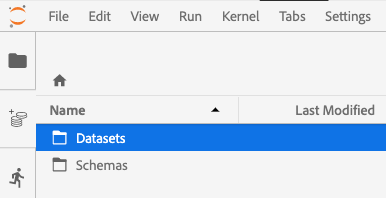

# Servicio de consulta en el bloc de notas de Jupyter

[!DNL Adobe Experience Platform] le permite utilizar el lenguaje de Consulta estructurado (SQL) [!DNL Data Science Workspace] integrándolo [!DNL Query Service] en [!DNL JupyterLab] como función estándar.

Este tutorial muestra consultas SQL de muestra para casos de uso comunes para explorar, transformar y analizar [!DNL Adobe Analytics] datos.

## Primeros pasos

Antes de iniciar este tutorial, debe tener los siguientes requisitos previos:

- Acceso a [!DNL Adobe Experience Platform]. Si no tiene acceso a una organización de IMS en [!DNL Experience Platform], póngase en contacto con el administrador del sistema antes de continuar

- Un [!DNL Adobe Analytics] conjunto de datos

- Una explicación práctica de los siguientes conceptos clave utilizados en este tutorial:
   - [[!Modelo de datos de experiencia DNL (XDM) y sistema XDM]](../../xdm/home.md)
   - [[!Servicio de Consulta DNL]](../../query-service/home.md)
   - [[!Sintaxis SQL del servicio de Consulta DNL]](../../query-service/sql/overview.md)
   - Adobe Analytics

## Acceso [!DNL JupyterLab] y [!DNL Query Service] {#access-jupyterlab-and-query-service}

1. En [[!Experience Platform DNL]](https://platform.adobe.com), desplácese a **[!UICONTROL Equipos portátiles]** desde la columna de navegación izquierda. Deje un momento para que JupyterLab se cargue.

   

   >[!NOTE]
   >
   >Si no aparece automáticamente una nueva ficha Iniciador, abra una nueva ficha Iniciador haciendo clic en **[!UICONTROL Archivo]** y, a continuación, seleccione **[!UICONTROL Nuevo iniciador]**.

2. En la ficha Iniciador, haga clic en el icono **[!UICONTROL Vacío]** de un entorno Python 3 para abrir un bloc de notas vacío.

   

   >[!NOTE]
   >
   >Python 3 es actualmente el único entorno admitido para el servicio de Consulta en portátiles.

3. En el carril de selección de la izquierda, haga clic en el icono **[!UICONTROL Datos]** y en el doble haga clic en el directorio **[!UICONTROL Conjuntos]** de datos para lista de todos los conjuntos de datos.

   

4. Busque un conjunto de datos para explorar y haga clic con el botón secundario en el listado, haga clic en Datos de [!DNL Adobe Analytics] Consulta en el bloc de notas **** para generar consultas SQL en el bloc de notas vacío.

5. Haga clic en la primera celda generada que contenga la función `qs_connect()` y ejecútela haciendo clic en el botón de reproducción. Esta función crea una conexión entre la instancia del bloc de notas y el [!DNL Query Service].

   

6. Copie el nombre del [!DNL Adobe Analytics] conjunto de datos de la segunda consulta SQL generada, será el valor posterior `FROM`.

   

7. Inserte una nueva celda de bloc de notas haciendo clic en el botón **+** .

   

8. Copie, pegue y ejecute las siguientes instrucciones de importación en una celda nueva. Estas afirmaciones se utilizarán para visualizar los datos:

   ```python
   import plotly.plotly as py
   import plotly.graph_objs as go
   from plotly.offline import iplot
   ```

9. A continuación, copie y pegue las siguientes variables en una celda nueva. Modifique sus valores según sea necesario y, a continuación, ejecútelos.

   ```python
   target_table = "your Adobe Analytics dataset name"
   target_year = "2019"
   target_month = "04"
   target_day = "01"
   ```

   - `target_table` :: Nombre del [!DNL Adobe Analytics] conjunto de datos.
   - `target_year` :: Año específico del que proceden los datos de destinatario.
   - `target_month` :: Mes específico del que procede el destinatario.
   - `target_day` :: Día específico del que proceden los datos de destinatario.

   >[!NOTE]
   >
   >Puede cambiar estos valores en cualquier momento. Al hacerlo, asegúrese de ejecutar la celda variables para que se apliquen los cambios.

## Consulta de datos {#query-your-data}

Introduzca las siguientes consultas SQL en celdas de bloc de notas individuales. Para ejecutar una consulta, haga clic en su celda y luego en el botón de **[!UICONTROL reproducción]** . Los resultados de consulta o los registros de errores se muestran debajo de la celda ejecutada.

Cuando un bloc de notas está inactivo durante un período de tiempo prolongado, la conexión entre el bloc de notas [!DNL Query Service] puede romperse. En estos casos, reinicie [!DNL JupyterLab] haciendo clic en el botón **[!UICONTROL Energía]** situado en la esquina superior derecha.


El núcleo del bloc de notas se restablecerá pero las celdas permanecerán, vuelva a ejecutar **todas** las celdas para continuar donde lo dejó.

### Recuento de visitantes por hora {#hourly-visitor-count}

La siguiente consulta devuelve el recuento de visitantes por hora para una fecha especificada:

#### Consulta

```sql
%%read_sql hourly_visitor -c QS_CONNECTION
SELECT Substring(timestamp, 1, 10)                               AS Day,
       Substring(timestamp, 12, 2)                               AS Hour, 
       Count(DISTINCT concat(enduserids._experience.aaid.id, 
                             _experience.analytics.session.num)) AS Visit_Count 
FROM   {target_table}
WHERE TIMESTAMP = to_timestamp('{target_year}-{target_month}-{target_day}')
GROUP  BY Day, Hour
ORDER  BY Hour;
```

En la consulta anterior, la marca de tiempo de la `WHERE` cláusula se define como el valor de `target_year`. Incluya las variables en las consultas SQL, contándolas entre llaves (`{}`).

La primera línea de la consulta contiene la variable opcional `hourly_visitor`. Los resultados de la consulta se almacenarán en esta variable como un dataframe de Pandas. El almacenamiento de resultados en un dataframe permite visualizar posteriormente los resultados de la consulta utilizando un paquete [!DNL Python] deseado. Ejecute el siguiente [!DNL Python] código en una celda nueva para generar un gráfico de barras:

```python
trace = go.Bar(
    x = hourly_visitor['Hour'],
    y = hourly_visitor['Visit_Count'],
    name = "Visitor Count"
)
layout = go.Layout(
    title = 'Visit Count by Hour of Day',
    width = 1200,
    height = 600,
    xaxis = dict(title = 'Hour of Day'),
    yaxis = dict(title = 'Count')
)
fig = go.Figure(data = [trace], layout = layout)
iplot(fig)
```

### Recuento de actividades por hora {#hourly-activity-count}

La siguiente consulta devuelve el recuento de acciones por hora para una fecha especificada:

#### Consulta <!-- omit in toc -->

```sql
%%read_sql hourly_actions -d -c QS_CONNECTION
SELECT Substring(timestamp, 1, 10)                        AS Day,
       Substring(timestamp, 12, 2)                        AS Hour, 
       Count(concat(enduserids._experience.aaid.id, 
                    _experience.analytics.session.num,
                    _experience.analytics.session.depth)) AS Count 
FROM   {target_table}
WHERE TIMESTAMP = to_timestamp('{target_year}-{target_month}-{target_day}')
GROUP  BY Day, Hour
ORDER  BY Hour;
```

La ejecución de la consulta anterior almacenará los resultados en `hourly_actions` un dataframe. Ejecute la siguiente función en una celda nueva para previsualización de los resultados:

```python
hourly_actions.head()
```

La consulta anterior se puede modificar para devolver el recuento de acciones por hora para un intervalo de fechas especificado mediante operadores lógicos en la cláusula **WHERE** :

#### Consulta <!-- omit in toc -->

```sql
%%read_sql hourly_actions_date_range -d -c QS_CONNECTION
SELECT Substring(timestamp, 1, 10)                        AS Day,
       Substring(timestamp, 12, 2)                        AS Hour, 
       Count(concat(enduserids._experience.aaid.id, 
                    _experience.analytics.session.num,
                    _experience.analytics.session.depth)) AS Count 
FROM   {target_table}
WHERE  timestamp >= TO_TIMESTAMP('2019-06-01 00', 'YYYY-MM-DD HH')
       AND timestamp <= TO_TIMESTAMP('2019-06-02 23', 'YYYY-MM-DD HH')
GROUP  BY Day, Hour
ORDER  BY Hour;
```

Si se ejecuta la consulta modificada, los resultados se almacenarán `hourly_actions_date_range` como un dataframe. Ejecute la siguiente función en una celda nueva para previsualización de los resultados:

```python
hourly_actions_date_rage.head()
```

### Número de eventos por sesión de visitante {#number-of-events-per-visitor-session}

La siguiente consulta devuelve el número de eventos por sesión de visitante para una fecha especificada:

#### Consulta <!-- omit in toc -->

```sql
%%read_sql events_per_session -c QS_CONNECTION
SELECT concat(enduserids._experience.aaid.id, 
              '-#', 
              _experience.analytics.session.num) AS aaid_sess_key, 
       Count(timestamp)                          AS Count 
FROM   {target_table}
WHERE TIMESTAMP = to_timestamp('{target_year}-{target_month}-{target_day}')
GROUP BY aaid_sess_key
ORDER BY Count DESC;
```

Ejecute el siguiente [!DNL Python] código para generar un histograma del número de eventos por sesión de visita:

```python
data = [go.Histogram(x = events_per_session['Count'])]

layout = go.Layout(
    title = 'Histogram of Number of Events per Visit Session',
    xaxis = dict(title = 'Number of Events'),
    yaxis = dict(title = 'Count')
)

fig = go.Figure(data = data, layout = layout)
iplot(fig)
```

### Páginas populares de un día determinado {#popular-pages-for-a-given-day}

La siguiente consulta devuelve las diez páginas más populares para una fecha especificada:

#### Consulta <!-- omit in toc -->

```sql
%%read_sql popular_pages -c QS_CONNECTION
SELECT web.webpagedetails.name                 AS Page_Name, 
       Sum(web.webpagedetails.pageviews.value) AS Page_Views 
FROM   {target_table}
WHERE TIMESTAMP = to_timestamp('{target_year}-{target_month}-{target_day}')
GROUP  BY web.webpagedetails.name 
ORDER  BY page_views DESC 
LIMIT  10;
```

### Usuarios activos para un día determinado {#active-users-for-a-given-day}

La siguiente consulta devuelve los diez usuarios más activos para una fecha especificada:

#### Consulta <!-- omit in toc -->

```sql
%%read_sql active_users -c QS_CONNECTION
SELECT enduserids._experience.aaid.id AS aaid, 
       Count(timestamp)               AS Count
FROM   {target_table}
WHERE TIMESTAMP = to_timestamp('{target_year}-{target_month}-{target_day}')
GROUP  BY aaid
ORDER  BY Count DESC
LIMIT  10;
```

### Ciudades activas por actividad de usuario {#active-cities-by-user-activity}

La siguiente consulta devuelve las diez ciudades que generan la mayoría de actividades de usuario para una fecha especificada:

#### Consulta <!-- omit in toc -->

```sql
%%read_sql active_cities -c QS_CONNECTION
SELECT concat(placeContext.geo.stateProvince, ' - ', placeContext.geo.city) AS state_city, 
       Count(timestamp)                                                     AS Count
FROM   {target_table}
WHERE TIMESTAMP = to_timestamp('{target_year}-{target_month}-{target_day}')
GROUP  BY state_city
ORDER  BY Count DESC
LIMIT  10;
```

## Pasos siguientes

En este tutorial se mostraron algunos casos de uso de muestra para utilizarlos [!DNL Query Service] en [!DNL Jupyter] portátiles. Siga el tutorial [Analizar los datos con Jupyter Notebooks](./analyze-your-data.md) para ver cómo se realizan operaciones similares con el SDK de acceso a datos.