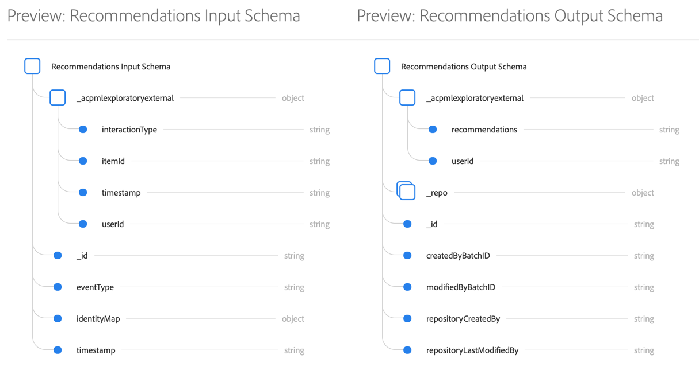

# Creación y publicación de un tutorial del modelo de aprendizaje automático

Imagine que posee un sitio web de venta en línea. Cuando los clientes compran en su sitio web comercial, usted desea presentarles recomendaciones personalizadas de productos para exponer una variedad de otros productos de sus ofertas comerciales. A lo largo de la existencia de su sitio web, ha recopilado continuamente datos de clientes y desea utilizar de alguna manera estos datos para generar recomendaciones de productos personalizadas.

[!DNL Adobe Experience Platform] [!DNL Data Science Workspace] proporciona los medios para lograr su objetivo mediante la fórmula [de Recommendations del producto prediseñada](../pre-built-recipes/product-recommendations.md). Siga este tutorial para ver cómo puede acceder a los datos de minoristas y comprenderlos, crear y optimizar un modelo de aprendizaje automático y generar perspectivas en [!DNL Data Science Workspace].

Este tutorial refleja el flujo de trabajo de [!DNL Data Science Workspace]y abarca los siguientes pasos para crear un modelo de aprendizaje automático:

1. [Preparación de los datos](#prepare-your-data)
2. [Crear el modelo](#author-your-model)
3. [Formación y evaluación de su modelo](#train-and-evaluate-your-model)
4. [Operacionalizar el modelo](#operationalize-your-model)

## Primeros pasos

Antes de iniciar este tutorial, debe tener los siguientes requisitos previos:

* Acceso a [!DNL Adobe Experience Platform]. Si no tiene acceso a una organización de IMS en [!DNL Experience Platform], póngase en contacto con el administrador del sistema antes de continuar.

* Recursos de habilitación. Póngase en contacto con el representante de cuentas para que le proporcione los siguientes elementos.
   * Recommendations Recipe
   * Recommendations Input Dataset
   * Esquema de entrada Recommendations
   * Recommendations Output Dataset
   * Recommendations Output Esquema
   * Valores posteriores del conjunto de datos dorados
   * Esquema Conjunto de datos dorado

* Descargue los tres [!DNL Jupyter Notebook] archivos necesarios del [Adobe [!DNL Git] publicRepository](https://github.com/adobe/experience-platform-dsw-reference/tree/master/Summit/2019/resources/Notebooks-Thurs), que se utilizarán para mostrar el [!DNL JupyterLab] flujo de trabajo en [!DNL Data Science Workspace].

* Una explicación práctica de los siguientes conceptos clave utilizados en este tutorial:
   * [[!Modelo de datos de experiencia DNL]](../../xdm/home.md): El esfuerzo de estandarización liderado por Adobe para definir esquemas estándar como [!DNL Profile] y ExperienceEvent para la administración de la experiencia del cliente.
   * Conjuntos de datos: Una construcción de almacenamiento y administración para los datos reales. Una instancia física de instancia de un Esquema XDM.
   * Lotes: Los conjuntos de datos están compuestos por lotes. Un lote es un conjunto de datos recopilados durante un período de tiempo y procesados juntos como una sola unidad.
   * [!DNL JupyterLab]:: [[!DNL JupyterLab]](https://blog.jupyter.org/jupyterlab-is-ready-for-users-5a6f039b8906) es una interfaz basada en web de código abierto para Project [!DNL Jupyter] y está estrechamente integrada en [!DNL Experience Platform].

## Preparación de los datos {#prepare-your-data}

Para crear un modelo de aprendizaje automático que haga recomendaciones de productos personalizadas a sus clientes, se deben analizar las compras anteriores realizadas en el sitio web. En esta sección se explica cómo se transfieren estos datos [!DNL Platform] a través de [!DNL Adobe Analytics]y cómo se transforman en conjuntos de datos de funciones para que los utilice el modelo de aprendizaje automático.

### Explore los datos y comprenda los esquemas

1. Inicie sesión en [Adobe Experience Platform](https://platform.adobe.com/) y haga clic en **[!UICONTROL Conjuntos]** de datos para lista de todos los conjuntos de datos existentes y seleccione el conjunto de datos que desee explorar. En este caso, el [!DNL Analytics] conjunto de datos Conjunto de datos **dorado postValues**.
   
2. Seleccione Conjunto de datos **[!UICONTROL de Previsualización]** cerca de la parte superior derecha para examinar los registros de muestra y, a continuación, haga clic en **[!UICONTROL Cerrar]**.
   
3. Seleccione el vínculo debajo del Esquema en el carril derecho para la vista del esquema para el conjunto de datos y, a continuación, vuelva a la página de detalles del conjunto de datos&quot;.
   

Los demás conjuntos de datos se han rellenado previamente con lotes para obtener una vista previa. Puede realizar la vista de estos conjuntos de datos repitiendo los pasos anteriores.

| Nombre del conjunto de datos | Esquema | Descripción |
| ----- | ----- | ----- |
| Valores posteriores del conjunto de datos dorados | Esquema Conjunto de datos dorado | [!DNL Analytics] datos de origen del sitio web |
| Recommendations Input Dataset | Esquema de entrada Recommendations | Los datos [!DNL Analytics] se transforman en un conjunto de datos de capacitación mediante una canalización de funciones. Estos datos se utilizan para entrenar el modelo de aprendizaje automático de Product Recommendations. `itemid` y `userid` corresponden a un producto comprado por ese cliente. |
| Recommendations Output Dataset | Recommendations Output Esquema | El conjunto de datos para el que se almacenan los resultados de puntuación contendrá la lista de los productos recomendados para cada cliente. |

## Crear el modelo {#author-your-model}

El segundo componente del ciclo de vida [!DNL Data Science Workspace] incluye la creación de fórmulas y modelos. La fórmula Product Recommendations está diseñada para generar recomendaciones de productos a escala mediante el uso de datos de compras anteriores y aprendizaje automático.

Las fórmulas son la base de un modelo, ya que contienen algoritmos de aprendizaje automático y lógica diseñados para resolver problemas específicos. Lo que es más importante, las fórmulas le permiten democratizar el aprendizaje automático en toda la organización, lo que permite a otros usuarios acceder a un modelo para casos de uso dispares sin necesidad de escribir ningún código.

### Explorar la fórmula de Recommendations del producto

1. En [!DNL Adobe Experience Platform], vaya a **[!UICONTROL Modelos]** desde la columna de navegación izquierda y, a continuación, haga clic en **[!UICONTROL Fórmulas]** en la parte superior para vista de una lista de Fórmulas disponibles para su organización.
   
2. Busque y abra la fórmula **[!UICONTROL de]** Recommendations proporcionada haciendo clic en su nombre.
   
3. En el carril derecho, haga clic en **[!UICONTROL Recommendations Input Esquema]** para vista del esquema que alimenta la fórmula. Los campos de esquema &quot;[!UICONTROL itemId]&quot; y &quot;[!UICONTROL userId]&quot; corresponden a un producto comprado ([!UICONTROL interactiveType]) por ese cliente a una hora específica ([!UICONTROL marca de hora]). Siga los mismos pasos para revisar los campos del Esquema **[!UICONTROL de salida de]**Recommendations.
   

Ahora ha revisado los esquemas de entrada y salida requeridos por la fórmula Recommendations del producto. Ahora puede continuar en la siguiente sección para averiguar cómo crear, entrenar y evaluar un modelo de producto Recommendations.

## Formación y evaluación de su modelo {#train-and-evaluate-your-model}

Ahora que los datos están preparados y la fórmula está lista para ser utilizada, puede crear, entrenar y evaluar el modelo de aprendizaje automático.

### Crear un modelo

Un modelo es una instancia de una fórmula, que le permite entrenar y puntuar con datos a escala.

1. En [!DNL Adobe Experience Platform], vaya a **[!UICONTROL Modelos]** desde la columna de navegación izquierda y, a continuación, haga clic en **[!UICONTROL Fórmulas]** en la parte superior de la página para mostrar una lista de todas las Fórmulas disponibles para su organización.
   
2. Busque y abra la fórmula **[!UICONTROL de]** Recommendations proporcionada haciendo clic en su nombre y en la página de información general de la fórmula. Haga clic en **[!UICONTROL Crear un modelo]** desde el centro (si no hay modelos existentes) o desde la parte superior derecha de la página Información general de fórmula.
   
3. Se muestra una lista de conjuntos de datos de entrada disponibles para formación, seleccione **[!UICONTROL Recommendations Input Dataset]** y haga clic en **[!UICONTROL Siguiente]**.
   
4. Proporcione un nombre para el modelo, por ejemplo, &quot;Modelo Recommendations de producto&quot;. Se enumeran las configuraciones disponibles para el modelo, que contienen los ajustes de los comportamientos de puntuación y formación predeterminados del modelo. No se necesitan cambios, ya que estas configuraciones son específicas de su organización. Revise las configuraciones y haga clic en **[!UICONTROL Finalizar]**.
   
5. El modelo se ha creado y la página *Información general* del modelo aparece en una nueva ejecución de formación generada. Una ejecución de formación se genera de forma predeterminada cuando se crea un modelo.
   

Puede optar por esperar a que finalice la ejecución de formación o continuar creando una nueva ejecución de formación en la sección siguiente.

### Formación del modelo mediante hiperparámetros personalizados

1. En la página Información general **del** modelo, haga clic en **[!UICONTROL Tren]** en la parte superior derecha para crear una nueva ejecución de formación. Seleccione el mismo conjunto de datos de entrada que utilizó al crear el modelo y haga clic en **[!UICONTROL Siguiente]**.
   
2. Aparece la página **Configuración** . Aquí puede configurar el valor &quot;[!UICONTROL num_recommendations]&quot; de la ejecución de formación, también conocido como un parámetro Hyperparameter. Un modelo preparado y optimizado utilizará los hiperparámetros de mejor rendimiento según los resultados de la ejecución de la formación.

   No se pueden aprender los hiperparámetros, por lo tanto deben asignarse antes de que se produzcan las ejecuciones de formación. El ajuste de los hiperparámetros puede cambiar la precisión del modelo entrenado. Dado que la optimización de un modelo es un proceso iterativo, es posible que se requieran múltiples ejercicios de capacitación antes de lograr una evaluación satisfactoria.

   >[!TIP]
   >
   >Establezca **[!UICONTROL num_recommendations]** en 10.

   
3. Una vez finalizada la nueva ejecución de formación, aparecerá un punto de datos adicional en el gráfico de evaluación del modelo, lo que puede tardar varios minutos.
   

### Evaluar el modelo

Cada vez que se completa una ejecución de formación, puede realizar una vista de las métricas de evaluación resultantes para determinar el rendimiento del modelo.

1. Revise las métricas de evaluación (Precisión y recuperación) de cada formación completada haciendo clic en la ejecución de formación.
2. Explore la información proporcionada para cada métrica de evaluación. Cuanto más altas sean estas métricas, mejor será el rendimiento del modelo.
   
3. Puede ver los parámetros de conjunto de datos, esquema y configuración utilizados para cada formación ejecutada en el carril correcto.
4. Vuelva a la página Modelo e identifique la formación de mayor rendimiento mediante la observación de sus métricas de evaluación.

## Operacionalizar el modelo {#operationalize-your-model}

El paso final en el flujo de trabajo de Data Science es poner en marcha el modelo para obtener una puntuación y consumir perspectivas del almacén de datos.

### Puntuación y generación de perspectivas

1. En la página *Información general* del modelo de recomendaciones de productos, haga clic en el nombre de la ejecución de formación de mejor rendimiento, con los valores de precisión y recuperación más altos.
2. En la parte superior derecha de la página de detalles de la ejecución de formación, haga clic en **[!UICONTROL Puntuación]**.
3. Seleccione el conjunto de datos de entrada de **[!UICONTROL Recommendations]** como conjunto de datos de entrada de puntuación, que es el mismo conjunto de datos que utilizó al crear el modelo y ejecutar sus ejecuciones de formación. Then, click **[!UICONTROL Next]**.
   
4. Seleccione el conjunto de datos de resultados de **[!UICONTROL Recommendations]** como conjunto de datos de resultados de puntuación. Los resultados de puntuación se almacenarán en este conjunto de datos como un lote.
   
5. Revise las configuraciones de puntuación. Estos parámetros contienen los conjuntos de datos de entrada y salida seleccionados anteriormente, junto con los esquemas correspondientes. Haga clic en **[!UICONTROL Finalizar]** para iniciar la ejecución de la puntuación. La ejecución puede tardar varios minutos en completarse.
   

### Perspectivas puntuadas de vista

Una vez finalizada la ejecución de la puntuación, podrá realizar la previsualización de los resultados y la vista de las perspectivas generadas.

1. En la página de ejecuciones de puntuación, haga clic en la ejecución de puntuación completada y, a continuación, haga clic en Conjunto de datos **[!UICONTROL de resultados de puntuación de]** Previsualización en el carril derecho.
   
2. En la tabla de previsualizaciones, cada fila contiene recomendaciones de productos para un cliente en particular, etiquetadas como [!UICONTROL recomendaciones] y [!UICONTROL userId] respectivamente. Dado que el [!UICONTROL valor de num_recommendations] Hyperparameter se estableció en 10 en las capturas de pantalla de muestra, cada fila de recomendaciones puede contener hasta 10 identidades de producto delimitadas por un signo de número (#).
   

## Pasos siguientes {#next-steps}

¡Bien hecho, ha generado con éxito recomendaciones de productos!

Este tutorial le ha presentado el flujo de trabajo de [!DNL Data Science Workspace], demostrando cómo los datos sin procesar pueden convertirse en información útil a través del aprendizaje automático. Para obtener más información sobre el uso del [!DNL Data Science Workspace], continúe con la siguiente guía sobre la [creación del esquema de ventas minoristas y del conjunto de datos](./create-retails-sales-dataset.md).