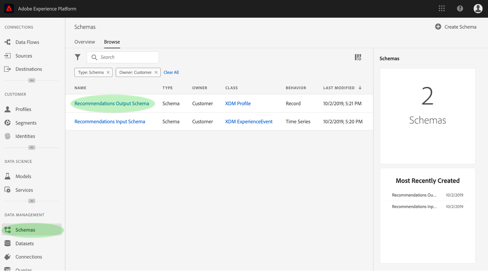
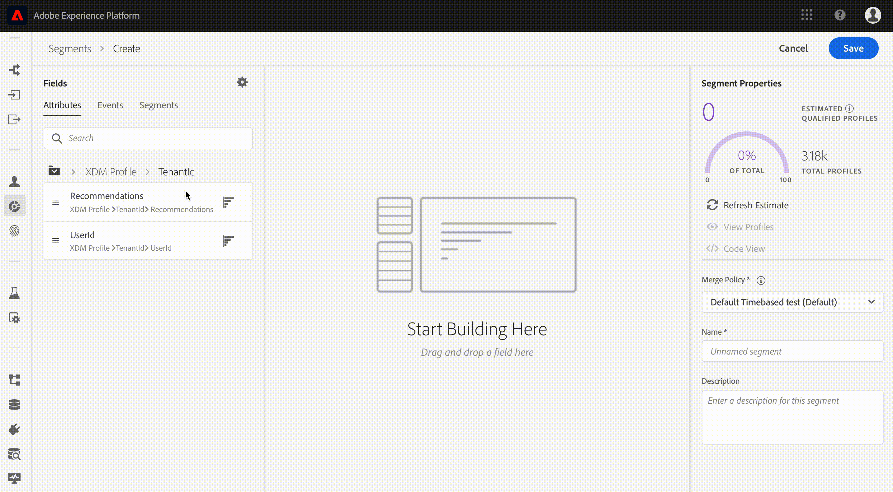

# Enriquecer el Perfil del cliente en tiempo real con perspectivas de aprendizaje automático

Adobe Experience Platform Data Science Workspace proporciona las herramientas y los recursos para crear, evaluar y utilizar modelos de aprendizaje automático para generar predicciones y perspectivas de datos. Cuando las perspectivas de aprendizaje automático se ingieren en un conjunto de datos habilitado para el Perfil, esos mismos datos también se ingieren como registros de Perfil, los cuales se pueden segmentar en subconjuntos de elementos relacionados mediante el servicio de segmentación de la plataforma de experiencia.

Este documento proporciona un tutorial paso a paso para enriquecer el Perfil del cliente en tiempo real con perspectivas de aprendizaje automático. Los pasos se desglosan en las siguientes secciones:

1. [Crear un esquema de salida y un conjunto de datos](#create-an-output-schema-and-dataset)
2. [Configurar un esquema de salida y un conjunto de datos](#configure-an-output-schema-and-dataset)
3. [Creación de segmentos mediante el Generador de segmentos](#create-segments-using-the-segment-builder)

## Primeros pasos

Este tutorial requiere un conocimiento práctico de los distintos aspectos de Adobe Experience Platform relacionados con la ingesta de datos de Perfil y la creación de segmentos. Antes de comenzar este tutorial, consulte la documentación de los siguientes servicios:

* [Perfil](../../rtcdp/overview.md)del cliente en tiempo real: Proporciona un perfil de consumo unificado y en tiempo real basado en datos agregados de varias fuentes.
* [Servicio](../../identity-service/home.md)de identidad: Permite el Perfil del cliente en tiempo real al enlazar identidades de orígenes de datos dispares que se están ingeriendo en la plataforma.
* [Modelo de datos de experiencia (XDM)](../../xdm/home.md): El marco estandarizado por el cual Platform organiza los datos de experiencia del cliente.

Además de los documentos mencionados, se recomienda revisar también las siguientes guías sobre esquemas y el Editor de Esquemas:

* [Conceptos básicos de la composición](../../xdm/schema/composition.md)de esquemas: Describe esquemas XDM, componentes básicos, principios y prácticas recomendadas para la composición de esquemas que se utilizarán en la plataforma de experiencia.
* [Tutorial](../../xdm/tutorials/create-schema-ui.md)del Editor de Esquemas: Proporciona instrucciones detalladas para crear esquemas con el Editor de Esquemas en la plataforma de experiencia.

## Crear un esquema de salida y un conjunto de datos

El primer paso para enriquecer el Perfil del cliente en tiempo real con perspectivas de puntuación es saber qué objeto real (como una persona) define sus datos. Conocer los datos le permite describir y diseñar una estructura que tenga un significado para los datos, como diseñar una base de datos relacional.

La composición de un esquema comienza asignando una clase. Las clases definen los aspectos de comportamiento de los datos que contendrá el esquema (registro o serie temporal). En esta sección se proporcionan instrucciones básicas para crear un esquema con el generador de esquemas. Para ver un tutorial más detallado, consulte el tutorial sobre la [creación de un esquema con el Editor](../../xdm/tutorials/create-schema-ui.md)de Esquemas.

1. En Adobe Experience Platform, haga clic en la ficha **Esquema** para acceder al navegador de esquema. Haga clic en **Crear Esquema** para acceder al Editor *de*Esquemas, donde puede crear esquemas de forma interactiva.
   

2. En la ventana *Composición* , haga clic en **Asignar** para examinar las clases disponibles.
   * Para asignar una clase existente, haga clic en y resalte la clase deseada y, a continuación, haga clic en **Asignar clase**.
      

   * Para crear una clase personalizada, haga clic en **Crear nueva clase** que se encuentre cerca de la parte central de la ventana del explorador. Proporcione un nombre de clase, una descripción y elija el comportamiento de la clase. Haga clic en **Asignar clase** una vez que haya terminado.
      
   En este punto, la estructura del esquema debe contener algunos campos de clase y está listo para asignar mezclas. Una mezcla es un grupo de uno o más campos que describen un concepto en particular.

3. En la ventana *Composición* , haga clic en **Añadir** en la subsección *Mezclas* .
   * Para asignar una mezcla existente, haga clic en y resalte la mezcla deseada y, a continuación, haga clic en **Añadir mezcla**. A diferencia de las clases, se pueden asignar varias mezclas a un solo esquema siempre que sea apropiado.
      

   * Para crear una nueva mezcla, haga clic en **Crear nueva mezcla** que se encuentre cerca de la parte central de la ventana del explorador. Proporcione un nombre y una descripción para la mezcla y, a continuación, haga clic en **Asignar mezcla** una vez que haya terminado.
      

   * Para agregar campos de mezcla, haga clic en el nombre de la mezcla dentro de la ventana *Composición* . A continuación, se le proporcionará la opción de agregar campos mezclados haciendo clic en **Añadir campo** en la ventana *Estructura* . Asegúrese de proporcionar las propiedades de mezcla correspondientes.
      

4. Una vez que haya terminado de crear el esquema, haga clic en el campo de nivel superior del esquema dentro de la ventana *Estructura* para mostrar las propiedades del esquema en la ventana de propiedades de la derecha. Proporcione un nombre y una descripción, y haga clic en **Guardar** para crear el esquema.
   

5. Cree un conjunto de datos de salida con el esquema recién creado haciendo clic en **Conjuntos** de datos en la columna de navegación izquierda y, a continuación, haga clic en **Crear conjunto de datos**. En la pantalla siguiente, elija **Crear conjunto de datos desde esquema**.
   

6. Con el navegador de esquema, busque y seleccione el esquema recién creado y, a continuación, haga clic en **Siguiente**.
   

7. Proporcione un nombre y una descripción opcional y, a continuación, haga clic en **Finalizar** para crear el conjunto de datos.
   

Ahora que ha creado un conjunto de datos de esquema de salida, puede continuar en la siguiente sección para configurarlo y habilitarlo para el enriquecimiento de Perfil.

## Configurar un esquema de salida y un conjunto de datos

Antes de habilitar un conjunto de datos para Perfil, debe configurar el esquema del conjunto de datos para tener un campo de identidad principal y luego habilitar el esquema para Perfil. Si desea crear y activar un nuevo esquema, puede consultar el tutorial sobre la [creación de un esquema con el Editor](../../xdm/tutorials/create-schema-ui.md)de Esquemas. De lo contrario, siga las instrucciones a continuación para habilitar un esquema y un conjunto de datos existentes.

1. En Adobe Experience Platform, utilice el navegador de esquema para buscar el esquema de salida en el que desea activar el Perfil y haga clic en su nombre para vista de la composición.
   

2. Expanda la estructura de esquema y busque un campo adecuado para establecerlo como identificador principal. Haga clic en el campo que desee para mostrar sus propiedades.
   

3. Establezca el campo como identidad principal habilitando la propiedad **Identity** del campo, la propiedad **Primary Identity** y, a continuación, seleccionando una Área de nombres **** Identity apropiada. Haga clic en **Aplicar** una vez que haya realizado los cambios.
   

4. Haga clic en el objeto de nivel superior de la estructura del esquema para mostrar las propiedades del esquema y activar el esquema para el Perfil alternando el conmutador de **Perfil** . Haga clic en **Guardar** para finalizar los cambios. El conjunto de datos que se creó con este esquema ahora se puede habilitar para Perfil.
   

5. Utilice el navegador de conjuntos de datos para encontrar el conjunto de datos en el que desea activar el Perfil y haga clic en su nombre para acceder a sus detalles.
   

6. Habilite el conjunto de datos para el Perfil alternando el conmutador de **Perfil** que se encuentra en la columna de información derecha.
   

Cuando los datos se ingieren en un conjunto de datos habilitado para Perfil, esos mismos datos también se ingieren como registros de Perfil. Ahora que el esquema y el conjunto de datos están preparados, genere algunos datos en el conjunto de datos realizando ejecuciones de puntuación utilizando un modelo adecuado y continúe con este tutorial para crear segmentos de perspectiva mediante el Generador de segmentos.

## Creación de segmentos mediante el Generador de segmentos

Ahora que ha generado e ingestado perspectivas en el conjunto de datos habilitado para Perfil, puede administrar esos datos identificando subconjuntos de elementos relacionados mediante el Generador de segmentos. Siga los pasos a continuación para crear sus propios segmentos.

1. En Adobe Experience Platform, haga clic en la ficha **Segmentos** seguida de **Crear segmento** para acceder al Generador de segmentos.
   

2. En el Generador de segmentos, el carril izquierdo proporciona acceso a los componentes principales de los segmentos: atributos, eventos y segmentos existentes. Cada bloque de creación aparece en su propia ficha respectiva. Seleccione la clase a la que se extiende el esquema con Perfil habilitado y, a continuación, busque los componentes básicos del segmento.
   

3. Arrastre y suelte los bloques de creación en el lienzo del generador de reglas, rellénelos con instrucciones comparativas.
   

4. Mientras crea el segmento, puede previsualización los resultados estimados del mismo observando el panel Propiedades ** del segmento.
   

5. Seleccione una directiva **de** combinación adecuada, proporcione un nombre y una descripción opcional y, a continuación, haga clic en **Guardar** para completar el nuevo segmento.
   

## Pasos siguientes

Este documento lo guió por los pasos necesarios para habilitar un esquema y un conjunto de datos para Perfil, y mostró brevemente el flujo de trabajo para crear segmentos de perspectiva mediante el Generador de segmentos. Para obtener más información sobre los segmentos y el Generador de segmentos, consulte la descripción general [del servicio](../../segmentation/home.md)Segmentación.