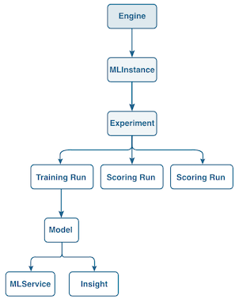

# Importar una fórmula empaquetada mediante la API de aprendizaje automático de Sensei

Este tutorial utiliza el [[!DNL Sensei Machine Learning API]](https://www.adobe.io/apis/experienceplatform/home/api-reference.html#!acpdr/swagger-specs/sensei-ml-api.yaml) para crear un [Motor](../api/engines.md), también conocido como fórmula en la interfaz de usuario de.

Antes de comenzar, es importante tener en cuenta que Adobe Experience Platform [!DNL Data Science Workspace] utiliza términos diferentes para hacer referencia a elementos similares dentro de la API y la interfaz de usuario. Los términos de la API se utilizan en este tutorial y la siguiente tabla describe los términos correlacionados:

| Término de interfaz de usuario | Término de API |
| ---- | ---- |
| Fórmula | [Motor](../api/engines.md) |
| Modelo | [MLInstance](../api/mlinstances.md) |
| Capacitación y evaluación | [Experimento](../api/experiments.md) |
| Service | [MLService](../api/mlservices.md) |

Un motor contiene algoritmos de aprendizaje automático y lógica para resolver problemas específicos. El diagrama siguiente proporciona una visualización que muestra el flujo de trabajo de la API en [!DNL Data Science Workspace]. Este tutorial se centra en la creación de un motor, el cerebro de un modelo de aprendizaje automático.



## Primeros pasos

Este tutorial requiere un archivo de fórmula empaquetado en forma de URL de Docker. Siga las [Empaquetar archivos de origen en una fórmula](./package-source-files-recipe.md) para crear un archivo de fórmula empaquetado o proporcionar el suyo propio.

- `{DOCKER_URL}`: una dirección URL a una imagen Docker de un servicio inteligente.

Este tutorial requiere que haya completado el [Tutorial de autenticación en Adobe Experience Platform](https://www.adobe.com/go/platform-api-authentication-en) para realizar llamadas correctamente a [!DNL Platform] API. Al completar el tutorial de autenticación, se proporcionan los valores para cada uno de los encabezados necesarios en todas las [!DNL Experience Platform] Llamadas de API, como se muestra a continuación:

- `{ACCESS_TOKEN}`: el valor del token de portador específico proporcionado después de la autenticación.
- `{ORG_ID}`: Las credenciales de su organización se encuentran en la integración de Adobe Experience Platform única.
- `{API_KEY}`: El valor de clave de API específico que se encuentra en la integración única de Adobe Experience Platform.

## Crear un motor

Los motores se pueden crear realizando una solicitud del POST al extremo /engines. El motor creado se configura en función del formulario del archivo de fórmula empaquetado que debe incluirse como parte de la solicitud de API.

### Creación de un motor con una URL de Docker {#create-an-engine-with-a-docker-url}

Para crear un motor con un archivo de fórmula empaquetado almacenado en un contenedor de Docker, debe proporcionar la URL de Docker al archivo de fórmula empaquetado.

>[!CAUTION]
>
> Si está utilizando [!DNL Python] o R utilice la solicitud siguiente. Si utiliza PySpark o Scala, utilice el ejemplo de solicitud PySpark/Scala situado debajo del ejemplo Python/R.

**Formato de API**

```http
POST /engines
```

**Solicitar Python/R**

```shell
curl -X POST \
    https://platform.adobe.io/data/sensei/engines \
    -H 'Authorization: {ACCESS_TOKEN}' \
    -H 'X-API-KEY: {API_KEY}' \
    -H 'content-type: multipart/form-data' \
    -H 'x-gw-ims-org-id: {ORG_ID}' \
    -H `x-sandbox-name: {SANDBOX_NAME}` \
    -F 'engine={
        "name": "Retail Sales Engine Python",
        "description": "A description for Retail Sales Engine, this Engines execution type is Python",
        "type": "Python"
        "artifacts": {
            "default": {
                "image": {
                    "location": "{DOCKER_URL}",
                    "name": "retail_sales_python",
                    "executionType": "Python"
                }
            }
        }
    }' 
```

| Propiedad | Descripción |
| -------  | ----------- |
| `engine.name` | El nombre deseado para el motor. La fórmula correspondiente a este motor heredará este valor para mostrarlo en [!DNL Data Science Workspace] interfaz de usuario como nombre de la fórmula. |
| `engine.description` | Una descripción opcional del motor. La fórmula correspondiente a este motor heredará este valor para mostrarlo en [!DNL Data Science Workspace] como la descripción de la fórmula. No elimine esta propiedad, deje que este valor sea una cadena vacía si decide no proporcionar una descripción. |
| `engine.type` | El tipo de ejecución del motor. Este valor corresponde al idioma en el que se desarrolla la imagen Docker. Cuando se proporciona una URL de Docker para crear un motor, `type` es o bien `Python`, `R`, `PySpark`, `Spark` (Scala), o `Tensorflow`. |
| `artifacts.default.image.location` | Su `{DOCKER_URL}` va aquí. Una URL de Docker completa tiene la siguiente estructura: `your_docker_host.azurecr.io/docker_image_file:version` |
| `artifacts.default.image.name` | Un nombre adicional para el archivo de imagen Docker. No elimine esta propiedad, deje que este valor sea una cadena vacía si decide no proporcionar un nombre de archivo de imagen Docker adicional. |
| `artifacts.default.image.executionType` | El tipo de ejecución de este motor. Este valor corresponde al idioma en el que se desarrolla la imagen Docker. Cuando se proporciona una URL de Docker para crear un motor, `executionType` es o bien `Python`, `R`, `PySpark`, `Spark` (Scala), o `Tensorflow`. |

**Solicitar PySpark**

```shell
curl -X POST \
  https://platform.adobe.io/data/sensei/engines \
    -H 'Authorization: Bearer {ACCESS_TOKEN}' \
    -H 'x-api-key: {API_KEY}' \
    -H 'x-gw-ims-org-id: {ORG_ID}' \
    -H 'x-sandbox-name: {SANDBOX_NAME}' \
    -H 'content-type: multipart/form-data' \
    -F 'engine={
    "name": "PySpark retail sales recipe",
    "description": "A description for this Engine",
    "type": "PySpark",
    "mlLibrary":"databricks-spark",
    "artifacts": {
        "default": {
            "image": {
                "name": "modelspark",
                "executionType": "PySpark",
                "packagingType": "docker",
                "location": "v1d2cs4mimnlttw.azurecr.io/sarunbatchtest:0.0.1"
            }
        }
    }
}'
```

| Propiedad | Descripción |
| --- | --- |
| `name` | El nombre deseado para el motor. La fórmula correspondiente a este motor heredará este valor para mostrarlo en la interfaz de usuario como el nombre de la fórmula. |
| `description` | Una descripción opcional del motor. La fórmula correspondiente a este motor heredará este valor para mostrarlo en la interfaz de usuario como la descripción de la fórmula. Esta es una propiedad obligatoria. Si no desea proporcionar una descripción, establezca su valor como una cadena vacía. |
| `type` | El tipo de ejecución del motor. Este valor corresponde al idioma en el que se crea la imagen Docker sobre &quot;PySpark&quot;. |
| `mlLibrary` | Campo obligatorio al crear motores para las recetas PySpark y Scala. |
| `artifacts.default.image.location` | La ubicación de la imagen de Docker a la que está vinculado una URL de Docker. |
| `artifacts.default.image.executionType` | El tipo de ejecución del motor. Este valor corresponde al idioma en el que se crea la imagen Docker sobre &quot;Spark&quot;. |

**Solicitar Scala**

```shell
curl -X POST \
  https://platform.adobe.io/data/sensei/engines \
    -H 'Authorization: Bearer {ACCESS_TOKEN}' \
    -H 'x-api-key: {API_KEY}' \
    -H 'x-gw-ims-org-id: {ORG_ID}' \
    -H 'x-sandbox-name: {SANDBOX_NAME}' \
    -H 'content-type: multipart/form-data' \
    -F 'engine={
    "name": "Spark retail sales recipe",
    "description": "A description for this Engine",
    "type": "Spark",
    "mlLibrary":"databricks-spark",
    "artifacts": {
        "default": {
            "image": {
                "name": "modelspark",
                "executionType": "Spark",
                "packagingType": "docker",
                "location": "v1d2cs4mimnlttw.azurecr.io/sarunbatchtest:0.0.1"
            }
        }
    }
}'
```

| Propiedad | Descripción |
| --- | --- |
| `name` | El nombre deseado para el motor. La fórmula correspondiente a este motor heredará este valor para mostrarlo en la interfaz de usuario como el nombre de la fórmula. |
| `description` | Una descripción opcional del motor. La fórmula correspondiente a este motor heredará este valor para mostrarlo en la interfaz de usuario como la descripción de la fórmula. Esta es una propiedad obligatoria. Si no desea proporcionar una descripción, establezca su valor como una cadena vacía. |
| `type` | El tipo de ejecución del motor. Este valor corresponde al idioma en el que se crea la imagen Docker sobre &quot;Spark&quot;. |
| `mlLibrary` | Campo obligatorio al crear motores para las recetas PySpark y Scala. |
| `artifacts.default.image.location` | La ubicación de la imagen de Docker a la que está vinculado una URL de Docker. |
| `artifacts.default.image.executionType` | El tipo de ejecución del motor. Este valor corresponde al idioma en el que se crea la imagen Docker sobre &quot;Spark&quot;. |

**Respuesta**

Una respuesta correcta devuelve una carga útil que contiene los detalles del motor recién creado, incluido su identificador único (`id`). La siguiente respuesta de ejemplo es para un [!DNL Python] Motor. El `executionType` y `type` Las claves cambian según el POST suministrado.

```json
{
    "id": "{ENGINE_ID}",
    "name": "A name for this Engine",
    "description": "A description for this Engine",
    "type": "Python",
    "algorithm": "Classification",
    "created": "2019-01-01T00:00:00.000Z",
    "createdBy": {
        "userId": "Jane_Doe@AdobeID"
    },
    "updated": "2019-01-01T00:00:00.000Z",
    "artifacts": {
        "default": {
            "image": {
                "location": "{DOCKER_URL}",
                "name": "An additional name for the Docker image",
                "executionType": "Python",
                "packagingType": "docker"
            }
        }
    }
}
```

Una respuesta correcta muestra una carga útil JSON con información sobre el motor recién creado. El `id` representa el identificador de motor único y se requiere en el siguiente tutorial para crear una instancia de MLI. Asegúrese de que el identificador del motor se guarde antes de continuar con los pasos siguientes.

## Pasos siguientes {#next-steps}

Ha creado un motor mediante la API y se ha obtenido un identificador de motor único como parte del cuerpo de respuesta. Puede utilizar este identificador de motor en el siguiente tutorial mientras aprende a [crear, entrenar y evaluar un modelo mediante la API](./train-evaluate-model-api.md).
