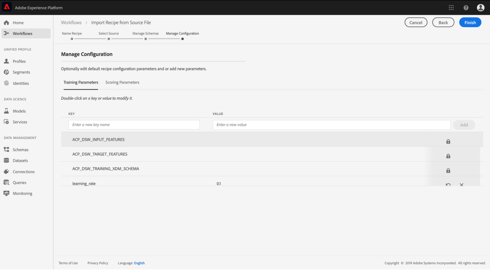

# Importar una fórmula empaquetada en la interfaz de usuario de Data Science Workspace

Este tutorial proporciona información sobre cómo configurar e importar una fórmula empaquetada mediante el ejemplo de ventas minoristas proporcionado. Al final de este tutorial, estará listo para crear, entrenar y evaluar un modelo en Adobe Experience Platform [!DNL Data Science Workspace].

## Requisitos previos

Este tutorial requiere una fórmula empaquetada en forma de URL de imagen Docker. Consulte el tutorial sobre cómo [Empaquetar archivos de origen en una fórmula](./package-source-files-recipe.md) para obtener más información.

## Flujo de trabajo de la interfaz de usuario

Importación de una fórmula empaquetada en [!DNL Data Science Workspace] requiere configuraciones de fórmula específicas, compiladas en un solo archivo de Notación de objetos JavaScript (JSON), esta compilación de configuraciones de fórmula se denomina archivo de configuración. Una fórmula empaquetada con un conjunto particular de configuraciones se denomina instancia de fórmula. Se puede usar una fórmula para crear muchas instancias de fórmula en [!DNL Data Science Workspace].

El flujo de trabajo para importar una fórmula de paquete consta de los siguientes pasos:
- [Configurar una fórmula](#configure)
- [Importar fórmula basada en Docker: Python](#python)
- [Importar fórmula basada en Docker - R](#r)
- [Importar fórmula basada en Docker - PySpark](#pyspark)
- [Importar fórmula basada en Docker - Scala](#scala)

### Configurar una fórmula {#configure}

Cada instancia de fórmula de [!DNL Data Science Workspace] va acompañada de un conjunto de configuraciones que adaptan la instancia de fórmula para adaptarla a un caso de uso determinado. Los archivos de configuración definen los comportamientos de formación y puntuación predeterminados de un modelo creado con esta instancia de fórmula.

>[!NOTE]
>
>Los archivos de configuración son específicos de fórmula y de caso.

A continuación, se muestra un archivo de configuración de muestra con los comportamientos de puntuación y formación predeterminados para la fórmula de ventas minoristas.

```json
[
    {
        "name": "train",
        "parameters": [
            {
                "key": "learning_rate",
                "value": "0.1"  
            },
            {
                "key": "n_estimators",
                "value": "100"
            },
            {
                "key": "max_depth",
                "value": "3"
            },
            {
                "key": "ACP_DSW_INPUT_FEATURES",
                "value": "date,store,storeType,storeSize,temperature,regionalFuelPrice,markdown,cpi,unemployment,isHoliday"
            },
            {
                "key": "ACP_DSW_TARGET_FEATURES",
                "value": "weeklySales"
            },
            {
                "key": "ACP_DSW_FEATURE_UPDATE_SUPPORT",
                "value": false
            },
            {
                "key": "tenantId",
                "value": "_{TENANT_ID}"
            },
            {
                "key": "ACP_DSW_TRAINING_XDM_SCHEMA",
                "value": "{SEE BELOW FOR DETAILS}"
            },
            {
                "key": "evaluation.labelColumn",
                "value": "weeklySalesAhead"
            },
            {
                "key": "evaluation.metrics",
                "value": "MAPE,MAE,RMSE,MASE"
            }
        ]
    },
    {
        "name": "score",
        "parameters": [
            {
                "key": "tenantId",
                "value": "_{TENANT_ID}"
            },
            {
                "key":"ACP_DSW_SCORING_RESULTS_XDM_SCHEMA",
                "value":"{SEE BELOW FOR DETAILS}"
            }
        ]
    }
]
```

| Clave de parámetro | Tipo | Descripción |
| ----- | ----- | ----- |
| `learning_rate` | Número | Escalar para la multiplicación de degradado. |
| `n_estimators` | Número | Número de árboles del bosque para el clasificador de bosque aleatorio. |
| `max_depth` | Número | Profundidad máxima de un árbol en el clasificador de bosque aleatorio. |
| `ACP_DSW_INPUT_FEATURES` | Cadena | Lista de los atributos de esquema de entrada separados por comas. |
| `ACP_DSW_TARGET_FEATURES` | Cadena | Lista de los atributos de esquema de salida separados por comas. |
| `ACP_DSW_FEATURE_UPDATE_SUPPORT` | Booleano | Determina si las funciones de entrada y salida se pueden modificar |
| `tenantId` | Cadena | Este ID garantiza que los recursos que cree tengan un espacio de nombres adecuado y estén contenidos dentro de su organización. [Siga estos pasos aquí](../../xdm/api/getting-started.md#know-your-tenant_id) para encontrar su ID de inquilino. |
| `ACP_DSW_TRAINING_XDM_SCHEMA` | Cadena | El esquema de entrada utilizado para entrenar un modelo. Deje esto vacío al importar en la interfaz de usuario, reemplace por SchemaID de capacitación al importar mediante API. |
| `evaluation.labelColumn` | Cadena | Etiqueta de columna para visualizaciones de evaluación. |
| `evaluation.metrics` | Cadena | Lista separada por comas de las métricas de evaluación que se utilizarán para evaluar un modelo. |
| `ACP_DSW_SCORING_RESULTS_XDM_SCHEMA` | Cadena | El esquema de salida utilizado para puntuación de un modelo. Deje esto vacío al importar en la interfaz de usuario, reemplace con Scoring SchemaID al importar con API. |

A los efectos de este tutorial, puede dejar los archivos de configuración predeterminados para la fórmula de ventas minoristas en la [!DNL Data Science Workspace] Haga referencia a cómo son.

### Importar fórmula basada en Docker - [!DNL Python] {#python}

Comience por navegar y seleccionando **[!UICONTROL Flujos de trabajo]** situado en la parte superior izquierda del [!DNL Platform] IU. A continuación, seleccione **Importar fórmula** y seleccione **[!UICONTROL Launch]**.


La variable **Configurar** para la variable **Importar fórmula** flujo de trabajo. Introduzca un nombre y una descripción para la fórmula y, a continuación, seleccione **[!UICONTROL Siguiente]** en la esquina superior derecha.


>[!NOTE]
>
> En el [Empaquetar archivos de origen en una fórmula](./package-source-files-recipe.md) , se proporcionó una URL de Docker al final de la generación de la fórmula de ventas minoristas utilizando archivos fuente Python.

Una vez que esté en el **Seleccionar origen** pegue la URL del Docker correspondiente a la fórmula empaquetada creada con [!DNL Python] los archivos de origen de **[!UICONTROL URL de origen]** campo . A continuación, importe el archivo de configuración proporcionado arrastrando y soltando, o utilice el sistema de archivos **Navegador**. El archivo de configuración proporcionado se puede encontrar en `experience-platform-dsw-reference/recipes/python/retail/retail.config.json`. Select **[!UICONTROL Python]** en el **Tiempo de ejecución** desplegable y **[!UICONTROL Clasificación]** en el **Tipo** desplegable . Una vez rellenado todo, seleccione **[!UICONTROL Siguiente]** en la esquina superior derecha para continuar con **Administrar esquemas**.

>[!NOTE]
>
> Compatibilidad de tipo **[!UICONTROL Clasificación]** y **[!UICONTROL Regresión]**. Si el modelo no está comprendido en uno de estos tipos, seleccione **[!UICONTROL Personalizado]**.


A continuación, seleccione los esquemas de entrada y salida de Retail Sales en la sección . **Administrar esquemas**, se crearon utilizando el script de arranque proporcionado en la variable [crear el esquema de ventas minoristas y el conjunto de datos](../models-recipes/create-retails-sales-dataset.md) tutorial.


En el **Administración de funciones** , seleccione en la identificación del inquilino en el visor de esquemas para expandir el esquema de entrada de ventas minoristas. Seleccione las funciones de entrada y salida resaltando la función deseada y seleccionando: **[!UICONTROL Función de entrada]** o **[!UICONTROL Función Target]** a la derecha **[!UICONTROL Propiedades de campo]** ventana. Para los fines de este tutorial, establezca **[!UICONTROL weeklySales]** como el  **[!UICONTROL Función Target]** y todo lo demás como **[!UICONTROL Función de entrada]**. Select **[!UICONTROL Siguiente]** para revisar la nueva fórmula configurada.

Revise la fórmula, añada, modifique o elimine configuraciones según sea necesario. Select **[!UICONTROL Finalizar]** para crear la fórmula.



Continúe con el [pasos siguientes](#next-steps) para saber cómo crear un modelo en [!DNL Data Science Workspace] uso de la fórmula de ventas minoristas recién creada.

### Importar fórmula basada en Docker - R {#r}

Comience por navegar y seleccionando **[!UICONTROL Flujos de trabajo]** situado en la parte superior izquierda del [!DNL Platform] IU. A continuación, seleccione **Importar fórmula** y seleccione **[!UICONTROL Launch]**.


La variable **Configurar** para la variable **Importar fórmula** flujo de trabajo. Introduzca un nombre y una descripción para la fórmula y, a continuación, seleccione **[!UICONTROL Siguiente]** en la esquina superior derecha.


>[!NOTE]
>
> En el [Empaquetar archivos de origen en una fórmula](./package-source-files-recipe.md) , se proporcionó una URL de Docker al final de la generación de la fórmula de ventas minoristas utilizando archivos de origen R.

Una vez que esté en el **Seleccionar origen** pegue la URL del Docker correspondiente a la fórmula empaquetada creada utilizando los archivos de origen R en la **[!UICONTROL URL de origen]** campo . A continuación, importe el archivo de configuración proporcionado arrastrando y soltando, o utilice el sistema de archivos **Navegador**. El archivo de configuración proporcionado se puede encontrar en `experience-platform-dsw-reference/recipes/R/Retail\ -\ GradientBoosting/retail.config.json`. Select **[!UICONTROL R]** en el **Tiempo de ejecución** desplegable y **[!UICONTROL Clasificación]** en el **Tipo** desplegable . Una vez rellenado todo, seleccione **[!UICONTROL Siguiente]** en la esquina superior derecha para continuar con **Administrar esquemas**.

>[!NOTE]
>
> *Tipo* support **[!UICONTROL Clasificación]** y **[!UICONTROL Regresión]**. Si el modelo no está comprendido en uno de estos tipos, seleccione **[!UICONTROL Personalizado]**.


A continuación, seleccione los esquemas de entrada y salida de Retail Sales en la sección . **Administrar esquemas**, se crearon utilizando el script de arranque proporcionado en la variable [crear el esquema de ventas minoristas y el conjunto de datos](../models-recipes/create-retails-sales-dataset.md) tutorial.


En el *Administración de funciones* , seleccione en la identificación del inquilino en el visor de esquemas para expandir el esquema de entrada de ventas minoristas. Seleccione las funciones de entrada y salida resaltando la función deseada y seleccionando: **[!UICONTROL Función de entrada]** o **[!UICONTROL Función Target]** a la derecha **[!UICONTROL Propiedades de campo]** ventana. Para los fines de este tutorial, establezca **[!UICONTROL weeklySales]** como el  **[!UICONTROL Función Target]** y todo lo demás como **[!UICONTROL Función de entrada]**. Select **[!UICONTROL Siguiente]** para revisar la nueva fórmula configurada.

Revise la fórmula, añada, modifique o elimine configuraciones según sea necesario. Select **Finalizar** para crear la fórmula.


Continúe con el [pasos siguientes](#next-steps) para saber cómo crear un modelo en [!DNL Data Science Workspace] uso de la fórmula de ventas minoristas recién creada.

### Importar fórmula basada en Docker - PySpark {#pyspark}

Comience por navegar y seleccionando **[!UICONTROL Flujos de trabajo]** situado en la parte superior izquierda del [!DNL Platform] IU. A continuación, seleccione **Importar fórmula** y seleccione **[!UICONTROL Launch]**.


La variable **Configurar** para la variable **Importar fórmula** flujo de trabajo. Introduzca un nombre y una descripción para la fórmula y, a continuación, seleccione **[!UICONTROL Siguiente]** en la esquina superior derecha para continuar.


>[!NOTE]
>
> En el [Empaquetar archivos de origen en una fórmula](./package-source-files-recipe.md) tutorial, se proporcionó una URL de Docker al final de la generación de la fórmula de ventas minoristas utilizando archivos de origen PySpark.

Una vez que esté en el **Seleccionar origen** pegue la URL del Docker correspondiente a la fórmula empaquetada creada con los archivos de origen PySpark en la **[!UICONTROL URL de origen]** campo . A continuación, importe el archivo de configuración proporcionado arrastrando y soltando, o utilice el sistema de archivos **Navegador**. El archivo de configuración proporcionado se puede encontrar en `experience-platform-dsw-reference/recipes/pyspark/retail/pipeline.json`. Select **[!UICONTROL PySpark]** en el **Tiempo de ejecución** desplegable . Una vez seleccionado el tiempo de ejecución de PySpark, el artefacto predeterminado se rellena automáticamente en **[!UICONTROL Docker]**. A continuación, seleccione **[!UICONTROL Clasificación]** en el **Tipo** desplegable . Una vez rellenado todo, seleccione **[!UICONTROL Siguiente]** en la esquina superior derecha para continuar con **Administrar esquemas**.

>[!NOTE]
>
> *Tipo* support **[!UICONTROL Clasificación]** y **[!UICONTROL Regresión]**. Si el modelo no está comprendido en uno de estos tipos, seleccione **[!UICONTROL Personalizado]**.


A continuación, seleccione los esquemas de entrada y salida de Retail Sales utilizando la variable **Administrar esquemas** , los esquemas se crearon utilizando la secuencia de comandos de arranque proporcionada en el [crear el esquema de ventas minoristas y el conjunto de datos](../models-recipes/create-retails-sales-dataset.md) tutorial.


En el **Administración de funciones** , seleccione en la identificación del inquilino en el visor de esquemas para expandir el esquema de entrada de ventas minoristas. Seleccione las funciones de entrada y salida resaltando la función deseada y seleccionando: **[!UICONTROL Función de entrada]** o **[!UICONTROL Función Target]** a la derecha **[!UICONTROL Propiedades de campo]** ventana. Para los fines de este tutorial, establezca **[!UICONTROL weeklySales]** como el  **[!UICONTROL Función Target]** y todo lo demás como **[!UICONTROL Función de entrada]**. Select **[!UICONTROL Siguiente]** para revisar la nueva fórmula configurada.


Revise la fórmula, añada, modifique o elimine configuraciones según sea necesario. Select **[!UICONTROL Finalizar]** para crear la fórmula.


Continúe con el [pasos siguientes](#next-steps) para saber cómo crear un modelo en [!DNL Data Science Workspace] uso de la fórmula de ventas minoristas recién creada.

### Importar fórmula basada en Docker - Scala {#scala}

Comience por navegar y seleccionando **[!UICONTROL Flujos de trabajo]** situado en la parte superior izquierda del [!DNL Platform] IU. A continuación, seleccione **Importar fórmula** y seleccione **[!UICONTROL Launch]**.


La variable **Configurar** para la variable **Importar fórmula** flujo de trabajo. Introduzca un nombre y una descripción para la fórmula y, a continuación, seleccione **[!UICONTROL Siguiente]** en la esquina superior derecha para continuar.


>[!NOTE]
>
> En el [Empaquetar archivos de origen en una fórmula](./package-source-files-recipe.md) tutorial, se proporcionó una URL de Docker al final de la generación de la fórmula de ventas minoristas usando Scala ([!DNL Spark]) archivos de origen.

Una vez que esté en el **Seleccionar origen** pegue la URL del Docker correspondiente a la fórmula empaquetada creada utilizando archivos de origen Scala en el campo URL de origen. A continuación, importe el archivo de configuración proporcionado arrastrando y soltando, o utilice el Explorador del sistema de archivos. El archivo de configuración proporcionado se puede encontrar en `experience-platform-dsw-reference/recipes/scala/retail/pipelineservice.json`. Select **[!UICONTROL Spark]** en el **Tiempo de ejecución** desplegable . Una vez que la variable [!DNL Spark] tiempo de ejecución está seleccionado el artefacto predeterminado que se rellena automáticamente en **[!UICONTROL Docker]**. A continuación, seleccione **[!UICONTROL Regresión]** de la variable **Tipo** desplegable . Una vez rellenado todo, seleccione **[!UICONTROL Siguiente]** en la esquina superior derecha para continuar con **Administrar esquemas**.

>[!NOTE]
>
> Compatibilidad de tipo **[!UICONTROL Clasificación]** y **[!UICONTROL Regresión]**. Si el modelo no está comprendido en uno de estos tipos, seleccione **[!UICONTROL Personalizado]**.


A continuación, seleccione los esquemas de entrada y salida de Retail Sales utilizando la variable **Administrar esquemas** , los esquemas se crearon utilizando la secuencia de comandos de arranque proporcionada en el [crear el esquema de ventas minoristas y el conjunto de datos](../models-recipes/create-retails-sales-dataset.md) tutorial.


En el **Administración de funciones** , seleccione en la identificación del inquilino en el visor de esquemas para expandir el esquema de entrada de ventas minoristas. Seleccione las funciones de entrada y salida resaltando la función deseada y seleccionando: **[!UICONTROL Función de entrada]** o **[!UICONTROL Función Target]** a la derecha **[!UICONTROL Propiedades de campo]** ventana. A los efectos de este tutorial, establezca &quot;[!UICONTROL weeklySales]&quot; como el  **[!UICONTROL Función Target]** y todo lo demás como **[!UICONTROL Función de entrada]**. Select **[!UICONTROL Siguiente]** para revisar la nueva fórmula configurada.


Revise la fórmula, añada, modifique o elimine configuraciones según sea necesario. Select **[!UICONTROL Finalizar]** para crear la fórmula.


Continúe con el [pasos siguientes](#next-steps) para saber cómo crear un modelo en [!DNL Data Science Workspace] uso de la fórmula de ventas minoristas recién creada.

## Pasos siguientes {#next-steps}

Este tutorial proporciona información sobre la configuración e importación de una fórmula en [!DNL Data Science Workspace]. Ahora puede crear, entrenar y evaluar un modelo con la fórmula recién creada.

- [Capacitar y evaluar un modelo en la interfaz de usuario](./train-evaluate-model-ui.md)
- [Capacitar y evaluar un modelo mediante la API](./train-evaluate-model-api.md)
