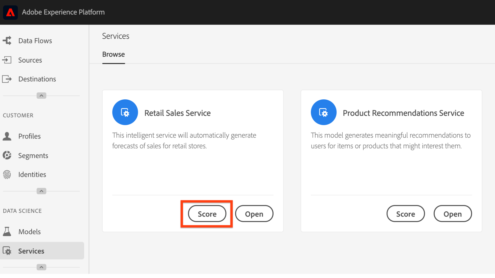

# Publicación de un modelo como servicio (UI)

Adobe Experience Platform Data Science Workspace le permite publicar el modelo evaluado y capacitado como un servicio, lo que permite a los usuarios de la organización de IMS puntuar datos sin necesidad de crear sus propios modelos.

## Primeros pasos

Para completar este tutorial, debe tener acceso a [!DNL Experience Platform]. Si no tiene acceso a una organización de IMS en [!DNL Experience Platform], póngase en contacto con el administrador del sistema antes de continuar.

Este tutorial requiere un modelo existente con una ejecución de formación correcta. Si no dispone de un modelo que se pueda publicar, siga el [programa de formación y evalúe un modelo en el tutorial de la interfaz de usuario](./train-evaluate-model-ui.md) antes de continuar.

Si prefiere publicar un modelo con las API de aprendizaje automático de Sensei, consulte el tutorial [de](./publish-model-service-api.md)API.

## Publicación de un modelo {#publish-a-model}

1. En Adobe Experience Platform, haga clic en el vínculo **[!UICONTROL Modelos]** ubicado en la columna de navegación izquierda para realizar la lista de todos los modelos existentes. Busque y haga clic en el nombre del modelo que se va a publicar como servicio.
   
2. Haga clic en **[!UICONTROL Publicar]** cerca de la parte superior derecha de la página de información general del modelo para inicio de un proceso de creación de servicios.
   
3. Introduzca un nombre que desee para el servicio y, si lo desea, proporcione una descripción del servicio, haga clic en **[!UICONTROL Siguiente]** cuando finalice.
   
4. Se muestran todas las ejecuciones de formación correctas para el modelo. El nuevo servicio heredará las configuraciones de capacitación y puntuación de la ejecución de formación seleccionada.
   
5. Haga clic en **[!UICONTROL Finalizar]** para crear el servicio y redirigir a la Galería **[!UICONTROL de]** servicios para mostrar todos los servicios disponibles, incluido el servicio recién creado.
   

## Puntuación mediante un servicio {#access-a-service}

1. En Adobe Experience Platform, haga clic en la ficha **[!UICONTROL Servicios]** ubicada en la columna de navegación izquierda para acceder a la Galería **[!UICONTROL de servicios]**. Busque el servicio que desee utilizar y haga clic en **[!UICONTROL Puntuación]**.
   
2. Seleccione un conjunto de datos de entrada adecuado para la ejecución de puntuación y haga clic en **[!UICONTROL Siguiente]**.
   
3. Seleccione un conjunto de datos de salida adecuado para los resultados de puntuación y haga clic en **[!UICONTROL Siguiente]**.
   
4. Cuando se crea un servicio, hereda las configuraciones de puntuación predeterminadas. Puede revisar estas configuraciones y ajustarlas según sea necesario haciendo clic con el doble en los valores. Una vez que esté satisfecho con las configuraciones, haga clic en **[!UICONTROL Finalizar]** para comenzar la ejecución de la puntuación.
   
5. En la página *Información general* del servicio, se muestran los detalles del nuevo trabajo de puntuación y su progreso. Una vez finalizado el trabajo, se actualizará el trabajo de puntuación **[!UICONTROL Más reciente]** .
   

## Pasos siguientes {#next-steps}

Siguiendo este tutorial, ha publicado correctamente un modelo como un servicio accesible y ha puntuado datos mediante el nuevo servicio a través de la Galería **[!UICONTROL de]** servicios. Continúe con el siguiente tutorial para obtener información sobre cómo puede [programar las ejecuciones de puntuación y formación automatizada en un servicio](./schedule-models-ui.md).
