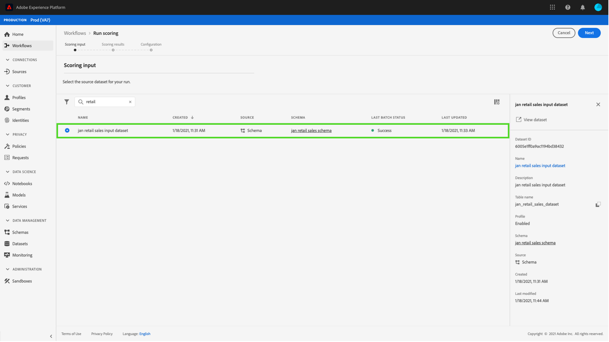

# Publicación de un modelo como servicio en la IU de Espacio de trabajo de ciencia de datos {#publish-a-model-as-a-service}

>[!CONTEXTUALHELP]
>id="platform_intelligentservices_publishmodel"
>title="Publicación de un modelo como servicio"
>abstract=""

El espacio de trabajo de ciencia de datos de Adobe Experience Platform le permite publicar su modelo entrenado y evaluado como servicio, lo que permite a los usuarios de su organización puntuar datos sin necesidad de crear sus propios modelos.

## Introducción

Para completar este tutorial, debe tener acceso a [!DNL Experience Platform]. Si no tiene acceso a una organización en [!DNL Experience Platform], póngase en contacto con el administrador del sistema antes de continuar.

Este tutorial requiere un modelo existente con una ejecución de formación correcta. Si no tiene un modelo publicable, siga las [Formación y evaluación de un modelo en la IU de](./train-evaluate-model-ui.md) tutorial antes de continuar.

Si prefiere publicar un modelo mediante las API de aprendizaje automático de Sensei, consulte la [Tutorial de API](./publish-model-service-api.md).

## Publicación de un modelo {#publish-a-model}

En Adobe Experience Platform, seleccione **[!UICONTROL Modelos]** situado en la columna de navegación izquierda, seleccione la opción **[!UICONTROL Examinar]** para ver una lista de todos los modelos existentes. Seleccione el nombre del modelo que desea publicar como servicio.

Seleccionar **[!UICONTROL Publish]** cerca de la parte superior derecha de la página Información general del modelo para iniciar un proceso de creación de servicios.

Introduzca un nombre para el servicio y, opcionalmente, proporcione una descripción del servicio y seleccione **[!UICONTROL Siguiente]** cuando termine.

Se muestran todas las ejecuciones de formación correctas para en el modelo. El nuevo servicio heredará las configuraciones de formación y puntuación de la ejecución de formación seleccionada.

Seleccionar **[!UICONTROL Finalizar]** para crear el servicio y redirigir a **[!UICONTROL Galería de servicios]** para mostrar todos los servicios disponibles, incluido el servicio recién creado.

## Puntuación mediante un servicio {#access-a-service}

En Adobe Experience Platform, seleccione la **[!UICONTROL Servicios]** situado en la columna de navegación izquierda para acceder a la **[!UICONTROL Galería de servicios]**. Busque el servicio que desea utilizar y seleccione **[!UICONTROL Abrir]**.

En la página de información general del servicio, seleccione **[!UICONTROL Puntuación]**.

Seleccione un conjunto de datos de entrada adecuado para la ejecución de puntuación y, a continuación, seleccione **[!UICONTROL Siguiente]**. Se le pide que haga lo mismo para el conjunto de datos de puntuación. Una vez seleccionado el conjunto de datos de entrada y salida, puede actualizar las configuraciones.

Cuando se crea un servicio, hereda las configuraciones de puntuación predeterminadas. Puede revisar estas configuraciones y ajustarlas según sea necesario haciendo doble clic en los valores. Una vez que esté satisfecho con las configuraciones, seleccione **[!UICONTROL Finalizar]** para comenzar la ejecución de puntuación.

En el servicio de **Información general** , se muestran los detalles del nuevo trabajo de puntuación y su progreso. Una vez finalizado el trabajo, la variable **[!UICONTROL Más reciente]** encabezado dentro de **[!UICONTROL Puntuación]** contenedor se ha actualizado.

## Pasos siguientes {#next-steps}

Al seguir este tutorial, ha publicado correctamente un modelo como servicio accesible y ha puntuado los datos mediante el nuevo servicio a través de la variable [!UICONTROL Galería de servicios]. Continúe con el siguiente tutorial para aprender cómo puede hacer lo siguiente [programar ejecuciones automatizadas de formación y puntuación en un servicio](./schedule-models-ui.md).
