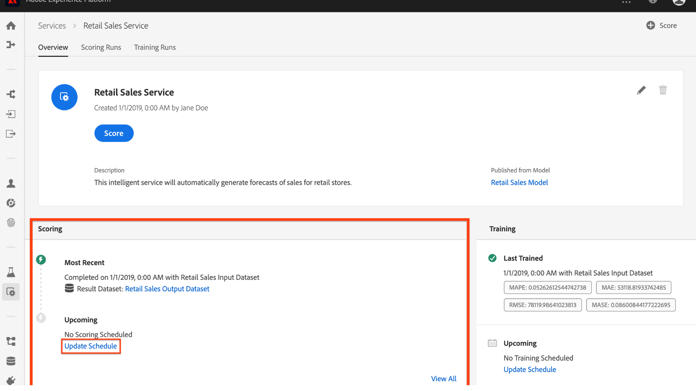

# Programar un modelo (IU)

Adobe Experience Platform [!DNL Data Science Workspace] le permite configurar las ejecuciones de puntuación y formación programadas en un servicio de aprendizaje automático. La automatización del proceso de calificación y capacitación puede ayudar a mantener y mejorar la eficiencia de un servicio a través del tiempo, al mantenerse al día con los patrones dentro de sus datos.

En este tutorial se explican los pasos para configurar las programaciones de capacitación y puntuación en un servicio existente a través de la Galería **[!UICONTROL de servicios]**. Se divide en las siguientes secciones principales:

- [Configurar puntuación programada](#configure-scheduled-scoring)
- [Configurar la formación programada](#configure-scheduled-training)

## Primeros pasos

Para completar este tutorial, debe tener acceso a [!DNL Experience Platform]. Si no tiene acceso a una organización de IMS en [!DNL Experience Platform], póngase en contacto con el administrador del sistema antes de continuar.

Este tutorial requiere un servicio existente. Si no tiene un servicio accesible con el que trabajar, puede crear uno siguiendo el tutorial [Publicar el modelo como servicio de la interfaz de usuario](./publish-model-service-ui.md) .

## Configurar puntuación programada {#configure-scheduled-scoring}

La puntuación de modelo se puede configurar para que sea un proceso automatizado y programado. Una vez creado el servicio, puede seguir los pasos a continuación para configurar y aplicar un programa de puntuación:

1. En Adobe Experience Platform, haga clic en la ficha **[!UICONTROL Servicios]** ubicada en la columna de navegación izquierda para acceder a la *[!DNL Service Gallery]*. Busque el servicio en el que desea programar las ejecuciones de puntuación y haga clic en **[!UICONTROL Abrir]** para vista de su página de *Información general* .
   

2. La página Información general muestra la información de puntuación del servicio. Haga clic en el vínculo **[!UICONTROL Actualizar programación]** para configurar un programa de puntuación.
   

3. Configure la frecuencia, la fecha de inicio, la fecha de finalización, el conjunto de datos de entrada y el conjunto de datos de salida para la programación de puntuación. Una vez que esté satisfecho con las configuraciones, haga clic en **[!UICONTROL Crear]** para actualizar el programa de puntuación del servicio.
   

4. El programa de puntuación actualizado se muestra en la página *Información general* del servicio.
   

## Configurar la formación programada {#configure-scheduled-training}

La configuración de las ejecuciones de formación programadas en un servicio garantiza que el modelo de aprendizaje automático se actualice a los patrones de datos más recientes. Siempre que se completa una ejecución de formación programada, se utiliza el modelo capacitado resultante para activar el servicio hasta la siguiente ejecución de formación programada.

Una vez creado el servicio, puede seguir los pasos que se indican a continuación para configurar y aplicar una programación de formación:

1. En Adobe Experience Platform, haga clic en la ficha **[!UICONTROL Servicios]** ubicada en la columna de navegación izquierda para acceder a la Galería **[!UICONTROL de servicios]**. Busque el servicio en el que desea programar las ejecuciones de formación y haga clic en **[!UICONTROL Abrir]** para vista de la página de *Información general* .
   

2. La página Información general muestra la información de capacitación del servicio. Haga clic en el vínculo **[!UICONTROL Actualizar programación]** para configurar una programación de formación.
   

3. Configure la frecuencia, la fecha de inicio, la fecha de finalización y el conjunto de datos de entrada utilizados para la programación de formación. Una vez que esté satisfecho con las configuraciones, haga clic en **[!UICONTROL Crear]** para actualizar la programación de formación del servicio.
   

4. La programación de formación actualizada se muestra en la página *Información general* del servicio.
   

## Pasos siguientes

Siguiendo este tutorial, ha programado correctamente las ejecuciones de puntuación y formación automatizada en un servicio y ha completado el flujo de trabajo de la interfaz de usuario del [!DNL Data Science Workspace] tutorial. Si aún no lo ha hecho, considere [reiniciar el tutorial](./create-retails-sales-dataset.md) y siga el flujo de trabajo de API para crear, entrenar, marcar y publicar un modelo.
