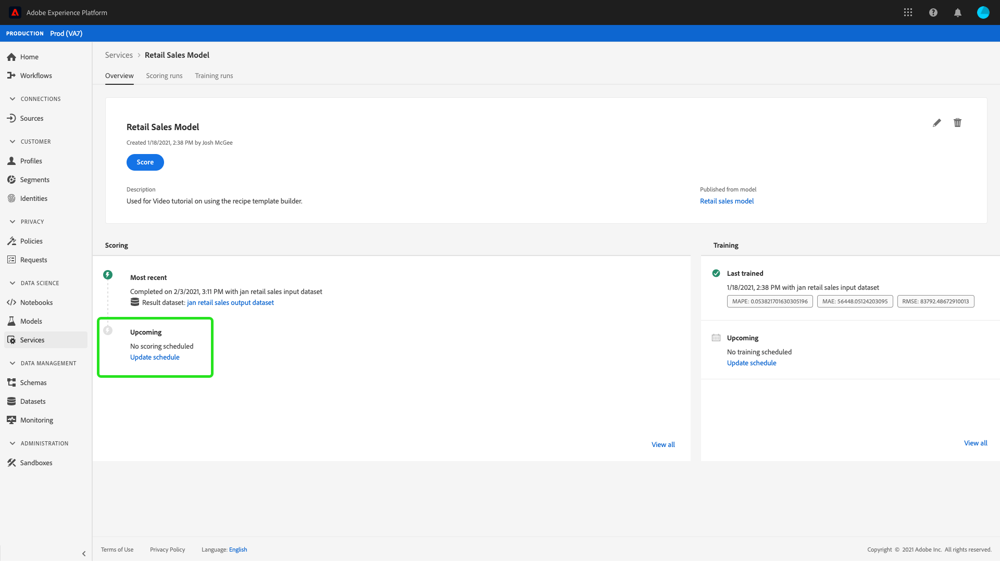

# Programar un modelo en la interfaz de usuario de Data Science Workspace

Adobe Experience Platform [!DNL Data Science Workspace] permite configurar ejecuciones de puntuación y formación programadas en un servicio de aprendizaje automático. La automatización del proceso de capacitación y puntuación puede ayudar a mantener y mejorar la eficacia de un servicio a lo largo del tiempo al mantenerse al día con los patrones dentro de los datos.

Este tutorial explica los pasos para configurar las programaciones de capacitación y puntuación en un servicio existente a través del [!UICONTROL Galería de servicios]. Se divide en las siguientes secciones principales:

- [Configurar la puntuación programada](#configure-scheduled-scoring)
- [Configuración de la formación programada](#configure-scheduled-training)

## Primeros pasos

Para completar este tutorial, debe tener acceso a [!DNL Experience Platform]. Si no tiene acceso a una organización en [!DNL Experience Platform], póngase en contacto con el administrador del sistema antes de continuar.

Este tutorial requiere un servicio existente. Si no tiene un servicio accesible con el que trabajar, puede crearlo siguiendo el tutorial de [publicación de un modelo como servicio](./publish-model-service-ui.md).

## Configurar la puntuación programada {#configure-scheduled-scoring}

La puntuación del modelo se puede configurar para que sea un proceso automatizado de forma programada. Una vez creado un servicio, puede seguir los pasos a continuación para configurar y aplicar una programación de puntuación:

En Adobe Experience Platform, seleccione la opción **[!UICONTROL Servicios]** situado en la columna de navegación izquierda para acceder a la **[!DNL Service Gallery]**. Busque el servicio en el que desea programar las ejecuciones de puntuación y seleccione **[!UICONTROL Apertura]** para ver su **[!UICONTROL Información general]** página.

La página Información general muestra la información de puntuación del servicio. Seleccione el **[!UICONTROL Actualizar programación]** para configurar una programación de puntuación.

Configure la frecuencia, la fecha de inicio, la fecha de finalización, el conjunto de datos de entrada y el conjunto de datos de salida para la programación de puntuación. Una vez que esté satisfecho con las configuraciones, seleccione **[!UICONTROL Crear]** para actualizar la programación de puntuación del servicio.

El programa de puntuación actualizado se muestra en la **[!UICONTROL Información general]** página.

## Configuración de la formación programada {#configure-scheduled-training}

La configuración de las ejecuciones de capacitación programadas en un servicio garantiza que el modelo de aprendizaje automático se actualice a los patrones de datos más recientes. Cada vez que se completa una ejecución de capacitación programada, el modelo entrenado resultante se utiliza para impulsar el servicio hasta la siguiente ejecución de capacitación programada.

Una vez creado un servicio, puede seguir los pasos a continuación para configurar y aplicar una programación de capacitación:

En Adobe Experience Platform, seleccione la opción **[!UICONTROL Servicios]** situado en la columna de navegación izquierda para acceder a la **[!UICONTROL Galería de servicios]**. Busque el servicio en el que desea programar la ejecución de la formación y seleccione **[!UICONTROL Apertura]** para ver su **[!UICONTROL Información general]** página.

La página Información general muestra la información de formación del servicio. Seleccione el **[!UICONTROL Actualizar programación]** para configurar una programación de formación.

Configure la frecuencia, la fecha de inicio, la fecha de finalización y el conjunto de datos de entrada utilizados para la programación de capacitación. Una vez que esté satisfecho con las configuraciones, seleccione **[!UICONTROL Crear]** para actualizar el programa de formación del servicio.

El programa de formación actualizado se muestra en la **[!UICONTROL Información general]** página.

## Pasos siguientes

Al seguir este tutorial, ha programado correctamente la formación automatizada y las ejecuciones de puntuación en un servicio, y ha completado la [!DNL Data Science Workspace] flujo de trabajo de la interfaz de usuario del tutorial. Si aún no lo ha hecho, considere la posibilidad de [reiniciar el tutorial](./create-retails-sales-dataset.md) y siga el flujo de trabajo de la API para crear, entrenar, puntuar y publicar un modelo.
