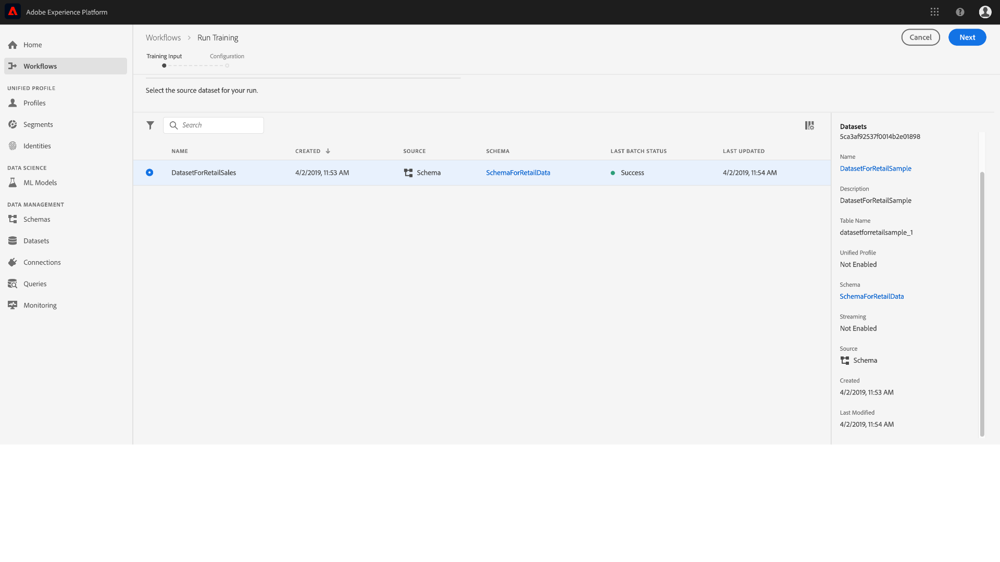

# Formación y evaluación de un modelo en la interfaz de usuario de Área de trabajo de ciencia de datos

En Adobe Experience Platform Data Science Workspace, se crea un modelo de aprendizaje automático mediante la incorporación de una fórmula existente que es adecuada para la intención del modelo. A continuación, se capacita y evalúa al Modelo para optimizar su eficacia y eficiencia operativa mediante el ajuste de sus hiperparámetros asociados. Las fórmulas son reutilizables, lo que significa que se pueden crear y adaptar varios modelos a fines específicos con una sola fórmula.

Este tutorial recorre los pasos para crear, entrenar y evaluar un modelo.

## Primeros pasos

Para completar este tutorial, debe tener acceso a [!DNL Experience Platform]. Si no tiene acceso a una organización de IMS en [!DNL Experience Platform], comuníquese con el administrador del sistema antes de continuar.

Este tutorial requiere una fórmula existente. Si no tiene una fórmula, siga el tutorial [Importar una fórmula empaquetada en la IU](./import-packaged-recipe-ui.md) antes de continuar.

## Crear un modelo

1. En Adobe Experience Platform, haga clic en el vínculo **[!UICONTROL Modelos]** ubicado en la columna de navegación izquierda para lista de todos los modelos existentes. Haga clic en **[!UICONTROL Crear modelo]** cerca de la parte superior derecha de la página para iniciar un proceso de creación de modelo.
   

2. Navegue por la lista de las fórmulas existentes, busque y seleccione la fórmula que se utilizará para crear el modelo y haga clic en **[!UICONTROL Siguiente]**.
   

3. Seleccione un conjunto de datos de entrada adecuado y haga clic en **[!UICONTROL Siguiente]**. Esto establecerá el conjunto de datos de formación de entrada predeterminado para el modelo.
   

4. Proporcione un nombre para el modelo y revise las configuraciones de modelo predeterminadas. Las configuraciones predeterminadas se aplicaron durante la creación de la fórmula, para revisar y modificar los valores de configuración, haga clic en los valores mientras pulsa el doble. Para proporcionar un nuevo conjunto de configuraciones, haga clic en **[!UICONTROL Cargar nueva configuración]** y arrastre un archivo JSON que contenga configuraciones de modelo a la ventana del explorador. Haga clic en **[!UICONTROL Finalizar]** para crear el modelo.

   >[!NOTE]
   >
   >Las configuraciones son únicas y específicas de la fórmula deseada, lo que significa que las configuraciones de la fórmula de ventas minoristas no funcionarán para la fórmula de Recommendations del producto. Consulte la sección [referencia](#reference) para obtener una lista de las configuraciones de las fórmulas de venta minorista.

   

## Crear una ejecución de formación

1. En Adobe Experience Platform, haga clic en el vínculo **[!UICONTROL Modelos]** ubicado en la columna de navegación izquierda para lista de todos los modelos existentes. Busque y haga clic en el nombre del modelo que se va a formar.
   

2. Se muestran todas las ejecuciones de formación existentes con sus estados de formación actuales. Para los modelos creados con la interfaz de usuario [!DNL Data Science Workspace], se genera y ejecuta automáticamente una ejecución de formación utilizando las configuraciones predeterminadas y el conjunto de datos de capacitación de entrada.
   

3. Para crear una nueva formación, haga clic en **[!UICONTROL Train]** cerca de la parte superior derecha de la página de información general del modelo.
   

4. Seleccione el conjunto de datos de entrada de formación para la ejecución de la formación y haga clic en **[!UICONTROL Siguiente]**.
   

5. Las configuraciones predeterminadas proporcionadas durante la creación del Modelo se muestran, cambian y modifican en consecuencia haciendo clic en los valores con el doble. Haga clic en **[!UICONTROL Finalizar]** para crear y ejecutar la ejecución de formación.

   >[!NOTE]
   >
   >Las configuraciones son únicas y específicas de la fórmula deseada, lo que significa que las configuraciones de la fórmula de ventas minoristas no funcionarán para la fórmula de Recommendations del producto. Consulte la sección [referencia](#reference) para obtener una lista de las configuraciones de las fórmulas de venta minorista.

   

## Evaluar el modelo

1. En Adobe Experience Platform, haga clic en el vínculo **[!UICONTROL Modelos]** ubicado en la columna de navegación izquierda para lista de todos los modelos existentes. Busque y haga clic en el nombre del modelo que se va a evaluar.
   

2. Se muestran todas las ejecuciones de formación existentes con sus estados de formación actuales. Con varias ejecuciones de formación completadas, las métricas de evaluación se pueden comparar en distintas ejecuciones de formación en el gráfico de evaluación del modelo; seleccione una métrica de evaluación mediante la lista desplegable que se encuentra encima del gráfico.

   La métrica de error de porcentaje absoluto medio (MAPE) expresa la precisión como un porcentaje del error. Se utiliza para identificar el experimento de mayor rendimiento. Cuanto más bajo sea el MAPE, mejor.

   

   La métrica &quot;Precisión&quot; describe el porcentaje de instancias relevantes en comparación con el total de *instancias recuperadas*. La precisión puede considerarse como la probabilidad de que un resultado seleccionado al azar sea correcto.
   

   Haga clic en una ejecución de formación específica para vista de los detalles de dicha ejecución. Esto se puede hacer incluso antes de que se complete la ejecución. En la página de detalles de ejecución, puede ver otras métricas de evaluación, parámetros de configuración y visualizaciones específicos de la ejecución de formación. También puede descargar registros de actividades para ver los detalles de la ejecución. Los registros son especialmente útiles para las ejecuciones fallidas a fin de ver qué ha fallado.
   

3. No se puede entrenar a los hiperparámetros y se debe optimizar un modelo probando distintas combinaciones de hiperparámetros. Repita este proceso de formación y evaluación del modelo hasta que llegue a un modelo optimizado.

## Pasos siguientes

Este tutorial lo guió durante la creación, formación y evaluación de un modelo en [!DNL Data Science Workspace]. Una vez que haya llegado a un modelo optimizado, puede utilizar el modelo capacitado para generar perspectivas siguiendo el tutorial [Puntuación de un modelo en la IU](./score-model-ui.md).

## Referencia {#reference}

### Configuraciones de fórmulas de venta minorista

Los hiperparámetros determinan el comportamiento de la formación del modelo; la modificación de los hiperparámetros afectará a la precisión y precisión del modelo:

| Hiperparámetro | Descripción | Intervalo recomendado |
--- | --- | ---
| learning_rate | La tasa de aprendizaje reduce la contribución de cada árbol según la tasa de aprendizaje. Hay una compensación entre learning_rate y n_estimators. | 0,1 | [2 - 10] / número de estimadores |
| n_estimators | Número de etapas de refuerzo que se van a realizar. El aumento de degradado es bastante robusto para sobreencajar, por lo que un gran número suele dar como resultado un mejor rendimiento. | 100 | 100 - 1000 |
| max_depth | Profundidad máxima de los estimadores de regresión individuales. La profundidad máxima limita el número de nodos en el árbol. Ajuste este parámetro para obtener el mejor rendimiento; el mejor valor depende de la interacción de las variables de entrada. | 3 | 4 - 10 |

Los parámetros adicionales determinan las propiedades técnicas del modelo:

| Clave de parámetro | Tipo | Descripción |
| ----- | ----- | ----- |
| `ACP_DSW_INPUT_FEATURES` | Cadena | Lista de atributos de esquema de entrada separados por comas. |
| `ACP_DSW_TARGET_FEATURES` | Cadena | Lista de atributos de esquema de salida separados por comas. |
| `ACP_DSW_FEATURE_UPDATE_SUPPORT` | Booleano | Determina si las características de entrada y salida se pueden modificar |
| `tenantId` | Cadena | Este ID garantiza que los recursos que cree tengan un espacio de nombres adecuado y estén contenidos en la organización de IMS. [Siga los pasos ](../../xdm/api/getting-started.md#know-your-tenant_id) aquí para encontrar su ID de inquilino. |
| `ACP_DSW_TRAINING_XDM_SCHEMA` | Cadena | Esquema de entrada utilizado para la formación de un modelo. |
| `evaluation.labelColumn` | Cadena | Etiqueta de columna para visualizaciones de evaluación. |
| `evaluation.metrics` | Cadena | Lista separada por comas de las métricas de evaluación que se utilizarán para evaluar un modelo. |
| `ACP_DSW_SCORING_RESULTS_XDM_SCHEMA` | Cadena | Esquema de salida utilizado para marcar un modelo. |