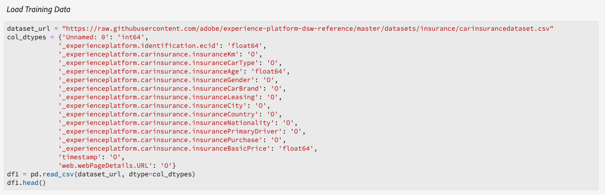

# Administrar portátiles de aprendizaje automático en tiempo real (Alpha)

>[!IMPORTANT]
>
>El aprendizaje automático en tiempo real aún no está disponible para todos los usuarios. Esta función está en alfa y aún se está probando. Este documento está sujeto a cambios.

La siguiente guía describe los pasos necesarios para crear una aplicación de aprendizaje automático en tiempo real. Utilizando el Adobe proporcionado **[!UICONTROL Real-time ML]** Python bloc template, esta guía abarca la formación de un modelo, la creación de un DSL, la publicación de DSL a Edge y la puntuación de la solicitud. A medida que avanza en la implementación del modelo de aprendizaje automático en tiempo real, se espera que modifique la plantilla para adaptarla a las necesidades del conjunto de datos.

## Crear un bloc de notas de aprendizaje automático en tiempo real

En la interfaz de usuario de Adobe Experience Platform, seleccione **[!UICONTROL Notebooks]** dentro de **Data Science**. A continuación, seleccione **[!UICONTROL JupyterLab]** y permita que el entorno se cargue algún tiempo.


Aparece el [!DNL JupyterLab] lanzador. Desplácese hacia abajo hasta *Aprendizaje automático en tiempo real* y seleccione el bloc de notas **[!UICONTROL Real-time ML]**. Se abre una plantilla que contiene celdas de bloc de notas de ejemplo con un conjunto de datos de ejemplo.


## Importar y descubrir nodos

Comience importando todos los paquetes necesarios para su modelo. Asegúrese de importar cualquier paquete que planee utilizar para la creación de nodos.

>[!NOTE]
>
>Su lista de importaciones puede diferir según el modelo que desee hacer. Esta lista cambiará a medida que se añadan nuevos nodos con el paso del tiempo. Consulte la [guía de referencia de nodos](./node-reference.md) para obtener una lista completa de los nodos disponibles.

```python
from pprint import pprint
import pandas as pd
import numpy as np
import json
import uuid
from shutil import copyfile
from pathlib import Path
from datetime import date, datetime, timedelta
from platform_sdk.dataset_reader import DatasetReader

from rtml_nodelibs.nodes.standard.preprocessing.json_to_df import JsonToDataframe
from rtml_sdk.edge.utils import EdgeUtils
from rtml_sdk.graph.utils import GraphBuilder
from rtml_nodelibs.nodes.standard.ml.onnx import ONNXNode
from rtml_nodelibs.core.nodefactory import NodeFactory as nf
from rtml_nodelibs.nodes.standard.preprocessing.pandasnode import Pandas
from rtml_nodelibs.nodes.standard.preprocessing.one_hot_encoder import OneHotEncoder
from rtml_nodelibs.nodes.standard.ml.artifact_utils import ModelUpload
from rtml_nodelibs.core.nodefactory import NodeFactory as nf
from rtml_nodelibs.core.datamsg import DataMsg
```

La siguiente celda de código imprime una lista de nodos disponibles.

```python
# Discover Nodes
pprint(nf.discover_nodes())
```


## Formación de un modelo de aprendizaje automático en tiempo real

Con una de las siguientes opciones, se escribe código [!DNL Python] para leer, preprocesar y analizar datos. A continuación, debe entrenar su propio modelo ML, serializarlo en formato ONNX y luego cargarlo en la tienda del modelo de aprendizaje automático en tiempo real.

- [Formación de su propio modelo en portátiles JupyterLab](#training-your-own-model)
- [Carga de su propio modelo ONNX preentrenado a portátiles JupyterLab](#pre-trained-model-upload)

### Capacitación de su propio modelo {#training-your-own-model}

Comience cargando los datos de la formación.

>[!NOTE]
>
>En la plantilla **Real-time ML** , el [conjunto de datos CSV de seguro de automóvil](https://github.com/adobe/experience-platform-dsw-reference/tree/master/datasets/insurance) se toma de [!DNL Github].



Si desea utilizar un conjunto de datos desde Adobe Experience Platform, quite el comentario de la celda siguiente. A continuación, debe reemplazar `DATASET_ID` por el valor apropiado.


Para acceder a un conjunto de datos en su bloc de notas [!DNL JupyterLab], seleccione la pestaña **Data** en la navegación izquierda de [!DNL JupyterLab]. Aparecen los directorios **[!UICONTROL Datasets]** y **[!UICONTROL Schemas]**. Seleccione **[!UICONTROL Datasets]** y haga clic con el botón derecho y, a continuación, seleccione la opción **[!UICONTROL Explore Data in Notebook]** en el menú desplegable del conjunto de datos que desee utilizar. Aparece una entrada de código ejecutable en la parte inferior del bloc de notas. Esta celda tiene su `dataset_id`.


Una vez finalizada, haga clic con el botón secundario y elimine la celda que generó en la parte inferior del bloc de notas.

### Propiedades de formación

Con la plantilla proporcionada, modifique cualquiera de las propiedades de formación en `config_properties`.

```python
config_properties = {
    "train_records_limit":1000000,
    "n_estimators": "80",
    "max_depth": "5",
    "ten_id": "_experienceplatform"  
}
```

### Preparar el modelo

Con la plantilla **[!UICONTROL Real-time ML]**, debe analizar, procesar previamente, entrenar y evaluar su modelo ML. Esto se hace mediante la aplicación de transformaciones de datos y la creación de un flujo de formación.

**Transformaciones de datos**

La celda **[!UICONTROL Real-time ML]** plantillas **Data Transformations** debe modificarse para que funcione con su propio conjunto de datos. Normalmente, esto implica cambiar el nombre de las columnas, el resumen de datos y la preparación/ingeniería de funciones de datos.

>[!NOTE]
>
>El siguiente ejemplo se ha condensado para fines de legibilidad utilizando `[ ... ]`. Consulte y expanda la sección de transformaciones de datos de las plantillas *ML* en tiempo real para la celda de código completa.

```python
df1.rename(columns = {config_properties['ten_id']+'.identification.ecid' : 'ecid',
                     [ ... ]}, inplace=True)
df1 = df1[['ecid', 'km', 'cartype', 'age', 'gender', 'carbrand', 'leasing', 'city', 
       'country', 'nationality', 'primaryuser', 'purchase', 'pricequote', 'timestamp']]
print("df1 shape 1", df1.shape)
#########################################
# Data Rollup
######################################### 
df1['timestamp'] = pd.to_datetime(df1.timestamp)
df1['hour'] = df1['timestamp'].dt.hour.astype(int)
df1['dayofweek'] = df1['timestamp'].dt.dayofweek

df1.loc[(df1['purchase'] == 'yes'), 'purchase'] = 1
df1.purchase.fillna(0, inplace=True)
df1['purchase'] = df1['purchase'].astype(int)

[ ... ]

print("df1 shape 2", df1.shape)

#########################################
# Data Preparation/Feature Engineering
#########################################      

df1['carbrand'] = df1['carbrand'].str.lower()
df1['country'] = df1['country'].str.lower()
df1.loc[(df1['carbrand'] == 'vw'), 'carbrand'] = 'volkswagen'

[ ... ]

df1['age'].fillna(df1['age'].median(), inplace=True)
df1['gender'].fillna('notgiven', inplace=True)

[ ... ]

df1['city'] = df1.groupby('country')['city'].transform(lambda x : x.fillna(x.mode()))
df1.dropna(subset = ['pricequote'], inplace=True)
print("df1 shape 3", df1.shape)
print(df1)

#grouping
grouping_cols = ['carbrand', 'cartype', 'city', 'country']

for col in grouping_cols:
    df_idx = pd.DataFrame(df1[col].value_counts().head(6))

    def grouping(x):
        if x in df_idx.index:
            return x
        else:
            return "Others"
    df1[col] = df1[col].apply(lambda x: grouping(x))

def age(x):
    if x < 20:
        return "u20"
    elif x > 19 and x < 29:
    [ ... ]
    else: 
        return "Others"

df1['age'] = df1['age'].astype(int)
df1['age_bucket'] = df1['age'].apply(lambda x: age(x))

df_final = df1[['hour', 'dayofweek','age_bucket', 'gender', 'city',  
   'country', 'carbrand', 'cartype', 'leasing', 'pricequote', 'purchase']]
print("df final", df_final.shape)

cat_cols = ['age_bucket', 'gender', 'city', 'dayofweek', 'country', 'carbrand', 'cartype', 'leasing']
df_final = pd.get_dummies(df_final, columns = cat_cols)
```

Ejecute la celda proporcionada para ver un resultado de ejemplo. La tabla de salida devuelta del conjunto de datos `carinsurancedataset.csv` devuelve las modificaciones que ha definido.


**Canalización de formación**

A continuación, debe crear la canalización de formación. Esto se parece a cualquier otro archivo de canalización de formación, excepto que necesita convertir y generar un archivo ONNX.

Con las transformaciones de datos definidas en la celda anterior, modifique la plantilla. El siguiente código resaltado a continuación se utiliza para generar un archivo ONNX en la canalización de funciones. Consulte la plantilla *Real-time ML* para obtener la celda completa del código de canalización.

```python
#for generating onnx
def generate_onnx_resources(self):        
    install_dir = os.path.expanduser('~/my-workspace')
    print("Generating Onnx")
        
    from skl2onnx import convert_sklearn
    from skl2onnx.common.data_types import FloatTensorType
        
    # ONNX-ification
    initial_type = [('float_input', FloatTensorType([None, self.feature_len]))]

    print("Converting Model to Onnx")
    onx = convert_sklearn(self.model, initial_types=initial_type)
             
    with open("model.onnx", "wb") as f:
        f.write(onx.SerializeToString())
            
    print("Model onnx created")
```

Una vez que haya completado la canalización de formación y haya modificado los datos mediante transformaciones de datos, utilice la siguiente celda para ejecutar la formación.

```python
model = train(config_properties, df_final)
```

### Generación y carga de un modelo ONNX

Una vez que haya completado una ejecución de formación exitosa, debe generar un modelo ONNX y cargar el modelo entrenado en la tienda del modelo de aprendizaje automático en tiempo real. Después de ejecutar las siguientes celdas, el modelo ONNX aparece en el carril izquierdo junto con todos los demás portátiles.

```python
import os
import skl2onnx, subprocess

model.generate_onnx_resources()
```

>[!NOTE]
>
>Cambie el valor de cadena `model_path` (`model.onnx`) para cambiar el nombre del modelo.

```python
model_path = "model.onnx"
```

>[!NOTE]
>
>La siguiente celda no es editable ni eliminable y es necesaria para que funcione la aplicación de aprendizaje automático en tiempo real.

```python
model = ModelUpload(params={'model_path': model_path})
msg_model = model.process(None, 1)
model_id = msg_model.model['model_id']
 
print("Model ID : ", model_id)
```


### Carga de su propio modelo de ONNX preentrenado {#pre-trained-model-upload}

Utilizando el botón de carga ubicado en [!DNL JupyterLab] blocs de notas, cargue su modelo ONNX preentrenado en el entorno [!DNL Data Science Workspace] de portátiles.


A continuación, cambie el valor de la cadena `model_path` en el bloc de notas *Real-time ML* para que coincida con el nombre del modelo ONNX. Una vez finalizado, ejecute la celda *Set model path* y luego ejecute la celda *Upload your model to RTML Model Store*. Tanto la ubicación del modelo como el ID del modelo se devuelven en la respuesta cuando se realiza correctamente.


## Creación de un idioma específico del dominio (DSL)

Esta sección describe la creación de un DSL. Va a crear los nodos que incluyen cualquier preprocesamiento de datos junto con el nodo ONNX. A continuación, se crea un gráfico DSL utilizando nodos y bordes. Bordea los nodos de conexión utilizando un formato basado en tuples (node_1, node_2). El gráfico no debe tener ciclos.

>[!IMPORTANT]
>
>El uso del nodo ONNX es obligatorio. Sin el nodo ONNX, la aplicación no tendrá éxito.

### Creación de nodos

>[!NOTE]
>
> Es probable que tenga varios nodos en función del tipo de datos que utilice. El siguiente ejemplo describe solo un nodo en la plantilla *Real-time ML*. Consulte la sección *Plantillas ML* en tiempo real *Creación de nodos* para ver la celda de código completa.

El nodo Pandas siguiente utiliza `"import": "map"` para importar el nombre del método como una cadena en los parámetros, seguido de introducir los parámetros como una función de asignación. El ejemplo siguiente lo hace utilizando `{'arg': {'dataLayerNull': 'notgiven', 'no': 'no', 'yes': 'yes', 'notgiven': 'notgiven'}}`. Una vez que haya colocado el mapa, tiene la opción de establecer `inplace` como `True` o `False`. Establezca `inplace` como `True` o `False` en función de si desea aplicar la transformación en su lugar o no. De forma predeterminada, `"inplace": False` crea una nueva columna. La compatibilidad para proporcionar un nuevo nombre de columna se establece para añadirse en una versión posterior. La última línea `cols` puede ser un nombre de columna único o una lista de columnas. Especifique las columnas en las que desea aplicar la transformación. En este ejemplo se especifica `leasing`. Para obtener más información sobre los nodos disponibles y cómo utilizarlos, visite la [guía de referencia de nodos](./node-reference.md).

```python
# Renaming leasing column using Pandas Node
leasing_mapper_node = Pandas(params={'import': 'map',
                                'kwargs': {'arg': {
                                    'dataLayerNull': 'notgiven', 
                                    'no': 'no', 
                                    'yes': 'yes', 
                                    'notgiven': 'notgiven'}},
                                'inplace': True,
                                'cols': 'leasing'})
```

### Creación del gráfico DSL

Con los nodos creados, el siguiente paso es encadenar los nodos juntos para crear un gráfico.

Comience enumerando todos los nodos que forman parte del gráfico creando una matriz.

```python
nodes = [json_df_node, 
        to_datetime_node,
        hour_node,
        dayofweek_node,
        age_fillna_node,
        carbrand_fillna_node,
        country_fillna_node,
        cartype_primary_nationality_km_fillna_node,
        carbrand_mapper_node,
        cartype_mapper_node,
        country_mapper_node,
        gender_mapper_node,
        leasing_mapper_node,
        age_to_int_node,
        age_bins_node,
        dummies_node, 
        onnx_node]
```

A continuación, conecte los nodos con los bordes. Cada tuple es una conexión [!DNL Edge].

>[!TIP]
>
> Como los nodos dependen linealmente entre sí (cada nodo depende de la salida del nodo anterior), puede crear vínculos utilizando una simple comprensión de la lista Python. Añada sus propias conexiones si un nodo depende de varias entradas.

```python
edges = [(nodes[i], nodes[i+1]) for i in range(len(nodes)-1)]
```

Una vez que los nodos estén conectados, cree el gráfico. La celda siguiente es obligatoria y no se puede editar ni eliminar.

```python
dsl = GraphBuilder.generate_dsl(nodes=nodes, edges=edges)
pprint(json.loads(dsl))
```

Una vez finalizado, se devuelve un objeto `edge` que contiene cada uno de los nodos y los parámetros asignados a ellos.


## Publicar en Edge (Hub)

>[!NOTE]
>
>Adobe Experience Platform Hub implementa y administra temporalmente aprendizaje automático en tiempo real. Para obtener más información, consulte la sección de información general sobre [Arquitectura de aprendizaje automático en tiempo real](./home.md#architecture).

Ahora que ha creado un gráfico DSL, puede implementarlo en [!DNL Edge].

>[!IMPORTANT]
>
>No publicar en [!DNL Edge] con frecuencia, esto puede sobrecargar los nodos [!DNL Edge]. No se recomienda publicar el mismo modelo varias veces.

```python
edge_utils = EdgeUtils()
(edge_location, service_id) = edge_utils.publish_to_edge(dsl=dsl)
print(f'Edge Location: {edge_location}')
print(f'Service ID: {service_id}')
```

### Actualización del DSL y republicación en Edge (opcional)

Si no necesita actualizar su DSL, puede saltar a [Scoring](#scoring).

>[!NOTE]
>
>Las siguientes celdas solo son necesarias si desea actualizar un DSL existente que se ha publicado en Edge.

Es probable que sus modelos sigan desarrollándose. En lugar de crear un servicio completamente nuevo, es posible actualizar un servicio existente con el nuevo modelo. Puede definir un nodo que desee actualizar, asignarlo a un nuevo ID y, a continuación, volver a cargar el nuevo DSL en [!DNL Edge].

En el siguiente ejemplo, el nodo 0 se actualiza con un nuevo ID.

```python
# Update the id of Node 0 with a random uuid.

dsl_dict = json.loads(dsl)
print(f"ID of Node 0 in current DSL: {dsl_dict['edge']['applicationDsl']['nodes'][0]['id']}")

new_node_id = str(uuid.uuid4())
print(f'Updated Node ID: {new_node_id}')

dsl_dict['edge']['applicationDsl']['nodes'][0]['id'] = new_node_id
```


Después de actualizar el ID de nodo, puede volver a publicar un DSL actualizado en Edge.

```python
# Republish the updated DSL to Edge
(edge_location_ret, service_id, updated_dsl) = edge_utils.update_deployment(dsl=json.dumps(dsl_dict), service_id=service_id)
print(f'Updated dsl: {updated_dsl}')
```

Se le devuelve el DSL actualizado.


## Puntuación {#scoring}

Después de publicar en [!DNL Edge], la puntuación se realiza mediante una solicitud del POST de un cliente. Normalmente, esto se puede hacer desde una aplicación cliente que necesita puntuaciones ML. También puedes hacerlo desde Postman. La plantilla **[!UICONTROL Real-time ML]** utiliza EdgeUtils para demostrar este proceso.

>[!NOTE]
>
>Se requiere un tiempo de procesamiento pequeño antes de que comience la puntuación.

```python
# Wait for the app to come up
import time
time.sleep(20)
```

Con el mismo esquema utilizado en la formación, se generan datos de puntuación de muestra. Estos datos se utilizan para crear un datafame de puntuación y luego se convierten en un diccionario de puntuación. Consulte la plantilla *Real-time ML* para obtener la celda de código completa.


### Puntuación frente al extremo de Edge

Utilice la siguiente celda dentro de la plantilla *Real-time ML* para comparar su servicio [!DNL Edge].


Una vez finalizada la puntuación, se devuelve el resultado [!DNL Edge] URL, Carga útil y puntuado del [!DNL Edge].

## Enumere las aplicaciones implementadas desde [!DNL Edge]

Para generar una lista de las aplicaciones implementadas actualmente en [!DNL Edge], ejecute la siguiente celda de código. Esta celda no se puede editar ni eliminar.

```python
services = edge_utils.list_deployed_services()
print(services)
```

La respuesta devuelta es una matriz de los servicios implementados.

```json
[
    {
        "created": "2020-05-25T19:18:52.731Z",
        "deprecated": false,
        "id": "40eq76c0-1c6f-427a-8f8f-54y9cdf041b7",
        "type": "edge",
        "updated": "2020-05-25T19:18:52.731Z"
    }
]
```

## Eliminar una aplicación o ID de servicio implementados del [!DNL Edge] (opcional)

>[!CAUTION]
>
>Esta celda se utiliza para eliminar la aplicación Edge implementada. No utilice la siguiente celda a menos que necesite eliminar una aplicación [!DNL Edge] implementada.

```python
if edge_utils.delete_from_edge(service_id=service_id):
    print(f"Deleted service id {service_id} successfully")
else:
    print(f"Failed to delete service id {service_id}")
```

## Pasos siguientes

Siguiendo el tutorial anterior, ha entrenado y cargado correctamente un modelo ONNX en la tienda de modelos de aprendizaje automático en tiempo real. Además, ha marcado e implementado su modelo de aprendizaje automático en tiempo real. Si desea obtener más información sobre los nodos disponibles para la creación de modelos, visite la [guía de referencia de nodos](./node-reference.md).
