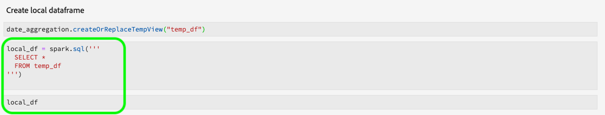
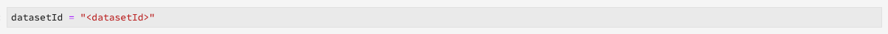
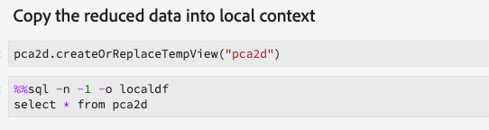

# Guías de migración de fórmulas y portátiles

>[!NOTE]
>Los equipos portátiles y las fórmulas que utilizan Python/R no se ven afectados. La migración solo se aplica a las fórmulas y los blocs de notas PySpark/Spark existentes.

Las siguientes guías describen los pasos y la información necesarios para migrar las fórmulas y los blocs de notas existentes.

- [Guías de migración de fórmulas](#recipe-migration)
- [Guías de migración de equipos portátiles](#notebook-migration)

## Guías de migración de fórmulas {#recipe-migration}

Los cambios recientes en el área de trabajo de ciencia de datos requieren que se actualicen las fórmulas existentes de Spark y PySpark. Utilice los siguientes flujos de trabajo para ayudarle en la transición de las fórmulas.

- [Guía de migración de Spark](#spark-migration-guide)
   - [Modificar la forma de leer y escribir conjuntos de datos](#read-write-recipe-spark)
   - [Descargar la fórmula de muestra](#download-sample-spark)
   - [Añadir el archivo de docker](#add-dockerfile-spark)
   - [Comprobar dependencias](#change-dependencies-spark)
   - [Preparación de secuencias de comandos de doctorado](#prepare-docker-spark)
   - [crear la fórmula con docker](#create-recipe-spark)
- [Guía de migración de PySpark](#pyspark-migration-guide)
   - [Modificar la forma de leer y escribir conjuntos de datos](#pyspark-read-write)
   - [Descargar la fórmula de muestra](#pyspark-download-sample)
   - [Añadir el archivo de docker](#pyspark-add-dockerfile)
   - [Preparación de secuencias de comandos de doctorado](#pyspark-prepare-docker)
   - [crear la fórmula con docker](#pyspark-create-recipe)

## Guía de migración de Spark {#spark-migration-guide}

El artefacto de fórmula generado por los pasos de compilación es ahora una imagen de Docker que contiene el archivo binario .jar. Además, la sintaxis utilizada para leer y escribir conjuntos de datos mediante el SDK de plataforma ha cambiado y requiere que modifique el código de fórmula.

El siguiente vídeo está diseñado para ayudar a comprender mejor los cambios que se requieren para las fórmulas de Spark:

>[!VIDEO](https://video.tv.adobe.com/v/33243)

### Leer y escribir conjuntos de datos (Spark) {#read-write-recipe-spark}

Antes de crear la imagen de Docker, revise los ejemplos de lectura y escritura de conjuntos de datos en el SDK de plataforma, que se proporcionan en las secciones siguientes. Si va a convertir las fórmulas existentes, es necesario actualizar el código del SDK de la plataforma.

#### Leer un conjunto de datos

En esta sección se describen los cambios necesarios para leer un conjunto de datos y se utiliza el ejemplo [helper.scala](https://github.com/adobe/experience-platform-dsw-reference/blob/master/recipes/scala/src/main/scala/com/adobe/platform/ml/helper/Helper.scala) , proporcionado por Adobe.

Con las actualizaciones de las fórmulas de Spark, es necesario agregar y cambiar varios valores. En primer lugar, ya no `DataSetOptions` se utiliza. Replace `DataSetOptions` with `QSOption`. Además, se requieren nuevos `option` parámetros. Tanto `QSOption.mode` como `QSOption.datasetId` son necesarios. Por último, `orgId` y `serviceApiKey` hay que cambiarlo por `imsOrg` y `apiKey`. Revise la siguiente tabla para ver una comparación sobre la lectura de conjuntos de datos:

<table>
  <th>Forma antigua de leer un conjunto de datos</th>
  <th>Nueva forma de leer un conjunto de datos</th>
  <tr>
  <td>
  <pre class="JSON language-JSON hljs">
  var df = sparkSession.read.format("com.adobe.platform.dataset") .option(DataSetOptions.orgId, orgId).option(DataSetOptions.serviceToken, serviceToken).option(DataSetOptions.userToken, userToken).option(DataSetOptions.serviceApiKey, apiKey).load(data SetId)
</pre>
  </td>
  <td>
<pre class="JSON language-JSON hljs">
import com.adobe.platform.consulta.QSOption

var df = sparkSession.read.format(&quot;com.adobe.platform.consulta&quot;).option(QSOption.userToken&quot;, {userToken}).option(QSOption.serviceToken, {serviceToken}).option(QSOption.imsOrg, {orgId}).option(QSOption.apiKey, {apiKey}).option(QSOption.mode, &quot;interactive&quot;).option(QSOption.datasetId, {dataSetId}).load()
</pre>
</td>
  </tr>
</table>

>[!TIP]
> El tiempo de espera del modo interactivo finaliza si las consultas se ejecutan más de 10 minutos. Si va a ingerir más de unos cuantos gigabytes de datos, se recomienda cambiar al modo &quot;por lotes&quot;. El modo de lotes tarda más en inicio, pero puede manejar conjuntos de datos más grandes.

#### Escribir en un conjunto de datos

Esta sección describe los cambios necesarios para escribir un conjunto de datos mediante el ejemplo [ScoringDataSaver.scala](https://github.com/adobe/experience-platform-dsw-reference/blob/master/recipes/scala/src/main/scala/com/adobe/platform/ml/ScoringDataSaver.scala) , proporcionado por Adobe.

Con las actualizaciones de las fórmulas de Spark, es necesario agregar y cambiar varios valores. En primer lugar, ya no `DataSetOptions` se utiliza. Replace `DataSetOptions` with `QSOption`. Además, se requieren nuevos `option` parámetros. `QSOption.datasetId` y reemplaza la necesidad de cargar el `{dataSetId}` en `.save()`. Por último, `orgId` y `serviceApiKey` hay que cambiarlo por `imsOrg` y `apiKey`. Revise la siguiente tabla para ver una comparación sobre cómo escribir conjuntos de datos:

<table>
  <th>Forma antigua de escribir un conjunto de datos</th>
  <th>Nueva forma de escribir un conjunto de datos</th>
  <tr>
  <td>
  <pre class="JSON language-JSON hljs">
  df.write.format("com.adobe.platform.dataset") .option(DataSetOptions.orgId, orgId) .option(DataSetOptions.serviceToken, serviceToken) .option(DataSetOptions.userToken, userToken).option(DataSetOptions.serviceApiKey, apiKey).save(scoringResultsDataData SetId)
</pre>
  </td>
  <td>
<pre class="JSON language-JSON hljs">
import com.adobe.platform.consulta.QSOption

df.write.format(&quot;com.adobe.platform.consulta&quot;).option(QSOption.userToken&quot;, {userToken}).option(QSOption.serviceToken, {serviceToken}).option(QSOption.imsOrg, {orgId}).option(QSOption.apiKey, {apiKey}).option(QSO ption.datasetId, {dataSetId}).save()
</pre>
</td>
  </tr>
</table>

### Archivos de origen basados en el acoplador de paquetes (Spark) {#package-docker-spark}

Inicio navegando al directorio donde se encuentra la fórmula.

Las siguientes secciones utilizan la nueva fórmula de ventas minoristas de Scala, que se encuentra en el repositorio [público Github de](https://github.com/adobe/experience-platform-dsw-reference)Data Science Workspace.

### Descargar la fórmula de muestra (Spark) {#download-sample-spark}

La fórmula de ejemplo contiene archivos que deben copiarse en la fórmula existente. Para clonar el Github público que contiene todas las fórmulas de muestra, introduzca lo siguiente en el terminal:

```BASH
git clone https://github.com/adobe/experience-platform-dsw-reference.git
```

La fórmula Scala se encuentra en el siguiente directorio `experience-platform-dsw-reference/recipes/scala/retail`.

### Añadir el archivo de acoplamiento (Spark) {#add-dockerfile-spark}

Se necesita un nuevo archivo en la carpeta de fórmulas para utilizar el flujo de trabajo basado en docker. Copie y pegue el archivo de Dockerfile desde la carpeta de fórmulas ubicada en `experience-platform-dsw-reference/recipes/scala/Dockerfile`. Opcionalmente, también puede copiar y pegar el código siguiente en un nuevo archivo llamado `Dockerfile`.

>[!IMPORTANT]
> El archivo jar de ejemplo que se muestra a continuación `ml-retail-sample-spark-*-jar-with-dependencies.jar` debe reemplazarse por el nombre del archivo jar de la fórmula.

```scala
FROM adobe/acp-dsw-ml-runtime-spark:0.0.1

COPY target/ml-retail-sample-spark-*-jar-with-dependencies.jar /application.jar
```

### Cambiar dependencias (Spark) {#change-dependencies-spark}

Si está utilizando una fórmula existente, se requieren cambios en el archivo pom.xml para las dependencias. Cambie la versión de dependencia model-authoring-sdk a 1.0.0. A continuación, actualice la versión de Spark en el archivo pom a 2.4.3 y la versión de Scala a a 2.11.12.

```json
<groupId>com.adobe.platform.ml</groupId>
<artifactId>authoring-sdk_2.11</artifactId>
<version>1.0.0</version>
<classifier>jar-with-dependencies</classifier>
```

### Preparación de los scripts del acoplador (Spark) {#prepare-docker-spark}

Las fórmulas de chispa ya no utilizan artefactos binarios y, en su lugar, requieren crear una imagen de acoplamiento. Si no lo ha hecho, [descargue e instale Docker](https://www.docker.com/products/docker-desktop).

En la fórmula de muestra de Scala proporcionada, puede encontrar las secuencias de comandos `login.sh` y `build.sh` ubicada en `experience-platform-dsw-reference/recipes/scala/` . Copie y pegue estos archivos en la fórmula existente.

La estructura de carpetas ahora debe tener un aspecto similar al siguiente ejemplo (los archivos recién agregados se resaltan):


El siguiente paso es seguir los archivos de origen del [paquete en un tutorial de fórmula](./models-recipes/package-source-files-recipe.md) . Este tutorial tiene una sección que describe la creación de una imagen de acoplador para una fórmula Scala (Spark). Una vez completada, se le proporcionará la imagen del Docker en un Registro de Contenedores de Azure junto con la URL de la imagen correspondiente.

### Crear una fórmula (Chispa) {#create-recipe-spark}

Para crear una fórmula, primero debe completar el tutorial de archivos [de origen del](./models-recipes/package-source-files-recipe.md) paquete y tener preparada la URL de la imagen del docker. Puede crear una fórmula con la interfaz de usuario o la API.

Para crear la fórmula con la IU, siga el tutorial [Importar una fórmula empaquetada (UI)](./models-recipes/import-packaged-recipe-ui.md) para Scala.

Para crear la fórmula con la API, siga el tutorial [Importar una fórmula empaquetada (API)](./models-recipes/import-packaged-recipe-api.md) para Scala.

## Guía de migración de PySpark {#pyspark-migration-guide}

El artefacto de fórmula generado por los pasos de compilación es ahora una imagen de Docker que contiene el archivo .egg binario. Además, la sintaxis utilizada para leer y escribir conjuntos de datos mediante el SDK de plataforma ha cambiado y requiere que modifique el código de fórmula.

El siguiente vídeo está diseñado para ayudar a comprender mejor los cambios necesarios para las fórmulas de PySpark:

>[!VIDEO](https://video.tv.adobe.com/v/33048?learn=on&quality=12)

### Lectura y escritura de conjuntos de datos (PySpark) {#pyspark-read-write}

Antes de crear la imagen de Docker, revise los ejemplos de lectura y escritura de conjuntos de datos en el SDK de plataforma, que se proporcionan en las secciones siguientes. Si va a convertir las fórmulas existentes, es necesario actualizar el código del SDK de la plataforma.

#### Leer un conjunto de datos

Esta sección describe los cambios necesarios para leer un conjunto de datos mediante el [ejemplo helper.py](https://github.com/adobe/experience-platform-dsw-reference/blob/master/recipes/pyspark/pysparkretailapp/helper.py) , proporcionado por Adobe.

Con las actualizaciones de las fórmulas de Spark, es necesario agregar y cambiar varios valores. En primer lugar, ya no `DataSetOptions` se utiliza. Replace `DataSetOptions` with `qs_option`. Además, se requieren nuevos `option` parámetros. Tanto `qs_option.mode` como `qs_option.datasetId` son necesarios. Por último, `orgId` y `serviceApiKey` hay que cambiarlo por `imsOrg` y `apiKey`. Revise la siguiente tabla para ver una comparación sobre la lectura de conjuntos de datos:

<table>
  <th>Forma antigua de leer un conjunto de datos</th>
  <th>Nueva forma de leer un conjunto de datos</th>
  <tr>
  <td>
  <pre class="JSON language-JSON hljs">
dataset_options = get_dataset_options(spark.sparkContext)

pd = spark.read.format(&quot;com.adobe.platform.dataset&quot;).option(dataset_options.serviceToken(), service_token).option(dataset_options.userToken(), user_token).option(dataset_options.orgId(), org_id).option(dataset_options.serviceApiKey(), api_load).key) (dataset_id)
</pre>
</td>
  <td>
<pre class="JSON language-JSON hljs">
qs_option = spark_context._jvm.com.adobe.platform.consulta.QSOption

pd = sparkSession.read.format(&quot;com.adobe.platform.consulta&quot;).option(qs_option.userToken, {userToken}).option(qs_option.serviceToken, {serviceToken}).option(qs_option.imsOrg, {orgId}).option(qs_option.apiKey, {apiKey}) .option(qs_option.mode, &quot;interactive&quot;).option(qs_option.datasetId, {dataSetId}).load()
</pre>
</td>
  </tr>
</table>

>[!TIP]
> El tiempo de espera del modo interactivo finaliza si las consultas se ejecutan más de 10 minutos. Si va a ingerir más de unos cuantos gigabytes de datos, se recomienda cambiar al modo &quot;por lotes&quot;. El modo de lotes tarda más en inicio, pero puede manejar conjuntos de datos más grandes.

#### Escribir en un conjunto de datos

Esta sección describe los cambios necesarios para escribir un conjunto de datos mediante el ejemplo [data_saver.py](https://github.com/adobe/experience-platform-dsw-reference/blob/master/recipes/pyspark/pysparkretailapp/data_saver.py) , proporcionado por Adobe.

Con las actualizaciones de las fórmulas de PySpark, es necesario agregar y cambiar varios valores. En primer lugar, ya no `DataSetOptions` se utiliza. Replace `DataSetOptions` with `qs_option`. Además, se requieren nuevos `option` parámetros.  `qs_option.datasetId` y reemplaza la necesidad de cargar el `{dataSetId}` en `.save()` . Por último, `orgId` y `serviceApiKey` hay que cambiarlo por `imsOrg` y `apiKey`. Revise la siguiente tabla para ver una comparación sobre la lectura de conjuntos de datos:

<table>
  <th>Forma antigua de escribir un conjunto de datos</th>
  <th>Nueva forma de escribir un conjunto de datos</th>
  <tr>
  <td>
  <pre class="JSON language-JSON hljs">
df.write.format("com.adobe.platform.dataset") .option(DataSetOptions.orgId, orgId) .option(DataSetOptions.serviceToken, serviceToken) .option(DataSetOptions.userToken, userToken).option(DataSetOptions.serviceApiKey, apiKey).save(scoringResultsDataData SetId)
</pre>
  </td>
  <td>
<pre class="JSON language-JSON hljs">
qs_option = spark_context._jvm.com.adobe.platform.consulta.QSOption

score_df.write.format(&quot;com.adobe.platform.consulta&quot;).option(qs_option.userToken, {userToken}).option(qs_option.serviceToken, {serviceToken}).option(qs_option.imsOrg, {orgId}).option(qs_option.apiKey, {apiKey}).option(qs s_option.datasetId, {dataSetId}).save()
</pre>
</td>
  </tr>
</table>

### Archivos de origen basados en el acoplador de paquetes (PySpark) {#pyspark-package-docker}

Inicio navegando al directorio donde se encuentra la fórmula.

Para este ejemplo, se utiliza la nueva fórmula de ventas minoristas de PySpark y se puede encontrar en el repositorio [público de Github de](https://github.com/adobe/experience-platform-dsw-reference)Data Science Workspace.

### Descargar la fórmula de muestra (PySpark) {#pyspark-download-sample}

La fórmula de ejemplo contiene archivos que deben copiarse en la fórmula existente. Para clonar el Github público que contiene todas las fórmulas de muestra, introduzca lo siguiente en la terminal.

```BASH
git clone https://github.com/adobe/experience-platform-dsw-reference.git
```

La fórmula PySpark se encuentra en el siguiente directorio `experience-platform-dsw-reference/recipes/pyspark`.

### Añadir el archivo de Dockerfile (PySpark) {#pyspark-add-dockerfile}

Se necesita un nuevo archivo en la carpeta de fórmulas para utilizar el flujo de trabajo basado en docker. Copie y pegue el archivo de Dockerfile desde la carpeta de fórmulas ubicada en `experience-platform-dsw-reference/recipes/pyspark/Dockerfile`. Opcionalmente, también puede copiar y pegar el código siguiente y crear un nuevo archivo llamado `Dockerfile`.

>[!IMPORTANT]
> El archivo de ejemplo de huevo que se muestra a continuación `pysparkretailapp-*.egg` debe reemplazarse por el nombre del archivo de huevo de la fórmula.

```scala
FROM adobe/acp-dsw-ml-runtime-pyspark:0.0.1
RUN mkdir /recipe

COPY . /recipe

RUN cd /recipe && \
    ${PYTHON} setup.py clean install && \
    rm -rf /recipe

RUN cp /databricks/conda/envs/${DEFAULT_DATABRICKS_ROOT_CONDA_ENV}/lib/python3.6/site-packages/pysparkretailapp-*.egg /application.egg
```

### Preparación de los scripts de Docker (PySpark) {#pyspark-prepare-docker}

Las fórmulas de PySpark ya no utilizan artefactos binarios y, en su lugar, requieren crear una imagen de Docker. Si no lo ha hecho, descargue e instale [Docker](https://www.docker.com/products/docker-desktop).

En la fórmula de muestra PySpark proporcionada, puede encontrar los scripts `login.sh` y `build.sh` ubicados en `experience-platform-dsw-reference/recipes/pyspark` . Copie y pegue estos archivos en la fórmula existente.

La estructura de carpetas ahora debe tener un aspecto similar al siguiente ejemplo (los archivos recién agregados se resaltan):


La fórmula ya está lista para crearse con una imagen de Docker. El siguiente paso es seguir los archivos de origen del [paquete en un tutorial de fórmula](./models-recipes/package-source-files-recipe.md) . Este tutorial tiene una sección que describe cómo crear una imagen de acoplador para una fórmula PySpark (Spark 2.4). Una vez completada, se le proporcionará la imagen del Docker en un Registro de Contenedores de Azure junto con la URL de la imagen correspondiente.

### Crear una fórmula (PySpark) {#pyspark-create-recipe}

Para crear una fórmula, primero debe completar el tutorial de archivos [de origen del](./models-recipes/package-source-files-recipe.md) paquete y tener preparada la URL de la imagen del docker. Puede crear una fórmula con la interfaz de usuario o la API.

Para crear la fórmula con la IU, siga el tutorial [Importar una fórmula empaquetada (UI)](./models-recipes/import-packaged-recipe-ui.md) de PySpark.

Para crear la fórmula con la API, siga el tutorial [Importar una fórmula empaquetada (API)](./models-recipes/import-packaged-recipe-api.md) de PySpark.

## Guías de migración de equipos portátiles {#notebook-migration}

Los cambios recientes en los blocs de notas de JupyterLab requieren que actualice los blocs de notas PySpark y Spark 2.3 existentes a 2.4. Con este cambio, JupyterLab Launcher se ha actualizado con nuevos portátiles de arranque. Para obtener una guía paso a paso sobre cómo convertir los blocs de notas, seleccione una de las siguientes guías:

- [Guía de migración de PySpark 2.3 a 2.4](#pyspark-notebook-migration)
- [Guía de migración de Spark 2.3 a Spark 2.4 (Scala)](#spark-notebook-migration)

El siguiente vídeo está diseñado para ayudar a comprender mejor los cambios que se requieren para los equipos portátiles JupyterLab:

>[!VIDEO](https://video.tv.adobe.com/v/33444?quality=12&learn=on)

## Guía de migración de portátiles PySpark 2.3 a 2.4 {#pyspark-notebook-migration}

Con la introducción de PySpark 2.4 a los portátiles JupyterLab, los nuevos portátiles Python con PySpark 2.4 ahora utilizan el núcleo Python 3 en lugar del núcleo PySpark 3. Esto significa que el código existente que se ejecuta en PySpark 2.3 no es compatible con PySpark 2.4.

>[!IMPORTANT] PySpark 2.3 está en desuso y está configurado para eliminarse en una versión posterior. Todos los ejemplos existentes se han configurado para reemplazarse con ejemplos de PySpark 2.4.

Para convertir los portátiles PySpark 3 (Spark 2.3) existentes a Spark 2.4, siga los ejemplos que se describen a continuación:

### Kernel

Los portátiles PySpark 3 (Spark 2.4) utilizan el núcleo Python 3 en lugar del núcleo PySpark desaprobado que se utiliza en los portátiles PySpark 3 (Spark 2.3 - desaprobado).

Para confirmar o cambiar el núcleo en la interfaz de usuario de JupyterLab, seleccione el botón del núcleo ubicado en la barra de navegación superior derecha del bloc de notas. Si está utilizando uno de los blocs de notas predefinidos del iniciador, el núcleo está preseleccionado. El ejemplo siguiente utiliza el motor de arranque del bloc de notas PySpark 3 (Spark 2.4) *Aggregation* .


Al seleccionar el menú desplegable, se abre una lista de núcleos disponibles.


Para los portátiles PySpark 3 (Spark 2.4), seleccione el núcleo Python 3 y confirme haciendo clic en el botón **Seleccionar** .


## Inicializando sparkSession

Todos los blocs de notas Spark 2.4 requieren que inicialice la sesión con el nuevo código repetitivo.

<table>
  <th>Portátil</th>
  <th>PySpark 3 (Spark 2.3, obsoleto)</th>
  <th>PySpark 3 (Spark 2.4)</th>
  <tr>
  <th>Kernel</th>
  <td align="center">PySpark 3</td>
  <td align="center">Python 3</td>
  </tr>
  <tr>
  <th>Código</th>
  <td>
  <pre class="JSON language-JSON hljs">
  spark
</pre>
  </td>
  <td>
  <pre class="JSON language-JSON hljs">
desde pyspark.sql import SparkSessionspark = SparkSession.builder.getOrCreate()
</pre>
  </td>
  </tr>
</table>

Las siguientes imágenes resaltan las diferencias en la configuración de PySpark 2.3 y PySpark 2.4. Este ejemplo utiliza los blocs de notas de inicio de *Agregación* proporcionados en JupyterLab Launcher.

**Ejemplo de configuración para 2.3 (desaprobado)**


**Ejemplo de configuración para 2.4**


## Uso de la magia %dataset {#magic}

Con la introducción de Spark 2.4, `%dataset` la magia personalizada se suministra para su uso en los nuevos portátiles PySpark 3 (Spark 2.4) (núcleo Python 3).

**Uso**

`%dataset {action} --datasetId {id} --dataFrame {df}`

**Descripción**

Un comando mágico personalizado de Data Science Workspace para leer o escribir un conjunto de datos desde un bloc de notas Python (núcleo Python 3).

- **{action}**: Tipo de acción que se realizará en el conjunto de datos. Hay dos acciones disponibles: &quot;lectura&quot; o &quot;escritura&quot;.
- **—datasetId {id}**: Se utiliza para proporcionar la identificación del conjunto de datos que se va a leer o escribir. Este es un argumento requerido.
- **—dataFrame {df}**: El juego de datos pandas. Este es un argumento requerido.
   - Cuando la acción es &quot;leída&quot;, {df} es la variable donde están disponibles los resultados de la operación de lectura del conjunto de datos.
   - Cuando la acción es &quot;write&quot;, este dataframe {df} se escribe en el conjunto de datos.
- **—mode (opcional)**: Los parámetros permitidos son &quot;batch&quot; e &quot;interactive&quot;. De forma predeterminada, el modo se establece en &quot;interactivo&quot;. Se recomienda utilizar el modo &quot;por lotes&quot; al leer grandes cantidades de datos.

**Ejemplos**

- **Leer ejemplo**: `%dataset read --datasetId 5e68141134492718af974841 --dataFrame pd0`
- **Ejemplo** de escritura: `%dataset write --datasetId 5e68141134492718af974842 --dataFrame pd0`

## Cargar en un marco de datos en LocalContext

Con la introducción de Spark 2.4, se proporciona [`%dataset`](#magic) magia personalizada. La siguiente tabla resalta las diferencias clave para cargar el datafame en los blocs de notas PySpark (Spark 2.3) y PySpark (Spark 2.4):

<table>
  <th>Portátil</th>
  <th>PySpark 3 (Spark 2.3, obsoleto)</th>
  <th>PySpark 3 (Spark 2.4)</th>
  <tr>
  <th>Kernel</th>
  <td align="center">PySpark 3</td>
  <td align="center">Python 3</td>
  </tr>
  <tr>
  <th>Código</th>
  <td>
  <pre class="JSON language-JSON hljs">
dataset_options = sc._jvm.com.adobe.platform.dataset.DataSetOptions

pd0 = spark.read.format(&quot;com.adobe.platform.dataset&quot;).option(dataset_options.orgId(), &quot;310C6D375BA5248F0A494212@AdobeOrg&quot;).load(&quot;5e68141134492718af974844&quot;)
</pre>
</td>
  <td>
  <pre class="JSON language-JSON hljs">
%dataset read —datasetId 5e68141134492718af974844 —dataFrame pd0
</pre>
  </td>
  </tr>
</table>

| Elemento | Descripción |
| ------- | ----------- |
| pd0 | Nombre del objeto dataframe pandas que se va a usar o crear. |
| [%dataset](#magic) | Magia personalizada para acceso a datos en el núcleo Python3. |

Las siguientes imágenes resaltan las diferencias clave en la carga de datos para PySpark 2.3 y PySpark 2.4. Este ejemplo utiliza los blocs de notas de inicio de *Agregación* proporcionados en JupyterLab Launcher.

**Carga de datos en PySpark 2.3 (conjunto de datos de luminancia): obsoleto**


**Carga de datos en PySpark 2.4 (conjunto de datos de luminancia)**

Con PySpark 3 (Spark 2.4) `sc = spark.sparkContext` se define en la carga.


**Carga de datos de la plataforma de Experience Cloud en PySpark 2.3, obsoleto**


**Carga de datos de la plataforma de Experience Cloud en PySpark 2.4**

Con PySpark 3 (Spark 2.4) `org_id` y ya no `dataset_id` es necesario definir. Además, `df = spark.read.format` se ha sustituido por una magia personalizada [`%dataset`](#magic) para facilitar la lectura y escritura de conjuntos de datos.


| Elemento | description |
| ------- | ----------- |
| [%dataset](#magic) | Magia personalizada para acceso a datos en el núcleo Python3. |

>[!TIP] —mode se puede establecer en `interactive` o `batch`. El valor predeterminado para —mode es `interactive`. Se recomienda utilizar el `batch` modo cuando se leen grandes cantidades de datos.

## Creación de un datafame local

Con PySpark 3 (Spark 2.4) ya no se admite `%%` sparkMagic. Ya no se pueden utilizar las siguientes operaciones:

- `%%help`
- `%%info`
- `%%cleanup`
- `%%delete`
- `%%configure`
- `%%local`

En la tabla siguiente se describen los cambios necesarios para convertir consultas `%%sql` chismosas:

<table>
  <th>Portátil</th>
  <th>PySpark 3 (Spark 2.3, obsoleto)</th>
  <th>PySpark 3 (Spark 2.4)</th>
  <tr>
  <th>Kernel</th>
  <td align="center">PySpark 3</td>
  <td align="center">Python 3</td>
  </tr>
  <tr>
  <th>Código</th>
      <td>
         <pre class="JSON language-JSON hljs">%%sql -o dfselect * de sparkdf
</pre>
         <pre class="JSON language-JSON hljs"> %%sql -o df -n limitselect * de sparkdf
</pre>
         <pre class="JSON language-JSON hljs">%%sql -o df -qselect * de sparkdf
</pre>
         <pre class="JSON language-JSON hljs"> %%sql -o df -r fractionselect * de sparkdf
</pre>
      </td>
      <td>
         <pre class="JSON language-JSON hljs">
df = spark.sql(''' SELECT * FROM sparkdf'')
</pre>
         <pre class="JSON language-JSON hljs">
df = spark.sql(''' SELECT * FROM sparkdf LIMIT limit''')
</pre>
         <pre class="JSON language-JSON hljs">
df = spark.sql(''' SELECT * FROM sparkdf LIMIT limit''')
</pre>
         <pre class="JSON language-JSON hljs">
sample_df = df.sample(fraction)
</pre>
      </td>
   </tr>
</table>

>[!TIP] También puede especificar una muestra de raíz opcional, como un booleano conSustitución, fracción de doble o una semilla larga.

Las siguientes imágenes resaltan las diferencias clave para crear un datafame local en PySpark 2.3 y PySpark 2.4. Este ejemplo utiliza los blocs de notas de inicio de *Agregación* proporcionados en JupyterLab Launcher.

**Crear un dataframe local PySpark 2.3, obsoleto**


**Crear un datafame local PySpark 2.4**

Con PySpark 3 (Spark 2.4) `%%sql` SparkMagic ya no se admite y se ha sustituido por lo siguiente:



## Escribir en un conjunto de datos

Con la introducción de Spark 2.4, se proporciona la magia personalizada que hace que la escritura de conjuntos de datos sea más limpia. [`%dataset`](#magic) Para escribir en un conjunto de datos, utilice el siguiente ejemplo de Spark 2.4:

<table>
  <th>Portátil</th>
  <th>PySpark 3 (Spark 2.3, obsoleto)</th>
  <th>PySpark 3 (Spark 2.4)</th>
  <tr>
  <th>Kernel</th>
  <td align="center">PySpark 3</td>
  <td align="center">Python 3</td>
  </tr>
  <tr>
  <th>Código</th>
  <td>
  <pre class="JSON language-JSON hljs">
userToken = spark.sparkContext.getConf().get("spark.yarn.appMasterEnv.USER_TOKEN")serviceToken = spark.sparkContext.getConf().get("spark.yarn.appMasterEnv.SERVICE_TOKEN") serviceApiKey = spark.spark Context.getConf().get("spark.yarn.appMasterEnv.SERVICE_API_KEY")

dataset_options = sc._jvm.com.adobe.platform.dataset.DataSetOptions

pd0.write.format(&quot;com.adobe.platform.dataset&quot;).option(dataset_options.orgId(), &quot;310C6D375BA5248F0A494212@AdobeOrg&quot;).option(dataset_options.userToken(), userToken).option(dataset_options.serviceToken(), serviceToken).option(dataset_options.serviceApiKey(), serviceApiKey).save(&quot;5e68141134492718af974844&quot;)
</pre>
</td>
  <td>
  <pre class="JSON language-JSON hljs">
%dataset write —datasetId 5e68141134492718af974844 —dataFrame pd0

pd0.describe()pd0.show(10, False)
</pre>
</td>
  </tr>
</table>

| Elemento | description |
| ------- | ----------- |
| pd0 | Nombre del objeto dataframe pandas que se va a usar o crear. |
| [%dataset](#magic) | Magia personalizada para acceso a datos en el núcleo Python3. |

>[!TIP] —mode se puede establecer en `interactive` o `batch`. El valor predeterminado para —mode es `interactive`. Se recomienda utilizar el `batch` modo cuando se leen grandes cantidades de datos.

Las siguientes imágenes resaltan las diferencias clave para volver a escribir datos en Platform en PySpark 2.3 y PySpark 2.4. Este ejemplo utiliza los blocs de notas de inicio de *Agregación* proporcionados en JupyterLab Launcher.

**Escritura de datos en Platform PySpark 2.3, obsoleto**



**Escritura de datos en Platform PySpark 2.4**

Con PySpark 3 (Spark 2.4), la `%dataset` magia personalizada elimina la necesidad de definir valores como `userToken`, `serviceToken`, `serviceApiKey`y `.option`. Además, ya no `orgId` es necesario definir.


## Guía de migración de portátiles Spark 2.3 a Spark 2.4 (Scala) {#spark-notebook-migration}

Con la introducción de Spark 2.4 a los portátiles JupyterLab, los portátiles Spark (Spark 2.3) ya existentes utilizan el núcleo Scala en lugar del núcleo Spark. Esto significa que el código existente que se ejecuta en Spark (Spark 2.3) no es compatible con Scala (Spark 2.4). Además, todos los nuevos portátiles Spark deben utilizar Scala (Spark 2.4) en el iniciador JupyterLab.

>[!IMPORTANT] La chispa (Spark 2.3) está obsoleta y está configurada para eliminarse en una versión posterior. Todos los ejemplos existentes están configurados para reemplazarse con ejemplos de Scala (Spark 2.4).

Para convertir los blocs de notas Spark (Spark 2.3) existentes a Scala (Spark 2.4), siga los ejemplos que se describen a continuación:

## Kernel

Los portátiles Scala (Spark 2.4) utilizan el núcleo Scala en lugar del núcleo Spark desaprobado que se utiliza en los portátiles Spark (Spark 2.3 - desaprobado).

Para confirmar o cambiar el núcleo en la interfaz de usuario de JupyterLab, seleccione el botón del núcleo ubicado en la barra de navegación superior derecha del bloc de notas. Aparece la ventana emergente *Seleccionar núcleo* . Si está utilizando uno de los blocs de notas predefinidos del iniciador, el núcleo está preseleccionado. El ejemplo siguiente utiliza el bloc de notas Scala *Clustering* en JupyterLab Launcher.


Al seleccionar el menú desplegable, se abre una lista de núcleos disponibles.


Para los blocs de notas Scala (Spark 2.4), seleccione el núcleo Scala y confirme haciendo clic en el botón **Seleccionar** .


## Inicializando SparkSession {#initialize-sparksession-scala}

Todos los blocs de notas Scala (Spark 2.4) requieren que inicialice la sesión con el siguiente código repetitivo:

<table>
  <th>Portátil</th>
  <th>Chispa (Spark 2.3 - obsoleto)</th>
  <th>Scala (Spark 2.4)</th>
  <tr>
  <th>Kernel</th>
  <td align="center">Spark</td>
  <td align="center">Scala</td>
  </tr>
  <tr>
  <th>code</th>
  <td align="center">
  no se requiere código
  </td>
  <td>
  <pre class="JSON language-JSON hljs">
import org.apache.spark.sql.{ SparkSession } val spark = SparkSession.builder() .master("local") .getOrCreate()
</pre>
  </td>
  </tr>
</table>

La imagen de Scala (Spark 2.4) a continuación resalta la diferencia clave en la inicialización de sparkSession con el núcleo Spark 2.3 Spark y el núcleo Spark 2.4 Scala. En este ejemplo se utilizan los blocs de notas de inicio de *clústeres* proporcionados en JupyterLab Launcher.

**Chispa (Spark 2.3 - obsoleto)**

Spark (Spark 2.3 - desaprobado) utiliza el núcleo Spark, y por lo tanto, no era necesario que definiera Spark.

**Scala (Spark 2.4)**

El uso de Spark 2.4 con el núcleo Scala requiere que usted defina `val spark` e importe `SparkSesson` para leer o escribir:


## Datos de Consulta

Con Scala (Spark 2.4) ya no se admite `%%` sparkMagic. Ya no se pueden utilizar las siguientes operaciones:

- `%%help`
- `%%info`
- `%%cleanup`
- `%%delete`
- `%%configure`
- `%%local`

En la tabla siguiente se describen los cambios necesarios para convertir consultas `%%sql` chismosas:

<table>
  <th>Portátil</th>
  <th>Chispa (Spark 2.3 - obsoleto)</th>
  <th>Scala (Spark 2.4)</th>
  <tr>
  <th>Kernel</th>
  <td align="center">Spark</td>
  <td align="center">Scala</td>
  </tr>
  <tr>
  <th>code</th>
    <td>
       <pre class="JSON language-JSON hljs">
%%sql -o dfselect * de sparkdf
</pre>
         <pre class="JSON language-JSON hljs">
%%sql -o df -n limitselect * de sparkdf
</pre>
         <pre class="JSON language-JSON hljs">
%%sql -o df -qselect * de sparkdf
</pre>
         <pre class="JSON language-JSON hljs">
%%sql -o df -r fractionselect * de sparkdf
</pre>
      </td>
      <td>
         <pre class="JSON language-JSON hljs">
val df = spark.sql(''' SELECT * FROM sparkdf'')
</pre>
         <pre class="JSON language-JSON hljs">
val df = spark.sql(''' SELECT * FROM sparkdf LIMIT limit''')
</pre>
         <pre class="JSON language-JSON hljs">
val df = spark.sql(''' SELECT * FROM sparkdf LIMIT limit''')
</pre>
         <pre class="JSON language-JSON hljs">
val sample_df = df.sample(fraction) </pre>
      </td>
   </tr>
</table>

La imagen de Scala (Spark 2.4) a continuación resalta las principales diferencias en la realización de consultas con el núcleo Spark 2.3 y Spark 2.4 Scala. En este ejemplo se utilizan los blocs de notas de inicio de *clústeres* proporcionados en JupyterLab Launcher.

**Chispa (Spark 2.3 - obsoleto)**

El bloc de notas Spark (Spark 2.3 - desaprobado) utiliza el núcleo Spark. El núcleo Spark soporta y utiliza `%%sql` sparkMagic.



**Scala (Spark 2.4)**

El núcleo Scala ya no soporta `%%sql` sparkMagic. Es necesario convertir el código sparkMagic existente.


## Leer un conjunto de datos {#notebook-read-dataset-spark}

En Spark 2.3 era necesario definir variables para `option` los valores utilizados para leer datos o utilizar los valores sin procesar en la celda de código. En Scala, puede utilizar `sys.env("PYDASDK_IMS_USER_TOKEN")` para declarar y devolver un valor, lo que elimina la necesidad de definir variables como, por ejemplo, `var userToken`. En el siguiente ejemplo de Scala (Spark 2.4), `sys.env` se utiliza para definir y devolver todos los valores necesarios para leer un conjunto de datos.

<table>
  <th>Portátil</th>
  <th>Chispa (Spark 2.3 - obsoleto)</th>
  <th>Scala (Spark 2.4)</th>
  <tr>
  <th>Kernel</th>
  <td align="center">Spark</td>
  <td align="center">Scala</td>
  </tr>
  <tr>
  <th>code</th>
  <td>
  <pre class="JSON language-JSON hljs">

import com.adobe.platform.dataset.DataSetOptions

var df1 = spark.read.format(&quot;com.adobe.platform.dataset&quot;).option(DataSetOptions.orgId, &quot;310C6D375BA5248F0A494212@AdobeOrg&quot;).option(DataSetOptions.batchId, &quot;dbe154d3-197a-4e6c-80f8-9b7025eea2b9&quot;) .load(&quot;5e68141134492718af974844&quot;)
</pre>
</td>
  <td>
  <pre class="JSON language-JSON hljs">

import org.apache.spark.sql.{Dataset, SparkSession}val spark = SparkSession.builder().master(&quot;local&quot;).getOrCreate()

val df1 = spark.read.format(&quot;com.adobe.platform.consulta&quot;).option(&quot;user-token&quot;, sys.env(&quot;PYDASDK_IMS_USER_TOKEN&quot;).option(&quot;ims-org&quot;, sys.env(&quot;IMS_ORG_ID&quot;)).option(&quot;api-key&quot;, sys.env(&quot;PYDASI DK_IMS_CLIENT_ID&quot;).option(&quot;service-token&quot;, sys.env(&quot;PYDASDK_IMS_SERVICE_TOKEN&quot;)).option(&quot;mode&quot;, &quot;interactive&quot;).option(&quot;dataset-id&quot;, &quot;5e6814113492718af 974844&quot;).load()
</pre>
</td>
  </tr>
</table>

| Elemento | description |
| ------- | ----------- |
| df1 | Variable que representa el dataframe de Pandas utilizado para leer y escribir datos. |
| user-token | El token de usuario que se obtiene automáticamente mediante `sys.env("PYDASDK_IMS_USER_TOKEN")`. |
| service-token | El token de servicio que se obtiene automáticamente mediante `sys.env("PYDASDK_IMS_SERVICE_TOKEN")`. |
| ims-org | Su id de ims-org que se obtiene automáticamente mediante `sys.env("IMS_ORG_ID")`. |
| api-key | La clave de API que se obtiene automáticamente mediante `sys.env("PYDASDK_IMS_CLIENT_ID")`. |

Las siguientes imágenes resaltan las diferencias clave en la carga de datos con las Spark 2.3 y Spark 2.4. En este ejemplo se utilizan los blocs de notas de inicio de *clústeres* proporcionados en JupyterLab Launcher.

**Chispa (Spark 2.3 - obsoleto)**

El bloc de notas Spark (Spark 2.3 - desaprobado) utiliza el núcleo Spark. Las dos celdas siguientes muestran un ejemplo de carga del conjunto de datos con una ID de conjunto de datos especificada en el intervalo de fechas de (2019-3-21, 2019-3-29).


**Scala (Spark 2.4)**

El bloc de notas Scala (Spark 2.4) utiliza el núcleo Scala que requiere más valores al configurarlo, como se destaca en la primera celda de código. Además, `var mdata` requiere que se rellenen más `option` valores. En este bloc de notas, el código mencionado anteriormente para [inicializar SparkSession](#initialize-sparksession-scala) se incluye en la celda de `var mdata` código.


>[!TIP] En Scala, puede utilizar `sys.env()` para declarar y devolver un valor desde dentro `option`. Esto elimina la necesidad de definir variables si sabe que sólo se van a usar una sola vez. El ejemplo siguiente toma `val userToken` el ejemplo anterior y lo declara en línea dentro de `option`:
> 
```scala
> .option("user-token", sys.env("PYDASDK_IMS_USER_TOKEN"))
> ```

## Escribir en un conjunto de datos

De manera similar a [leer un conjunto de datos](#notebook-read-dataset-spark), escribir en un conjunto de datos requiere valores adicionales `option` descritos en la tabla siguiente. En Scala, puede utilizar `sys.env("PYDASDK_IMS_USER_TOKEN")` para declarar y devolver un valor, lo que elimina la necesidad de definir variables como, por ejemplo, `var userToken`. En el siguiente ejemplo de Scala, `sys.env` se utiliza para definir y devolver todos los valores necesarios para escribir en un conjunto de datos.

<table>
  <th>Portátil</th>
  <th>Chispa (Spark 2.3 - obsoleto)</th>
  <th>Scala (Spark 2.4)</th>
  <tr>
  <th>Kernel</th>
  <td align="center">Spark</td>
  <td align="center">Scala</td>
  </tr>
  <tr>
  <th>code</th>
  <td>
  <pre class="JSON language-JSON hljs">

import com.adobe.platform.dataset.DataSetOptions

var userToken = spark.sparkContext.getConf.getOption(&quot;spark.yarn.appMasterEnv.USER_TOKEN&quot;).getvar serviceToken = spark.sparkContext.getConf.getOption(&quot;spark.yarn.appMasterEnv.SERVICE_TOKEN&quot;).getvar serviceKey = spark.sparkContext.getConf.getOption(&quot;spark.yarn.appMasterEnv.SERVICE_API_KEY&quot;).get

df1.write.format(&quot;com.adobe.platform.dataset&quot;).option(DataSetOptions.orgId, &quot;310C6D375BA5248F0A494212@AdobeOrg&quot;).option(DataSetOptions.userToken, userToken).option(DataSetOptions.serviceToken, serviceToken).option(DataSetOptions.serviceApiKey, serviceApiKey).save(&quot;5e 68141134492718af974844&quot;)
</pre>
</td>
  <td>
  <pre class="JSON language-JSON hljs">

import org.apache.spark.sql.{Dataset, SparkSession}val spark = SparkSession.builder().master(&quot;local&quot;).getOrCreate()

df1.write.format(&quot;com.adobe.platform.consulta&quot;).option(&quot;user-token&quot;, sys.env(&quot;PYDASDK_IMS_USER_TOKEN&quot;)).option(&quot;service-token&quot;, sys.env(&quot;PYDASDK_IMS_SERVICE_TOKEN&quot;).option(&quot;ims-org&quot;, sys.env(&quot;IMS_ORG_ID&quot;).option(&quot;api-key&quot;, sys.env(&quot;PYDASDK_IMS_CLIENT_ID&quot;)).option(&quot;mode&quot;, &quot;interactive&quot;).option(&quot;dataset-id&quot;, &quot;5e68141134492718af97 4844&quot;).save()
</pre>
</td>
  </tr>
</table>

| Elemento | description |
| ------- | ----------- |
| df1 | Variable que representa el dataframe de Pandas utilizado para leer y escribir datos. |
| user-token | El token de usuario que se obtiene automáticamente mediante `sys.env("PYDASDK_IMS_USER_TOKEN")`. |
| service-token | El token de servicio que se obtiene automáticamente mediante `sys.env("PYDASDK_IMS_SERVICE_TOKEN")`. |
| ims-org | Su id de ims-org que se obtiene automáticamente mediante `sys.env("IMS_ORG_ID")`. |
| api-key | La clave de API que se obtiene automáticamente mediante `sys.env("PYDASDK_IMS_CLIENT_ID")`. |