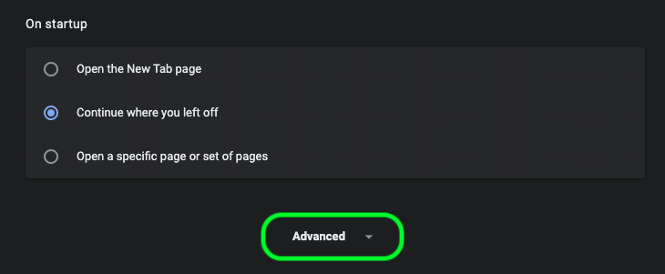

# [!DNL Data Science Workspace] guía de solución de problemas

Este documento proporciona respuestas a las preguntas más frecuentes sobre Adobe Experience Platform [!DNL Data Science Workspace]. Para preguntas y solución de problemas con [!DNL Platform] las API en general, consulte la guía [de solución de problemas de la API de](../landing/troubleshooting.md)Adobe Experience Platform.

## [!DNL JupyterLab] entorno no se está cargando en [!DNL Google Chrome]

>[!IMPORTANT]
>
>Este problema se ha resuelto, pero aún podría estar presente en el navegador Google Chrome 80.x. Asegúrese de que el navegador Chrome esté actualizado.

Con la versión 80.x del [!DNL Google Chrome] explorador, todas las cookies de terceros están bloqueadas de forma predeterminada. Esta directiva puede evitar [!DNL JupyterLab] que se cargue en Adobe Experience Platform.

Para solucionar este problema, siga estos pasos:

En su [!DNL Chrome] navegador, vaya a la parte superior derecha y seleccione **Configuración** (también puede copiar y pegar &quot;chrome://settings/&quot; en la barra de direcciones). A continuación, desplácese hasta la parte inferior de la página y haga clic en el menú desplegable **Avanzado** .



Aparece la sección **Privacidad y seguridad** . A continuación, haga clic en Configuración **del** sitio seguido de **Cookies y datos** del sitio.


Por último, cambie &quot;Bloquear cookies de terceros&quot; por &quot;Desactivado&quot;.


>[!NOTE]
>
>También puede deshabilitar las cookies de terceros y agregar [*.]ds.adobe.net a la lista de permitidos.

Vaya a &quot;chrome://flags/&quot; en la barra de direcciones. Busque y deshabilite el indicador titulado *&quot;SameSite de forma predeterminada&quot;* mediante el menú desplegable de la derecha.


Después del paso 2, se le pedirá que vuelva a iniciar el explorador. Después de reiniciar, [!DNL Jupyterlab] debe ser accesible.

## ¿Por qué no puedo acceder [!DNL JupyterLab] en Safari?

Safari desactiva las cookies de terceros de forma predeterminada en Safari &lt; 12. Dado que la instancia de la máquina [!DNL Jupyter] virtual reside en un dominio diferente al del marco principal, Adobe Experience Platform requiere que las cookies de terceros estén habilitadas. Habilite las cookies de terceros o cambie a otro explorador como [!DNL Google Chrome].

Para Safari 12, debe cambiar el agente de usuario a &#39;[!DNL Chrome]&#39; o &#39;[!DNL Firefox]&#39;. Para cambiar el agente de usuario, abra el menú *Safari* y seleccione **Preferencias**. Aparecerá la ventana de preferencias.


En la ventana de preferencias de Safari, seleccione **Avanzado**. A continuación, marque el menú *Mostrar desarrollo en la casilla de la barra* de menús. Puede cerrar la ventana de preferencias una vez completado este paso.


A continuación, en la barra de navegación superior, seleccione el menú **Desarrollar** . En la lista desplegable **Desarrollar** , pase el ratón por encima del agente **de usuario**. Puede seleccionar la cadena **[!DNL Chrome]** o **[!DNL Firefox]** Agente de usuario que desee utilizar.


## ¿Por qué veo un mensaje &#39;403 prohibido&#39; al intentar cargar o eliminar un archivo en [!DNL JupyterLab]?

Si el explorador está habilitado con software de bloqueo de anuncios como [!DNL Ghostery] o [!DNL AdBlock] Plus, se debe permitir el dominio &quot;\*.adobe.net&quot; en cada software de bloqueo de anuncios para que [!DNL JupyterLab] funcione con normalidad. Esto se debe a que [!DNL JupyterLab] las máquinas virtuales se ejecutan en un dominio diferente al [!DNL Experience Platform] dominio.

## ¿Por qué algunas partes de mi [!DNL Jupyter Notebook] aspecto parecen revueltas o no se representan como código?

Esto puede suceder si la celda en cuestión se cambia accidentalmente de &quot;Código&quot; a &quot;Código de barras&quot;. Mientras una celda de código está enfocada, al pulsar la combinación de teclas **ESC+M** se cambia el tipo de celda a Markdown. El tipo de celda se puede cambiar mediante el indicador desplegable en la parte superior del bloc de notas de las celdas seleccionadas. Para cambiar un tipo de celda a código, seleccione el inicio de la celda que desee cambiar. A continuación, haga clic en el menú desplegable que indica el tipo actual de celda y, a continuación, seleccione &quot;Código&quot;.


## ¿Cómo instalo [!DNL Python] bibliotecas personalizadas?

El [!DNL Python] núcleo viene preinstalado con muchas bibliotecas populares de aprendizaje automático. Sin embargo, puede instalar bibliotecas personalizadas adicionales ejecutando el siguiente comando en una celda de código:

```shell
!pip install {LIBRARY_NAME}
```

Para obtener una lista completa de [!DNL Python] las bibliotecas preinstaladas, consulte la sección de [apéndice de la Guía](./jupyterlab/overview.md#supported-libraries)del usuario de JupyterLab.

## ¿Puedo instalar bibliotecas PySpark personalizadas?

Desafortunadamente, no puede instalar bibliotecas adicionales para el núcleo PySpark. Sin embargo, puede ponerse en contacto con el representante de servicios al cliente de Adobe para que le instalen bibliotecas PySpark personalizadas.

Para obtener una lista de las bibliotecas PySpark preinstaladas, consulte la sección de [apéndice de la Guía](./jupyterlab/overview.md#supported-libraries)del usuario de JupyterLab.

## ¿Es posible configurar [!DNL Spark] los recursos del clúster para [!DNL JupyterLab] [!DNL Spark] o el kernel de PySpark?

Puede configurar los recursos agregando el siguiente bloque a la primera celda del bloc de notas:

```python
%%configure -f 
{
    "numExecutors": 10,
    "executorMemory": "8G",
    "executorCores":4,
    "driverMemory":"2G",
    "driverCores":2,
    "conf": {
        "spark.cores.max": "40"
    }
}
```

Para obtener más información sobre la configuración [!DNL Spark] de recursos de clúster, incluida la lista completa de propiedades configurables, consulte la Guía del usuario de [JupyterLab](./jupyterlab/overview.md#kernels).

## ¿Por qué se produce un error al intentar ejecutar determinadas tareas para conjuntos de datos más grandes?

Si recibe un error por un motivo como `Reason: Remote RPC client disassociated. Likely due to containers exceeding thresholds, or network issues.` Esto significa que el controlador o un ejecutor se está quedando sin memoria. Consulte la documentación de acceso [a](./jupyterlab/access-notebook-data.md) datos de JupyterLab para obtener más información sobre los límites de datos y cómo ejecutar tareas en conjuntos de datos grandes. Normalmente, este error se puede resolver cambiando el `mode` de `interactive` a `batch`.