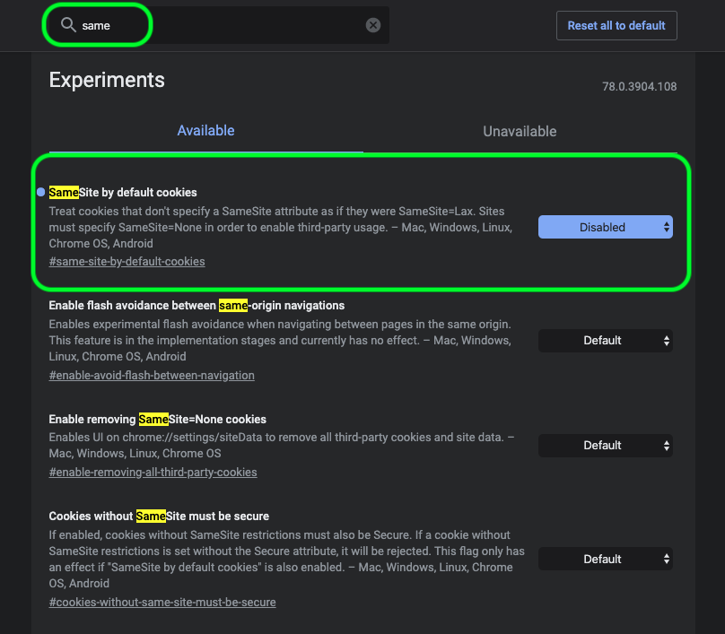

# [!DNL Data Science Workspace] guía de solución de problemas

Este documento proporciona respuestas a las preguntas frecuentes acerca de Adobe Experience Platform [!DNL Data Science Workspace]. Si tiene alguna pregunta o pregunta sobre [!DNL Platform] API en general, consulte las [Guía de solución de problemas de API de Adobe Experience Platform](../landing/troubleshooting.md).

## Estado de la consulta de JupyterLab Notebook atascado en estado de ejecución

Un JupyterLab Notebook puede indicar que una celda está en estado de ejecución, indefinidamente, en algunas condiciones de falta de memoria. Por ejemplo, al consultar un conjunto de datos grande o realizar varias consultas subsiguientes, JupyterLab Notebook puede quedarse sin memoria disponible para almacenar el objeto de marco de datos resultante. Hay algunos indicadores que se pueden ver en esta situación. En primer lugar, el núcleo entra en estado inactivo aunque la celda se muestre como en ejecución indicada por el [`*`] junto a la celda. Además, la barra inferior indica la cantidad de RAM utilizada/disponible.


Durante la lectura de datos, la memoria puede crecer hasta alcanzar la cantidad máxima de memoria asignada. La memoria se libera tan pronto como se alcanza la memoria máxima y el núcleo se reinicia. Esto significa que la memoria utilizada en este escenario puede mostrarse muy baja debido al reinicio del núcleo, mientras que justo antes del reinicio, la memoria habría estado muy cerca de la RAM máxima asignada.

Para resolver este problema, seleccione el icono de engranaje en la parte superior derecha de JupyterLab y deslice el control deslizante a la derecha seguido de seleccionar **[!UICONTROL Actualizar configuraciones]** para asignar más RAM. Además, si está ejecutando varias consultas y el valor de RAM se acerca a la cantidad máxima asignada, a menos que necesite los resultados de consultas anteriores, reinicie el núcleo para restablecer la cantidad de RAM disponible. Esto garantiza que tiene la máxima cantidad de RAM disponible para la consulta actual.


Si asigna la cantidad máxima de memoria (RAM) y sigue teniendo este problema, puede modificar la consulta para que funcione en un tamaño de conjunto de datos más pequeño reduciendo las columnas o el intervalo de datos. Para utilizar toda la cantidad de datos, se recomienda utilizar un portátil Spark.

## [!DNL JupyterLab] el entorno no se está cargando en [!DNL Google Chrome]

>[!IMPORTANT]
>
>Este problema se ha resuelto, pero aún puede estar presente en el explorador Google Chrome 80.x. Asegúrese de que el navegador Chrome esté actualizado.

Con el [!DNL Google Chrome] versión 80.x del explorador, todas las cookies de terceros están bloqueadas de forma predeterminada. Esta política puede evitar [!DNL JupyterLab] de carga en Adobe Experience Platform.

Para solucionar este problema, siga estos pasos:

En su [!DNL Chrome] del explorador, vaya a la parte superior derecha y seleccione **Configuración** (también puede copiar y pegar &quot;chrome://settings/&quot; en la barra de direcciones). A continuación, desplácese hasta la parte inferior de la página y haga clic en **Avanzadas** desplegable.


El **Privacidad y seguridad** aparece la sección. A continuación, haga clic en **Configuración del sitio** seguido de **Cookies y datos del sitio**.


Por último, cambie &quot;Bloquear cookies de terceros&quot; a &quot;Desactivado&quot;.


>[!NOTE]
>
>También puede deshabilitar las cookies de terceros y agregar lo siguiente [*.]ds.adobe.net a la lista de permitidos.

Vaya a &quot;chrome://flags/&quot; en la barra de direcciones. Busque y deshabilite el indicador titulado *&quot;SameSite con cookies predeterminadas&quot;* mediante el menú desplegable de la derecha.



Después del paso 2, se le pedirá que reinicie el explorador. Después de reiniciar, [!DNL Jupyterlab] debería ser accesible.

## ¿Por qué no puedo acceder a [!DNL JupyterLab] ¿en Safari?

Safari deshabilita las cookies de terceros de forma predeterminada en Safari &lt; 12. Porque su [!DNL Jupyter] la instancia de máquina virtual reside en un dominio diferente a su marco principal, Adobe Experience Platform requiere actualmente que se habiliten las cookies de terceros. Active las cookies de terceros o cambie a otro explorador, por ejemplo [!DNL Google Chrome].

Para Safari 12, debe cambiar el agente de usuario a &quot;[!DNL Chrome]&#39; o &#39;[!DNL Firefox]&#39;. Para cambiar el agente de usuario, comience abriendo *Safari* y seleccione **Preferencias**. Aparecerá la ventana de preferencias.


En la ventana de preferencias de Safari, seleccione **Avanzadas**. A continuación, compruebe la *Mostrar el menú Desarrollo en la barra de menús* cuadro. Una vez completado este paso, puede cerrar la ventana de preferencias.


A continuación, en la barra de navegación superior, seleccione la **Desarrollar** menú. Desde dentro de **Desarrollar** menú desplegable, pase el ratón sobre **Agente de usuario**. Puede seleccionar el **[!DNL Chrome]** o **[!DNL Firefox]** Cadena del agente de usuario que desea utilizar.


## ¿Por qué veo el mensaje &quot;403 prohibido&quot; al intentar cargar o eliminar un archivo en? [!DNL JupyterLab]?

Si su navegador está habilitado con software de bloqueo de anuncios como [!DNL Ghostery] o [!DNL AdBlock] Además, se debe permitir el dominio &quot;\*.adobe.net&quot; en cada software de bloqueo de anuncios para [!DNL JupyterLab] para funcionar normalmente. Esto se debe a [!DNL JupyterLab] las máquinas virtuales se ejecutan en un dominio diferente al de [!DNL Experience Platform] dominio.

## ¿Por qué algunas partes de mi [!DNL Jupyter Notebook] ¿parece codificado o no se representa como código?

Esto puede suceder si la celda en cuestión cambia accidentalmente de &quot;Código&quot; a &quot;Markdown&quot;. Mientras una celda de código está enfocada, al pulsar la combinación de teclas **ESC + M** cambia el tipo de celda a Markdown. El tipo de celda se puede cambiar mediante el indicador desplegable situado en la parte superior del bloc de notas para las celdas seleccionadas. Para cambiar un tipo de celda a código, comience por seleccionar la celda determinada que desea cambiar. A continuación, haga clic en el menú desplegable que indica el tipo actual de celda y seleccione &quot;Código&quot;.


## ¿Cómo instalo el personalizado? [!DNL Python] ¿bibliotecas?

El [!DNL Python] kernel viene preinstalado con muchas bibliotecas populares de aprendizaje automático. Sin embargo, puede instalar bibliotecas personalizadas adicionales ejecutando el siguiente comando en una celda de código:

```shell
!pip install {LIBRARY_NAME}
```

Para obtener una lista completa de los equipos preinstalados [!DNL Python] bibliotecas, consulte las [apéndice de la Guía del usuario de JupyterLab](./jupyterlab/overview.md#supported-libraries).

## ¿Puedo instalar bibliotecas PySpark personalizadas?

Desafortunadamente, no se pueden instalar bibliotecas adicionales para el núcleo PySpark. Sin embargo, puede ponerse en contacto con el servicio de atención al cliente de Adobe para que le instalen bibliotecas PySpark personalizadas.

Para obtener una lista de las bibliotecas PySpark preinstaladas, consulte la [apéndice de la Guía del usuario de JupyterLab](./jupyterlab/overview.md#supported-libraries).

## ¿Es posible configurar [!DNL Spark] recursos de clúster para [!DNL JupyterLab] [!DNL Spark] o núcleo PySpark?

Puede configurar los recursos agregando el siguiente bloque a la primera celda del bloc de notas:

```python
%%configure -f 
{
    "numExecutors": 10,
    "executorMemory": "8G",
    "executorCores":4,
    "driverMemory":"2G",
    "driverCores":2,
    "conf": {
        "spark.cores.max": "40"
    }
}
```

Para obtener más información sobre [!DNL Spark] configuración de recursos de clúster, incluida la lista completa de propiedades configurables, consulte la [Guía del usuario de JupyterLab](./jupyterlab/overview.md#kernels).

## ¿Por qué recibo un error al intentar ejecutar ciertas tareas para conjuntos de datos más grandes?

Si recibe un error por un motivo como `Reason: Remote RPC client disassociated. Likely due to containers exceeding thresholds, or network issues.` Esto suele significar que el controlador o un ejecutor se está quedando sin memoria. Consulte JupyterLab Notebooks [acceso a datos](./jupyterlab/access-notebook-data.md) para obtener más información sobre los límites de datos y cómo ejecutar tareas en conjuntos de datos grandes. Normalmente, este error se puede resolver cambiando la variable `mode` de `interactive` hasta `batch`.

Además, al escribir grandes conjuntos de datos de Spark/PySpark, almacene en caché los datos (`df.cache()`) antes de ejecutar el código de escritura puede mejorar en gran medida el rendimiento.

<!-- remove this paragraph at a later date once the sdk is updated -->

Si tiene problemas al leer datos y está aplicando transformaciones a los datos, intente almacenar en caché los datos antes de las transformaciones. El almacenamiento en caché de los datos impide que se realicen varias lecturas en la red. Comience por leer los datos. A continuación, caché (`df.cache()`) los datos. Por último, realice las transformaciones que desee.

## ¿Por qué mis portátiles Spark/PySpark tardan tanto en leer y escribir datos?

Si realiza transformaciones en los datos, como usar `fit()`Sin embargo, las transformaciones pueden estar ejecutándose varias veces. Para aumentar el rendimiento, almacene en caché los datos usando `df.cache()` antes de realizar la `fit()`. Esto garantiza que las transformaciones se ejecuten solo una vez y evita que se lean varias veces en la red.

**Pedido recomendado:** Comience por leer los datos. A continuación, realice transformaciones seguidas de almacenamiento en caché (`df.cache()`) los datos. Por último, realice una `fit()`.

## ¿Por qué no se pueden ejecutar mis portátiles Spark/PySpark?

Si recibe cualquiera de los siguientes errores:

- Se ha anulado el trabajo debido a un error de fase... Solo puede comprimir RDD con el mismo número de elementos en cada partición.
- Cliente RPC remoto desasociado y otros errores de memoria.
- Rendimiento deficiente al leer y escribir conjuntos de datos.

Compruebe que está almacenando en caché los datos (`df.cache()`) antes de escribir los datos. Al ejecutar código en blocs de notas, se utiliza `df.cache()` antes de una acción, como `fit()` puede mejorar en gran medida el rendimiento del portátil. Uso de `df.cache()` antes de escribir un conjunto de datos, garantiza que las transformaciones se ejecuten solo una vez en lugar de varias veces.

## [!DNL Docker Hub] Limite las restricciones en Data Science Workspace

A partir del 20 de noviembre de 2020, entraron en vigor los límites de tarifas para el uso anónimo y autenticado gratuito de Docker Hub. Anónimo y gratuito [!DNL Docker Hub] los usuarios están limitados a 100 solicitudes de extracción de imagen de contenedor cada seis horas. Si se ve afectado por estos cambios, recibirá este mensaje de error: `ERROR: toomanyrequests: Too Many Requests.` o `You have reached your pull rate limit. You may increase the limit by authenticating and upgrading: https://www.docker.com/increase-rate-limits.`.

En la actualidad, este límite solo afecta a su organización si intenta crear 100 Notebook to Recipes dentro del periodo de seis horas o si utiliza Notebooks basados en Spark en Data Science Workspace que se están ampliando y reduciendo con frecuencia. Sin embargo, esto es improbable, ya que el clúster en el que se ejecutan permanece activo durante dos horas antes de dejarse a ralentí. Esto reduce el número de extracciones necesarias cuando el clúster está activo. Si recibe alguno de los errores anteriores, tendrá que esperar hasta que su [!DNL Docker] se ha restablecido el límite.

Para obtener más información acerca de [!DNL Docker Hub] límites de velocidad, visite la [Documentación de DockerHub](https://www.docker.com/increase-rate-limits). Se está trabajando en una solución para esto y se espera que esta sea una versión posterior.
