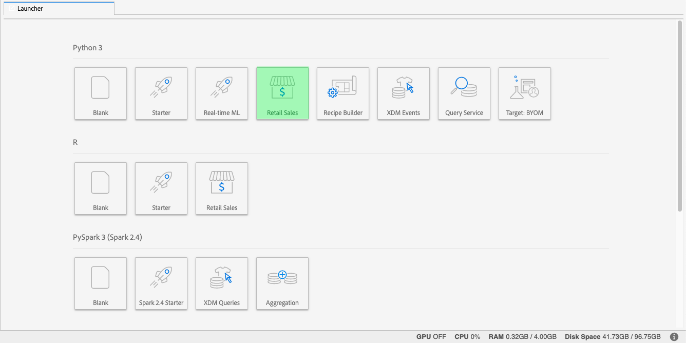

# [!DNL Data Science Workspace] tutorial

Este documento proporciona un tutorial para Adobe Experience Platform [!DNL Data Science Workspace]. En este tutorial se describe un flujo de trabajo general de Data Science y cómo pueden abordar y resolver un problema mediante el aprendizaje automático.

## Requisitos previos

- Una cuenta de Adobe ID registrada
   - La cuenta de Adobe ID debe haberse agregado a una organización con acceso a Adobe Experience Platform y [!DNL Data Science Workspace].

## Caso de uso comercial

Un minorista enfrenta muchos desafíos para seguir siendo competitivo en el mercado actual. Una de las principales preocupaciones del minorista es decidir la fijación de precios óptimos de un producto y predecir las tendencias de venta. Con un modelo de predicción preciso, un minorista podría encontrar la relación entre la demanda y las políticas de precios y tomar decisiones de precios optimizadas para maximizar las ventas y los ingresos.

## La solución del científico de datos

La solución de un científico de datos es aprovechar la abundancia de información histórica proporcionada por un minorista, predecir tendencias futuras y optimizar las decisiones de precios. Este tutorial utiliza datos de ventas anteriores para entrenar un modelo de aprendizaje automático y utiliza el modelo para predecir las tendencias de venta futuras. Con esto, puede generar perspectivas para ayudarle a realizar cambios óptimos en los precios.

Esta visión general refleja los pasos que un científico de datos debe seguir para realizar un conjunto de datos y crear un modelo para predecir las ventas semanales. Este tutorial cubre las siguientes secciones del bloc de notas de ventas minoristas de muestra en Adobe Experience Platform [!DNL Data Science Workspace]:

- [Configuración](#setup)
- [Exploración de datos](#exploring-data)
- [Ingeniería de funciones](#feature-engineering)
- [Formación y verificación](#training-and-verification)

### Equipos portátiles en [!DNL Data Science Workspace]

En la interfaz de usuario de Adobe Experience Platform, seleccione **[!UICONTROL Equipos portátiles]** en la ficha **[!UICONTROL Ciencia de datos]** para que se muestre en la página de información general de [!UICONTROL Equipos portátiles]. En esta página, seleccione la ficha [!DNL JupyterLab] para iniciar el entorno [!DNL JupyterLab]. La página de aterrizaje predeterminada para [!DNL JupyterLab] es el **[!UICONTROL iniciador]**.




Este tutorial utiliza [!DNL Python] 3 en [!DNL JupyterLab Notebooks] para mostrar cómo acceder a los datos y explorarlos. En la página del iniciador se proporcionan blocs de notas de ejemplo. El bloc de notas de muestra **[!UICONTROL Retail Sales]** se utiliza en los ejemplos que se proporcionan a continuación.

### Configuración {#setup}

Con el bloc de notas de ventas minoristas abierto, lo primero que debe hacer es cargar las bibliotecas necesarias para el flujo de trabajo. La siguiente lista proporciona una breve descripción de cada una de las bibliotecas utilizadas en los ejemplos en pasos posteriores.

- **numpy**: Biblioteca informática científica que añade compatibilidad con matrices y matrices multidimensionales y grandes
- **pandas**: Biblioteca que oferta las estructuras y operaciones de datos utilizadas para la manipulación y análisis de datos
- **matplotlib.pyplot**: Biblioteca de asignación que proporciona una experiencia similar a MATLAB al trazar
- **mar** : Biblioteca de visualización de datos de interfaz de alto nivel basada en matplotlib
- **sklearn**: Biblioteca de aprendizaje automático que incluye algoritmos de clasificación, regresión, vector de compatibilidad y clúster
- **advertencias**: Biblioteca que controla los mensajes de advertencia

### Explorar datos {#exploring-data}

#### Cargar datos

Una vez cargadas las bibliotecas, puede ver los datos en inicio. El siguiente código [!DNL Python] utiliza la estructura de datos `DataFrame` de pandas y la función [read_csv()](https://pandas.pydata.org/pandas-docs/stable/generated/pandas.read_csv.html#pandas.read_csv) para leer el CSV alojado en [!DNL Github] en el DataFrame de pandas:


La estructura de datos DataFrame de Pandas es una estructura de datos bidimensional etiquetada. Para ver rápidamente las dimensiones de los datos, puede utilizar `df.shape`. Esto devuelve un tupla que representa la dimensionalidad del marco de datos:


Por último, puede realizar previsualizaciones sobre el aspecto de los datos. Puede utilizar `df.head(n)` para la vista de las primeras `n` filas de DataFrame:


#### Resumen estadístico

Podemos aprovechar la biblioteca de [!DNL Python's] paneles para obtener el tipo de datos de cada atributo. El resultado de la siguiente llamada nos proporcionará información sobre el número de entradas y el tipo de datos de cada una de las columnas:

```PYTHON
df.info()
```


Esta información es útil, ya que conocer el tipo de datos de cada columna nos permitirá saber cómo tratar los datos.

Ahora veamos el resumen estadístico. Sólo se mostrarán los tipos de datos numéricos, de modo que `date`, `storeType` y `isHoliday` no se generarán:

```PYTHON
df.describe()
```


Con esto, se pueden ver 6435 instancias para cada característica. Además, se proporciona información estadística como media, desviación estándar (std), min, max e intercuartil. Esto nos proporciona información sobre la desviación de los datos. En la siguiente sección, pasará a la visualización, que funciona junto con esta información para darnos una comprensión completa de sus datos.

Si observa los valores mínimo y máximo de `store`, puede ver que hay 45 almacenes únicos que los datos representan. También hay `storeTypes` que diferencian lo que es una tienda. puede ver la distribución de `storeTypes` haciendo lo siguiente:


Esto significa que 22 almacenes son `storeType A`, 17 son `storeType B` y 6 son `storeType C`.

#### Visualizar datos

Ahora que conoce los valores de los marcos de datos, quiere complementar esto con visualizaciones para que las cosas sean más claras y fáciles de identificar los patrones. Estos gráficos también son útiles para transmitir resultados a una audiencia.

#### Gráficos uniformes

Los gráficos uniformes son gráficos de una variable individual. Un gráfico univariado común que se utiliza para visualizar los datos son los gráficos de cajas y de murmullos.

Mediante el uso de su conjunto de datos minoristas de antes, puede generar el diagrama de cajas y de whiskys para cada una de las 45 tiendas y sus ventas semanales. El trazado se genera mediante la función `seaborn.boxplot`.


Para mostrar la distribución de datos se utiliza una casilla y un diagrama de whisky. Las líneas exteriores del trazado muestran los cuartiles superior e inferior, mientras que el cuadro abarca el rango intercuartil. La línea del cuadro marca la mediana. Los puntos de datos que superen 1,5 veces el cuartil superior o inferior se marcarán como un círculo. Estos puntos se consideran periféricos.

A continuación, puede trazar las ventas semanales con el tiempo. Solo se mostrará el resultado de la primera tienda. El código del cuaderno genera 6 parcelas correspondientes a 6 de las 45 tiendas de nuestro conjunto de datos.


Con este diagrama, puede comparar las ventas semanales durante un período de 2 años. Es fácil ver los picos de venta y los patrones a través del tiempo.

#### Gráficos multivariados

Los gráficos multivariados se utilizan para ver la interacción entre variables. Con la visualización, los científicos de datos pueden ver si hay correlaciones o patrones entre las variables. Un gráfico multivariado común es una matriz de correlación. Con una matriz de correlación, las dependencias entre varias variables se cuantifican con el coeficiente de correlación.

Con el mismo conjunto de datos comercial, puede generar la matriz de correlación.


Fíjese en la diagonal de los que están en el centro. Esto muestra que cuando se compara una variable con sí misma, tiene una correlación positiva completa. Una correlación positiva fuerte tendrá una magnitud más cercana a 1, mientras que las correlaciones débiles estarán más cerca de 0. La correlación negativa se muestra con un coeficiente negativo que muestra una tendencia inversa.

### Ingeniería de funciones {#feature-engineering}

En esta sección, el ingeniería de funciones se utiliza para realizar modificaciones en el conjunto de datos comercial mediante las siguientes operaciones:

- Añadir columnas de semana y año
- Convertir storeType en una variable de indicador
- Convertir isHoliday en una variable numérica
- Predecir ventas semanalesVentas de la semana siguiente

#### Añadir columnas de semana y año

El formato actual de fecha (`2010-02-05`) puede dificultar la diferenciación de los datos de cada semana. Debido a esto, debe convertir la fecha para que contenga semana y año.


Ahora la semana y la fecha son las siguientes:


#### Convertir storeType en variable de indicador

A continuación, desea convertir la columna storeType en columnas que representen cada `storeType`. Existen tres tipos de tienda (`A`, `B`, `C`), desde los cuales se crean 3 nuevas columnas. El valor establecido en cada una es un valor booleano donde se establece un &#39;1&#39; en función de lo que `storeType` era y `0` para las otras 2 columnas.


La columna `storeType` actual se ha eliminado.

#### Convertir isHoliday en tipo numérico

La siguiente modificación es cambiar el booleano `isHoliday` a una representación numérica.


#### Predecir ventas semanalesVentas de la semana siguiente

Ahora desea agregar ventas semanales anteriores y futuras a cada uno de sus conjuntos de datos. Esto se puede hacer compensando su `weeklySales`. Además, se calcula la diferencia `weeklySales`. Esto se realiza restando `weeklySales` con el `weeklySales` de la semana anterior.


Dado que está desactivando los `weeklySales` datos 45 datasets hacia adelante y 45 datasets hacia atrás para crear nuevas columnas, los primeros y últimos 45 puntos de datos tienen valores NaN. Puede eliminar estos puntos del conjunto de datos mediante la función `df.dropna()`, que elimina todas las filas que tienen valores NaN.


A continuación se muestra un resumen del conjunto de datos después de las modificaciones:


### Capacitación y verificación {#training-and-verification}

Ahora es el momento de crear algunos modelos de los datos y seleccionar qué modelo es el mejor para predecir las ventas futuras. Evaluará los 5 algoritmos siguientes:

- Regresión lineal
- Árbol de decisiones
- Bosque aleatorio
- Aumento de degradado
- K Vecinos

#### Dividir conjuntos de datos en subconjuntos de prueba y capacitación

Necesita una manera de saber cuán preciso será el modelo para poder predecir los valores. Esta evaluación se puede realizar asignando parte del conjunto de datos para utilizarlo como validación y el resto como datos de capacitación. Dado que `weeklySalesAhead` es el valor futuro real de `weeklySales`, puede utilizarlo para evaluar la precisión del modelo al predecir el valor. La división se realiza a continuación:


Ahora tiene `X_train` y `y_train` para preparar los modelos y `X_test` y `y_test` para la evaluación posterior.

#### Algoritmos de comprobación de puntos

En esta sección, se declaran todos los algoritmos en una matriz denominada `model`. A continuación, se iteran a través de esta matriz y, para cada algoritmo, se introducen los datos de capacitación con `model.fit()`, lo que crea un modelo `mdl`. Con este modelo, puede predecir `weeklySalesAhead` con sus datos `X_test`.


Para la puntuación, está tomando la diferencia porcentual media entre el `weeklySalesAhead` previsto con los valores reales en los datos `y_test`. Dado que desea minimizar la diferencia entre la predicción y el resultado real, el regresor de aumento de degradado es el modelo de mejor rendimiento.

#### Visualizar predicciones

Por último, visualiza el modelo de predicción con los valores de ventas semanales reales. La línea azul representa los números reales, mientras que el verde representa la predicción mediante la ampliación de degradado. El siguiente código genera 6 gráficos que representan 6 de los 45 almacenes del conjunto de datos. Aquí solo se muestra `Store 1`:


## Pasos siguientes

Este documento abarcaba un flujo de trabajo general de un científico de datos para resolver un problema de ventas minoristas. Para resumir:

- Cargue las bibliotecas necesarias para el flujo de trabajo.
- Una vez cargadas las bibliotecas, puede realizar inicios para ver los datos mediante resúmenes estadísticos, visualizaciones y gráficos.
- A continuación, se utiliza ingeniería de funciones para realizar modificaciones en el conjunto de datos minorista.
- Por último, cree modelos de los datos y seleccione qué modelo es el de mejor rendimiento para predecir las ventas futuras.

Una vez que esté listo, lea la [guía del usuario de JupyterLab](./jupyterlab/overview.md) para obtener una visión general rápida de los blocs de notas en Adobe Experience Platform Data Science Workspace. Además, si le interesa conocer los modelos y las fórmulas, consulte el tutorial [esquema de ventas minoristas y conjunto de datos](./models-recipes/create-retails-sales-dataset.md) para obtener inicios. Este tutorial le prepara para los tutoriales posteriores de Área de trabajo de ciencia de datos que se pueden ver en la página de tutoriales de Área de trabajo de ciencia de datos [a1/>.](../tutorials/data-science-workspace.md)