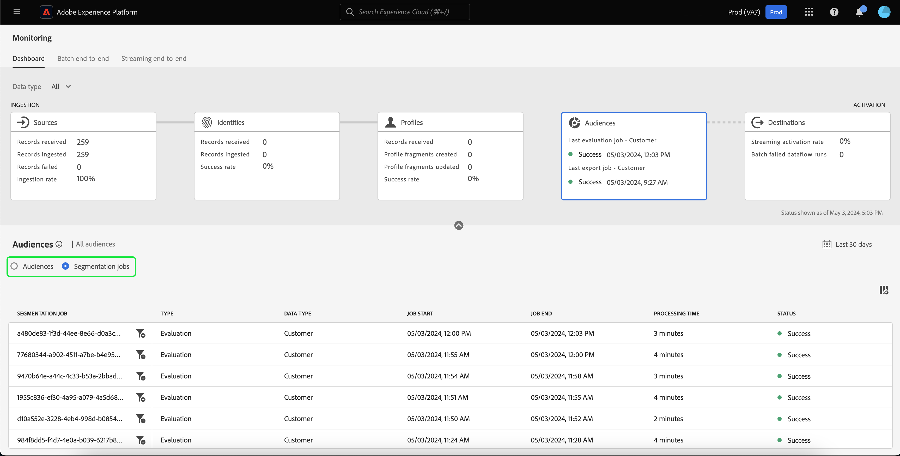

# Monitorización de flujos de datos para audiencias en la IU

El servicio de segmentación le permite crear audiencias mediante definiciones de segmentos u otras fuentes a partir de los datos de [!DNL Real-Time Customer Profile]. Experience Platform proporciona flujos de datos para rastrear de forma transparente este flujo de datos de fuentes a destinos.

Utilice el panel de monitorización para ver una representación visual de la actividad de los datos dentro de una audiencia, incluido el estado de la segmentación de los datos. Lea el tutorial para obtener instrucciones sobre cómo puede utilizar el panel de monitorización para monitorizar la segmentación de los datos mediante la interfaz de usuario de Experience Platform, lo que le permite rastrear el estado de los trabajos de activación, evaluación y exportación de audiencias.

## Introducción {#getting-started}

Esta guía requiere una comprensión práctica de los siguientes componentes de Adobe Experience Platform:

- [Flujos de datos](../home.md): los flujos de datos son una representación de los trabajos de datos que mueven datos a través de Experience Platform. Los flujos de datos se configuran en diferentes servicios, lo que ayuda a mover datos de los conectores de origen a los conjuntos de datos de destino, a [!DNL Identity] y [!DNL Profile], y a [!DNL Destinations].
   - [Ejecuciones de flujo de datos](../../sources/notifications.md): Las ejecuciones de flujo de datos son los trabajos programados recurrentes en función de la configuración de frecuencia de los flujos de datos seleccionados.
- [Segmentación](../../segmentation/home.md): la segmentación le permite crear audiencias a partir de los datos del perfil del cliente en tiempo real.
   - [Trabajos de activación](../../destinations/ui/activation-overview.md): se usa un trabajo de activación para activar la audiencia en un destino especificado.
   - [Trabajos de evaluación](../../segmentation/tutorials/evaluate-a-segment.md#evaluate-a-segment): Un trabajo de evaluación es un proceso asincrónico que evalúa la audiencia.
   - [Trabajos de exportación](../../segmentation/api/export-jobs.md): un trabajo de exportación es un proceso asincrónico que se usa para mantener miembros de audiencia en conjuntos de datos.
- [Zonas protegidas](../../sandboxes/home.md): [!DNL Experience Platform] proporciona zonas protegidas virtuales que dividen una sola instancia de [!DNL Experience Platform] en entornos virtuales independientes para ayudar a desarrollar y evolucionar aplicaciones de experiencia digital.

## Panel de control de monitorización de públicos {#monitoring-audiences-dashboard}

>[!CONTEXTUALHELP]
>id="platform_monitoring_segments"
>title="Públicos"
>abstract="La vista de públicos contiene información sobre todos los públicos de su organización, con más detalles acerca de sus trabajos de activación y evaluación."

Para acceder al panel **[!UICONTROL Audiences]**, seleccione **[!UICONTROL Monitoring]** en el panel de navegación izquierdo. Una vez en la página **[!UICONTROL Monitoring]**, seleccione la tarjeta **[!UICONTROL Audiences]**.

En el panel principal **[!UICONTROL Audiences]**, la tarjeta **[!UICONTROL Audiences]** muestra el estado y la fecha del último trabajo de evaluación y del último trabajo de exportación.

El propio panel contiene métricas tanto para audiencias como para trabajos de segmentación. De forma predeterminada, el tablero muestra las métricas de audiencia de las últimas 24 horas. Para obtener más información acerca de la vista de trabajos de segmentación, lea la sección [supervisión de trabajos de segmentación](#monitoring-segmentation-jobs-dashboard).

>[!IMPORTANT]
>
>Actualmente, solo se admiten las audiencias activadas en [destinos por lotes (basados en archivos)](../../destinations/destination-types.md#file-based) para el panel de monitorización de audiencias.

Las siguientes métricas están disponibles para esta vista de panel:

| Métrica | Descripción |
| ------ | ----------- |
| **[!UICONTROL Audience name]** | Nombre de la audiencia. |
| **[!UICONTROL Data type]** | El tipo de datos de la audiencia. Los valores posibles incluyen **[!UICONTROL Customer]**, **[!UICONTROL Account]** y **[!UICONTROL Prospect]**. Puede ver para audiencias de un tipo de datos especificado usando el filtro [!UICONTROL Data type] sobre la banda de tarjetas. |
| **[!UICONTROL Last evaluation timestamp]** | La fecha y la hora en que se ejecutó el último trabajo de evaluación de la audiencia. |
| **[!UICONTROL Last evaluation status]** | El estado del último trabajo de evaluación de la audiencia. Los valores posibles incluyen **[!UICONTROL Success]**, **[!UICONTROL No runs]** y **[!UICONTROL Failed]**. |
| **[!UICONTROL Last evaluation method]** | El método de evaluación de la audiencia. Dado que solo se admite la segmentación por lotes, el único valor posible es **[!UICONTROL Batch]**. |
| **[!UICONTROL Last evaluation profiles]** | El número de perfiles que se evaluaron en el último trabajo de evaluación de la audiencia. |
| **[!UICONTROL Last activation timestamp]** | La fecha y la hora en que se ejecutó el último trabajo de activación de la audiencia. |
| **[!UICONTROL Last activation status]** | El estado del último trabajo de activación de la audiencia. Los valores posibles incluyen **[!UICONTROL Success]**, **[!UICONTROL No runs]** y **[!UICONTROL Failed]**. |
| **[!UICONTROL Last activation identities]** | El número de identidades que se activaron en el último trabajo de activación de la audiencia. |
| **[!UICONTROL Last activation destination]** | El nombre del destino al que se activó el último trabajo de activación de la audiencia. |

Puede filtrar los resultados a una audiencia específica y ver sus trabajos de segmentación seleccionando el icono de filtro (). Los trabajos de segmentación se ordenan en orden cronológico y aparecen primero los trabajos de segmentación más recientes.

Aparecerá el tablero de audiencias filtradas. La tarjeta **[!UICONTROL Audiences]** muestra el estado y la fecha del último trabajo de evaluación y del último trabajo de activación.

El propio panel muestra la hora y el estado de los últimos trabajos de evaluación y activación, un gráfico que muestra el recuento de perfiles de la evaluación de audiencia y las métricas de los trabajos de segmentación que se ejecutaron. De forma predeterminada, el panel muestra las métricas de trabajo de segmentación de las últimas 24 horas.

Las siguientes métricas están disponibles para esta vista de panel:

| Métrica | Descripción |
| ------ | ----------- |
| **[!UICONTROL Job start]** | La fecha y la hora en que se inició el trabajo de segmentación. |
| **[!UICONTROL Type]** | Indica el tipo de trabajo de segmentación. Los dos tipos de trabajos admitidos son **activation** y **evaluation**. |
| **[!UICONTROL Job complete]** | La fecha y la hora en que se completó el trabajo de segmentación. |
| **[!UICONTROL Processing time]** | Cantidad de tiempo que tardó el trabajo de segmentación en completarse. |
| **[!UICONTROL Job status]** | El estado del trabajo de segmentación. Los valores admitidos son **[!UICONTROL Success]**, **[!UICONTROL In Progress]** y **[!UICONTROL Failed]**. |
| **[!UICONTROL Profile count]** | El número de perfiles que está evaluando el trabajo de segmentación. Cada usuario debe tener un perfil único. |
| **[!UICONTROL Identity activated]** | El número de identidades que está activando el trabajo de segmentación. Cada perfil puede tener varias identidades. Por ejemplo, un perfil puede tener un correo electrónico, un número de teléfono y un número de fidelidad como identidades. |
| **[!UICONTROL Destination name]** | El nombre del destino al que se está activando el trabajo de segmentación. |

Puede filtrar a un trabajo de segmentación específico y ver sus detalles seleccionando el icono de filtro (). Existen dos tipos diferentes de trabajos de segmentación que se pueden filtrar: trabajos de activación y trabajos de evaluación.

### Detalles del trabajo de activación {#activation-job-details}

La página de detalles de ejecución del flujo de datos del trabajo de activación muestra información sobre las métricas de la ejecución, los errores de ejecución del flujo de datos y las audiencias relacionadas con el trabajo de segmentación. Se utiliza un trabajo de activación para activar la audiencia en un destino especificado.

Las siguientes métricas están disponibles para esta vista de panel:

| Métrica | Descripción |
| ------ | ----------- |
| **[!UICONTROL Profiles received]** | Número total de perfiles recibidos en el flujo de activación. |
| **[!UICONTROL Identities activated]** | Número total de identidades que se activaron correctamente en el destino, según los perfiles recibidos. |
| **[!UICONTROL Identities excluded]** | Número total de identidades que se excluyeron de la activación en el destino, según los perfiles recibidos. Estas identidades podrían excluirse debido a la falta de atributos o violaciones del consentimiento. |
| **[!UICONTROL Size of data]** | El tamaño del flujo de datos que se está activando. |
| **[!UICONTROL Total files]** | Número total de archivos que se activan en el flujo de datos. |
| **[!UICONTROL Status]** | El estado actual del trabajo de activación. |
| **[!UICONTROL Dataflow run start]** | La fecha y la hora en que se inició el trabajo de activación. |
| **[!UICONTROL Dataflow run end]** | La fecha y la hora en que finalizó el trabajo de activación. |
| **[!UICONTROL Dataflow run ID]** | El ID del trabajo de activación actual. |
| **[!UICONTROL IMS org ID]** | El ID de la organización a la que pertenece el trabajo de activación. |
| **[!UICONTROL Destination name]** | El nombre del destino al que se activan los datos. |

En la sección audiencias puede ver una lista de audiencias que se activaron como parte del trabajo de activación.

Para la sección de audiencias, están disponibles las siguientes métricas:

| Métrica | Descripción |
| ------ | ----------- |
| **[!UICONTROL Name]** | Nombre de la audiencia que se activó. |
| **[!UICONTROL Identities activated]** | Número total de identidades que se activaron correctamente en el destino, según los perfiles recibidos. |
| **[!UICONTROL Identities excluded]** | Número total de identidades que se excluyeron de la activación en el destino, según los perfiles recibidos. Estas identidades podrían excluirse debido a la falta de atributos o a una infracción de consentimiento. |
| **[!UICONTROL Last dataflow run status]** | El estado del último trabajo de activación que se ejecutó para esa audiencia. |
| **[!UICONTROL Last dataflow run date]** | La fecha y la hora del último trabajo de activación que se ejecutó para esa audiencia. |

Además, puede ver detalles sobre los errores de ejecución del flujo de datos. En la sección de errores de ejecución del flujo de datos, puede ver las identidades que fallaron o las identidades excluidas. La sección de errores incluye detalles sobre el código de error y el número de identidades fallidas o excluidas.

### Detalles del trabajo de evaluación {#evaluation-job-details}

La página de detalles de ejecución del flujo de datos del trabajo de evaluación muestra información sobre las métricas de la ejecución y las audiencias relacionadas con el trabajo de segmentación.

Las siguientes métricas están disponibles para esta vista de panel:

| Métrica | Descripción |
| ------ | ----------- |
| **[!UICONTROL Total profiles]** | Número total de perfiles que se están evaluando. |
| **[!UICONTROL Status]** | El estado del trabajo de evaluación. Los estados posibles para el trabajo de evaluación incluyen **[!UICONTROL Success]** y **[!UICONTROL Failed]**. |
| **[!UICONTROL Job start]** | La fecha y la hora en que se inició el trabajo de evaluación. |
| **[!UICONTROL Job end]** | La fecha y la hora en que finalizó el trabajo de evaluación. |
| **[!UICONTROL Job type]** | El tipo de trabajo de segmentación. En este caso, siempre será un trabajo de **[!UICONTROL Segment evaluation]**. |
| **[!UICONTROL Evaluation type]** | El tipo de evaluación que se está realizando. Puede ser **[!UICONTROL Batch]** o **[!UICONTROL Streaming]**. |
| **[!UICONTROL Job ID]** | El ID del trabajo de evaluación. |
| **[!UICONTROL IMS org ID]** | El ID de la organización a la que pertenece el trabajo de evaluación. |
| **[!UICONTROL Audience name]** | Nombre de la audiencia que se está evaluando. |
| **[!UICONTROL Audience ID]** | El ID de la audiencia que se está evaluando. |

En la sección [!UICONTROL Audiences] puede ver una lista de audiencias que se evalúan como parte del trabajo de evaluación. Puede filtrar la lista de audiencias por nombre mediante la barra de búsqueda.

>[!IMPORTANT]
>
>Actualmente, esta vista de panel admite hasta 800 métricas de audiencia.

Para la sección [!UICONTROL Audiences], están disponibles las siguientes métricas:

| Métrica | Descripción |
| ------ | ----------- |
| **[!UICONTROL Name]** | Nombre de la audiencia que se está evaluando. |
| **[!UICONTROL Profile count]** | El número de perfiles que se están evaluando. |

## Panel de control de monitorización de trabajos de segmentación {#monitoring-segmentation-jobs-dashboard}

>[!CONTEXTUALHELP]
>id="platform_monitoring_segment_jobs"
>title="Trabajos de segmentación"
>abstract="La vista de trabajos de segmentación contiene información sobre los trabajos de evaluación y exportación de todos los públicos."

Para acceder al panel **[!UICONTROL Segmentation Jobs]**, seleccione **[!UICONTROL Segmentation jobs]** en el panel [!UICONTROL Audiences]. El panel [!UICONTROL Monitoring] contiene métricas e información sobre los trabajos de evaluación y exportación.

>[!NOTE]
>
>Solo se admiten **trabajos de evaluación de segmentación** para la monitorización por audiencia. Los trabajos de exportación de segmentación solo admiten la monitorización en el nivel de organización.

Utilice el panel [!UICONTROL Segmentation Jobs] para saber si la evaluación y exportación de perfiles se realiza a tiempo y sin excepciones, de modo que los servicios descendentes de activación de destino puedan tener los datos de perfil evaluados más recientes.

Las siguientes métricas están disponibles para los trabajos de segmentación:

| Métrica | Descripción |
| ------ | ----------- |
| **[!UICONTROL Segmentation job]** | Indica el nombre del trabajo de segmentación. |
| **[!UICONTROL Type]** | Indica el tipo de trabajo de segmentación: exportación o evaluación. Tenga en cuenta que en ambos casos, el trabajo de segmentación evalúa o exporta **todas** las audiencias que pertenecen a una organización. Para obtener más información acerca de los trabajos de exportación, lea la guía del [extremo de trabajos de exportación](../../segmentation/api/export-jobs.md). Para obtener más información acerca de los trabajos de evaluación, lea el tutorial sobre [evaluación de una definición de segmento](../../segmentation/tutorials/evaluate-a-segment.md#evaluate-a-segment). |
| **[!UICONTROL Job start]** | La fecha y la hora en que se inició el trabajo de segmentación. |
| **[!UICONTROL Job end]** | La fecha y la hora en que se completó el trabajo de segmentación. |
| **[!UICONTROL Status]** | El estado del trabajo completado. Los estados posibles para el trabajo de segmentación incluyen éxito o error. |
